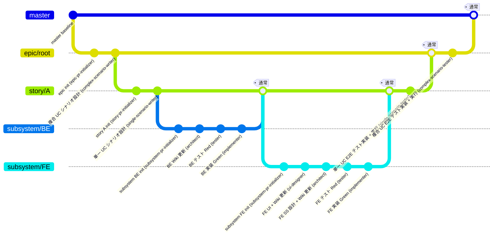

# ai-monitor ワークフロー設計

## ラベル一覧

| No | ラベル | 概要 | 補足 |
| --- | --- | --- | --- |
| 1 | `layer:intake` | ユーザーが最初に起票した集約元 Issue |  |
| 2 | `layer:epic` | 機能全体（対象システム横断）の親 Issue |  |
| 3 | `layer:story` | ユースケース単位の親 Issue |  |
| 4 | `layer:subsystem` | 対象システム別担当分担用の親 Issue |  |
| 5 | `type:feat` | 新規機能追加 |  |
| 6 | `type:refactor` | 内部リファクタリング（振る舞い変更なし） |  |
| 7 | `type:bug` | バグ修正 |  |
| 8 | `type:docs` | ドキュメント更新 |  |
| 9 | `type:chore` | ビルド設定・軽微修正 |  |
| 10 | `type:question` | 質疑応答のみ |  |
| 11 | `scope:backend` | バックエンド担当 |  |
| 12 | `scope:frontend` | フロントエンド担当 |  |

- `layer:*` は自身は実装コードを持たず、全子完了 → 自ブランチを親レイヤーにマージ → クローズ
- `type:*` は親（`layer:*` or master）のブランチから派生して 1 leaf の PR を持ち、完了 → 親ブランチにマージ
- `scope:*` は将来対象システムが増えたら追加（モバイル、CLI ツール、等）
- GitHub Issue Type（組織リポジトリで利用可）に将来移行する場合は **`layer:*` を Issue Type に昇格**、`type:*` / `scope:*` はラベルのままにする

## 各レイヤー作業

### レイヤー判定基準

`docs/wiki/判定フローチャート/レイヤー.md` に移行済み（判定フロー・4 分類の基準とも Wiki 側が SoT）。
運用ルール（集約元 Issue の扱い・複数サブ Issue 等）はモニター詳細「1. intake-issue-triager」参照。

### 全レイヤーの流れ

3 階層構造（epic → story → subsystem）で運用。
矢印ラベル = 担当モニター + 実施内容、ノード = 各段階での状態（Issue / PR / 完了状態）。
基本は一本線で、subsystem レイヤーの「画面あり / なし」だけ分岐する。

```mermaid
flowchart TD
  U([ユーザー])
  I0([Issue · 未分類])
  TRIAGE([intake-issue-triager: 内容分解 + 各作業を 4 分類判定])
  CONFIRM([ユーザー確認: サブ Issue 案の承認])
  CREATE([intake-issue-triager: Issue に Sub-issue として作成])

  U -->|Issue 起票| I0
  I0 --> TRIAGE
  TRIAGE --> CONFIRM
  CONFIRM --> CREATE
  CREATE --> E_ISSUE
  CREATE --> S_ISSUE
  CREATE --> B_ISSUE
  CREATE --> QUICK

  QUICK([quick-implementer: 直接コミット + マージ])

  %% epic レイヤー
  E_ISSUE([epic Issue])
  E_REQ([要件確定: ユースケース一覧 + 横断要件])
  E_PR([epic Draft PR · epic/root · base=master])
  E_SCENARIO([複合ユースケースシナリオ確定])

  E_ISSUE -->|epic-issue-triager: 本文整形 + ユースケース一覧 + 横断要件| E_REQ
  E_REQ -->|epic-pr-initializer: Draft PR 作成| E_PR
  E_PR -->|complex-scenario-writer: 複合ユースケースシナリオ設計 · commit| E_SCENARIO
  E_SCENARIO -->|epic-issue-triager: 子 story 起票| S_ISSUE

  %% story レイヤー
  S_ISSUE([story Issue])
  S_REQ([要件確定: ユースケース要件])
  S_PR([story Draft PR · story/A · base=epic/root])
  S_SCENARIO([単一ユースケースシナリオ確定])

  S_ISSUE -->|story-issue-triager: 本文整形 + ユースケース要件| S_REQ
  S_REQ -->|story-pr-initializer: Draft PR 作成| S_PR
  S_PR -->|single-scenario-writer: 単一ユースケースシナリオ設計 · commit| S_SCENARIO
  S_SCENARIO -->|story-issue-triager: 子 subsystem 起票| B_ISSUE

  %% subsystem レイヤー
  B_ISSUE([subsystem Issue])
  B_INTAKE([Issue 完成: 本文 + 現状調査 + 要件確定])
  B_PR([subsystem Draft PR · subsystem/BE · base=story/A])
  B_UI([UI 設計 + FE Wiki 更新完了])
  B_ARCH([SS 設計 + BE Wiki 更新完了])
  B_TEST([テスト Red])
  B_IMPL([実装 Green])
  B_REVIEW([レビュー完了])
  B_MERGED([subsystem → story にマージ完了])

  B_ISSUE -->|subsystem-issue-triager: 本文整形 + 現状調査 + 機能・非機能要件確定| B_INTAKE
  B_INTAKE -->|subsystem-pr-initializer: Draft PR 作成| B_PR
  B_PR -->|ui-designer: 画面ありの場合| B_UI
  B_PR -->|architect: 画面なしの場合| B_ARCH
  B_UI -->|architect: SS + BE Wiki 更新| B_ARCH
  B_ARCH -->|tester: テストコード Red| B_TEST
  B_TEST -->|implementer: 実装 Green| B_IMPL
  B_IMPL -->|reviewer: AI 間ループ + ユーザー承認| B_REVIEW
  B_REVIEW -->|merger: story ブランチにマージ| B_MERGED

  %% story レベル: 単一 UC シナリオテスト実行
  S_TEST_START([story レベル: 単一 UC シナリオテスト実行])
  S_TEST_RESULT{単一 UC テスト結果}
  S_MERGE([merger: story → epic マージ])
  BUG_S([バグ用 subsystem Issue 起票])

  B_MERGED -->|全 subsystem 完了時| S_TEST_START
  S_TEST_START -->|single-scenario-tester| S_TEST_RESULT
  S_TEST_RESULT -->|✅ pass| S_MERGE
  S_TEST_RESULT -->|❌ fail| BUG_S
  BUG_S -.->|バグ修正 → 単一 UC 再実行| B_ISSUE

  %% epic レベル: 複合 UC シナリオテスト実行
  E_TEST_START([epic レベル: 複合 UC シナリオテスト実行])
  E_TEST_RESULT{複合 UC テスト結果}
  E_MERGE([merger: epic → master マージ])
  BUG_E([バグ用 subsystem Issue 起票])

  S_MERGE -->|全 story 完了時| E_TEST_START
  E_TEST_START -->|complex-scenario-tester| E_TEST_RESULT
  E_TEST_RESULT -->|✅ pass| E_MERGE
  E_TEST_RESULT -->|❌ fail| BUG_E
  BUG_E -.->|バグ修正 → 単一 UC 再実行 → 複合 UC 再実行| B_ISSUE
```



**読み方:**

- 起点は「ユーザーが普通に Issue 起票（Issue）」→ `intake-issue-triager` が内容を作業単位に分解 + 4 分類判定
- ユーザーが Sub-issue 案を承認 → `intake-issue-triager` が **Issue に Sub-issue として** epic / story / subsystem / chore Issue を作成（複数可）
- Issue は集約元として残る（各サブ Issue のフローは独立進行、全完了でIssue クローズ）
- 基本は一本線、subsystem レイヤーの「画面あり / なし」だけ分岐
- 各矢印ラベルの先頭が **担当モニター名**、続けて実施内容
- ノードは「その段階での成果物 / 状態」を表す
- 下流 PR は上流 PR のブランチを base にする **Stacked PR** 構造（`base=master` / `base=epic/root` / `base=story/A`）
- **統合テスト（右側の縦の V 字）**: 全 subsystem 完了時に story レベルで単一 UC E2E 実行、全 story 完了時に epic レベルで複合 UC E2E 実行。失敗すれば bug 用 subsystem Issue 起票 → 修正フローへ再突入
- マージは下流から順（subsystem → story → epic → master）
- 修正 / バグ修正 / 機能追加の場合、必要な層だけを通る（epic 影響が無ければ story or subsystem から始まる）

## gitGraph（ブランチ + commit + モニター対応）

3 階層構造（epic → story → subsystem）を例示。

- epic ブランチ:
  - **複合 UC シナリオ設計 (complex-scenario-writer)** の commit を積む
  - 全 story マージ後に **複合 UC E2E テスト実装 + 実行 (complex-scenario-tester)** の commit を積む
- story ブランチ:
  - **単一 UC シナリオ設計 (single-scenario-writer)** の commit を積む
  - 全 subsystem マージ後に **単一 UC E2E テスト実装 + 実行 (single-scenario-tester)** の commit を積む
- subsystem ブランチ:
  - **Wiki 更新 (architect/ui-designer) → テスト (tester) → 実装 (implementer)** の commit が積まれる

下流 PR は上流 PR のブランチを base にする Stacked PR 構造で、subsystem → story → epic → master と通常マージで昇格していく。




---

## 設計レベルとモニターの対応

| 設計レベル | 担当モニター | 決めること |
| --- | --- | --- |
| 起点判定 | `intake-issue-triager` | Issue の内容を確認して epic / story / subsystem / chore のどのレイヤーから始めるかを判定（`docs/wiki/判定フローチャート/レイヤー.md` を参照） |
| epic Issue 本文整形 | `epic-issue-triager` | タイトル・概要・背景・ユースケース一覧・横断要件を確定 + 子 story 起票 |
| epic Draft PR 作成 | `epic-pr-initializer` | epic ブランチ（`epic/root`）+ Draft PR 作成（`base=master`）+ PR 本文骨組み配置 |
| epic 複合ユースケースシナリオ設計 | `complex-scenario-writer` | epic PR で `docs/wiki/設計図/シナリオ/複合ユースケース/*.md` を作成 / 更新 · commit |
| epic 複合ユースケースシナリオテスト実行 | `complex-scenario-tester` | 全 story マージ後、epic レベルで複合 UC E2E 実行。失敗時にバグ用 subsystem Issue を起票 |
| story Issue 本文整形 | `story-issue-triager` | タイトル・概要・背景・ユースケース要件を確定 + 子 subsystem 起票 |
| story Draft PR 作成 | `story-pr-initializer` | story ブランチ（`story/A`）+ Draft PR 作成（`base=epic/root`）+ PR 本文骨組み配置 |
| story 単一ユースケースシナリオ設計 | `single-scenario-writer` | story PR で `docs/wiki/設計図/シナリオ/単一ユースケース/{機能名}.md` を作成 / 更新 · commit |
| story 単一ユースケースシナリオテスト実行 | `single-scenario-tester` | 全 subsystem マージ後、story レベルで単一 UC E2E 実行。失敗時にバグ用 subsystem Issue を起票 |
| subsystem Issue 本文整形 | `subsystem-issue-triager` | 本文整形 + **現状調査**（既存コード・関連テスト・関連 Issue/PR・再現ログ）+ **機能要件・非機能要件・スコープ外を確定**（旧 investigator + spec-writer を統合） |
| subsystem Draft PR 作成 | `subsystem-pr-initializer` | subsystem ブランチ（`subsystem/BE` 等）+ Draft PR 作成（`base=story/A`）+ PR 本文骨組み配置 |
| UI 設計 + FE 設計 Wiki 更新 | `ui-designer` | 画面構成・モック・画面遷移・UI 関連の実装計画 + **FE 設計 Wiki 更新**（フロントエンド結合 / モジュール構成 の該当分類）。UI ライブラリ採用時は PoC まで |
| SS（システム方式）+ 実装計画 + 設計 Wiki 更新 | `architect` | コンポーネント分割・採用ライブラリ・データフロー・実装計画 + **BE 設計 Wiki 更新**（モジュール構成 / ER 図 / バックエンド結合 / 外部ライブラリ / 外部 API 等）。ライブラリ選定で必要なら PoC 実施 |
| テスト | `tester` | テストコード作成（Red 状態） |
| 実装 | `implementer` | 実装 → Green 化 |
| 実装レビュー | `reviewer` | コード品質 + Wiki 差分整合性チェック |
| 直接実装（`chore`） | `quick-implementer` | 軽微修正の直接コミット（TDD・レビュー・ドキュメント全スキップ） |
| 質疑応答（`question`） | `questioner` | ユーザーとのコメントループのみ（実装なし） |
| マージ | `merger` | マージ + コンフリクト解消 + worktree 削除 |
| 中断リセット | `resetter` | 不要化した Issue/PR の巻き戻し（追記 Wiki 削除・worktree 削除・クローズ） |

- Wiki 更新は「実装より前」に完了させる **仕様駆動（docs → 実装）** 方針。architect / ui-designer が Wiki を確定させてから tester / implementer が続く
- Wiki 差分は subsystem PR の commit として含まれ、実装 diff と同一 PR でレビューされる（別 PR 化しない）
- `type:docs` 単独 Issue（Wiki 単独更新など、実装コードを伴わない変更）は `architect` / `ui-designer` が Wiki のみコミットして進める（`確認:tester` / `確認:implementer` はスキップして `確認:reviewer` に直接遷移）

---

## issue本文の担当セクション

詳細は Wiki: **`テンプレート/イシュー本文/サブシステム.md`**

担当モニター・サブセクション一覧・記入テンプレートはすべて Wiki に集約。

> Issue は「**何を作るか**」（要件レベル）まで。UI 設計・システム方式設計（SS）・PoC 結果・実装計画・テスト計画・Wiki 更新履歴は **PR 本文側** に移管（PR diff でレビューできるようにするため）。


## PR本文の担当セクション

| セクション | サブセクション | 必須or条件 | 概要 | 担当モニター |
| --- | --- | --- | --- | --- |
| `## 紐づく Issue` | - | 必須 | 親 Issue 番号 | 各 pr-initializer（Draft PR 作成時に記入） |
| `## システム方式設計（SS）` | `### 採用ライブラリ` | 実装系 | No / ライブラリ / バージョン / 用途 / 補足 の表 | architect |
| 〃 | `### コンポーネント分割` | 〃 | No / 新規/変更 / レイヤー / コンポーネント / 役割 / 補足 の表 | 〃 |
| 〃 | `### データフロー` | 複数コンポーネント間でデータが流れる場合 | Mermaid sequenceDiagram または flowchart で図示 | 〃 |
| `## UI 設計` | `### 画面構成` | 画面ありの場合 | 画面ごとに小見出し + 要素/種類/位置/データソース/アクション の表 | ui-designer |
| 〃 | `### 画面遷移` | 画面ありで複数画面が絡む場合 | Mermaid flowchart LR | 〃 |
| 〃 | `### モック` | 画面ありの場合 | No / 画面 / URL / 補足 の表 | 〃 |
| `## PoC 結果` | `### 検証したライブラリ` | ライブラリ選定で PoC を実施した場合 | No / ライブラリ / バージョン / ライセンス / 用途 / 補足 の表 | architect または ui-designer |
| 〃 | `### 動作確認結果` | 〃 | No / ライブラリ / 検証項目 / 結果 / 補足 の表 + 最小再現コード | 〃 |
| `## 追記した Wiki` | - | 仕様駆動により実質必須 | No / ページ / 内容 / 補足 の表（resetter 用の履歴）。architect が BE 設計 Wiki 行、ui-designer が FE 設計 Wiki 行、PoC 実施時は外部ライブラリ / 外部 API 行を追記 | architect / ui-designer |
| `## 実装計画` | - | 必須 | No / 完了 / 新規/変更 / レイヤー / 分類 / ファイル / 対象 / 概要 / 補足 の表（分類: クラス/メソッド/関数/コンポーネント/フック/型/DBカラム/マイグレーション/エンドポイント など。対象: クラス名・メソッド名・型名・カラム名など。概要: 何を追加/変更するかを 1〜2 文。完了は ⬜/✅、implementer が完了から ✅ に更新） | architect が SS 設計と同時に記入 / ui-designer が UI 関連行追加 / implementer がチェック |
| `## テスト計画` | `### 単体テスト` | 実装系（ドキュメント系はスキップ） | 新規/変更/既存実行のテスト一覧 + 各行にチェックボックス（implementer で Green になったらチェック） | tester が追加 / implementer がチェック |
| 〃 | `### 結合テスト` | 〃 | 〃 | 〃 |
| 〃 | `### E2Eテスト` | 〃 | 〃 | 〃 |
| 〃 | `### 外部疎通テスト` | 起動環境系の最低限の確認が必要時 | 〃 | 〃 |


## rulesページの担当セクション
<!-- 'my-plugins\plugins\dev-kit\hooks\inject_rules\rules' -->

dev-kit のルール（言語/フレームワーク横断の規約。プロジェクトを跨いで使い回す）。Wiki と違ってプロジェクト固有情報は含まない。

> 担当モニターは `architect`（BE 系）/ `ui-designer`（FE 系）。仕様駆動で SS・UI 確定と同一 PR 内に更新 commit を積む。分類別サブエージェント経由で並列処理する。

| 分類 | ファイルパス（rules/ 以下） | 概要 |
| --- | --- | --- |
| claude | claude/Claude Code Tool活用.md | Write 前に空ファイル作成・Task 系ツール活用など Claude Code の基本ツール作法 |
| 〃 | claude/Claude_Json.md | settings.json 等 JSON ファイルでのコメント擬似記法・キー間空行ルール |
| 〃 | claude/Claude共通.md | SKILL/ルール/CLAUDE.md 執筆時の簡潔・無冗長の共通方針 |
| 〃 | claude/claudeプラグイン.md | プラグイン内テンプレートフォルダの規約と展開方法 |
| 〃 | claude/mcp.md | MCP サーバー作成ルール（FastMCP・stdio・構成） |
| 〃 | claude/skills活用.md | AgentSkills（SKILL.md）の動的コンテキスト注入・公式仕様 |
| 〃 | claude/サブエージェント.md | スキル内ステップをサブエージェントに委譲する判断基準とマーカー |
| 〃 | claude/フック.md | フックスクリプト/プロンプトの配置と書き方・ワンタイムトークン |
| 〃 | claude/ルール記載.md | ユーザ配下ルール記載時の汎用性・プロジェクト特化禁止 |
| dev | dev/yaml-sot.md | 新規ドメインは index.yaml+settings.yaml の 2 段構成で SoT 化 |
| 〃 | dev/コーディング全般.md | 例外を握りつぶさない・無闇なフォールバック禁止など言語横断のコーディング規約 |
| html | html/components/カスタムエレメント.md | Light DOM の自律カスタム要素・connectedCallback・属性駆動 |
| 〃 | html/components/先読みカタログ.md | 画面実装前に共通層を先読みして再利用する原則 |
| 〃 | html/components/共通シェル.md | ヘッダー・サイドバー等の app-shell 共通シェル方針 |
| 〃 | html/core/iframe禁止.md | フロントエンドで iframe を使わない |
| 〃 | html/core/ビルドレス原則.md | バンドラを使わずネイティブ ESM と素 CSS を配信（tsc 1 段のみ可） |
| 〃 | html/css/コメント.md | CSS セレクタごとに直上コメントを書く・/* */ のみ使う |
| 〃 | html/css/トークン.md | デザイントークンを :root に集約・3 ティア・ライト固定 |
| 〃 | html/css/ネスト.md | CSS Nesting 利用可・&__title 連結禁止・フル記述 |
| 〃 | html/css/レイヤー構成.md | @layer 順序固定・全 CSS をレイヤーへ・utilities で !important 禁止 |
| 〃 | html/html/コメント.md | HTML のセクション/属性/hidden/Jinja ブロックへのコメント規約 |
| 〃 | html/html/ネイティブ要素.md | dialog/details 等のネイティブ要素を第一選択する |
| 〃 | html/js/api層.md | api 層 fetch ラッパーに通信集約・openapi 型のみ生成 |
| 〃 | html/js/websocket.md | WsClient extends EventTarget・指数バックオフ・URL 定数化 |
| 〃 | html/js/エンドポイント.md | URL 文字列をハードコードせず定数集約・使う範囲で配置先決定 |
| 〃 | html/js/バニラTS方針.md | 関数指向で書く・クラスは Custom Element のみ・ライブラリ追加禁止 |
| 〃 | html/js/モジュール解決.md | import maps でモジュール解決・bare specifier・生成 .js を参照 |
| 〃 | html/js/レイヤー分離.md | UI/State/API の 3 層分離・下方向のみ依存 |
| 〃 | html/js/状態管理.md | リアクティブ強制せず手続き的更新可・URL クエリ反映推奨 |
| 〃 | html/layout/レイアウトパターン.md | サイドバー+メインの標準骨格・PC 固定 |
| 〃 | html/layout/画面テンプレート.md | 一覧/詳細/設定の画面型ごとの構成要点 |
| 〃 | html/mock/indexモック.md | モック index.html は各モック画面へのリンク集 |
| 〃 | html/mock/モックテーマ.md | モックテーマ画面の役割・デザイン方向性決め |
| 〃 | html/mock/モック画面ルール.md | mocks/ 配下に FastAPI+HTML で疎結合にモック配置 |
| 〃 | html/naming/cssクラス.md | CSS クラス命名（c-/l- 等のハンガリアン禁止・BEM 風連結） |
| 〃 | html/naming/カスタムエレメント.md | app- 接頭辞+kebab・is 属性禁止（Safari 非対応） |
| 〃 | html/naming/ファイル名.md | kebab-case 統一・概念区切りはフォルダで分ける |
| 〃 | html/pages/_shared.md | pages/{domain}/_shared はドメイン内共通部品置き場 |
| 〃 | html/pages/index-html.md | 各画面 index.html は _layout 継承・ブロック使い分け規約 |
| 〃 | html/pages/screen-css.md | 画面固有 CSS も @layer 内・トークン参照・画面ローカル変数 |
| 〃 | html/pages/screen-ts.md | screen.ts の作法（init 即時起動・getElementById・XSS エスケープ） |
| 〃 | html/pages/画面の作り方.md | pages/{domain}/{screen}/ 配下のファイル構成と役割 |
| 〃 | html/shared/components.md | shared/components の配置と共通スタイル方針 |
| 〃 | html/shared/core.md | shared/core に環境/定数/ルート値を集約・DOM/通信は持たない |
| 〃 | html/shared/css.md | shared/css は基盤スタイル置き場・layers.css がエントリ |
| 〃 | html/shared/fmt.md | fmt.ts に整形関数集約・純関数・DOM 不可 |
| 〃 | html/shared/lib.md | shared/lib は DOM 非依存の汎用ユーティリティ集約場所 |
| 〃 | html/shared/logger.md | logger.ts でログ集約・console 直書き禁止 |
| 〃 | html/shared/vendor.md | 外部依存は vendoring で固定・CDN 依存禁止 |
| 〃 | html/testing/e2eテスト.md | Playwright E2E 規約（モック・ロケータ優先・直列実行） |
| 〃 | html/testing/テスト戦略.md | vitest+playwright の 2 層・ピラミッド構造 |
| 〃 | html/testing/ユニットテスト.md | vitest+jsdom で純 ESM をテスト・配置と対象選定 |
| 〃 | html/tooling/tsc運用.md | tsc で ts→js 同階層 emit・バンドラ不使用 |
| 〃 | html/typescript/コメント.md | TS コメント規約（@param 等不要・export 直上に JSDoc） |
| 〃 | html/typescript/型システム.md | 汎用 TS の型方針（any 回避・union literal・関数型エイリアス） |
| 〃 | html/typescript/関数とオブジェクト引数.md | 依存は引数注入・2 引数以上はオブジェクトで受ける |
| 〃 | html/フォルダ構成.md | frontend/ 配下の shared+pages ディレクトリツリー定義 |
| 〃 | html/モバイル対応.md | @media (max-width:768px) 単一で screen.css 末尾に追記する方式 |
| 〃 | html/共通化の判断.md | 部品の置き場所判断（使う範囲が最も狭い階層を選ぶ） |
| markdown | markdown/マークダウンテーブル.md | Markdown テーブル活用・No カラム付与基準 |
| 〃 | markdown/マークダウン編集.md | フロントマター配置・--- 区切り線の使用制限 |
| 〃 | markdown/マーメイド.md | mermaid でフローチャート作成（LR/TD 使い分け） |
| next | next/backend/APIフォルダ概要.md | app/api/v{N}/{resource}/ の 6 ファイル責務分離（CQRS） |
| 〃 | next/backend/DB Enum.md | drizzle/schema.ts の pgEnum 運用・値削除回避 |
| 〃 | next/backend/DB-ID設計.md | 主キーは gen_random_uuid()・独自 ID 避ける |
| 〃 | next/backend/DB-ts.md | api/db.ts は書き込み専用・1 関数 1 SQL・DatabaseError 包む |
| 〃 | next/backend/DBタイムスタンプ.md | createdAt/updatedAt を ISO 文字列共通カラムで持つ |
| 〃 | next/backend/DBヘルパー-ts.md | api/dbHelper.ts はリソース内共通の純粋関数 |
| 〃 | next/backend/DBマイグレーション.md | drizzle-kit の追加/削除運用・破壊的変更手順 |
| 〃 | next/backend/DBリレーション.md | drizzle の relations/index/外部キー方針 |
| 〃 | next/backend/DB変更履歴.md | ソフトデリート禁止・履歴テーブル退避+ハードデリート |
| 〃 | next/backend/DB楽観的ロック.md | updatedAt 比較による VersionConflictError 検知パターン |
| 〃 | next/backend/Drizzleスタイル.md | SQL Builder 標準・Relational Query 限定使用・sql.raw 禁止 |
| 〃 | next/backend/アクション-ts.md | Server Action 規約（use server/ActionResult/Zod/getAuthContext） |
| 〃 | next/backend/ウェブフック.md | Webhook 受信パターン（配置・署名検証） |
| 〃 | next/backend/キャッシュ.md | Next.js 16 の cacheComponents/use cache/cacheLife/cacheTag |
| 〃 | next/backend/クエリ-ts.md | api/query.ts は読み取り専用・Zod フィルタ・Promise.all 活用 |
| 〃 | next/backend/クライアント-ts.md | api/client.ts の型 import・URL 定数経由・data unwrap |
| 〃 | next/backend/サービス-ts.md | api/service.ts がトランザクション境界・AppError 派生扱い |
| 〃 | next/backend/プロキシ.md | proxy.ts（旧 middleware）の認証ガード・matcher 設定 |
| 〃 | next/backend/ルート-ts.md | route.ts は withRouteErrorHandling+認証+Zod+service 呼び |
| 〃 | next/backend/レートリミット.md | Upstash Ratelimit で proxy.ts と route.ts で二重適用 |
| 〃 | next/backend/ローカルYAML開発DB.md | dev 用 YAML データストアと本番 Drizzle 実装の差し替え |
| 〃 | next/backend/冪等性.md | Idempotency-Key ヘッダで二重実行防止対象を限定 |
| 〃 | next/backend/認証アクション.md | auth.ts Server Action（Better Auth 経由の signIn/Up/Out） |
| 〃 | next/backend/認証クライアント.md | クライアント useSession（Better Auth）配置と利用 |
| 〃 | next/backend/認証コンテキスト.md | getAuthContext() 統一エントリ・3 関数でセッション取得 |
| 〃 | next/backend/認証スキーマ.md | Better Auth が要求する user/session/account/verification 定義 |
| 〃 | next/backend/認証セットアップ.md | lib/auth.ts の Better Auth 初期化・cookieCache・期限 |
| 〃 | next/devops/デプロイ.md | Vercel を標準とするデプロイ先選定マトリクス |
| 〃 | next/devtools/Storybook.md | shadcn 拡張の Storybook 構成・Vitest 統合 |
| 〃 | next/devtools/モック.md | MSW で fetch を intercept・dev/test 両用 |
| 〃 | next/devtools/リントとフォーマット.md | ESLint/Prettier/tsconfig 設定（Next.js 16） |
| 〃 | next/frontend/404-tsx.md | not-found.tsx は Server Component・戻るリンク必須 |
| 〃 | next/frontend/IDルーティング.md | [id]/page.tsx が View 本体・edit/ との共通化方針 |
| 〃 | next/frontend/PWA.md | manifest.ts・Apple 対応の PWA 設定 |
| 〃 | next/frontend/SEO.md | Metadata API・sitemap/robots/manifest・構造化データ |
| 〃 | next/frontend/Zustandパターン.md | Context で不十分な時の Zustand・配置・selector |
| 〃 | next/frontend/appフォルダ概要.md | app/ 配下の全体構成（Route Group 3 つ・API 配下） |
| 〃 | next/frontend/conventions/コメント規約.md | Next.js App Router のコメントスタイル（JSX/Drizzle/Zod） |
| 〃 | next/frontend/conventions/ルートファイル規約.md | page/layout/loading 等各 route segment の役割と配置 |
| 〃 | next/frontend/conventions/命名規約.md | フォルダ/ファイル/フック等の命名規則 |
| 〃 | next/frontend/conventions/型規約.md | 型定義の置き場所マッピング |
| 〃 | next/frontend/url-state.md | URL クエリにスクリーン state を置く原則・読み書き方法 |
| 〃 | next/frontend/useActionState.md | Server Action 呼び出しの hook 選択（useTransition 他） |
| 〃 | next/frontend/useFormパターン.md | use{Feature}Form.ts の構成・defaultValues と values 使い分け |
| 〃 | next/frontend/useMutationパターン.md | useMutation 採用条件・楽観更新の許可リスト |
| 〃 | next/frontend/useQueryパターン.md | useQuery の戻り値/queryKey/initialData 規約 |
| 〃 | next/frontend/useUrlStateパターン.md | use{Feature}UrlState.ts の nuqs 採用ルール |
| 〃 | next/frontend/アセット.md | next/image の remotePatterns・priority・sizes 規約 |
| 〃 | next/frontend/エラー-tsx.md | error.tsx/global-error.tsx の作法 |
| 〃 | next/frontend/エンドポイント.md | app/(shared)/endpoints.ts で URL 全集約・ハードコード禁止 |
| 〃 | next/frontend/クエリクライアントセットアップ.md | TanStack Query の QueryProvider 設定（staleTime 等） |
| 〃 | next/frontend/コンテキストパターン.md | React Context の使い所と運用ルール |
| 〃 | next/frontend/コンポーネントカタログ.md | (shared)/components/ の自前ラッパー一覧 |
| 〃 | next/frontend/スクリーンラッパー.md | <ScreenWrapper> の責務と isLoading オーバーレイ |
| 〃 | next/frontend/ストリーミング.md | Suspense 境界と streaming・Skeleton フォールバック |
| 〃 | next/frontend/タグ入力.md | <TagInput> の IME 対応・onBlur 確定 |
| 〃 | next/frontend/ダイアログ.md | Dialog/AlertDialog/Sheet 等の suffix 選択 |
| 〃 | next/frontend/フィーチャーフォルダ.md | app/(authenticated)/{feature}/ 配下の標準構成 |
| 〃 | next/frontend/フォーム-ts.md | {feature}/form.ts に Zod schema と型を集約 |
| 〃 | next/frontend/フォームコンポーネント.md | shadcn <Form>+RHF+Zod 標準組み合わせ |
| 〃 | next/frontend/ページヘッダー.md | <PageHeader> の props・h1 利用・1 Screen 1 つ |
| 〃 | next/frontend/ルートグループ.md | (authenticated)/(auth)/(shared) の 3 グループ運用 |
| 〃 | next/frontend/ローディングボタン.md | <LoadingButton> で mutation ボタンを統一 |
| 〃 | next/frontend/一覧スクリーン-tsx.md | ListScreen.tsx は use client+URL state+initial |
| 〃 | next/frontend/一覧ページ-tsx.md | 一覧 page.tsx は Zod パース+SEO metadata |
| 〃 | next/frontend/必須マーク.md | <RequiredMark/> を必須フィールドにのみ付与 |
| 〃 | next/frontend/状態管理判断基準.md | サーバー/URL/Context/Zustand/useState の決定フロー |
| 〃 | next/frontend/確認ダイアログ.md | useConfirmDialog() で window.confirm 代替 |
| 〃 | next/frontend/空状態.md | <EmptyState> で length 0 時の白画面防止 |
| 〃 | next/frontend/編集スクリーン-tsx.md | EditScreen/NewScreen は shadcn Form+useTransition+Server Action |
| 〃 | next/frontend/編集ページ-tsx.md | edit/page.tsx の notFound/redirect/canEdit 分岐 |
| 〃 | next/frontend/自動保存.md | useAutosave hook で debounce 保存と古い結果無視 |
| 〃 | next/frontend/自動保存インジケーター.md | <AutosaveIndicator> の 4 状態と表示規約 |
| 〃 | next/frontend/詳細スクリーン-tsx.md | ViewScreen.tsx は use client・読み取り専用・canEdit |
| 〃 | next/frontend/詳細ページ-tsx.md | [id]/page.tsx が View 本体・notFound・generateMetadata |
| 〃 | next/shared/エラーアクションハンドラー.md | handleActionError で Server Action 例外を ActionResult 化 |
| 〃 | next/shared/エラークライアントハンドラー.md | handleAppError でクライアント側エラーを UX 変換 |
| 〃 | next/shared/エラークラス.md | AppError 階層・fromResponse で API 失敗復元 |
| 〃 | next/shared/エラールートハンドラー.md | withRouteErrorHandling で route.ts エラーを構造化 JSON へ |
| 〃 | next/shared/セキュリティ.md | セキュリティヘッダ・CSP nonce・CSRF 対策 |
| 〃 | next/shared/ロガータグ.md | logger.create("tag") タグ命名規約（layer:name 形式） |
| 〃 | next/shared/ロガー実装.md | logger.ts の JSON Lines 出力・level 運用・本番クランプ |
| 〃 | next/shared/環境変数.md | 環境変数は秘密のみ・構造化設定は YAML に分離 |
| 〃 | next/testing/E2Eテスト.md | Playwright 設定・storageState・webServer 自動起動 |
| 〃 | next/testing/テスト戦略.md | Vitest+Playwright のピラミッド構造・各 Level ツール表 |
| 〃 | next/testing/フィクスチャー.md | tests/fixtures の 4 点セット（build/seed/seeds/clean） |
| 〃 | next/testing/ユニットテスト.md | Vitest+Testing Library のユニット/コンポーネントテスト |
| python | python/architecture/TypeScriptスタイル適用.md | 関数ファースト+型エイリアス+DTO+Protocol で書く中心ドキュメント |
| 〃 | python/architecture/コンポジションルート.md | main.py で関数依存を組み立てる composition root |
| 〃 | python/architecture/リファクタリング判断.md | DRY 化のトリガー（2 回目検討/3 回目必須）と粒度 |
| 〃 | python/architecture/レイアウト.md | 機能フォルダ型レイアウトのトップレベル構成 |
| 〃 | python/architecture/依存関係管理.md | features→integrations→shared の依存方向ルール |
| 〃 | python/architecture/設計原則.md | DRY 最重視・SOLID 重視・YAGNI 不強制の優先順位 |
| 〃 | python/concurrency/並列処理.md | GIL 前提・CPU/IO 分岐の並列処理判断フロー |
| 〃 | python/concurrency/非同期処理.md | asyncio 規約（TaskGroup/timeout/to_thread） |
| 〃 | python/core/コメント.md | Python 固有コメントルール（docstring 濃度マトリクス） |
| 〃 | python/core/スタイル.md | ruff/mypy/pyright/pytest ツール構成と設定 |
| 〃 | python/core/デコレーター.md | 推奨デコレータ表とハンドラーデコレータ用法 |
| 〃 | python/core/命名規則.md | モジュール/関数/型/Protocol 等の命名規約表 |
| 〃 | python/core/型ヒント.md | Python 3.12+ の PEP 695 必須・annotations import |
| 〃 | python/core/言語ルール.md | コメント/識別子/出力文字列の使用言語使い分け表 |
| 〃 | python/fastapi/アプリケーション.md | server/app.py の build_fastapi+lifespan 構成 |
| 〃 | python/fastapi/スキーマ.md | リクエスト/レスポンス Pydantic・to_domain/from_domain |
| 〃 | python/fastapi/ヘルスチェック.md | /healthz は生存判定のみ・liveness/readiness の分け方 |
| 〃 | python/fastapi/ルート定義.md | ルーターは薄く 4 責務のみ・features に配置 |
| 〃 | python/fastapi/認証とエラー.md | Bearer/APIKey/Scope 認証パターンと例外ハンドラ |
| 〃 | python/llm/Instructor.md | Instructor で LLM 出力を Pydantic モデル化 |
| 〃 | python/llm/コストとキャッシュ.md | LLM トークン管理・用途別 max_tokens 目安 |
| 〃 | python/llm/プロバイダー.md | make_{provider}_chat ファクトリで関数注入抽象化 |
| 〃 | python/llm/プロンプトローダー.md | prompts/index.yaml を読み Jinja2 で結合する実装 |
| 〃 | python/llm/プロンプト執筆.md | プロンプトをファイル化・部品分割・index.yaml 組み立て |
| 〃 | python/llm/例外とリトライ.md | LlmError ベース例外分類とリトライ可否マトリクス |
| 〃 | python/packaging/Pythonバージョン.md | 3.12+ を最低ライン・3.13 新機能の採用判断 |
| 〃 | python/packaging/pyproject設定.md | pyproject.toml 標準テンプレート（project メタデータ） |
| 〃 | python/packaging/依存パッケージ管理.md | uv 標準・コマンド早見表 |
| 〃 | python/packaging/配布設定.md | uv build/publish・SemVer・CLI エントリポイント |
| 〃 | python/performance/パフォーマンスチートシート.md | 計測ツール早見表・最適化前に計測する原則 |
| 〃 | python/scripts/Pythonスクリプト.md | scripts/ サブフォルダ配置・docstring 必須要素 |
| 〃 | python/scripts/Tkinter.md | tkinter GUI 設計指針・テーマ統一・モーダル作法 |
| 〃 | python/scripts/launchers-windows.md | Windows .bat ランチャーの標準テンプレート |
| 〃 | python/scripts/ランチャー-Unix.md | UNIX 系 .sh ランチャーの標準テンプレート |
| 〃 | python/shared/エラー定義.md | shared/errors.py の AppError 単一階層 |
| 〃 | python/shared/シークレットと環境変数.md | .env/settings.yaml/コードでの値分離方針 |
| 〃 | python/shared/ロガー.md | JSON Lines 構造化ログ実装・get_logger 運用 |
| 〃 | python/shared/型定義.md | shared/types.py に横断的型のみ・引き上げ基準 |
| 〃 | python/shared/定数.md | shared/constants.py に計算済み不変値だけ置く |
| 〃 | python/shared/設定.md | pydantic-settings で .env/環境変数を型安全に読む |
| 〃 | python/testing/pytest.md | pytest 規約（命名・fixture・conftest 階層） |
| 〃 | python/testing/テスト戦略.md | 単体テスト書かない方針・結合+外部疎通の 2 種類のみ |
| 〃 | python/testing/モック.md | 関数型エイリアス DI 前提の Mock パターン早見表 |


## wikiページの担当セクション

> 担当モニターは `architect`（BE 系）/ `ui-designer`（FE 系）。仕様駆動で SS・UI 確定と同一 PR 内に更新 commit を積む。分類別サブエージェント経由で並列処理する。
> ここに載せるのは**全プロジェクトで共通で使うページ**のみ。my-plugins 固有のページ（テンプレート_ライブラリ選定論点.md など）はここには載せない。

| 分類 | ページ名 | 概要 |
| --- | --- | --- |
| 設計図 | 設計図/モジュール構成/README.md | 全分類網羅のクラス / 関数 / 関数型インデックス |
| 〃 | 設計図/モジュール構成/{分類}.md | 分類別: 当該分類のクラス / 関数 / 関数型詳細 |
| 〃 | 設計図/ER図/README.md | 全テーブル一覧 + データストア概要（DB / JSON / YAML） |
| 〃 | 設計図/ER図/{分類}.md | 分類別: 当該分類のテーブル詳細 |
| 〃 | 設計図/バックエンド結合/README.md | 全エンドポイント索引（旧 `APIエンドポイント一覧` の後継） |
| 〃 | 設計図/バックエンド結合/{論理名}.md | 1 エンドポイント = 1 ファイル（メイン + 条件分岐 + 異常系） |
| 〃 | 設計図/フロントエンド結合/README.md | 全画面操作索引 |
| 〃 | 設計図/フロントエンド結合/{論理名}.md | 1 画面操作 = 1 ファイル（処理フロー） |
| 〃 | 設計図/シナリオ/README.md | E2E シナリオ索引（主要画面別） |
| 〃 | 設計図/シナリオ/{論理名}.md | 1 シナリオ = 1 ファイル（複数結合をまたぐ成功フロー） |
| 〃 | 設計図/アーキテクチャ図.md | システム全体構成（C4 / Mermaid） |
| プロジェクト管理 | プロジェクト管理/ラベル定義一覧.md | constants.sh のラベルと運用ルール |
| 〃 | プロジェクト管理/ディレクトリ構成図.md | プラグイン全体のフォルダ階層 |
| 運用・規約 | 運用・規約/イシュードキュメント.md | Issue 本文テンプレート |
| 〃 | 運用・規約/PRドキュメント.md | PR 本文テンプレート |
| 〃 | 運用・規約/セットアップ手順.md | プラグインインストール手順 |
| Claude ハーネス | Claude ハーネス/スキル一覧.md | プラグイン内の全 SKILL.md の一覧と役割 |
| 〃 | Claude ハーネス/カスタムサブエージェント一覧.md | agents/*.md の一覧と役割 |
| 〃 | Claude ハーネス/フック一覧.md | session-start / PreToolUse などの設定一覧 |
| 〃 | Claude ハーネス/動的注入対応表.md | 編集対象パス → 注入される Wiki ページの対応 |
| 〃 | Claude ハーネス/プラグイン構成.md | hooks / skills / agents / scripts の役割と関係 |
| 実装リファレンス | 実装リファレンス/エラーコード・例外定義一覧.md | エラーコード・例外クラスとその発生条件・ハンドリング方針 |
| 外部ライブラリ | 外部ライブラリ/README.md | 採用済みライブラリのインデックス |
| 〃 | 外部ライブラリ/{lib名}.md | このプロジェクトで使うメソッドとそのパラメータを公式ドキュメントから抜粋。書き方規約は `テンプレート/外部ライブラリ.md` |
| 外部API | 外部API/README.md | 採用済み外部 API のインデックス |
| 〃 | 外部API/{API名}.md | このプロジェクトで使うエンドポイントを公式ドキュメントから抜粋。書き方規約は `テンプレート/外部API.md` |
| テスト | テスト/テスト実行方法.md | **プロジェクト固有**のテスト起動コマンドと前提条件（戦略自体は rules 側） |
| 開発環境 | 開発環境/開発環境セットアップ.md | ローカル開発環境の構築手順（依存ツール・初期化スクリプト） |

**配置ルール:**
- **分類名 = サブフォルダ名**（`docs/wiki/{分類名}/{ページ}` の形で配置）
- 分類内が多階層になる場合はさらにサブフォルダを切る（例: `設計図/モジュール構成/{分類}.md`）

---

## モニター詳細

モニターは全 20 個。順序は「起点判定 → epic → story → subsystem → 共通後段 → 独立系」。

| No | モニター名 | 属するレイヤー |
| --- | --- | --- |
| 1 | intake-issue-triager | 起点 |
| 2 | epic-issue-triager | epic |
| 3 | epic-pr-initializer | 〃 |
| 4 | complex-scenario-writer | 〃 |
| 5 | complex-scenario-tester | 〃 |
| 6 | story-issue-triager | story |
| 7 | story-pr-initializer | 〃 |
| 8 | single-scenario-writer | 〃 |
| 9 | single-scenario-tester | 〃 |
| 10 | subsystem-issue-triager | subsystem |
| 11 | subsystem-pr-initializer | 〃 |
| 12 | ui-designer | 〃 |
| 13 | architect | 〃 |
| 14 | tester | 〃 |
| 15 | implementer | 〃 |
| 16 | reviewer | 〃 |
| 17 | merger | 共通後段 |
| 18 | resetter | 独立系 |
| 19 | quick-implementer | 〃 |
| 20 | questioner | 〃 |


### 1. intake-issue-triager

**モニター条件**:
- Issue に `確認:intake-issue-triager` ラベルが付与された
- Assignee にユーザーが未設定

**役割**:
Issue（ユーザーが最初に書いた Issue）の内容を **作業単位に分解** し、各作業について epic / story / subsystem / chore のどの種別のサブ Issue として起票するかを判定する。
判定案を **ユーザーに事前確認** し、承認後に **Issue に Sub-issue として** 判定結果のサブ Issue を新規作成する。

- Issue 本文は書き換えない（ユーザーが最初に書いた内容のまま残す）
- Issue は集約元として残す（クローズしない）
- 1 Issue から複数のサブ Issue が生まれる場合もある（例: 1 epic + 1 chore、独立した 2 epic など）
- 判定基準は `docs/wiki/判定フローチャート/レイヤー.md` に集約

**フロー**:

1. Issue の内容を作業単位に分解し、各作業を `docs/wiki/判定フローチャート/レイヤー.md` に沿って 4 分類判定
2. サブ Issue 案（種別 + タイトル + 概要）をコメントでユーザーに提示
3. `assignee=ユーザー` で承認待ち
4. ユーザー応答ループ → 修正指示があればサブ Issue 案を更新
5. `フェーズ終了` 付与でユーザー承認 → 各サブ Issue を Sub-issue として作成（`create_child_issue` を件数分呼ぶ）
6. Issue のラベルを除去（`確認:intake-issue-triager` / `フェーズ終了`）、`assignee` を外す

**担当セクション**: なし（Issue の本文は書き換えない、サブ Issue の本文整形は各レイヤーの `-intake-issue-triager` に委譲）

**カスタムサブエージェント**: なし

**ラベル更新**（フェーズ完了時=ユーザー `フェーズ終了` 付与後）:
- Issue: 除去 `確認:intake-issue-triager` + `フェーズ終了` / 付与 なし（役割終了）
- 作成した各サブ Issue: `layer:{種別}` + 種別に応じて `確認:epic-issue-triager` / `確認:story-issue-triager` / `確認:subsystem-issue-triager` / `確認:quick-implementer` を付与


### 2. epic-issue-triager

**モニター条件**:
- Issue に `確認:epic-issue-triager` ラベルが付与された
- Assignee にユーザーが未設定

**役割**:
epic Issue 本文の整形 + `## ユースケース一覧` + `## 横断要件` を確定する。
`complex-scenario-writer` 完了後は復帰して**子 story を起票**する（2 段階呼び出し）。

**担当ドキュメント**: `docs/wiki/テンプレート/イシュー本文/エピック.md`

**フロー（初回: 要件確定）**:

1. Issue 本文の骨組みを作成（`## 前提条件` / `## 概要` / `## 背景` / `## ユースケース一覧` / `## 横断要件`）
2. `## 概要` / `## 背景` をユーザー入力範囲内で整文
3. `## ユースケース一覧` の草案を作成（ユーザー承認を仰ぐ）
4. `## 横断要件` の草案を作成（ユーザー承認を仰ぐ）
5. 完了報告 + `assignee=ユーザー` で待機
6. ユーザー応答ループ → `フェーズ終了` 付与でラベル更新

**フロー（復帰: 子 story 起票）**:

`確認:epic-issue-triager` + `再開:子story起票` で復帰。

1. `## ユースケース一覧` の各 UC ごとに子 story Issue を起票（`layer:story` + `確認:story-issue-triager` を付与）
2. 親 epic 本文の `対応 story` 列にリンクを埋める
3. 完了報告 → `フェーズ終了` 付与でラベル除去

**カスタムサブエージェント**: なし

**ラベル更新**（初回完了時）:
- Issue: 除去 `確認:epic-issue-triager` + `フェーズ終了` / 付与 `確認:epic-pr-initializer`

**ラベル更新**（復帰完了時）:
- 親 Issue: 除去 `確認:epic-issue-triager` + `再開:子story起票` + `フェーズ終了`
- 子 story Issue: 新規作成 + `layer:story` + `確認:story-issue-triager`


### 3. epic-pr-initializer

**モニター条件**:
- Issue に `確認:epic-pr-initializer` ラベルが付与された
- Assignee にユーザーが未設定

**役割**:
epic ブランチ（`epic/{slug}`）+ Draft PR（`base=master`）を作成し、PR 本文骨組みを配置する。

**担当ドキュメント**: `docs/wiki/テンプレート/PR本文/エピック.md`

**フロー**:

1. `worktree_create` MCP で worktree 作成（ブランチ名: `epic/{slug}`）
2. 空 commit を push
3. `gh pr create --draft --base master` で Draft PR を作成
4. PR 本文にエピックテンプレの骨組みを配置（`## 紐づく Issue` / `## タスク一覧` / `## 複合ユースケースシナリオテスト結果`）
5. `## 紐づく Issue` に親 epic Issue 番号を記入
6. 完了報告 + `assignee=ユーザー` で待機
7. ユーザー `フェーズ終了` 付与 → ラベル更新

**カスタムサブエージェント**: なし

**ラベル更新**:
- Issue: 除去 `確認:epic-pr-initializer` + `フェーズ終了` / 付与 なし
- PR: 新規作成（Draft、`base=master`）+ 付与 `確認:complex-scenario-writer`


### 4. complex-scenario-writer

**モニター条件**:
- PR に `確認:complex-scenario-writer` ラベルが付与された（epic Draft PR）
- Assignee にユーザーが未設定

**役割**:
複合ユースケースシナリオ（複数 UC を連鎖させた業務フロー）の設計書を作成し、epic ブランチに commit する。
仕様駆動の起点で、シナリオ確定後に epic-issue-triager を復帰させて子 story 起票フェーズに進める。

**担当ドキュメント**: `docs/wiki/設計図/シナリオ/複合ユースケース/{機能名}.md`（書式は `docs/wiki/テンプレート/シナリオ.md`）

**フロー**:

1. 親 epic 本文の `## 概要` / `## ユースケース一覧` / `## 横断要件` を読み、複合 UC の範囲を把握
2. `複合ユースケース/{機能名}.md` を作成
3. `## 正常シナリオ` + `## 異常シナリオ（{条件}）` を H2 並列で書く
4. `設計図/シナリオ/README.md` の索引に該当行を追加
5. epic PR に commit + push
6. 完了報告 + `assignee=ユーザー` で待機
7. ユーザー応答ループ → `フェーズ終了` 付与で次へ
8. 親 epic Issue に `確認:epic-issue-triager` + `再開:子story起票` を付与

**カスタムサブエージェント**: なし

**ラベル更新**:
- PR: 除去 `確認:complex-scenario-writer` + `フェーズ終了` / 付与 なし
- 親 epic Issue: 付与 `確認:epic-issue-triager` + `再開:子story起票`（子 story 起票フェーズで復帰）


### 5. complex-scenario-tester

**モニター条件**:
- PR に `確認:complex-scenario-tester` ラベルが付与された（epic PR）
- 全 story マージ完了
- Assignee にユーザーが未設定

**役割**:
epic ブランチで複合ユースケース E2E テストを実装 + 実行する。
失敗したらバグ用 subsystem Issue を起票して修正フローに再突入させる。

**担当ドキュメント**:
- テストコード: `複合ユースケース/*.md` のシナリオを E2E テストに落とし込む
- PR 本文: `## 複合ユースケースシナリオテスト結果` を更新

**フロー**:

1. 全 story のマージ完了を確認
2. `複合ユースケース/*.md` のシナリオを E2E テストコードに実装
3. epic ブランチに commit + push
4. E2E テストを実行し結果を PR 本文に記録
5. **判定**:
   - 全 pass → `確認:merger` 付与（epic → master マージフェーズへ）
   - 失敗 → 失敗ケースごとにバグ用 subsystem Issue を起票（`layer:subsystem` + `type:bug` + `確認:subsystem-issue-triager`）→ 親 epic Issue に紐づけ → `assignee=ユーザー` で待機
6. バグ修正 + 単一 UC 再実行 pass 後、当モニターは再度アクティブになり複合 UC 再実行

**カスタムサブエージェント**: なし

**ラベル更新**（全 pass 時）:
- PR: 除去 `確認:complex-scenario-tester` / 付与 `確認:merger`

**ラベル更新**（失敗時）:
- PR: 保持 `確認:complex-scenario-tester`（バグ修正完了後に再実行）
- 新規 subsystem Issue: `layer:subsystem` + `type:bug` + `確認:subsystem-issue-triager`


### 6. story-issue-triager

**モニター条件**:
- Issue に `確認:story-issue-triager` ラベルが付与された
- Assignee にユーザーが未設定

**役割**:
story Issue 本文の整形 + `## ユースケース要件`（この UC 固有の要件）を確定する。
`single-scenario-writer` 完了後は復帰して**子 subsystem を起票**する（2 段階呼び出し）。

**担当ドキュメント**: `docs/wiki/テンプレート/イシュー本文/ストーリー.md`

**フロー（初回: 要件確定）**:

1. Issue 本文の骨組みを作成（`## 前提条件` / `## 概要` / `## 背景` / `## ユースケース要件`）
2. `## 概要` / `## 背景` を整文（`## 背景` に「親 epic #N の UC No.X に対応」を明示）
3. `## ユースケース要件` の草案を作成（親 epic の `## 横断要件` を参照して補足列に整合性を明記）
4. 完了報告 + `assignee=ユーザー` で待機
5. ユーザー応答ループ → `フェーズ終了` 付与でラベル更新

**フロー（復帰: 子 subsystem 起票）**:

`確認:story-issue-triager` + `再開:子subsystem起票` で復帰。

1. 実装に必要な subsystem（BE / FE / DB 等）を洗い出す
2. 各 subsystem に子 Issue を起票（`layer:subsystem` + `確認:subsystem-issue-triager` を付与）
3. 親 story Issue 本文に子 subsystem リンクを埋める
4. 完了報告 → `フェーズ終了` 付与でラベル除去

**カスタムサブエージェント**: なし

**ラベル更新**（初回完了時）:
- Issue: 除去 `確認:story-issue-triager` + `フェーズ終了` / 付与 `確認:story-pr-initializer`

**ラベル更新**(復帰完了時):
- 親 story Issue: 除去 `確認:story-issue-triager` + `再開:子subsystem起票` + `フェーズ終了`
- 子 subsystem Issue: 新規作成 + `layer:subsystem` + `確認:subsystem-issue-triager`


### 7. story-pr-initializer

**モニター条件**:
- Issue に `確認:story-pr-initializer` ラベルが付与された
- Assignee にユーザーが未設定

**役割**:
story ブランチ（`story/{slug}`）+ Draft PR（`base=epic/{親 slug}`、Stacked PR）を作成し、PR 本文骨組みを配置する。

**担当ドキュメント**: `docs/wiki/テンプレート/PR本文/ストーリー.md`

**フロー**:

1. `worktree_create` MCP で worktree 作成（ブランチ名: `story/{slug}`）
2. 空 commit を push
3. `gh pr create --draft --base epic/{親 slug}` で Draft PR を作成
4. PR 本文にストーリーテンプレの骨組みを配置（`## 紐づく Issue` / `## タスク一覧` / `## 単一ユースケースシナリオテスト結果`）
5. `## 紐づく Issue` に親 story Issue 番号を記入
6. 完了報告 + `assignee=ユーザー` で待機
7. ユーザー `フェーズ終了` 付与 → ラベル更新

**カスタムサブエージェント**: なし

**ラベル更新**:
- Issue: 除去 `確認:story-pr-initializer` + `フェーズ終了` / 付与 なし
- PR: 新規作成（Draft、`base=epic/{親 slug}`）+ 付与 `確認:single-scenario-writer`


### 8. single-scenario-writer

**モニター条件**:
- PR に `確認:single-scenario-writer` ラベルが付与された（story Draft PR）
- Assignee にユーザーが未設定

**役割**:
単一ユースケースシナリオ（1 UC の正常系 + 異常系）の設計書を作成し、story ブランチに commit する。
仕様駆動の起点で、シナリオ確定後に story-issue-triager を復帰させて子 subsystem 起票フェーズに進める。

**担当ドキュメント**: `docs/wiki/設計図/シナリオ/単一ユースケース/{機能名}.md`（書式は `docs/wiki/テンプレート/シナリオ.md`）

**フロー**:

1. 親 story 本文の `## 概要` / `## ユースケース要件` を読み、単一 UC の範囲を把握
2. `単一ユースケース/{機能名}.md` を作成
3. `## 正常シナリオ` + `## 異常シナリオ（{条件}）` を H2 並列で書く
4. `設計図/シナリオ/README.md` の索引に該当行を追加
5. story PR に commit + push
6. 完了報告 + `assignee=ユーザー` で待機
7. ユーザー応答ループ → `フェーズ終了` 付与で次へ
8. 親 story Issue に `確認:story-issue-triager` + `再開:子subsystem起票` を付与

**カスタムサブエージェント**: なし

**ラベル更新**:
- PR: 除去 `確認:single-scenario-writer` + `フェーズ終了` / 付与 なし
- 親 story Issue: 付与 `確認:story-issue-triager` + `再開:子subsystem起票`（子 subsystem 起票フェーズで復帰）


### 9. single-scenario-tester

**モニター条件**:
- PR に `確認:single-scenario-tester` ラベルが付与された（story PR）
- 全 subsystem マージ完了
- Assignee にユーザーが未設定

**役割**:
story ブランチで単一ユースケース E2E テストを実装 + 実行する。
失敗したらバグ用 subsystem Issue を起票して修正フローに再突入させる。

**担当ドキュメント**:
- テストコード: `単一ユースケース/*.md` のシナリオを E2E テストに落とし込む
- PR 本文: `## 単一ユースケースシナリオテスト結果` を更新

**フロー**:

1. 全 subsystem のマージ完了を確認
2. `単一ユースケース/{機能名}.md` のシナリオを E2E テストコードに実装
3. story ブランチに commit + push
4. E2E テストを実行し結果を PR 本文に記録
5. **判定**:
   - 全 pass → `確認:merger` 付与（story → epic マージフェーズへ）
   - 失敗 → 失敗ケースごとにバグ用 subsystem Issue を起票 → `assignee=ユーザー` で待機
6. バグ修正完了後、当モニターは再度アクティブになり単一 UC 再実行

**カスタムサブエージェント**: なし

**ラベル更新**（全 pass 時）:
- PR: 除去 `確認:single-scenario-tester` / 付与 `確認:merger`

**ラベル更新**（失敗時）:
- PR: 保持 `確認:single-scenario-tester`
- 新規 subsystem Issue: `layer:subsystem` + `type:bug` + `確認:subsystem-issue-triager`


### 10. subsystem-issue-triager

**モニター条件**:
- Issue に `確認:subsystem-issue-triager` ラベルが付与された
- Assignee にユーザーが未設定

**役割**:
subsystem Issue の本文整形 + **現状調査**（既存コード・関連テスト・関連 Issue/PR・再現ログ）+ **機能要件・非機能要件・スコープ外を確定**する。
旧 investigator + spec-writer + subsystem 部分の intake-issue-triager 責務を統合したモニター。

**担当ドキュメント**: `docs/wiki/テンプレート/イシュー本文/サブシステム.md`

**フロー**:

1. Issue 本文の骨組みを作成
2. `## 概要` / `## 背景` を整文（ユーザー入力範囲内）
3. **現状調査（サブエージェント並列起動）**:
   - 領域別コードベース調査（プロジェクト配下の領域カスタムサブエージェント推奨、なければ汎用 Agent）→ 各サブエージェントに関連 Wiki を注入
   - 実行可能なテストがあれば再現確認
   - `related-issue-finder` / `related-pr-finder` を並列起動
4. 調査結果を `## 現状` に記録（`### 関連実装コード` / `### 関連テスト` / `### 関連 Issue/PR` / `### 関連ドキュメント` / `### 既存テスト実行結果` / `### 再現手順`）
5. **要件観点調査（サブエージェント並列起動）**:
   - `ai-monitor:functional-requirements-analyzer` / `ai-monitor:nonfunctional-requirements-analyzer` を並列起動
   - 観点を踏まえて `## システム要件（SA）`（`### 機能要件` / `### 非機能要件` / `### スコープ外`）を確定
6. 曖昧な点があれば 1質問1コメントで投稿し、ユーザー回答を本文に反映
7. 完了報告 + `assignee=ユーザー` で待機
8. ユーザー応答ループ → `フェーズ終了` 付与でラベル更新

**カスタムサブエージェント**:

| エージェント | 入力 | 出力 |
| --- | --- | --- |
| related-issue-finder | Issue 本文・キーワード | 関連 Issue リスト（open/closed） |
| related-pr-finder | 〃 | 関連 PR リスト（merged 含む） |
| ai-monitor:functional-requirements-analyzer | Issue 本文（概要・背景・現状） + Issue 番号 + 対象領域 | 機能要件観点リスト |
| ai-monitor:nonfunctional-requirements-analyzer | Issue 本文（概要・背景・現状） + Issue 番号 + 採用予定の外部依存 | 非機能要件観点リスト |

**ラベル更新**:
- Issue: 除去 `確認:subsystem-issue-triager` + `フェーズ終了` / 付与 `確認:subsystem-pr-initializer`


### 11. subsystem-pr-initializer

**モニター条件**:
- Issue に `確認:subsystem-pr-initializer` ラベルが付与された
- Assignee にユーザーが未設定

**役割**:
subsystem ブランチ + Draft PR（`base=story/{親 slug}`、Stacked PR）を作成し、PR 本文骨組みを配置する。

**担当ドキュメント**: `docs/wiki/テンプレート/PR本文/サブシステム.md`

**フロー**:

1. `worktree_create` MCP で worktree 作成（ブランチ名: `subsystem/{BE/FE/DB/...}`）
2. 空 commit を push
3. `gh pr create --draft --base story/{親 slug}` で Draft PR を作成
4. PR 本文にサブシステムテンプレの骨組みを配置（`## 紐づく Issue` / `## タスク一覧` / 各種テスト結果セクション）
5. `## 紐づく Issue` に親 subsystem Issue 番号を記入
6. 完了報告 + `assignee=ユーザー` で待機
7. ユーザー `フェーズ終了` 付与 → 画面あり/なしで次モニターを判定

**カスタムサブエージェント**: なし

**ラベル更新**:
- Issue: 除去 `確認:subsystem-pr-initializer` + `フェーズ終了` / 付与 なし
- PR: 新規作成（Draft、`base=story/{親 slug}`）+ 付与 `確認:ui-designer`（画面あり）/ `確認:architect`（画面なし）


### 12. ui-designer（任意）

**モニター条件**:
- PR に `確認:ui-designer` ラベルが付与された
- Assignee にユーザが設定されていない

UI 設計を行う。**UI ライブラリ採用時に必要なら PoC まで実施（architect の PoC 機能と同じ手順）**。仕様駆動として **FE 設計 Wiki の更新も本フェーズで完了させる**（`確認:architect` に渡す前）。

- 画面構成・画面遷移を提案
- 必要に応じてモック画面を作成
  - 一画面につき 1コメントで各案のモック URL を貼る
- UI ライブラリ採用検討で PoC が必要な場合は **architect のフロー（PoC 要否判定カテゴリ A〜E / PoC worktree 運用ルール）を参照して同手順で実施** → 採用ライブラリを `## PoC 結果` に記録
- ユーザー UI 合意後、**FE 設計 Wiki を同一 subsystem ブランチにコミット**（フロントエンド結合 / モジュール構成 の該当分類ページ）
- ユーザー確認後、SS 設計に進む

**担当セクション**:
- `## UI 設計`
  - `### 画面構成`
  - `### 画面遷移`
  - `### モック`
- `## PoC 結果`（UI ライブラリ採用時に PoC を実施した場合のみ）
  - `### 検証したライブラリ`
  - `### 動作確認結果`
- `## 追記した Wiki`（本フェーズで更新した FE 設計 Wiki の履歴。resetter 用）

**担当セクション詳細**:

| サブセクション | 入力値 | 概要 | 参照 Wiki |
| --- | --- | --- | --- |
| `### 画面構成` | 機能要件・既存画面 | **No / 要素 / 種類 / 位置 / 説明 / 表示条件 / 必須 / 制限 / 初期値 / データソース / アクション / 補足** の表（要素: ボタン・入力欄・ラベル・テーブル等／種類: button/input/table 等／位置: ヘッダー/フッター/フォーム本体/サイドバー 等／**データソース: `エンティティ.フィールド` 形式（DB 論理名 or データモデル名）。例: `ユーザ.名前` / `タスク.編集日付`**／**アクション: 日本語のドメイン記述で。例: 「クリックで詳細画面へ遷移」「クリックで保存」（API パスやコードは書かない）**／**表に書き切れない複雑なロジックは `※1` `※2` … の印を該当セルに入れ、表の直下に `※1: 〜` 形式で詳細を記述**／該当しない列は `-`） | 設計図/フロントエンド結合/*.md / 設計図/モジュール構成/*.md |
| `### 画面遷移` | 機能要件・既存画面遷移 | Mermaid `flowchart LR` で図示。トリガー（ボタンクリック等）も明示 | 画面遷移図_*.md |
| `### モック` | 画面構成・画面遷移 | **No / 画面 / URL / 補足** の表（デプロイ済みモック画面の URL、画像添付ある場合は補足に記載） | - |

**ユーザーとのコメントのやり取り**:

| 起点 | 発生条件 | 議論内容 | 終了条件 | 備考 |
| --- | --- | --- | --- | --- |
| AI | 画面構成・モック案を提示する場合 | 画面要素・遷移・モック URL の選定 | ユーザーが構成案に合意 → 本文の `## UI 設計` に反映 | モックは別途デプロイ URL を貼る |
| ユーザー | 画面に対する追加・修正要望（要素追加・遷移変更など） | モック更新と該当箇所の調整 | モック更新 → 本文の `## UI 設計` に反映 | - |

**カスタムサブエージェント**: なし

**フロー**:

1. **既存画面・関連 UI コードの調査（サブエージェント並列起動）**:
   - 既存画面・共通コンポーネント・画面遷移などフロント領域の調査が必要なら、プロジェクト配下のフロント領域カスタムサブエージェント定義があれば優先的に並列起動（なければ汎用 Agent）
   - 各サブエージェントには Wiki の `画面遷移図`・関連 `画面遷移図_{機能名}` などを**注入**
   - 各サブエージェントは担当領域だけ調査し、要点を返す
2. 画面構成・画面遷移を提案（1 の調査結果を踏まえる）
3. 必要に応じて（新規画面もしくは大きく画面要素を変える場合 等）モック画面を作成し、1画面=1コメントでモック URL を共有
4. ユーザー合意後、本文 `## UI 設計`（`### 画面構成` / `### 画面遷移` / `### モック`）に記録
5. **FE 設計 Wiki 更新**（仕様駆動）:
   - `## UI 設計` の確定内容を Wiki に落とし込む（`設計図/フロントエンド結合/{論理名}.md` を新規作成 or 更新 / `設計図/モジュール構成/{フロント関連分類}.md` にコンポーネント / フック / 型を追記）
   - subsystem ブランチに commit（実装 PR と同一 PR）
   - 追記・作成した Wiki URL を本文 `## 追記した Wiki` に記録（resetter モニターの巻き戻し履歴）
6. 完了報告コメント投稿 + `assignee=ユーザー` で待機
7. **ユーザー応答ループ**:
   - フィードバックコメント + assignee 外す → モック / Wiki 更新・本文反映して 6 に戻る
   - `フェーズ終了` ラベル付与 → 次へ
8. **ラベル更新**（前提条件: 自分宛コメントが全て本文反映済み（未反映あればユーザー確認後に自分宛のみ一括 Resolve））:
   - 上記条件を満たさなければ「本文反映 → 一括 Resolve」を先に実行
   - 満たしたら `確認:ui-designer` 除去 + `フェーズ終了` 除去 + `確認:architect` を付与（フロー終了）

**ラベル更新**（フェーズ完了時=ユーザー `フェーズ終了` 付与後）:
- Issue: なし
- PR: 除去 `確認:ui-designer` + `フェーズ終了` / 付与 `確認:architect`


### 13. architect

**モニター条件**:
- PR に `確認:architect` ラベルが付与された
- Assignee にユーザが設定されていない

システム方式設計（SS）+ 実装計画 + **BE 設計 Wiki 更新** を行う。コンポーネント分割・採用ライブラリ・データフロー・実装計画（コード変更一覧）を決定し、確定した設計を Wiki にも同一 PR で反映する。**ライブラリ選定で必要な場合は PoC まで実施**する。

- 実装範囲を判定し、必要な領域分のサブエージェントを並列起動
- 各領域の検討結果を統合してコメントに投稿（1論点 = 1コメント）
- ライブラリ選定論点は library-finder / library-researcher を使う
- 採用候補が**未経験のライブラリ**で PoC が必要と判断したら（後述「PoC 要否判定カテゴリ」A〜E に該当）、PoC まで本フェーズ内で完結させる
- SS 設計と同時に `## 実装計画` 表を埋める（ui-designer が前に走った場合は UI 関連行も含めて統合）
- **仕様駆動: SS 確定後・tester に渡す前に BE 設計 Wiki を更新**（モジュール構成 / ER 図 / バックエンド結合 / 外部ライブラリ / 外部 API の該当分類ページ）。実装 PR と同一 subsystem ブランチに commit
- ユーザーが各論点を確認した後、`確認:tester` を自動付与して次フェーズに進む

#### PoC 要否判定カテゴリ

| カテゴリ | 該当する例 |
| --- | --- |
| A. ライブラリ選定型 | 複数候補（例: Faster-Whisper vs whisper.cpp）の比較が必要 |
| B. 動作確認型 | 採用方針は決まっているが API 仕様の確認が必要（例: Stripe 定期課金フロー） |
| C. パフォーマンス検証型 | 非機能要件で性能数値目標があり計測が必要 |
| D. 統合検証型 | 既存システムへの結合が読めない（例: 認証層変更） |
| E. 手順検証型 | 本番ぶっつけが怖い（例: DB マイグレーション） |

- 該当なし → PoC スキップ、通常のライブラリ選定論点として進める
- 該当あり → 候補/対象をユーザーと合意して PoC 実行

#### PoC worktree 運用ルール（実行する場合のみ）

- 命名: `poc/{issue#}-{lib-name}`（例: `poc/123-langchain`）
- リモート push なし（ローカル限定）
- 検証中の動作確認・所感はコメントで議論（決定後にコメント全消し）
- 採用決定後: 全 PoC worktree とローカルブランチを削除
- 大規模 PoC（複数ファイル）の場合のみ後続フェーズに引き継ぐため一時保持し、本文にその旨を注記

**担当セクション**:
- `## システム方式設計（SS）`
  - `### 採用ライブラリ`
  - `### コンポーネント分割`
  - `### データフロー`
- `## 実装計画`（SS 設計と同時に記入。ui-designer が前に書いた UI 関連行はそのまま残す）
- `## PoC 結果`（ライブラリ選定で PoC を実施した場合のみ）
  - `### 検証したライブラリ`
  - `### 動作確認結果`
- `## 追記した Wiki`（本フェーズで更新した BE 設計 Wiki + 外部ライブラリ / 外部 API ページの履歴。ui-designer が前に記入した FE Wiki 行はそのまま残す）

**担当セクション詳細**:

| サブセクション | 入力値 | 概要 | 参照 Wiki |
| --- | --- | --- | --- |
| `### 採用ライブラリ` | 本フェーズの PoC 結論・既存使用ライブラリ・library-finder の調査結果 | **No / ライブラリ / バージョン / 用途 / 補足** の表。新規採用は補足に選定理由 | 外部ライブラリ一覧.md |
| `### コンポーネント分割` | 機能要件・領域別サブエージェントの調査結果 | **No / 新規/変更 / レイヤー / コンポーネント / 役割 / 補足** の表（レイヤーは フロント/バック/DB、新規/変更は 新規/変更/削除） | アーキテクチャ図.md |
| `### データフロー` | コンポーネント分割・API エンドポイント | Mermaid `sequenceDiagram` または `flowchart` で図示 | データフロー図_*.md |
| `## 実装計画` | SS（コンポーネント分割・データフロー）・既存クラス・サブエージェント調査 | **No / 完了 / 新規/変更 / レイヤー / 分類 / ファイル / 対象 / 概要 / 補足** の表。分類は クラス/メソッド/関数/コンポーネント/フック/型/DBカラム/マイグレーション/エンドポイント など。概要は「何を受け取って何を返すか」を 1〜2 文。完了は ⬜（implementer が ✅ に更新）。ui-designer が前に書いた UI 関連行（コンポーネント等）はそのまま残す | 設計図/モジュール構成/*.md / 設計図/ER図/*.md |
| `### 検証したライブラリ` | ユーザーが採用決定したライブラリ | **No / ライブラリ / バージョン / ライセンス / 用途 / 補足** の表。採用決定した 1 ライブラリのみ記載、非決定の候補はコメントで議論し決定後に削除 | 外部ライブラリ一覧.md |
| `### 動作確認結果` | 採用決定ライブラリの PoC 実行結果 | **No / ライブラリ / 検証項目 / 結果 / 補足** の表（成功条件・所要時間・所感など）+ 表後に最小再現コード（10〜30行程度）。非決定案の検証履歴は残さない | - |
| `### 追記した Wiki` | このフェーズで新規作成・追記した Wiki ページ | **No / ページ / 内容 / 補足** の表（resetter モニターが巻き戻し時に遡って削除するための履歴） | 外部ライブラリ一覧.md / 外部ライブラリ_*.md |

**ユーザーとのコメントのやり取り**:

| 起点 | 発生条件 | 議論内容 | 終了条件 | 備考 |
| --- | --- | --- | --- | --- |
| AI | ライブラリ選定論点が見つかった場合 | 候補ライブラリの比較と推奨 | ユーザーが採用候補を選択 → 本文の `### 採用ライブラリ` に反映 | library-finder / library-researcher の結果を整形 |
| AI | 候補ライブラリの動作検証結果を共有する場合（PoC 実施時） | 候補ごとの動作結果・所感を共有し採用判断を仰ぐ | ユーザーが採用ライブラリを決定 → 本文の `## PoC 結果` に反映 | 候補ごとに 1 コメント |
| AI | 設計論点（コンポーネント分割・データフローなど）が見つかった場合 | 複数案比較 + 推奨 | ユーザーが案を選択 → 本文の `## システム方式設計（SS）` に反映 | design-points-finder / design-reviewer の結果を整形（テンプレート_設計レビュー論点.md） |
| ユーザー | 別の案・観点の追加要望 | 該当案を追加検討 | 追加検討結果 → 本文の `## システム方式設計（SS）` に反映 | - |

**カスタムサブエージェント**:

| エージェント | 入力 | 出力 |
| --- | --- | --- |
| design-points-finder | Issue + 関連コード + 領域別アーキ調査結果 | **ライブラリ以外**の設計判断ポイントを列挙（例: キャッシュ戦略・エラー処理方針・スキーマ分割・データフロー設計）。タイトルだけ、深掘りはしない |
| design-reviewer | 1 設計論点 + 関連コード | 複数案比較 + 推奨（`テンプレート_設計レビュー論点.md` 形式） |
| library-finder | 処理目的 + 既存スタック | ライブラリ候補3〜5個 |
| library-researcher | 1ライブラリ | 観点別スコア + コード例 |

**使い分け**:
- **library-***：ライブラリ採用判断（候補列挙 → 各候補深掘り → 必要なら PoC で実コード検証）
- **design-***：ライブラリに関係しない設計判断（キャッシュ戦略・エラー処理方針など）
- 両者は観点が独立しており重複しない。論点提示時は 1 論点 = 1 コメントで並列に出す

**フロー**:

1. **領域別アーキ調査（サブエージェント並列起動）**:
   - 実装範囲を判定し、必要な領域分のサブエージェント（フロント/バック/DB など）を並列起動
   - **プロジェクト配下の領域別カスタムサブエージェント定義があれば優先利用**
   - 各サブエージェントには関連 Wiki（`設計図/アーキテクチャ図.md` / 該当領域の `設計図/モジュール構成/{分類}.md` / `設計図/バックエンド結合/{論理名}.md` / `設計図/フロントエンド結合/{論理名}.md` / `設計図/シナリオ/{論理名}.md`（あれば）/ `設計図/ER図/{分類}.md` など）を**注入**
   - 各サブエージェントは担当領域だけ調査・設計案を返す
2. **論点抽出（2系統を並列起動）**:
   - 2a. **設計論点**（ライブラリ以外）: `design-points-finder` を起動 → 論点リスト（例: キャッシュ戦略・エラー処理方針・スキーマ分割など）を取得
   - 2b. **ライブラリ選定論点**: `library-finder` を起動 → 候補ライブラリリスト（3〜5 個）を取得
3. **論点ごとに深掘り（並列起動）**:
   - 3a. 設計論点ごとに `design-reviewer` を並列起動 → 複数案比較 + 推奨を取得（`テンプレート_設計レビュー論点.md` 形式）
   - 3b. ライブラリ候補ごとに `library-researcher` を並列起動 → 観点別スコア + コード例を取得
   - プロジェクト配下のカスタムサブエージェント定義があれば優先利用
4. **PoC 要否判定（ライブラリ系のみ対象）**: 採用候補が未経験で PoC が必要か判定（前述「PoC 要否判定カテゴリ」A〜E に該当するか）
   - **不要** → 5 に進む
   - **必要** → 以下の PoC サブステップを実施:
     - 4a. 候補ライブラリ・検証観点をコメントで提示しユーザー合意
     - 4b. 候補ライブラリごとに PoC 専用 worktree（`poc/{issue#}-{lib-name}`、リモート push なし）を作成
     - 4c. サブエージェント並列起動で各候補を独立検証（Wiki `外部ライブラリ一覧` を注入。担当 worktree で最小 PoC コードを書いて動作確認）
     - 4d. 各候補の動作結果・所感をコメントで投稿（議論用、決定後に削除）し採用判断を仰ぐ
     - 4e. ユーザー採用決定 → 採用案を本文 `## PoC 結果`（`### 検証したライブラリ` / `### 動作確認結果`）に記録
     - 4f. **Wiki 反映**: `外部ライブラリ一覧.md` に行追加・`外部ライブラリ_{lib名}.md` を新規作成または更新（書き方規約は Wiki `テンプレート/外部ライブラリ.md` 参照: 概要 / 現在のバージョン情報 / インストール / 使用するメソッドとパラメータ）→ 追記/新規作成した URL を `### 追記した Wiki` に記録
     - 4g. PoC worktree とローカルブランチを**全て削除**（大規模 PoC で architect に引き継ぐ場合のみ採用案の worktree を保持し、本文に注記）
5. 設計論点・ライブラリ論点を **1論点 = 1コメント** で並列に投稿、ユーザー選択を本文 `## システム方式設計（SS）`（`### 採用ライブラリ` / `### コンポーネント分割` / `### データフロー`）に反映
6. **BE 設計 Wiki 更新**（仕様駆動 — tester に渡す前に必ず完了させる）:
   - 確定した SS 内容を Wiki に落とし込む:
     - `設計図/モジュール構成/{分類}.md` — 追加/変更したクラス・関数・関数型
     - `設計図/バックエンド結合/{論理名}.md` — 新規/変更エンドポイントの契約（req / res / エラー）
     - `設計図/ER図/{分類}.md` — DB カラム追加・インデックス変更
     - `外部ライブラリ/{lib名}.md` / `外部ライブラリ/README.md` — 新規採用ライブラリ
     - `外部API/{API名}.md` / `外部API/README.md` — 新規外部 API 利用
   - subsystem ブランチに commit（実装 PR と同一 PR、別 PR にしない）
   - 追記・作成した Wiki URL を本文 `## 追記した Wiki` に記録（resetter モニターの巻き戻し履歴）
   - `agents/*.md` に古いファイル参照が残る場合はここで更新
7. 完了報告コメント投稿 + `assignee=ユーザー` で待機
8. **ユーザー応答ループ**:
   - フィードバックコメント + assignee 外す → 反映（設計 + Wiki 両方）して 7 に戻る
   - `フェーズ終了` ラベル付与 → 次へ
9. **ラベル更新**（前提条件: 自分宛コメントが全て本文反映済み（未反映あればユーザー確認後に自分宛のみ一括 Resolve）・PoC 実施時は非決定案の worktree が全て削除済み・Wiki 更新 commit が subsystem ブランチに push 済み）:
   - 上記条件を満たさなければ「本文反映 → 一括 Resolve → worktree 削除 → Wiki commit」を先に実行
   - 満たしたら PR の `確認:architect` 除去 + `フェーズ終了` 除去 + `確認:tester` を付与（フロー終了）

**ラベル更新**（フェーズ完了時=ユーザー `フェーズ終了` 付与後）:
- Issue: なし
- PR: 除去 `確認:architect` + `フェーズ終了` / 付与 `確認:tester`


### 14. tester

**モニター条件**:
- PR に `確認:tester` ラベルが付与された
- Assignee にユーザが設定されていない

選択されたテスト観点でテストコードを作成する（実装はまだ）。

- 既存テストの規約に沿ってテストコードを書く（Red 状態で push）
- E2E / 結合 / 単体 を必要なレイヤーで配置
- ユーザーが「重複してる」「他の観点も追加して」とフィードバックしたら反映

**担当セクション（PR 本文）**:
- `## テスト計画`（architect が骨組み済みの各サブセクションを更新）

**担当セクション詳細**:

| サブセクション | 入力値 | 概要 | 参照 Wiki |
| --- | --- | --- | --- |
| `## テスト計画`（architect が骨組み済の各サブセクション） | architect で立てた計画 | 計画通りにテストコードを Red 状態で作成し、各チェックボックスの行にテストファイル名を確定記入 | テスト実行方法.md / テスト戦略.md |

**ユーザーとのコメントのやり取り**:

| 起点 | 発生条件 | 議論内容 | 終了条件 | 備考 |
| --- | --- | --- | --- | --- |
| AI | 追加観点を提案する場合 | 既存テストとの差分を提示し追加観点を提案 | ユーザー合意 → テスト追加・本文の `## テスト計画` を更新 | - |
| ユーザー | ユーザーから「テストが重複してる」「他の観点も追加して」のフィードバックがあった場合 | テストの追加・削除・差し替え | ユーザーがテスト構成に合意 → 本文の `## テスト計画` を更新 | - |

**カスタムサブエージェント**: なし

**フロー**:

1. PR 本文 `## テスト計画`（architect が作成済み）の各サブセクション（`### 単体テスト` / `### 結合テスト` / `### E2Eテスト` / `### 外部疎通テスト`）を読み込む
2. 計画通りにテストコードを Red 状態で作成（既存テストの規約に沿う）
3. テスト失敗が想定通り（Red）であることを確認
4. 本文の各テスト行にテストファイル名を確定記入（チェックボックスはまだ付けない、Green は implementer で確認するため）
5. 完了報告コメント投稿 + `assignee=ユーザー` で待機
6. **ユーザー応答ループ**（テスト実装に対するフィードバック）:
   - フィードバックコメント + assignee 外す → テスト追加/削除/差し替え + 本文反映 → 5 に戻る
   - 計画自体の見直しが必要な場合はラベルを `確認:architect` に戻して終了
   - `フェーズ終了` ラベル付与 → 次へ
7. **ラベル更新**（前提条件: 自分宛コメントが全て本文反映済み（未反映あればユーザー確認後に自分宛のみ一括 Resolve））:
   - 上記条件を満たさなければ「本文反映 → 一括 Resolve」を先に実行
   - 満たしたら PR から `確認:tester` + `フェーズ終了` 除去 / PR に `確認:implementer` を付与（フロー終了）

**ラベル更新**（フェーズ完了時=ユーザー `フェーズ終了` 付与後）:
- Issue: なし
- PR: 除去 `確認:tester` + `フェーズ終了` / 付与 `確認:implementer`


### 15. implementer

**モニター条件**:
- PR に `確認:implementer` ラベルが付与された
- Assignee にユーザが設定されていない

実装する（TDD）。**ユーザーとのやり取りはなし**。計画通りに実装してテストが Green になったら自動で次のレビューフェーズへ進める。

- worktree に復帰し、fetch/resetter で最新化
- architect の実装計画通りに実装
- テスト走らせて Green を確認
- `gh pr ready` で Draft を解除 → 自動で `確認:reviewer` に進む

**担当セクション（PR 本文）**:
- `## 実装計画` のチェックボックスを完了したタスクから順にチェック
- `## テスト計画` の各テスト一覧のチェックボックスを Green になったものから順にチェック

**担当セクション詳細**:

| サブセクション | 入力値 | 概要 | 参照 Wiki |
| --- | --- | --- | --- |
| `## 実装計画`（チェックボックス更新） | architect の実装計画 | 完了したタスクから順にチェックを入れる（本文の追記はせず、既存項目のチェック更新のみ） | - |
| `## テスト計画`（チェックボックス更新） | tester の追加テスト | Green になったテストから順にチェックを入れる | - |

**ユーザーとのコメントのやり取り**: なし（実装に専念。設計レベルで困った場合のみラベルを `確認:architect` に戻して引き継ぎ）

**カスタムサブエージェント**: なし

**フロー**:

1. worktree に復帰し、fetch/resetter で最新化
2. **周辺コード調査が必要なケース（サブエージェント並列起動）**:
   - 実装中に周辺コード・既存実装の調査が必要になった場合、プロジェクト配下の領域別カスタムサブエージェント定義があれば優先的に並列起動（なければ汎用 Agent）
   - 各サブエージェントには関連 Wiki（該当領域の `設計図/モジュール構成/{分類}.md` / `設計図/バックエンド結合/{論理名}.md` / `設計図/フロントエンド結合/{論理名}.md` / `エラーコード・例外定義一覧.md` など）を**注入**
   - 各サブエージェントは担当領域だけ調査し、要点を返す
3. 実装計画を順に消化（タスク完了ごとに本文 `## 実装計画` のチェックボックスをチェック）
4. テスト実行 → Green を確認、本文 `## テスト計画` の各テスト一覧のチェックボックスをチェック
5. `gh pr ready` で Draft 解除
6. **判定**:
   - **全タスク完了 + 全テスト Green** → 7 へ
   - **設計レベルの判断に迷う**（メソッドシグネチャ変更などが必要） → ラベルを `確認:architect` に戻して終了（architect に引き継ぎ）
   - **テスト失敗が解消できない** → ラベルを `確認:architect` に戻して終了（テスト計画/実装計画の見直しを依頼）
7. **ラベル更新**（前提条件: 全タスク・全テストのチェックボックスが揃っている）:
   - PR から `確認:implementer` を除去 / PR に `確認:reviewer` を付与（フロー終了、**`フェーズ終了` ラベル不要・自動遷移**）

**ラベル更新**（実装完了時、ユーザー承認不要）:
- Issue: なし
- PR: 除去 `確認:implementer` / 付与 `確認:reviewer`


### 16. reviewer

**モニター条件**:
- PR に `確認:reviewer` ラベルが付与された
- Assignee にユーザが設定されていない

実装コードの品質をレビューする。**最初は AI 同士（reviewer と implementer）で指摘→修正のラリーを回し、出尽くしたら最後にユーザーに質問する**。

- バグ・可読性・保守性の観点で diff をレビュー（動作確認はテストで担保するためパフォーマンスチェックは行わない）
- 指摘があれば `確認:implementer` に差し戻し → implementer が修正 → 再び `確認:reviewer` に戻ってくる（**AI 間ループ**）
- 指摘が出尽くしたら最後に **質問点をまとめてユーザーに投げる**（`assignee=ユーザー`）

**担当セクション（PR 本文）**:
- なし（レビューはコメント中心、承認状況は GitHub の Approval 機能で見える）

**担当セクション詳細**: なし

**ユーザーとのコメントのやり取り**:

| 起点 | 発生条件 | 議論内容 | 終了条件 | 備考 |
| --- | --- | --- | --- | --- |
| AI | AI 間ループで結論が出ない箇所がある（設計判断要・代替案複数 など） | 質問点をまとめてユーザーに投げる | ユーザー回答 → 反映 → AI 間ループに戻る | **AI 間ループが先・ユーザー対話は最後** |
| AI | 全レビュー指摘解消後の最終承認依頼 | （議論なし、GitHub Approval のみ） | Approval → `フェーズ終了` 付与 → 次フェーズへ | GitHub Approval のみ |
| ユーザー | AI 指摘への反論・根拠説明 | 指摘の妥当性議論 | AI 合意なら指摘取り下げ | - |
| ユーザー | AI が見落とした観点の追加指摘 | 追加指摘箇所の修正 | ラベルを `確認:implementer` に戻して修正依頼 | - |

**カスタムサブエージェント**: なし

**フロー**:

1. **レビュー観点ごとの周辺コード・規約調査（サブエージェント並列起動）**:
   - diff の周辺コード・既存規約・命名規則の調査が必要なら、プロジェクト配下の領域別カスタムサブエージェント定義があれば優先的に並列起動（なければ汎用 Agent）
   - 各サブエージェントには **Issue 本文 + PR 本文** + 関連 Wiki（該当領域の `設計図/モジュール構成/{分類}.md` / `設計図/バックエンド結合/{論理名}.md` / `設計図/フロントエンド結合/{論理名}.md` / `エラーコード・例外定義一覧.md` など）を**注入**（Issue で決まった要件・設計意図を踏まえてレビューさせるため）
   - 各サブエージェントは担当領域だけ調査し、既存規約との整合性・類似実装との差分・要件との乖離を返す
2. diff をバグ・可読性・保守性の観点でレビュー（パフォーマンスチェックは行わない、1 の調査結果を踏まえる）
3. **指摘振り分け（AI 間ループ vs ユーザー質問）**:
   - **AI で判断可能な指摘**（規約違反・明確なバグ・既存パターンとの乖離 など）→ インラインコメント投稿 → ラベル `確認:implementer` に戻して再実装依頼 → implementer 完了で `確認:reviewer` に戻ってきたら 1 に戻る（**AI 間ループ**）
   - **判断に迷う指摘**（複数の妥当な案があり設計判断要 など）→ 質問点として一時保留
4. **AI 間ループ収束判定**:
   - 全指摘が解消 → 5 へ
   - まだ指摘ある → 3 のループ継続
5. **ユーザー質問フェーズ**（AI 間で結論が出なかった質問点がある場合のみ）:
   - 保留していた質問点をまとめて投稿 → `assignee=ユーザー` で待機
   - ユーザー応答ループ:
     - フィードバックコメント + assignee 外す → 反映して 1 に戻る（再レビュー）
     - `フェーズ終了` 付与 → 次へ
6. **質問なし or ユーザー承認済み**: そのまま次へ
7. **ラベル更新**（前提条件: 自分宛コメントが全て本文反映済み（未反映あればユーザー確認後に自分宛のみ一括 Resolve））:
   - 上記条件を満たさなければ「本文反映 → 一括 Resolve」を先に実行
   - 満たしたら PR から `確認:reviewer` + `フェーズ終了` 除去 / PR に `確認:merger` を付与（フロー終了）

**ラベル更新**（フェーズ完了時=ユーザー `フェーズ終了` 付与後 or 質問なしで AI 間ループ完了後）:
- Issue: なし
- PR: 除去 `確認:reviewer` + `フェーズ終了` / 付与 `確認:merger`


### 17. merger

**モニター条件**:
- PR に `確認:merger` ラベルが付与された
- Assignee にユーザが設定されていない

PR を base ブランチへマージする。コンフリクト解消もこのモニターの責務。

- master を取り込む → コンフリクトがあればユーザーに相談しながら解消
- `gh pr merge --squash --delete-branch` で squash マージ + リモートブランチ削除
- ローカルの worktree を削除

**担当セクション（PR 本文）**:
- 本文の追記はなし（マージで PR がクローズされるため）
- コンフリクト解消があった場合のみ、コメントに解消内容を記録

**担当セクション詳細**: なし

**ユーザーとのコメントのやり取り**:

| 起点 | 発生条件 | 議論内容 | 終了条件 | 備考 |
| --- | --- | --- | --- | --- |
| AI | master 取り込み時にコンフリクト発生 | どちらの変更を残すかの相談 | ユーザー判断 → コンフリクト解消してマージ続行 | どちらの変更を残すかをユーザー判断 |

**カスタムサブエージェント**: なし

**フロー**:

1. worktree に復帰し master を取り込み
2. コンフリクトがあればユーザーに相談コメント（`assignee=ユーザー`）→ ユーザー判断で解消
3. `gh pr merge --squash --delete-branch` で squash マージ + リモートブランチ削除
4. ローカルの worktree を削除
5. **ラベル更新**: PR から `確認:merger` 除去（マージで PR 自体がクローズ、`フェーズ終了` ラベルもクローズで実質無効化）（フロー終了）

※ merger は最終段階のため、他フェーズと異なり「完了報告 → `フェーズ終了` 待ち」のユーザー応答ループは行わない（マージしたら終了）。

**ラベル更新**（マージ実行時）:
- Issue: なし（マージで自動クローズ）
- PR: 除去 `確認:merger`（マージで PR 自体がクローズ、`フェーズ終了` ラベルもクローズで実質無効化）


### 18. resetter

**モニター条件**:
- Issue/PR に `確認:resetter` ラベルが付与された（ユーザー手動）
- Assignee にユーザが設定されていない

途中で不要になった Issue/PR を**巻き戻して初期化**する。これまでに作成した Wiki ページ・worktree などをすべて元に戻したうえで Issue/PR をクローズする。

**担当セクション**: なし（リセット作業のみ）

**担当セクション詳細**: なし

**ユーザーとのコメントのやり取り**:

| 起点 | 発生条件 | 議論内容 | 終了条件 | 備考 |
| --- | --- | --- | --- | --- |
| AI | 巻き戻し対象（Wiki/worktree など）が複数あり判断が必要 | 削除して良いか、残すか、別 Issue に移譲するかをユーザー確認 | ユーザー判断 | - |
| ユーザー | 「クローズする前にこれだけ残しておいて」のような追加指示 | 残すべき情報・別 Issue 移譲先を指示 | 該当処理を実行 | - |

**カスタムサブエージェント**: なし

**フロー**:

1. Issue/PR の本文を読み、各セクションから **「追記した Wiki」「PoC worktree」「Draft PR worktree」「子 Issue」** などの巻き戻し対象を全て洗い出す（子 Issue は **Sub-issue リンクを再帰的に辿り、孫以下の全子孫** を対象に含める。例: epic に付与されたら配下の story とその配下の subsystem まで全て）
2. 巻き戻し対象一覧をコメントで投稿し `assignee=ユーザー` で待機
3. ユーザー応答ループ:
   - 「全部削除でOK」「これは残す」「これは別 Issue に移譲」などの指示を受ける
   - `フェーズ終了` 付与 → 次へ
4. **巻き戻し実行**:
   - 削除対象の Wiki ページを削除（`外部ライブラリ一覧.md` などインデックスからも該当行を削除）
   - 削除対象の worktree（PoC・Draft PR とも）とローカルブランチを削除
   - リモートブランチが残っていれば削除
   - PR が存在する場合は `gh pr close --delete-branch`
   - Issue を `gh issue close --reason "not planned"` でクローズ
5. **ラベル更新**（前提条件: 自分宛コメントが処理済み（未反映あればユーザー確認後に自分宛のみ一括 Resolve）・巻き戻し対象が全て処理済み）:
   - 上記条件を満たさなければ「巻き戻し → コメント Resolve」を先に実行
   - 満たしたら `確認:resetter` 除去 + `フェーズ終了` 除去（Issue/PR 自体はクローズ済み）（フロー終了）

**ラベル更新**（フェーズ完了時=ユーザー `フェーズ終了` 付与後）:
- Issue/PR: 除去 `確認:resetter` + `フェーズ終了`（Issue/PR 自体はクローズ済み）


### 19. quick-implementer

**モニター条件**:
- Issue に `確認:quick-implementer` ラベルが付与された
- Assignee にユーザーが未設定

**役割**:
`chore` レイヤー（軽微修正）の直接コミット + マージを担当する。
TDD・Wiki 更新・レビュー・PR 本文整形を全てスキップする短絡系モニター。

**適用範囲**: typo・コメント・ログレベル変更・コードフォーマット・依存の軽微バージョン更新など、シナリオも設計も触らない変更（判定基準は `docs/wiki/判定フローチャート/レイヤー.md` の chore 条件）。

**フロー**:

1. `worktree_create` MCP で worktree 作成（ブランチ名: `chore/{slug}`）
2. Issue 本文の指示通りに直接修正 → commit
3. push + `gh pr create --base master`（Ready 直行、Draft にはしない）
4. `gh pr merge --squash --delete-branch` で即マージ
5. worktree 削除
6. Issue クローズ + ラベル除去

**担当セクション**: なし

**カスタムサブエージェント**: なし

**ラベル更新**:
- Issue: 除去 `確認:quick-implementer` / クローズ
- PR: 作成 → 即マージ → クローズ


### 20. questioner

**モニター条件**:
- Issue に `確認:questioner` ラベルが付与された
- Assignee にユーザーが未設定

**役割**:
`type:question` の Issue に対して、ユーザーとのコメントループで回答するのみ（実装はしない）。

**適用範囲**: 実装を伴わない質疑応答。回答が確定したら Issue をクローズする。

**フロー**:

1. Issue 本文の質問を読み、必要なら関連 Wiki・コードベース・過去 Issue/PR を調査
2. 回答コメントを投稿 + `assignee=ユーザー` で待機
3. ユーザー応答ループ:
   - 追加質問・不明点 → 追加回答して 2 に戻る
   - `フェーズ終了` 付与（=回答受領） → 次へ
4. ラベル更新 + Issue クローズ

**担当セクション**: なし（コメント上でのやり取りで完結）

**カスタムサブエージェント**: 調査が必要な場合はプロジェクト配下のカスタムサブエージェントまたは汎用 Agent

**ラベル更新**:
- Issue: 除去 `確認:questioner` + `フェーズ終了` / クローズ


---

## 運用ルール

### tmux セッション実行モデル

各モニターは常駐プロセスではなく、**orchestrator（Python 側）の polling がトリガー条件を検知するたびに使い捨ての tmux セッションとして起動される**。

```bash
tmux new-session -d \
  -s "ai-monitor-{project}-{monitor}-{issue/pr番号}" \
  -c "{監視対象プロジェクトの worktree}"
tmux send-keys -t "{セッション名}" \
  'claude "/ai-monitor:{skill名} {issue/pr番号}"' Enter
```

| No | 原則 | 説明 | 補足 |
| --- | --- | --- | --- |
| 1 | 1 セッション = 1 モニター × 1 Issue/PR | セッション名 `ai-monitor-{project}-{monitor}-{no}` で一意 | 同一 Issue の別フェーズは別セッション |
| 2 | セッションはステートレス | 状態は全て GitHub 側（ラベル / assignee / コメント / 本文）に持つ。tmux 内には持ち越さない | 起動直後にスキルの「起動判定」で現状態から実行フェーズを決める |
| 3 | 仕事を終えたら即破棄 | `assignee=ユーザー` で待機に入る＝セッション終了。承認・フィードバックで**同じモニターが再度起動**される（2 回目・3 回目…） | 「応答ループ」はセッションの再起動で実現する |
| 4 | CWD は監視対象プロジェクト | worktree 上で起動するため、対象プロジェクトの CLAUDE.md / .mcp.json も読み込まれる | ai-monitor プラグインは marketplace インストール済み前提 |
| 5 | タイムアウト防衛 | `AI_MONITOR_SESSION_TIMEOUT_MIN` 超過で orchestrator が kill | ハング・無限ループの最終防衛 |

### assignee による状態管理

各モニターは「**監視ラベル付き AND assignee にユーザが入っていない**」Issue/PR を拾う。
assignee がボールの所在を示す。

| アクター | アクション | assignee 操作 |
| --- | --- | --- |
| AI | コメントしてボールを渡す | `=ユーザー` を付ける |
| ユーザー | コメント等で返信 | **ユーザを外す**（モニターが再度拾えるように） |

スキル側は「最後のコメント著者が AI なら初回、ユーザーなら返信ターン」で分岐する。


### orchestrator 直轄の遷移（モニター外の責務）

ラベル遷移は原則モニター（tmux 内の Claude Code）が担うが、**「複数の子の完了を横断検知して初めて起こせる遷移」はモニターでは担えない**（どの子のセッションも自分以外の完了を知らない）ため、orchestrator（Python 側 polling）が直接実行する。

| No | トリガー（polling で検知） | orchestrator のアクション | 補足 |
| --- | --- | --- | --- |
| 1 | intake Issue の全 Sub-issue が closed | intake Issue を `gh issue close --reason completed` | 本文パース不要、Sub-issue の state のみで判定 |
| 2 | story Issue の全子 subsystem Issue が closed | 対応する story PR に `確認:single-scenario-tester` を付与 | 単一 UC 統合テストの起動トリガー |
| 3 | epic Issue の全子 story Issue が closed | 対応する epic PR に `確認:complex-scenario-tester` を付与 | 複合 UC 統合テストの起動トリガー |

- merger は「自分がマージした 1 PR」しか知らないため、この判定は行わない（責務分離）
- Issue → 対応 PR の紐付けは PR 本文の `## 紐づく Issue` から逆引き（または state store に記録）


### フェーズ終了ラベル（共通）

**`フェーズ終了`** ラベルを 1 つだけ用意し、全モニター共通で使う。

#### 役割

各モニターが本文・コメント整理を終え `assignee=ユーザー` で待機している状態で、ユーザーが「このフェーズの内容で OK」と判断したら **`フェーズ終了` ラベルを付与し、assignee から自分を外す**（モニター条件が「assignee にユーザーが未設定」のため、外さないと次の起動がかからない）。

#### モニターの動き

| 検知ラベル状態 | モニターの動き |
| --- | --- |
| `確認:{自身}` のみ | 初回起動 → 仕事をして `assignee=ユーザー` で待機 |
| `確認:{自身}` + ユーザー起点フィードバックコメント（**自身宛のみ**） | 該当箇所を本文反映 → `assignee=ユーザー` で待機（Resolve はフェーズ終了時に自分宛コメントのみ一括） |
| `確認:{自身}` + `フェーズ終了` | **フェーズ完了とみなす** → `確認:{自身}` 除去 + `フェーズ終了` 除去 + 次の `確認:{次モニター}` を付与で終了 |

#### 使い分け

| ユーザー操作 | 意味 |
| --- | --- |
| assignee を外す のみ | 「フィードバックを返したので AI で続きの作業をして」（ループ継続） |
| `フェーズ終了` を付与 + assignee を外す | 「このフェーズはこれで完了、次フェーズへ進めて OK」（ループ抜け、次フェーズへ遷移） |

どちらの操作でも **assignee を外すのはユーザー**（外れたことがモニター再起動の条件になる）。

`フェーズ終了` ラベルは次フェーズに進む直前にモニターが自分で除去するので、常にどこかの 1 つの Issue/PR にしか付かない想定。

#### フェーズ移行の前提条件（必須）

`確認:{自身}` + `フェーズ終了` を検知して次フェーズへ移行する前に、以下を順に実施:

1. **自分宛のコメント**を全件精査（コメント返信ルールの「精査対象」参照）
   - 自身が投稿したコメント
   - ユーザー → 自身宛のコメント
   - 他モニター宛のコメントは無視（そのモニターのフェーズ終了時に処理される）
2. **自分宛の未反映コメントがあるか確認**:
   - 全て本文反映済み → 自分宛コメントを一括 Resolve（`gh api graphql` の `minimizeComment` mutation で `RESOLVED`）→ 3 へ
   - 未反映あり → ユーザーに「これは反映してよいですか？反映不要ですか？」と質問コメント → `assignee=ユーザー` で待機 → ユーザー回答後に 1 から再判定
3. 本文の担当セクションが最新の確定版か最終確認 → 必要なら更新
4. `確認:{自身}` + `フェーズ終了` を除去 → 次の `確認:{次モニター}` を付与

「コメントは議論の経過であり、確定情報は本文に書く」原則の徹底のため。
Resolve されたコメントは後続フェーズや `reviewer` で AI 改善計画の素材として参照される。


### コメント返信ルール（共通）

詳細は Wiki: **`ai-monitor_共通_コメント返信.md`**

要点:
- 議論完了コメントは Resolve（minimizeComment mutation）で隠す。削除はしない
- 返信は同一コメントに `---` 区切りで追記。先頭に `@送信者 → @宛先` を必ず明記（AI は `🤖` 接頭辞）
- ユーザーコメントは 5 分類（質問 / 明確な指示 / 不明確な指示 / 妥当性に疑問 / 議論）で対応パターンが異なる
- コメントは個別 Resolve しない。`フェーズ終了` 付与時に自分宛コメントのみ一括 Resolve
- 「自分宛」判定は各コメント先頭の `@{宛先}` を見る


### 本文構造ルール（Issue/PR 共通）

本文はテンプレート構造にして、各モニターが担当セクションだけ上書きする。

#### Issue 本文テンプレート

詳細は Wiki:
- `テンプレート/イシュー本文/エピック.md`
- `テンプレート/イシュー本文/ストーリー.md`
- `テンプレート/イシュー本文/サブシステム.md`

各レイヤーの `-intake-issue-triager`（`epic-issue-triager` / `story-issue-triager` / `subsystem-issue-triager`）が起票直後に該当テンプレの骨組みを作成し、担当セクションを埋める。担当一覧・記入例は Wiki 参照。

#### PR 本文テンプレート

詳細は Wiki:
- `テンプレート/PR本文/エピック.md`
- `テンプレート/PR本文/ストーリー.md`
- `テンプレート/PR本文/サブシステム.md`

各レイヤーの `-pr-initializer` が Draft PR 作成時に該当テンプレの骨組みを配置し、後続モニターが自分の担当セクションを更新する。

記入例（題材: ユーザープロフィール編集画面追加 — Issue #42 への対応 PR）

```markdown
## 紐づく Issue
<!-- architect が記入 -->

- #42 ユーザープロフィール編集画面を追加する

## 実装計画
<!-- architect が計画・implementer が完了したものから「完了」列を ✅ に更新 -->
<!-- コード・型・DB カラムなど全変更を 1 表にまとめる -->

| No | 完了 | 新規/変更 | レイヤー | 分類 | ファイル | 対象 | 概要 | 補足 |
| --- | --- | --- | --- | --- | --- | --- | --- | --- |
| 1 | ⬜ | 変更 | DB | マイグレーション | `migrations/20260627_add_user_bio.sql` | `users.bio` | 自己紹介用 `VARCHAR(500) NULL` カラムを `users` に追加 | - |
| 2 | ⬜ | 新規 | バック | 型 | `types/user.ts` | `UpdateUserRequest` | プロフィール更新リクエスト（氏名・自己紹介・任意アバター） | - |
| 3 | ⬜ | 〃 | 〃 | 〃 | 〃 | `UpdateUserResponse` | 更新後の `User` をラップしたレスポンス | - |
| 4 | ⬜ | 〃 | 〃 | メソッド | `services/user_service.ts` | `UserService.updateProfile()` | ID と更新データを受け取り更新後の `User` を返す | 既存クラスへ追加 / バリデーション含む |
| 5 | ⬜ | 〃 | 〃 | エンドポイント | `api/users/[id].ts` | `PUT /api/users/{id}` | `UpdateUserRequest` を受け取り `UpdateUserResponse` を返す | 認可チェック含む |
| 6 | ⬜ | 〃 | フロント | コンポーネント | `pages/profile/ProfileEditScreen.tsx` | `ProfileEditScreen` | プロフィール編集画面を描画 | - |
| 7 | ⬜ | 〃 | 〃 | 〃 | `components/AvatarCropModal.tsx` | `AvatarCropModal` | 画像ソースとコールバックを受け取りトリミング UI を提供 | - |
| 8 | ⬜ | 〃 | 〃 | フック | `hooks/useUpdateProfile.ts` | `useUpdateProfile` | API 呼び出しと送信中状態を管理 | - |

## テスト計画
<!-- architect が骨組み・tester が中身を記入・implementer が「完了」列を ✅ に更新 -->

### 単体テスト

| No | 完了 | 種別 | ファイル | メソッド | 概要 | 補足 |
| --- | --- | --- | --- | --- | --- | --- |
| 1 | ⬜ | 新規 | `tests/services/test_user_service.py` | `test_update_profile_success` | 正常系 | - |
| 2 | ⬜ | 〃 | 〃 | `test_update_profile_validation` | バリデーション失敗系 | 500字超 / 5MB超 |
| 3 | ⬜ | 〃 | 〃 | `test_update_profile_authorization` | 他ユーザー更新拒否 | - |
| 4 | ⬜ | 既存実行 | 〃 | `test_get_user` | 既存テスト pass 維持確認 | - |

### 結合テスト

| No | 完了 | 種別 | ファイル | メソッド | 概要 | 補足 |
| --- | --- | --- | --- | --- | --- | --- |
| 1 | ⬜ | 新規 | `tests/api/test_users.py` | `test_put_users_id_e2e` | API → DB 統合 | テスト DB に対し実 PUT を投げる |

### E2Eテスト

| No | 完了 | 種別 | ファイル | メソッド | 概要 | 補足 |
| --- | --- | --- | --- | --- | --- | --- |
| 1 | ⬜ | 新規 | `tests/e2e/profile_edit.spec.ts` | - | プロフィール編集フルフロー | ※1 |
| 2 | ⬜ | 既存実行 | `tests/e2e/profile_view.spec.ts` | - | 表示画面に回帰がないこと | - |

※1: ログイン → `/profile/view` → 編集ボタン → 各項目編集（氏名・自己紹介・画像）→ 保存 → 詳細画面で反映確認

### 外部疎通テスト

| No | 完了 | 種別 | ファイル | メソッド | 概要 | 補足 |
| --- | --- | --- | --- | --- | --- | --- |
| 1 | ⬜ | 新規 | `tests/external/test_avatar_storage_live.py` | `test_upload_avatar_live` | アバター画像保存用の外部ストレージ（S3 互換）への実 PUT 疎通 | 課金発生・手動実行のみ・env キーなければ skip |
| 2 | ⬜ | 既存実行 | `tests/external/test_mail_notifier_live.py` | `test_send_profile_updated_mail_live` | プロフィール更新通知メールの外部メール送信サービスへの実送信疎通 | 〃 |

## 追記した Wiki
<!-- architect（BE 系）/ ui-designer（FE 系）が Wiki 更新 commit と同時に追記する。resetter モニターの巻き戻し履歴として使う -->

| No | ページ | 内容 | 補足 |
| --- | --- | --- | --- |
| 1 | `設計図/モジュール構成/ユーザー.md` | `### UserService` に `updateProfile()` 追記 | architect |
| 2 | `設計図/バックエンド結合/ユーザー編集.md` | 新規ファイル作成（PUT /api/users/{id}） | architect |
| 3 | `設計図/ER図/ユーザー.md` | `### users` に `bio` カラム追記 | architect |
| 4 | `設計図/フロントエンド結合/プロフィール編集.md` | 新規ファイル作成（画面操作フロー） | ui-designer |
| 5 | `外部ライブラリ/react-image-crop.md` | 新規ページ作成 | architect（PoC 経由） |
| 6 | `外部ライブラリ/README.md` | `react-image-crop.md` 行追加 | architect |
```

| 役割 | 場所 |
| --- | --- |
| 議論の経緯（論点・質問・回答） | コメント履歴 |
| 確定した内容（最新版のみ） | 本文 |

## mcp設計

### エンドポイント一覧

| No | エンドポイント名 | 引数 | 戻り値 | 概要 | 補足 |
| --- | --- | --- | --- | --- | --- |
| 1 | `comment` | `number` / `is_pr` / `sender` / `receivers[]` / `title` / `body` | `{ node_id, url }` | Issue / PR に定型フォーマットでコメント投稿 | `> 🤖 @sender → @receivers[,...]` + `## title` + body を組み立てる |
| 2 | `reply_comment` | `comment_node_id` / `sender` / `receivers[]` / `title` / `body` | `{ node_id }` | 既存コメントに `---` 区切りで定型ブロックを追記 | 既存 body を取得 → 追記 → PATCH |
| 3 | `save_original_body_comment` | `number` / `is_pr` / `original_body` | `{ node_id }` | 原文を「履歴保存」コメントとして投稿し即 Resolve | intake-issue-triager 用の頻出パターン（原文が失われないよう保持） |
| 4 | `resolve_comments` | `comment_node_ids[]` | `{ resolved_count }` | 1 件以上のコメントを一括 Resolve（minimizeComment mutation） | classifier = `RESOLVED`、並列 mutation |
| 5 | `list_addressed_comments` | `number` / `is_pr` / `addressee` / `include_resolved?` | `[{ node_id, sender, receivers[], title, body, author, url, is_resolved }]` | 宛先 `@addressee` のコメントだけを絞って返す | 宛先パース済み、デフォルトで Resolved 除外 |
| 6 | `add_labels` | `number` / `is_pr` / `labels[]` | `{ current_labels[] }` | ラベル追加 | 冪等 |
| 7 | `remove_labels` | `number` / `is_pr` / `labels[]` | `{ current_labels[] }` | ラベル除去 | 存在しないラベルは無視 |
| 8 | `transition_phase` | `number` / `is_pr` / `remove_labels[]` / `add_labels[]` | `{ current_labels[] }` | ラベル一括入れ替え（フェーズ遷移用の複合操作） | `remove_label` + `add_label` を 1 API 呼び出しで |
| 9 | `set_assignee` | `number` / `is_pr` / `login?` | `{ assignees[] }` | assignee 設定（省略時は現在の GH ログインユーザー） | - |
| 10 | `remove_assignee` | `number` / `is_pr` / `login?` | `{ assignees[] }` | assignee 除去 | - |
| 11 | `update_body` | `number` / `is_pr` / `body` | `{}` | 本文を上書き | 大きい本文でも stdin 経由で問題なし |
| 12 | `update_title` | `number` / `is_pr` / `title` | `{}` | タイトル更新 | - |
| 13 | `close` | `number` / `is_pr` / `reason?` / `delete_branch?` | `{}` | Issue / PR クローズ | Issue: `reason` = `completed` / `not_planned`。PR: `delete_branch` で分岐削除 |
| 14 | `create_child_issue` | `parent_issue_number` / `title` / `body` / `labels[]` | `{ issue_number, url }` | 子 Issue を作成し親と Sub-issue リンクで紐づけ | epic → story / story → subsystem の起票で使用 |
| 15 | `create_draft_pr` | `head_branch` / `base_branch` / `title` / `body` | `{ pr_number, url }` | Draft PR を作成 | Stacked PR の `base` 明示に対応 |
| 16 | `mark_pr_ready` | `pr_number` | `{}` | Draft → Ready | `gh pr ready` |
| 17 | `merge_pr` | `pr_number` / `strategy?` | `{}` | PR マージ（デフォルト squash + delete branch） | `strategy`: `squash` / `merge` / `rebase` |

## 各モニター質問案


各 issue-triager モニターが初回応答時にユーザーに投げる質問の観点集。
すべての質問は **AI 側で推奨案を用意 → 選択肢を提示 → ユーザーが記号で承認/変更する** 形式にする。
コメント投稿は MCP `ask_questions` で行い、`choices` と `recommended_index` を渡すことで書式が強制される。
モニターは Issue 内容と照らして「該当するものだけ」を選ぶ（全部載せない）。

### story-issue-triager

| 観点 | 質問 | 選択肢例 | 推奨 |
| --- | --- | --- | --- |
| バリデーション詳細 | 「入力値の上限は？」 | A. 上限なし / B. {案 X: N 文字} / C. 別途要件あり | B |
| 空値・null 許容 | 「空欄を許容しますか？」 | A. 必須 / B. 任意 / C. 条件付き必須 | A |
| 境界値・エッジケース | 「特殊文字 / 多言語入力は？」 | A. 制限なし（そのまま保存） / B. 特定文字を弾く（{文字}） | A |
| 保存タイミング | 「保存方式は？」 | A. 明示ボタン / B. 自動保存（debounce） / C. 離脱時に確認 | A |
| 成功時のフィードバック | 「保存成功時の通知は？」 | A. トースト / B. モーダル / C. 遷移 / D. なし | A |
| エラーメッセージ表示位置 | 「バリデーションエラーの表示は？」 | A. フィールド直下（インライン） / B. トップサマリ / C. モーダル | A |
| 同時性・排他 | 「同時編集の扱いは？」 | A. 最新優先 / B. 楽観的ロックで警告 / C. 悲観的ロック | B |
| 権限 | 「この操作の実行権限は？」 | A. 本人のみ / B. 管理者含む / C. 全員 | A |
| 監査ログ | 「操作履歴を残しますか？」 | A. 残さない / B. 残す（{保管期間}） | B |
| 削除挙動 | 「削除は？」 | A. 論理削除（復元可） / B. 物理削除 / C. 論理→期限後物理 | C |
| 既存 UC との相互作用 | 「他 UC への影響は？」 | A. 影響なし / B. 影響あり（{内容}） | A |
| レスポンス速度要求 | 「レスポンス時間の要求は？」 | A. 特になし / B. {数値} 以内 | A |
| 通知 | 「関係者への通知は？」 | A. なし / B. 本人のみ / C. 本人 + 関係者 | A |
| リトライ・冪等性 | 「二重送信の許容は？」 | A. 冪等キーで排他 / B. UI で連打防止のみ / C. 許容 | A |
| キャンセル可能性 | 「操作の取り消しは？」 | A. 不可 / B. 一定期間内は可 / C. いつでも可 | A |
| タイムアウト | 「処理タイムアウトは？」 | A. デフォルト（30s） / B. 特定値（{値}） / C. なし | A |
| 検索・フィルタ | 「検索・フィルタ機能は？」（一覧系のみ） | A. なし / B. 基本のみ（名前検索） / C. 高度（複数条件） | B |
| 集計・レポート | 「集計値表示は？」 | A. なし / B. カウントのみ / C. 詳細集計 | A |
| 添付ファイル | 「添付ファイル対応は？」 | A. 不要 / B. 画像のみ / C. 任意ファイル | A |
| Undo | 「Undo は？」 | A. なし / B. 直前のみ / C. 一定期間内 | A |

### subsystem-issue-triager

| 観点 | 質問 | 選択肢例 | 推奨 |
| --- | --- | --- | --- |
| 既存コードへの影響範囲 | 「変更対象の関数の使用箇所への影響は？」 | A. 副作用なし / B. 副作用あり（{内容}） | A |
| API 契約 | 「レスポンス形式は？」 | A. {案 X の JSON 構造} / B. {案 Y の JSON 構造} | A |
| エラーレスポンス | 「エラー時の HTTP ステータスは？」 | A. 400 系詳細分け / B. 400 統一 / C. 500 系にフォールバック | A |
| DB スキーマ変更 | 「マイグレーション方針は？」 | A. 同期（一括） / B. 段階移行（互換維持後に削除） | B |
| 外部依存の追加 | 「新規ライブラリ / 外部 API 追加は？」 | A. 追加なし（既存で対応） / B. 追加あり（{ライブラリ名}） | A |
| 認証・認可 | 「認証方式は？」 | A. 既存 {認証基盤} を利用 / B. 追加実装 | A |
| 入力バリデーション | 「バリデーション方針は？」 | A. Zod/Pydantic で入れる（既存パターン踏襲） / B. 手書き | A |
| 性能・スケーラビリティ | 「想定 QPS は？」 | A. 一般水準（100 QPS 未満） / B. 中規模（〜1k QPS） / C. 大規模（1k QPS 超） | A |
| キャッシュ | 「キャッシュ戦略は？」 | A. 不要 / B. 短期メモリキャッシュ / C. Redis 等の共有キャッシュ | A |
| ログ | 「追加ログのレベルは？」 | A. INFO のみ / B. INFO + WARN / C. DEBUG も含める | A |
| メトリクス | 「メトリクス追加は？」 | A. 不要 / B. 成功率 / C. 成功率 + レイテンシ | B |
| テスト範囲 | 「テスト範囲は？」 | A. 単体のみ / B. 単体 + 結合 / C. 単体 + 結合 + E2E | B |
| フォールバック | 「外部依存障害時の挙動は？」 | A. エラー返却 / B. リトライ後エラー / C. デフォルト値返却 | B |
| リトライ / タイムアウト | 「リトライ設定は？」 | A. なし / B. 3 回 指数バックオフ / C. カスタム | B |
| 環境差異 | 「dev/stg/prod で挙動が変わる部分は？」 | A. なし / B. あり（Feature Flag / 設定値で分岐） | A |
| ロールバック手順 | 「ロールバック手順は？」 | A. デプロイ戻し / B. Feature Flag OFF / C. 個別対応が必要 | B |
| Feature Flag | 「Feature Flag で段階リリースしますか？」 | A. 不要（即全公開） / B. 内部先行 → 段階公開 / C. カナリア | B |
| 設定値 | 「環境変数の追加は？」 | A. なし / B. あり（{変数名}） | A |
| デプロイ順序 | 「デプロイ順序に依存は？」 | A. なし / B. あり（DB → BE → FE の順） | A |
| データ移行 | 「既存データ移行は？」 | A. 不要 / B. バッチ / C. オンライン移行 | A |
| バックエンド互換性 | 「旧 API 互換は？」 | A. 破壊的変更 OK / B. 一定期間 併存 | B |
| 並行実行 | 「共有リソースへのロックは？」 | A. 不要 / B. 楽観的ロック / C. 排他ロック | A |
| セキュリティ観点 | 「新規攻撃面はありますか？」 | A. なし / B. あり（認可バイパス / SQLi / XSS 等） | A |


## 今後の TODO（メモ）

### 既存プロジェクト解析 → ai-monitor 移行モニター

- 既に稼働中の（ai-monitor を使ってない）プロジェクトを解析し、ai-monitor 準拠の Wiki 構成（モジュール構成 / データフロー / 状態遷移 / 設定 / 定数 / ER図 等）に逆生成するためのモニター群を作る
- 用語候補: リバースエンジニアリング / ブラウンフィールド適応 / 既存資産ドキュメント化
- 新規プロジェクト起点の epic フローと構造は似ているが、**コードから逆算する** 点が違う（要件 → 実装 ではなく 実装 → 要件 → ドキュメント）
- 想定モニター名: `reverse-engineering-triager` / `existing-project-doc-generator` 等
- DFD 作成判定チェックシート（`docs/wiki/チェックシート/データフロー作成判定.md`）はこの段階で活用する

### データフロー（DFD）の レベル別担当（要検討）

- Level 0（Context）= **epic 段階** で作成 / 更新（全体俯瞰）
- Level 1 = **story 段階**（1 UC / 1 データ の主要プロセス）
- Level 2 以降 = **subsystem 段階**（実装単位の詳細）
- 実装粒度と対応する構造
- どのモニターがどのレベルを触るかは、実装時に精査
