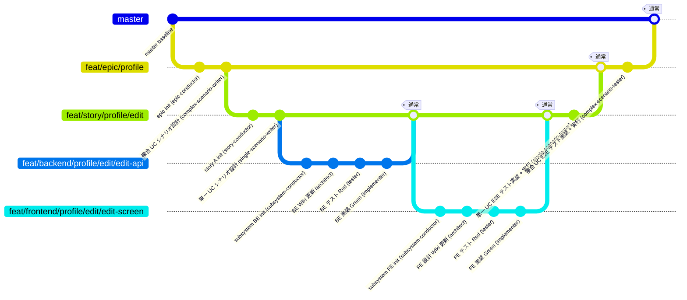

# ai-monitor ワークフロー設計

## ラベル一覧

| ラベル | 概要 | 補足 |
| --- | --- | --- |
| `layer:intake` | ユーザーが最初に起票した集約元 Issue |  |
| `layer:epic` | 機能全体（対象システム横断）の親 Issue |  |
| `layer:story` | ユースケース単位の親 Issue |  |
| `layer:subsystem` | 対象システム別担当分担用の親 Issue |  |
| `type:feat` | 新規機能追加 |  |
| `type:refactor` | 内部リファクタリング（振る舞い変更なし） |  |
| `type:bug` | バグ修正 |  |
| `type:docs` | ドキュメント更新 |  |
| `type:chore` | ビルド設定・軽微修正 |  |
| `type:question` | 質疑応答のみ |  |
| `scope:backend` | バックエンド担当 |  |
| `scope:frontend` | フロントエンド担当 |  |

- `layer:*` は自身は実装コードを持たず、全子完了 → 自ブランチを親レイヤーにマージ → クローズ
- `type:*` は親（`layer:*` or master）のブランチから派生して 1 leaf の PR を持ち、完了 → 親ブランチにマージ
- `scope:*` は将来対象システムが増えたら追加（モバイル、CLI ツール、等）
- GitHub Issue Type（組織リポジトリで利用可）に将来移行する場合は **`layer:*` を Issue Type に昇格**、`type:*` / `scope:*` はラベルのままにする

## 各レイヤー作業

### レイヤー判定基準

`docs/wiki/判定フローチャート/レイヤー.md` に移行済み（判定フロー・4 分類の基準とも Wiki 側が SoT）。
運用ルール（集約元 Issue の扱い・複数サブ Issue 等）はエージェント詳細「1. intake-issue-triager」参照。

### 全レイヤーの流れ

3 階層構造（epic → story → subsystem）で運用。
矢印ラベル = 担当エージェント + 実施内容、ノード = 各段階での状態（Issue / PR / 完了状態）。
基本は一本線で、分岐は epic の「画面変更あり / なし」のみ。

```mermaid
flowchart TD
  U([ユーザー])
  I0([Issue · 未分類])
  TRIAGE([intake-issue-triager: 内容分解 + 各作業を 4 分類判定])
  CONFIRM([ユーザー確認: サブ Issue 案の承認])
  CREATE([intake-issue-triager: Issue に Sub-issue として作成])

  U -->|Issue 起票| I0
  I0 --> TRIAGE
  TRIAGE --> CONFIRM
  CONFIRM --> CREATE
  CREATE --> E_ISSUE
  CREATE --> S_ISSUE
  CREATE --> B_ISSUE
  CREATE --> QUICK

  QUICK([quick-implementer: 直接コミット + マージ])

  %% epic レイヤー
  E_ISSUE([epic Issue])
  E_REQ([要件確定: ユースケース一覧 + 横断要件])
  E_PR([epic Draft PR · feat/epic/profile · base=master])
  E_SCENARIO([複合ユースケースシナリオ確定])
  E_UI([UI 全体設計: 画面方向性 + モック確定])

  E_ISSUE -->|epic-conductor: 本文整形 + ユースケース一覧 + 横断要件| E_REQ
  E_REQ -->|epic-conductor: 完了処理で Draft PR 作成| E_PR
  E_PR -->|mock-designer: 画面変更ありの場合 · モック commit| E_UI
  E_UI -->|complex-scenario-writer: 複合ユースケースシナリオ設計 · commit| E_SCENARIO
  E_PR -->|complex-scenario-writer: 画面変更なしの場合| E_SCENARIO
  E_SCENARIO -->|epic-conductor: 子 story 起票| S_ISSUE

  %% story レイヤー
  S_ISSUE([story Issue])
  S_REQ([要件確定: ユースケース要件])
  S_PR([story Draft PR · feat/story/profile/edit · base=epic ブランチ])
  S_SCENARIO([単一ユースケースシナリオ確定])

  S_ISSUE -->|story-conductor: 本文整形 + ユースケース要件| S_REQ
  S_REQ -->|story-conductor: 完了処理で Draft PR 作成| S_PR
  S_PR -->|single-scenario-writer: 単一ユースケースシナリオ設計 · commit| S_SCENARIO
  S_SCENARIO -->|story-conductor: 子 subsystem 起票| B_ISSUE

  %% subsystem レイヤー
  B_ISSUE([subsystem Issue])
  B_INTAKE([Issue 完成: 本文 + 現状調査 + 要件確定])
  B_PR([subsystem Draft PR · feat/backend/profile/edit/edit-api · base=story ブランチ])
  B_ARCH([SS 設計 + 設計 Wiki 更新完了])
  B_TEST([テスト Red])
  B_TESTREV([テストレビュー完了])
  B_IMPL([実装 Green])
  B_REVIEW([実装レビュー完了])
  B_MERGED([subsystem → story にマージ完了])

  B_ISSUE -->|subsystem-conductor: 本文整形 + 現状調査 + 機能・非機能要件確定| B_INTAKE
  B_INTAKE -->|subsystem-conductor: 完了処理で Draft PR 作成| B_PR
  B_PR -->|architect: 設計 Wiki 更新・BE / FE 共通| B_ARCH
  B_ARCH -->|tester: テストコード Red| B_TEST
  B_TEST -->|architect: テストと設計 Wiki の照合レビュー| B_TESTREV
  B_TESTREV -->|implementer: 実装 Green| B_IMPL
  B_IMPL -->|architect: Green 実測 + diff と設計 Wiki の照合レビュー| B_REVIEW
  B_REVIEW -->|subsystem-conductor: ユーザー最終確認後に story ブランチにマージ| B_MERGED

  %% story レベル: 単一 UC シナリオテスト（実装 → レビュー → 実行）
  S_TEST_IMPL([単一 UC テスト実装完了])
  S_TEST_REV([単一 UC テストレビュー完了])
  S_TEST_RESULT{単一 UC テスト結果}
  S_MERGE([story-conductor: story → epic マージ])
  BUG_S([該当 subsystem へのバグ差し戻し])

  B_MERGED -->|全 subsystem 完了時・single-scenario-tester: 回帰洗い出し + テスト実装| S_TEST_IMPL
  S_TEST_IMPL -->|single-scenario-writer: シナリオ設計書と照合レビュー| S_TEST_REV
  S_TEST_REV -->|single-scenario-tester: テスト実行| S_TEST_RESULT
  S_TEST_RESULT -->|✅ pass| S_MERGE
  S_TEST_RESULT -->|❌ fail・writer のトリアージ → story-conductor が差し戻し| BUG_S
  BUG_S -.->|バグ修正 → 単一 UC 再実行| B_ISSUE

  %% epic レベル: 複合 UC シナリオテスト（実装 → レビュー → 実行）
  E_TEST_IMPL([複合 UC テスト実装完了])
  E_TEST_REV([複合 UC テストレビュー完了])
  E_TEST_RESULT{複合 UC テスト結果}
  E_MERGE([epic-conductor: epic → master マージ])
  BUG_E([該当 subsystem へのバグ差し戻し])

  S_MERGE -->|全 story 完了時・complex-scenario-tester: 回帰洗い出し + テスト実装| E_TEST_IMPL
  E_TEST_IMPL -->|complex-scenario-writer: シナリオ設計書と照合レビュー| E_TEST_REV
  E_TEST_REV -->|complex-scenario-tester: テスト実行| E_TEST_RESULT
  E_TEST_RESULT -->|✅ pass| E_MERGE
  E_TEST_RESULT -->|❌ fail・writer のトリアージ → epic-conductor が差し戻し| BUG_E
  BUG_E -.->|バグ修正 → 単一 UC 再実行 → 複合 UC 再実行| B_ISSUE
```



**読み方:**

- 起点は「ユーザーが普通に Issue 起票（Issue）」→ `intake-issue-triager` が内容を作業単位に分解 + 4 分類判定
- ユーザーが Sub-issue 案を承認 → `intake-issue-triager` が **Issue に Sub-issue として** epic / story / subsystem / chore Issue を作成（複数可）
- Issue は集約元として残る（各サブ Issue のフローは独立進行、全完了でIssue クローズ）
- 基本は一本線。分岐は epic の「画面変更あり / なし」（UI 全体設計を通すか）のみ
- 各矢印ラベルの先頭が **担当エージェント名**、続けて実施内容
- ノードは「その段階での成果物 / 状態」を表す
- 下流 PR は上流 PR のブランチを base にする **Stacked PR** 構造（`base=master` / `base=epic ブランチ` / `base=story ブランチ`。ブランチ命名は `規約/ブランチ戦略.md`）
- **統合テスト（右側の縦の V 字）**: 全 subsystem 完了時に story レベルで単一 UC E2E、全 story 完了時に epic レベルで複合 UC E2E。いずれも「回帰洗い出し + テスト実装（scenario-tester）→ シナリオ設計書作成者のレビュー（scenario-writer）→ テスト実行（scenario-tester）」の 3 工程（E2E は実行が重いため実行前レビューで無駄実行を防ぐ）。失敗すれば bug 用 subsystem Issue 起票 → 修正フローへ再突入
- マージは下流から順（subsystem → story → epic → master）
- 修正 / バグ修正 / 機能追加の場合、必要な層だけを通る（epic 影響が無ければ story or subsystem から始まる）
- **V 字モデル**: シナリオ設計はトップダウン（複合 UC → 単一 UC。複合シナリオは UC を「箱」として扱う粗い粒度で書き、story 分割の根拠になる）、テスト実行はボトムアップ（単体 → 単一 UC E2E → 複合 UC E2E）
- **PoC は epic と subsystem の 2 レベルのみ**: epic = 実現可能性（epic-poc-runner）、subsystem = ライブラリ選定 + 動作確認（architect）。story レベルは不要（UC 連鎖の実現可能性は epic で検証済み）
- **粒度の階層定義**（シナリオ / 結合 / テストの対応）:

| 階層 | 定義 | 例（ファイル管理機能） | 対応テスト・担当レイヤー |
| --- | --- | --- | --- |
| 複合ユースケース | 複数の単一 UC を連鎖させた業務フロー | ファイル登録 → 共有 → 削除 | 複合 UC E2E（epic） |
| 単一ユースケース | **ユーザーの 1 操作**。結合をサブシステム単位で繋いだもの（1 操作が FE → BE → DB を貫通） | ファイル登録（画面入力 → API → DB 保存） | 単一 UC E2E（story） |
| 結合 | 単一 UC をサブシステムごとに区切ったもの。**BE 結合 = 1 エンドポイント / FE 結合 = 1 画面操作** | `POST /files` の受理〜保存 / 登録フォームの操作フロー | 結合テスト（subsystem） |
| 単体 | 各モジュール（クラス / 関数）ごと | `FileService.create()` | 単体テスト（subsystem） |

  - ai-monitor 自身のシナリオではユーザーの 1 操作 = 1 エージェントフェーズ（GitHub / tmux を貫通）に読み替える
  - **対応は 1:1 ではなく 1:N / N:M**: 1 つの単一 UC が同一サブシステムの結合を複数含むことがある（例: ファイル編集 = GET + PUT の 2 エンドポイント）し、共通エンドポイントは複数 UC から共有される
  - 「1 操作」は 1 クリック / 1 リクエストではなく「**1 つのまとまったゴール**（終わったらユーザーが満足して離れられる単位）」の意味
  - 命名テスト: 単一 UC は「**{対象}を{動詞}する**」の 1 動詞句で表せる粒度（例: ファイルを登録する）。1 動詞句にすると意味が消えるなら細かすぎ（例: 保存ボタンを押す）、複数動詞に分解できるなら粗すぎ = 複合 UC 行き（例: ファイルを管理する）

## gitGraph（ブランチ + commit + エージェント対応）

3 階層構造（epic → story → subsystem）を例示。

- epic ブランチ:
  - **複合 UC シナリオ設計 (complex-scenario-writer)** の commit を積む
  - 全 story マージ後に **複合 UC E2E テスト実装 + 実行 (complex-scenario-tester)** の commit を積む
- story ブランチ:
  - **単一 UC シナリオ設計 (single-scenario-writer)** の commit を積む
  - 全 subsystem マージ後に **単一 UC E2E テスト実装 + 実行 (single-scenario-tester)** の commit を積む
- subsystem ブランチ:
  - **Wiki 更新 (architect) → テスト (tester) → 実装 (implementer)** の commit が積まれる

下流 PR は上流 PR のブランチを base にする Stacked PR 構造で、subsystem → story → epic → master と通常マージで昇格していく。




---

## 設計レベルとエージェントの対応

| 設計レベル | 担当エージェント | 決めること |
| --- | --- | --- |
| 起点判定 | `intake-issue-triager` | Issue の内容を確認して epic / story / subsystem / chore のどのレイヤーから始めるかを判定（`docs/wiki/判定フローチャート/レイヤー.md` を参照） |
| epic Issue 本文整形 | `epic-conductor` | タイトル・概要・背景・ユースケース一覧・横断要件を確定 + 実現可能性 PoC 要否判定 + 完了時に epic / PoC Draft PR 作成 + PoC 結果確認 + 子 story 起票 + 複合 UC テストの委任 + epic → master マージの実行 |
| epic 実現可能性 PoC（条件付き） | `epic-poc-runner` | epic の核心機構が成立するかを最安直構成で検証。案ごとに PoC ブランチ + Draft PR（マージせず close）、結果は PR 本文に記録。ライブラリ銘柄選定はしない（subsystem の architect が担当） |
| epic UI 全体設計（条件付き） | `mock-designer` | 画面一覧・画面遷移の全体像・新規 / 変更画面のモックで**画面の方向性を確定**（画面の新規作成・レイアウト変更を含む epic のみ。方針合意 → モック合意の 2 ゲート。複合シナリオ設計の前段） |
| epic 複合ユースケースシナリオ設計 + 統合テスト指揮 | `complex-scenario-writer` | epic PR で `docs/wiki/設計図/シナリオ/複合ユースケース/*.md` を作成 / 更新 · commit + 複合 UC 統合テストの指揮（配下 tester へのタスク割り当て・実行前レビュー・fail トリアージ） |
| epic 複合ユースケースシナリオテスト | `complex-scenario-tester` | 全 story マージ後、回帰洗い出し + 複合 UC E2E 実装 → writer レビュー後に実行。報告先は writer のみ |
| story Issue 本文整形 | `story-conductor` | タイトル・概要・背景・ユースケース要件を確定 + 完了時に story Draft PR 作成 + 子 subsystem の直列起票 + 単一 UC テストの委任 + story → epic マージの実行 |
| story 単一ユースケースシナリオ設計 + 統合テスト指揮 | `single-scenario-writer` | story PR で `docs/wiki/設計図/シナリオ/単一ユースケース/{機能名}.md` を作成 / 更新 · commit + 単一 UC 統合テストの指揮（配下 tester へのタスク割り当て・実行前レビュー・fail トリアージ） |
| story 単一ユースケースシナリオテスト | `single-scenario-tester` | 全 subsystem マージ後、回帰洗い出し + 単一 UC E2E 実装 → writer レビュー後に実行。報告先は writer のみ |
| subsystem Issue 本文整形 | `subsystem-conductor` | 本文整形 + **現状調査**（既存コード・関連テスト・関連 Issue/PR・再現ログ）+ **機能要件・非機能要件・スコープ外を確定**（旧 investigator + spec-writer を統合）+ architect への一式委任 + マージ起動（タスク一覧の全チェック確認 + ユーザー最終確認ゲート） |
| SS（システム方式）設計 = 設計 Wiki 更新 + 内部パイプライン指揮 | `architect` | **設計 Wiki（インターフェース（バックエンド結合の `## インターフェース`）→ ER図 → 画面構成 → バックエンド結合 / フロントエンド結合（フロー）→ モジュール構成 / 外部ライブラリ / 外部 API）を上流順に 1 ページずつ確定**（BE / FE 共通。画面ありは epic で確定した画面方向性を前提に担当 UC の組み込み詳細を書く）。後続 subsystem が依存する場合はインターフェース確定時に subsystem-conductor へインターフェース確定報告を投稿。ライブラリ選定で必要なら PoC 実施。設計確定後は配下の tester / implementer にタスクを割り当て、検収したタスクのチェックを入れる |
| テスト | `tester` | テストコード作成（Red 状態）。報告先は architect のみ |
| テストレビュー | `architect` | テストコードと設計 Wiki（シナリオ / 結合 / モジュール構成）の照合レビュー → OK なら implementer にタスクを割り当て |
| 実装 | `implementer` | 実装 → Green 化 + テスト結果表の記入。報告先は architect のみ |
| 実装レビュー | `architect` | worktree でのテスト再実行（Green 実測）+ diff と設計 Wiki の照合レビュー → OK なら subsystem-conductor へ一式完了報告 |
| 直接実装（`chore`） | `quick-implementer` | 軽微修正の直接コミット + ユーザー確認後のマージ（TDD・レビュー・Wiki 更新スキップ） |
| 質疑応答（`question`） | `questioner` | ユーザーとのコメントループのみ（実装なし） |
| マージ | 各レイヤーの conductor | 自分の配下 PR のマージ + コンフリクト解消 + worktree 削除 + 上位 conductor への完了報告（手順は `規約/マージ手順.md`） |
| 中断リセット | `resetter` | 不要化した Issue/PR の巻き戻し（追記 Wiki 削除・worktree 削除・クローズ） |

- Wiki 更新は「実装より前」に完了させる **仕様駆動（docs → 実装）** 方針。architect が Wiki を確定させてから tester / implementer が続く
- Wiki 差分は subsystem PR の commit として含まれ、実装 diff と同一 PR でレビューされる（別 PR 化しない）
- **V 字レビュー**: 各工程の成果物はその上流ドキュメントを書いた architect がレビューする（テスト作成後のテストレビュー・実装 Green 後の実装レビューの 2 段階）。レビュー専用エージェントは置かない
- `type:docs` 単独 Issue（Wiki 単独更新など、実装コードを伴わない変更）は `architect` が Wiki のみコミットして進める（`確認:tester` / `確認:implementer` はスキップして subsystem-conductor がマージ起動に直接遷移）

---

## issue本文の担当セクション

詳細は Wiki: **`テンプレート/イシュー本文/サブシステム.md`**

担当エージェント・サブセクション一覧・記入テンプレートはすべて Wiki に集約。

> Issue は「**何を作るか**」（要件レベル）まで。設計（SS / UI）は **設計 Wiki の commit** に、進行管理とテスト結果は **PR 本文（タスク一覧 + テスト結果 4 表）** に移管（PR diff でレビューできるようにするため）。


## PR本文の担当セクション

`docs/wiki/テンプレート/PR本文/`（エピック / エピックPoC / ストーリー / サブシステム / ライブラリPoC / 軽微修正）に移行済み。
担当エージェント・サブセクション一覧・記入テンプレートは各テンプレートページが SoT。


## rulesページの担当セクション

dev-kit のルール（言語 / フレームワーク横断の規約。プロジェクトを跨いで使い回す）。一覧と本文は my-plugins の `docs/rules/`（索引は `index.yaml`）に移行済み。

> 担当エージェントは `architect`（BE / FE 系とも）。仕様駆動で SS 確定と同一 PR 内に更新 commit を積む。

## wikiページの担当セクション

ページ一覧は `docs/wiki/` の各 README・管理ルール（フォルダ構成 / 命名 / 参照方向 / 配置）は `規約/Wiki管理.md` に移行済み。

> 担当エージェントは `architect`（BE / FE 系とも）。仕様駆動で SS 確定と同一 PR 内に更新 commit を積む。

---

## エージェント詳細

エージェントは全 17 個。順序は「起点判定 → epic → story → subsystem → 独立系」（No は ID として維持、欠番 3・7・11 は廃止した pr-initializer 系、12・16 は architect に統合した ui-designer / reviewer、17 は各 conductor に統合した merger）。
エージェントの総称は 2 種類: **conductor**（レイヤー指揮役 = epic / story / subsystem-conductor）と **worker**（それ以外の作業系エージェント）。タスク一覧の運用（作成・ユーザー確認・検収チェック）は subsystem レイヤーのみ（epic / story は工程が少ないため直接割り当て）。

| No | エージェント名 | 属するレイヤー |
| --- | --- | --- |
| 1 | intake-issue-triager | 起点 |
| 2 | epic-conductor | epic |
| 21 | epic-poc-runner | 〃（epic-conductor の後・条件付き） |
| 22 | mock-designer | 〃（epic PR 作成後・画面変更ありのみ） |
| 4 | complex-scenario-writer | 〃 |
| 5 | complex-scenario-tester | 〃 |
| 6 | story-conductor | story |
| 8 | single-scenario-writer | 〃 |
| 9 | single-scenario-tester | 〃 |
| 10 | subsystem-conductor | subsystem |
| 13 | architect | 〃 |
| 23 | library-poc-runner | 〃（architect の PoC 発注・条件付き） |
| 14 | tester | 〃 |
| 15 | implementer | 〃 |
| 18 | resetter | 独立系 |
| 19 | quick-implementer | 〃 |
| 20 | questioner | 〃 |


### 1. intake-issue-triager

**起動条件**:
- Issue に `確認:intake-issue-triager` ラベルが付与された
- Assignee にユーザーが未設定

**役割**:
Issue（ユーザーが最初に書いた Issue）の内容を **作業単位に分解** し、各作業について epic / story / subsystem / chore のどの種別のサブ Issue として起票するかを判定する。
判定案を **ユーザーに事前確認** し、承認後に **Issue に Sub-issue として** 判定結果のサブ Issue を新規作成する。

- Issue 本文は書き換えない（ユーザーが最初に書いた内容のまま残す）
- Issue は集約元として残す（クローズしない）
- 1 Issue から複数のサブ Issue が生まれる場合もある（例: 1 epic + 1 chore、独立した 2 epic など）
- 判定基準は `docs/wiki/判定フローチャート/レイヤー.md` に集約

**フロー**:

1. Issue の内容を作業単位に分解し、各作業を `docs/wiki/判定フローチャート/レイヤー.md` に沿って 4 分類判定
2. サブ Issue 案（種別 + タイトル + 概要）をコメントでユーザーに提示
3. `assignee=ユーザー` で承認待ち
4. ユーザー応答ループ → 修正指示があればサブ Issue 案を更新
5. `議論中` 除去でユーザー承認 → 各サブ Issue を Sub-issue として作成（`create_child_issue` を件数分呼ぶ）
6. Issue のラベルを除去（`確認:intake-issue-triager`）、`assignee` を外す

**担当セクション**: なし（Issue の本文は書き換えない、サブ Issue の本文整形は各レイヤーの conductor に委譲）

**カスタムサブエージェント**: なし

**ラベル更新**（フェーズ完了時=ユーザー `議論中` 除去後）:
- Issue: 除去 `確認:intake-issue-triager` / 付与 なし（役割終了）
- 作成した各サブ Issue: `layer:{種別}` + 種別に応じて `確認:epic-conductor` / `確認:story-conductor` / `確認:subsystem-conductor` / `確認:quick-implementer` を付与


### 2. epic-conductor

**起動条件**:
- Issue に `確認:epic-conductor` ラベルが付与された
- Assignee にユーザーが未設定

**役割**:
epic Issue 本文の整形 + `## ユースケース一覧` + `## 横断要件` を確定する。
epic の条件付きフェーズ（実現可能性 PoC・UI 全体設計）は**互いに独立**で、あり / なしの 4 通りの組み合わせがあり得る。実施順は **PoC → モック → 複合シナリオ設計** で固定し、各フェーズの完了報告を受けるたびに本エージェントが次フェーズを判断して指示する（多段階呼び出し）。`complex-scenario-writer` 完了後は復帰して**子 story を起票**する。全子 story 完了後は複合 UC 統合テストを complex-scenario-writer に委任し、失敗報告を受けた該当 subsystem へのバグ差し戻しと epic → master マージの実行（`規約/マージ手順.md`）を行う（**epic レイヤーの工程順序を知るのは本エージェントだけ**）。

**担当ドキュメント**: `docs/wiki/テンプレート/イシュー本文/エピック.md`

**フロー（初回: 要件確定）**:

1. Issue 本文の骨組みを作成（`## 前提条件` / `## 概要` / `## 背景` / `## ユースケース一覧` / `## 横断要件`）
2. `## 概要` / `## 背景` をユーザー入力範囲内で整文
3. `## ユースケース一覧` の草案を作成（ユーザー承認を仰ぐ）
4. `## 横断要件` の草案を作成（ユーザー承認を仰ぐ）
5. **実現可能性 PoC 要否 + 画面変更有無の判定**: この epic の成立が前例のない技術機構に依存しているか（例: 新しいプロトコル連携・未検証のアーキテクチャ・性能が成立条件になっている等）と、画面の新規作成 / レイアウト変更を含むかを質問観点でユーザーに確認
6. 完了報告 + `assignee=ユーザー` で待機
7. ユーザー応答ループ → `議論中` 除去で完了処理:
   - **PoC 不要**: worktree + epic ブランチ（`{type}/epic/{ドメイン}`）作成 → 空 commit push → epic Draft PR 作成（`base=master`・本文は `## 紐づく Issue` のみ）→ PR に次フェーズのラベルを付与（**画面変更あり**: `確認:mock-designer` + 画面方針の指示コメント / **なし**: `確認:complex-scenario-writer`）
   - **PoC 必要**: worktree + PoC ブランチ（`poc/epic/{ドメイン}/{テーマ}`）作成 → 空 commit push → PoC Draft PR 作成（`base=master`・タイトル `PoC: {検証テーマ}（epic #{番号}）`・本文は `## 紐づく Issue` のみ）→ PR に `確認:epic-poc-runner` 付与

**フロー（復帰: PoC 結果確認）**:

`確認:epic-conductor` + epic-poc-runner の完了報告コメント（自分宛・未解決）で復帰（PoC 実施時のみ）。

1. epic Issue 本文の `## PoC 結果` と epic-poc-runner の完了報告コメントを確認
2. 疑問なし → 完了報告コメントを Resolve → PoC PR close（マージなし・複数あれば全て）+ PoC ブランチ / worktree 削除 → worktree + epic ブランチ（`{type}/epic/{ドメイン}`）作成 → 空 commit push → epic Draft PR 作成（`base=master`・本文は `## 紐づく Issue` のみ）→ PR に次フェーズのラベルを付与（**画面変更あり**: `確認:mock-designer` + 指示コメント / **なし**: `確認:complex-scenario-writer`）→ `確認:epic-conductor` 除去（子 story 起票時に complex-scenario-writer が再付与する）
3. 疑問あり → 質問コメント + `議論中` 付与 + `assignee=ユーザー` で相談。ユーザーが `議論中` 除去 + 再検証指示コメントで返した場合は、**同一 PoC PR** に `確認:epic-poc-runner` を再付与 + 再検証指示コメント（@epic-poc-runner 宛・ユーザー指示の要約）を投稿して差し戻す（PR・ブランチは保持したまま）

**フロー（復帰: モック完了確認）**:

`確認:epic-conductor` + mock-designer の完了報告コメント（自分宛・未解決）で復帰（画面変更ありの epic のみ）。

1. epic PR の `## UI 設計`（画面一覧 / 画面遷移 / モック URL）を確認
2. 疑問なし → 完了報告コメントを Resolve → epic PR に `確認:complex-scenario-writer` 付与 → `確認:epic-conductor` 除去（子 story 起票時に complex-scenario-writer が再付与する）
3. 疑問あり → 質問コメント + `議論中` 付与 + `assignee=ユーザー` で相談

**フロー（復帰: 子 story 起票）**:

`確認:epic-conductor` + complex-scenario-writer の完了報告コメント（自分宛・未解決）で復帰。完了報告から「複合シナリオ確定 → 子 story 起票に進む」と判断するのは本エージェントの責務。

1. `## ユースケース一覧` の各 UC ごとに子 story Issue を起票（`layer:story` + `確認:story-conductor` を付与）
2. 親 epic 本文の `対応 story` 列にリンクを埋める
3. 完了報告コメントを Resolve → 起票結果を報告コメントで記録（待機なし）→ ラベル除去（UC 一覧は要件確定で承認済みのため、**ユーザー承認なしの自動完了**）

**フロー（復帰: 統合テスト起動）**:

`確認:epic-conductor` + story-conductor の完了報告コメント（story 完了・自分宛・未解決）で復帰。統合テストの内部工程（実装 → レビュー → 実行）は complex-scenario-writer が指揮する。

1. 完了報告コメントを Resolve → 全子 story の close 状態で分岐:
   - 全子 close → epic PR に `確認:complex-scenario-writer` 付与（統合テストの委任。初回実装か再テストかの判定・内部工程は writer が指揮）
   - open の story が残っている → 何もしない（残りの story の完了を待つ）
2. ラベル除去（**ユーザー承認なしの自動完了**）

**フロー（復帰: バグ差し戻し）**:

`確認:epic-conductor` + complex-scenario-writer の失敗報告コメント（実装側の問題・自分宛・未解決）で復帰。実装修正は設計書の修正を伴うため、差し戻し前にユーザーと対応方針を確認する。進行中のバグは master 未反映のため、新規 Issue は起票せず該当 subsystem Issue に差し戻す。

1. 失敗内容から対応方針案（修正対象の subsystem・修正内容の要約・対応要否）をコメントで提示 + `議論中` 付与 + `assignee=ユーザー` で待機
2. ユーザー応答ループ → `議論中` 除去（= 方針の承認）で、該当する各 subsystem Issue を reopen + バグ内容コメント（fail 内容 + 修正方針・@subsystem-conductor 宛）+ `確認:subsystem-conductor` 付与 → 失敗報告コメントに差し戻し結果を返信追記して Resolve
3. ラベル除去（バグ修正後の再テストは統合テスト起動の経路で再委任。修正用 PR の作成〜マージはバグ修正フロー = subsystem-conductor のバグ修正着手以降で行われる）

**フロー（復帰: epic マージ・終端処理）**:

`確認:epic-conductor` + complex-scenario-writer の完了報告コメント（全 pass・自分宛・未解決）で復帰。

1. 完了報告（全 pass）と epic PR のテスト結果表を確認 → 完了報告コメントを Resolve
2. `規約/マージ手順.md` に沿って epic PR を master へマージ（コンフリクト時は相談コメント + `議論中` + `assignee=ユーザー` の応答ループで解消）
3. ラベル除去（最上位のため上位報告なし。epic Issue はマージで自動 close。intake の close とセッション一括解放は モニターの直轄）

**カスタムサブエージェント**: なし

**ラベル更新**（初回完了時）:
- Issue: 除去 `確認:epic-conductor` / **PoC 不要なら** epic Draft PR 作成 + PR に `確認:mock-designer`（画面変更あり・指示コメント付き）or `確認:complex-scenario-writer`（画面変更なし）・**PoC 必要なら** PoC Draft PR 作成 + PR に `確認:epic-poc-runner`

**ラベル更新**（復帰完了時）:
- 親 Issue: 除去 `確認:epic-conductor`
- 子 story Issue: 新規作成 + `layer:story` + `確認:story-conductor`


### 4. complex-scenario-writer

**起動条件**:
- PR に `確認:complex-scenario-writer` ラベルが付与された（epic Draft PR）
- Assignee にユーザーが未設定

**役割**:
複合ユースケースシナリオ（複数 UC を連鎖させた業務フロー）の設計書を作成し、epic ブランチに commit する。
仕様駆動の起点。シナリオ確定後は親 epic Issue に完了報告するのみで、次フェーズ（子 story 起票）に進む判断は指揮役の epic-conductor が行う。
全 story マージ後は epic-conductor から統合テストの指揮を委任され、**配下の complex-scenario-tester へのタスク割り当て**（テスト実装 → 統合テストレビュー → テスト実行）を行う。fail 時はシナリオ側 / 実装側の問題をトリアージし、実装側なら epic-conductor へ失敗報告する（バグ差し戻しは conductor）。

**担当ドキュメント**: `docs/wiki/設計図/シナリオ/複合ユースケース/{機能名}.md`（書式は `docs/wiki/テンプレート/シナリオ.md`）

**フロー（シナリオ設計）**:

1. 親 epic 本文の `## 概要` / `## ユースケース一覧` / `## 横断要件` を読み、複合 UC の範囲を把握
2. `複合ユースケース/{機能名}.md` を作成
3. `## 正常シナリオ` + `## 異常シナリオ（{条件}）` を H2 並列で書く
4. `設計図/シナリオ/README.md` の索引に該当行を追加
5. epic PR に commit + push
6. 完了報告 + `assignee=ユーザー` で待機
7. ユーザー応答ループ → `議論中` 除去で次へ
8. 親 epic Issue に `確認:epic-conductor` を付与し、完了報告コメント（@epic-conductor 宛・確認後の Resolve 依頼付き）を投稿 → **次へ進める判断は epic-conductor に委ねる**

**フロー（復帰: 統合テスト指揮）**:

epic PR の `確認:complex-scenario-writer` で復帰（全 story マージ後に epic-conductor が委任）。統合テストは テスト実装 → 統合テストレビュー → テスト実行 の 3 工程で、配下の complex-scenario-tester へのタスク割り当ては本エージェントが行う。

1. **テスト実装の起動**（委任時・テスト結果表が未記入）: `確認:complex-scenario-writer` 除去 + `確認:complex-scenario-tester` 付与
2. **統合テストレビュー**（tester のテスト実装完了報告で復帰）: E2E テストコードと実行対象（新規 + 回帰）を複合 UC シナリオ設計書と照合レビュー
   - 指摘なし → 報告 Resolve → シナリオ設計書の `対応テストファイル` に実体パスを記入して commit push → レビュー結果コメント投稿 → `確認:complex-scenario-tester` + 実行指示コメントを付与
   - 指摘あり → インライン指摘 → 報告 Resolve → `確認:complex-scenario-tester` + 指摘対応の指示コメントを付与（修正 → 再レビューは本エージェントと tester で直接回す）
3. **結果判定**（tester の実行結果報告で復帰）:
   - 全 pass → 報告 Resolve → 親 epic Issue に `確認:epic-conductor` 付与 + 完了報告コメント（全 pass）
   - fail → **トリアージ**: テストコード側の問題なら失敗報告に指摘と修正 + 再実行の再開指示を返信追記して `確認:complex-scenario-tester` を付与 / シナリオ側の問題なら失敗報告コメントに修正内容（修正 commit の ID）を返信追記しながらシナリオ設計書を修正（ユーザー承認の応答ループ）→ 同スレッドに再開指示を追記して tester に修正 + 再実行を割り当て / 実装側の問題なら失敗報告にトリアージ結果を返信追記して Resolve → 親 epic Issue に `確認:epic-conductor` 付与 + 失敗報告コメント（fail 内容の要約 + 元報告へのリンク。バグ差し戻しは epic-conductor）
4. **再テスト**（委任時・テスト結果表に fail 記録あり = テスト実装 + レビュー済み）: `確認:complex-scenario-tester` + 実行指示コメントを付与

**カスタムサブエージェント**: なし

**ラベル更新**:
- PR: 除去 `確認:complex-scenario-writer` / 付与 なし（統合テスト指揮中は `確認:complex-scenario-tester` を付与）
- 親 epic Issue: 付与 `確認:epic-conductor` + 完了報告 or 失敗報告コメント投稿（シナリオ設計は子 story 起票フェーズ・統合テストは全 pass / バグ差し戻しフェーズで復帰）


### 5. complex-scenario-tester

**起動条件**:
- PR に `確認:complex-scenario-tester` ラベルが付与された（epic PR）
- 全 story マージ完了
- Assignee にユーザーが未設定

**役割**:
epic ブランチで複合ユースケース E2E テストを実装 + 実行する。指揮役は complex-scenario-writer（タスク割り当て・報告の相手は全て writer。conductor とは会話しない）。実装と実行は別フェーズで、間に writer の統合テストレビュー（実行前レビュー）を挟む。実装フェーズでは今回の変更に関連する既存テストの回帰洗い出しも行う。
失敗時は fail 内容を writer へ報告する（トリアージとバグ差し戻しは writer / epic-conductor の責務）。

**担当ドキュメント**:
- テストコード: `複合ユースケース/*.md` のシナリオを E2E テストに落とし込む
- PR 本文: `## 複合ユースケースシナリオテスト結果` を更新（実装フェーズで新規 + 回帰の行を追加、実行フェーズで結果を記入）

**フロー（テスト実装）**:

epic PR の `確認:complex-scenario-tester`（writer が付与・実行指示コメントなし）で起動。

1. 全 story のマージ完了を確認
2. シナリオ索引と今回変更した単一 UC から回帰確認対象の既存テストを洗い出す
3. `複合ユースケース/*.md` のシナリオを E2E テストコードに実装して epic ブランチに commit + push（実行はしない）
4. PR 本文のテスト結果表に新規 + 回帰の行を追加（結果列は未記入）
5. `確認:complex-scenario-tester` 除去 → epic PR に `確認:complex-scenario-writer` 付与 + 完了報告コメント（統合テストレビューは writer が直接行う）

**フロー（テスト実行）**:

epic PR の `確認:complex-scenario-tester` + writer の実行指示コメント（自分宛・未解決）で復帰。

1. テスト結果表の全行（新規 + 回帰）を実行し、結果を PR 本文に記入 → 実行指示コメントを Resolve
2. **判定**:
   - 全 pass → epic PR に `確認:complex-scenario-writer` 付与 + 完了報告コメント（全 pass・@complex-scenario-writer 宛）→ 自ラベル除去
   - 失敗 → fail 結果 + 失敗ケースを PR 本文に記録 → epic PR に `確認:complex-scenario-writer` 付与 + 失敗報告コメント（fail 内容）→ 自ラベル除去

**カスタムサブエージェント**: なし

**ラベル更新**（テスト実装完了時・実行結果報告時）:
- PR: 除去 `確認:complex-scenario-tester` / 付与 `確認:complex-scenario-writer` + 完了報告 or 失敗報告コメント投稿


### 6. story-conductor

**起動条件**:
- Issue に `確認:story-conductor` ラベルが付与された
- Assignee にユーザーが未設定

**役割**:
story Issue 本文の整形 + `## ユースケース要件`（この UC 固有の要件）を確定する。
`single-scenario-writer` 完了後は復帰して**子 subsystem を依存順に起票**する（直列運用。後続は先行 subsystem のインターフェース確定報告を受けて逐次起票する）。全子 subsystem 完了後は単一 UC 統合テストを single-scenario-writer に委任し、失敗報告を受けた該当 subsystem へのバグ差し戻しと story → epic マージの実行（`規約/マージ手順.md`）を行う（**story レイヤーの工程順序を知るのは本エージェントだけ**）。

**担当ドキュメント**: `docs/wiki/テンプレート/イシュー本文/ストーリー.md`

**フロー（初回: 要件確定）**:

1. Issue 本文の骨組みを作成（`## 前提条件` / `## 概要` / `## 背景` / `## ユースケース要件`）
2. `## 概要` / `## 背景` を整文（`## 背景` に「親 epic #N の UC「{UC 名}」に対応」を明示）
3. `## ユースケース要件` の草案を作成（親 epic の `## 横断要件` を参照して補足列に整合性を明記）
4. 完了報告 + `assignee=ユーザー` で待機
5. ユーザー応答ループ → `議論中` 除去でラベル更新

**フロー（復帰: 子 subsystem 起票）**:

`確認:story-conductor` + single-scenario-writer の完了報告コメント（自分宛・未解決）で復帰。完了報告から「単一シナリオ確定 → 子 subsystem 起票に進む」と判断するのは本エージェントの責務。

1. 実装に必要な subsystem（BE / FE / DB 等）を洗い出し、依存順（例: BE → FE）を決める
2. **依存のない先頭グループのみ**子 Issue を起票（`layer:subsystem` + `確認:subsystem-conductor` を付与。直列運用 = インターフェースの手戻り防止のため、後続は先行 subsystem のインターフェース確定報告を受けて逐次起票する）
3. 親 story Issue 本文に全分担の依存順と子 subsystem リンクを埋める（未起票分は `未起票` と明記）
4. 完了報告コメントを Resolve → 起票結果を報告コメントで記録（待機なし）→ ラベル除去（分解は承認済みの単一シナリオから導かれるため、**ユーザー承認なしの自動完了**）

**フロー（復帰: 子 subsystem の進行判定）**:

`確認:story-conductor` + subsystem-conductor の報告コメント（インターフェース確定 or subsystem 完了・自分宛・未解決）で復帰。

1. 報告コメントを Resolve → 報告種別・`subIssues` の state・本文の依存順で分岐:
   - インターフェース確定報告（先行 subsystem の受け渡し面が確定）→ 本文の依存順から次の `未起票` subsystem を起票（`layer:subsystem` + `確認:subsystem-conductor`）+ 本文の `未起票` をリンクに置き換え
   - 完了報告 + 本文に `未起票` の subsystem が残っている → 同上（インターフェース確定報告を経由しなかった依存のフォールバック）
   - 完了報告 + 全子 close → story PR に `確認:single-scenario-writer` 付与（統合テストの委任。初回実装か再テストかの判定・内部工程（実装 → レビュー → 実行）は writer が指揮）
   - 完了報告 + open の subsystem が残っている → 何もしない（起票済みの後続の完了を待つ）
2. ラベル除去（**ユーザー承認なしの自動完了**）

**フロー（復帰: バグ差し戻し）**:

`確認:story-conductor` + single-scenario-writer の失敗報告コメント（実装側の問題・自分宛・未解決）で復帰。実装修正は設計書の修正を伴うため、差し戻し前にユーザーと対応方針を確認する。進行中のバグは master 未反映のため、新規 Issue は起票せず該当 subsystem Issue に差し戻す。

1. 失敗内容から対応方針案（修正対象の subsystem・修正内容の要約・対応要否）をコメントで提示 + `議論中` 付与 + `assignee=ユーザー` で待機
2. ユーザー応答ループ → `議論中` 除去（= 方針の承認）で、該当する各 subsystem Issue を reopen + バグ内容コメント（fail 内容 + 修正方針・@subsystem-conductor 宛）+ `確認:subsystem-conductor` 付与 → 失敗報告コメントに差し戻し結果を返信追記して Resolve
3. ラベル除去（バグ修正後の再テストは統合テスト起動の経路で再委任。修正用 PR の作成〜マージはバグ修正フロー = subsystem-conductor のバグ修正着手以降で行われる）

**フロー（復帰: story マージ）**:

`確認:story-conductor` + single-scenario-writer の完了報告コメント（全 pass・自分宛・未解決）で復帰。

1. 完了報告（全 pass）と story PR のテスト結果表を確認 → 完了報告コメントを Resolve
2. `規約/マージ手順.md` に沿って story PR を epic ブランチへマージ（コンフリクト時は相談コメント + `議論中` + `assignee=ユーザー` の応答ループで解消）
3. 親 epic Issue に `確認:epic-conductor` 付与 + 完了報告コメント（story 完了・@epic-conductor 宛）を投稿
4. ラベル除去（**ユーザー承認なしの自動完了**。統合テストの委任の判断は epic-conductor）

**カスタムサブエージェント**: なし

**ラベル更新**（初回完了時）:
- Issue: 除去 `確認:story-conductor` / story Draft PR 作成（`base=親 epic ブランチ`・本文は `## 紐づく Issue` のみ）+ PR に `確認:single-scenario-writer` 付与

**ラベル更新**(復帰完了時):
- 親 story Issue: 除去 `確認:story-conductor`
- 子 subsystem Issue: 新規作成 + `layer:subsystem` + `確認:subsystem-conductor`


### 8. single-scenario-writer

**起動条件**:
- PR に `確認:single-scenario-writer` ラベルが付与された（story Draft PR）
- Assignee にユーザーが未設定

**役割**:
単一ユースケースシナリオ（1 UC の正常系 + 異常系）の設計書を作成し、story ブランチに commit する。
仕様駆動の起点。シナリオ確定後は親 story Issue に完了報告するのみで、次フェーズ（子 subsystem 起票）に進む判断は指揮役の story-conductor が行う。
全 subsystem マージ後は story-conductor から統合テストの指揮を委任され、**配下の single-scenario-tester へのタスク割り当て**（テスト実装 → 統合テストレビュー → テスト実行）を行う。fail 時はシナリオ側 / 実装側の問題をトリアージし、実装側なら story-conductor へ失敗報告する（バグ差し戻しは conductor）。

**担当ドキュメント**: `docs/wiki/設計図/シナリオ/単一ユースケース/{機能名}.md`（書式は `docs/wiki/テンプレート/シナリオ.md`）

**フロー（シナリオ設計）**:

1. 親 story 本文の `## 概要` / `## ユースケース要件` を読み、単一 UC の範囲を把握
2. `単一ユースケース/{機能名}.md` を作成
3. `## 正常シナリオ` + `## 異常シナリオ（{条件}）` を H2 並列で書く
4. `設計図/シナリオ/README.md` の索引に該当行を追加
5. story PR に commit + push
6. 完了報告 + `assignee=ユーザー` で待機
7. ユーザー応答ループ → `議論中` 除去で次へ
8. 親 story Issue に `確認:story-conductor` を付与し、完了報告コメント（@story-conductor 宛・確認後の Resolve 依頼付き）を投稿 → **次へ進める判断は story-conductor に委ねる**

**フロー（復帰: 統合テスト指揮）**:

story PR の `確認:single-scenario-writer` で復帰（全 subsystem マージ後に story-conductor が委任）。統合テストは テスト実装 → 統合テストレビュー → テスト実行 の 3 工程で、配下の single-scenario-tester へのタスク割り当ては本エージェントが行う。

1. **テスト実装の起動**（委任時・テスト結果表が未記入）: `確認:single-scenario-writer` 除去 + `確認:single-scenario-tester` 付与
2. **統合テストレビュー**（tester のテスト実装完了報告で復帰）: E2E テストコードと実行対象（新規 + 回帰）を単一 UC シナリオ設計書と照合レビュー
   - 指摘なし → 報告 Resolve → シナリオ設計書の `対応テストファイル` に実体パスを記入して commit push → レビュー結果コメント投稿 → `確認:single-scenario-tester` + 実行指示コメントを付与
   - 指摘あり → インライン指摘 → 報告 Resolve → `確認:single-scenario-tester` + 指摘対応の指示コメントを付与（修正 → 再レビューは本エージェントと tester で直接回す）
3. **結果判定**（tester の実行結果報告で復帰）:
   - 全 pass → 報告 Resolve → 親 story Issue に `確認:story-conductor` 付与 + 完了報告コメント（全 pass）
   - fail → **トリアージ**: テストコード側の問題なら失敗報告に指摘と修正 + 再実行の再開指示を返信追記して `確認:single-scenario-tester` を付与 / シナリオ側の問題なら失敗報告コメントに修正内容（修正 commit の ID）を返信追記しながらシナリオ設計書を修正（ユーザー承認の応答ループ）→ 同スレッドに再開指示を追記して tester に修正 + 再実行を割り当て / 実装側の問題なら失敗報告にトリアージ結果を返信追記して Resolve → 親 story Issue に `確認:story-conductor` 付与 + 失敗報告コメント（fail 内容の要約 + 元報告へのリンク。バグ差し戻しは story-conductor）
4. **再テスト**（委任時・テスト結果表に fail 記録あり = テスト実装 + レビュー済み）: `確認:single-scenario-tester` + 実行指示コメントを付与

**カスタムサブエージェント**: なし

**ラベル更新**:
- PR: 除去 `確認:single-scenario-writer` / 付与 なし（統合テスト指揮中は `確認:single-scenario-tester` を付与）
- 親 story Issue: 付与 `確認:story-conductor` + 完了報告 or 失敗報告コメント投稿（シナリオ設計は子 subsystem 起票フェーズ・統合テストは全 pass / バグ差し戻しフェーズで復帰）


### 9. single-scenario-tester

**起動条件**:
- PR に `確認:single-scenario-tester` ラベルが付与された（story PR）
- 全 subsystem マージ完了
- Assignee にユーザーが未設定

**役割**:
story ブランチで単一ユースケース E2E テストを実装 + 実行する。指揮役は single-scenario-writer（タスク割り当て・報告の相手は全て writer。conductor とは会話しない）。実装と実行は別フェーズで、間に writer の統合テストレビュー（実行前レビュー）を挟む。実装フェーズでは今回の変更に関連する既存テストの回帰洗い出しも行う。
失敗時は fail 内容を writer へ報告する（トリアージとバグ差し戻しは writer / story-conductor の責務）。

**担当ドキュメント**:
- テストコード: `単一ユースケース/*.md` のシナリオを E2E テストに落とし込む
- PR 本文: `## 単一ユースケースシナリオテスト結果` を更新（実装フェーズで新規 + 回帰の行を追加、実行フェーズで結果を記入）

**フロー（テスト実装）**:

story PR の `確認:single-scenario-tester`（writer が付与・実行指示コメントなし）で起動。

1. 全 subsystem のマージ完了を確認
2. シナリオ索引と今回変更した結合ドキュメントから回帰確認対象の既存テストを洗い出す
3. `単一ユースケース/{機能名}.md` のシナリオを E2E テストコードに実装して story ブランチに commit + push（実行はしない）
4. PR 本文のテスト結果表に新規 + 回帰の行を追加（結果列は未記入）
5. `確認:single-scenario-tester` 除去 → story PR に `確認:single-scenario-writer` 付与 + 完了報告コメント（統合テストレビューは writer が直接行う）

**フロー（テスト実行）**:

story PR の `確認:single-scenario-tester` + writer の実行指示コメント（自分宛・未解決）で復帰。

1. テスト結果表の全行（新規 + 回帰）を実行し、結果を PR 本文に記入 → 実行指示コメントを Resolve
2. **判定**:
   - 全 pass → story PR に `確認:single-scenario-writer` 付与 + 完了報告コメント（全 pass・@single-scenario-writer 宛）→ 自ラベル除去
   - 失敗 → fail 結果 + 失敗ケースを PR 本文に記録 → story PR に `確認:single-scenario-writer` 付与 + 失敗報告コメント（fail 内容）→ 自ラベル除去

**カスタムサブエージェント**: なし

**ラベル更新**（テスト実装完了時・実行結果報告時）:
- PR: 除去 `確認:single-scenario-tester` / 付与 `確認:single-scenario-writer` + 完了報告 or 失敗報告コメント投稿


### 10. subsystem-conductor

**起動条件**:
- Issue に `確認:subsystem-conductor` ラベルが付与された
- Assignee にユーザーが未設定

**役割**:
subsystem Issue の本文整形 + **現状調査**（既存コード・関連テスト・関連 Issue/PR・再現ログ）+ **機能要件・非機能要件・スコープ外を確定**する。
旧 investigator + spec-writer + subsystem 部分の intake-issue-triager 責務を統合したエージェント。
subsystem Draft PR 作成後は、設計〜実装レビューの一式を **architect（内部パイプラインの指揮役）に委任**し、architect の一式完了報告を受けてマージ起動（`## タスク一覧` の全チェック確認 + ユーザー最終確認ゲート `議論中` + `assignee=ユーザー`）を開く。ユーザー承認後は**本エージェント自身が subsystem PR をマージ**（手順は `規約/マージ手順.md`・コンフリクト解消含む）し、親 story へ完了報告する。本エージェントが知る工程は「要件確定 → architect 一式 → マージ起動 → マージ」だけで、内部パイプラインの順序は architect が知る。
subsystem PR の `## タスク一覧`（Wiki 修正・実装・テスト実行の To Do）も PR 作成時に本エージェントが起こす（触る Wiki の分類は現状調査で把握済み。各タスクの詳細化は SS 設計に委ね、チェック記入は検収した architect が行う）。

**担当ドキュメント**: `docs/wiki/テンプレート/イシュー本文/サブシステム.md`

**フロー**:

1. Issue 本文の骨組みを作成
2. `## 概要` / `## 背景` を整文（ユーザー入力範囲内）
3. **現状調査**:
   - 設計図 Wiki（モジュール構成 / バックエンド結合 / フロントエンド結合 / ER図）を起点に既存コードを直接調査
   - 実行可能なテストがあれば再現確認
   - 関連 Issue / PR の収集は `related-issue-finder` / `related-pr-finder` を並列起動（gh 検索の fan-out のみサブエージェント）
4. 調査結果を `## 現状` に記録（`### 関連実装コード` / `### 関連テスト` / `### 関連 Issue/PR` / `### 関連ドキュメント` / `### 既存テスト実行結果` / `### 再現手順`）
5. **要件観点調査**: 機能要件・非機能要件の観点を洗い出し、`## システム要件（SA）`（`### 機能要件` / `### 非機能要件` / `### スコープ外`）を確定
6. 曖昧な点があれば 1質問1コメントで投稿し、ユーザー回答を本文に反映
7. 完了報告 + `assignee=ユーザー` で待機
8. ユーザー応答ループ → `議論中` 除去で完了処理: worktree + subsystem ブランチ（`{type}/{scope}/{ドメイン}/{UC名}/{変更内容}`）作成 → 空 commit push → subsystem Draft PR 作成（`base=親 story ブランチ`・本文に `## 紐づく Issue` と `## タスク一覧` を記入）
9. subsystem PR にタスク一覧の確認コメントを投稿 + `議論中` 再付与 + `assignee=ユーザー` で待機（タスクの過不足・順序・不要 Wiki の除外をユーザーが確認）
10. ユーザー応答ループ → `議論中` 除去で、タスク一覧の最初の工程の `確認:architect` を subsystem PR に付与 → `確認:subsystem-conductor` 除去

**フロー（復帰: マージ起動）**:

subsystem PR の `確認:subsystem-conductor` + architect の一式完了報告コメント（自分宛・未解決）で復帰（PR 側イベントは PR 本文の `## 紐づく Issue` の逆引きで Issue 起点の同一セッションへ届く）。

1. 一式完了報告とレビュー結果・テスト結果表を照合 → `## タスク一覧` が全チェック済みであることを確認（チェック記入は architect）
2. 完了報告コメントを Resolve → subsystem PR に最終確認の依頼コメント + `議論中` + `assignee=ユーザー` を付与（`確認:subsystem-conductor` は保持したまま待機）

**フロー（復帰: マージ）**:

ユーザーの `議論中` 除去 + assignee 外し（最終承認）で復帰。

1. 自分宛コメントを一括 Resolve → `規約/マージ手順.md` に沿って subsystem PR をマージ（base 取り込み → squash マージ + リモートブランチ削除 → worktree 削除。コンフリクト時は相談コメント + `議論中` + `assignee=ユーザー` の応答ループで解消）
2. 親 story Issue に `確認:story-conductor` 付与 + 完了報告コメント（subsystem 完了・@story-conductor 宛）を投稿
3. ラベル除去（次の subsystem の起票 / 統合テストの委任の判断は story-conductor）

**フロー（復帰: バグ修正着手）**:

subsystem Issue（統合テスト fail で上位 conductor が reopen 済み）の `確認:subsystem-conductor` + バグ内容コメント（fail 内容 + 修正方針・自分宛・未解決）で復帰。対応方針は上位 conductor のゲートで承認済みのため、SA の確定・タスク一覧のユーザー確認はやり直さない。

1. バグ内容コメントから影響範囲（設計書・実装・単体テスト）を分析（内容が明確なら現状調査は省略）
2. SA（Issue 本文）の変更が必要な場合のみ: 変更案をコメントで提示 + `議論中` 付与 + `assignee=ユーザー` で待機 → ユーザー応答ループ → `議論中` 除去で本文を更新
3. worktree + 修正用ブランチ（`fix/{scope}/{ドメイン}/{UC名}/{変更内容}`）作成 → 空 commit push → 修正用 Draft PR 作成（`base=親 story ブランチ`・本文に `## 紐づく Issue` と `## タスク一覧`（設計書修正・実装修正・単体テスト修正））
4. バグ内容コメントに修正用 PR のリンクを返信追記して Resolve → 修正用 PR に `確認:architect` 付与（設計〜実装レビュー・マージ起動・マージは既存フロー）→ `確認:subsystem-conductor` 除去

**フロー（復帰: インターフェース確定の中継）**:

subsystem PR の `確認:subsystem-conductor` + architect のインターフェース確定報告コメント（自分宛・未解決）で復帰（後続 subsystem が本 subsystem のインターフェースに依存する場合のみ発生）。

1. 報告コメントを Resolve → 親 story Issue に `確認:story-conductor` 付与 + インターフェース確定報告コメント（要約 + 元コメントへのリンク・@story-conductor 宛）を投稿
2. ラベル除去（**ユーザー承認なしの自動完了**。後続 subsystem の起票判断は story-conductor）

**フロー（復帰: エスカレーション中継）**:

subsystem PR の `確認:subsystem-conductor` + architect のエスカレーションコメント（レベル超えの論点・自分宛・未解決）で復帰。

1. エスカレーションコメントを Resolve → 親 story Issue に `確認:story-conductor` + 経緯コメント（要約 + 元コメントへのリンク）を投稿して 1 段上へ中継
2. ラベル除去（担当面は保留のまま待機。以降の判断は論点のレイヤーの conductor が行う）

**カスタムサブエージェント**:

| エージェント | 入力 | 出力 |
| --- | --- | --- |
| related-issue-finder | Issue 本文・キーワード | 関連 Issue リスト（open/closed） |
| related-pr-finder | 〃 | 関連 PR リスト（merged 含む） |

**ラベル更新**:
- Issue: 除去 `確認:subsystem-conductor`（タスク一覧のユーザー承認後）
- subsystem Draft PR: 作成（`base=親 story ブランチ`・本文に `## 紐づく Issue` と `## タスク一覧`）→ タスク一覧のユーザー承認後、最初の工程の `確認:architect` を付与


### 13. architect

**起動条件**:
- PR に `確認:architect` ラベルが付与された
- Assignee にユーザが設定されていない

システム方式設計（SS）を **設計 Wiki の編集**として行う（BE / FE 共通）。**Wiki を編集してユーザーと確認しながら進めるエージェント**で、**上流から 1 ページずつ**（インターフェース（バックエンド結合の `## インターフェース`）→ ER図 → 画面構成 → バックエンド結合 / フロントエンド結合（フロー）→ モジュール構成）Wiki を作成 → 応答ループで確定、を繰り返す（Wiki を叩き台に議論する）。後続 subsystem が本 subsystem のインターフェースに依存する場合は、インターフェース確定時に subsystem-conductor へ**インターフェース確定報告**を投稿する（待機なし・設計は継続。story-conductor が後続 subsystem の起票に使う）。**ライブラリ選定で必要な場合は PoC まで実施**する。
設計確定後は **subsystem 内部パイプライン（tester → テストレビュー → implementer → 実装レビュー）の指揮役**として、配下の tester / implementer にタスクを割り当てる。**テストレビュー**（tester のテストコードと設計 Wiki の照合）と**実装レビュー**（worktree でのテスト再実行 + diff と設計 Wiki の照合）は本エージェント自身が担当し（設計 Wiki の作成者がレビューする V 字対応。レビュー専用エージェントは置かない）、検収したタスクの `## タスク一覧` チェックを入れる。全工程完了で subsystem-conductor へ一式完了報告する。配下 worker からの質問・差し戻しも本エージェントが直接受ける（conductor は経由しない）。

- 実装範囲を判定し、設計図 Wiki を起点に各領域を直接調査
- 画面ありの subsystem では、epic で確定した画面方向性（mock-designer の UI 全体設計・モック）を前提に、担当 UC の組み込み詳細を画面構成（要素仕様）/ フロントエンド結合（操作フロー）として書く
- 設計判断が割れる論点は複数案比較 + 推奨をコメントに添える（1論点 = 1コメント）
- ライブラリ選定論点は library-finder / library-researcher を使う（BE / UI ライブラリ共通）
- 採用候補が**未経験のライブラリ**で PoC が必要と判断したら（後述「PoC 要否判定カテゴリ」A〜E に該当）、PoC まで本フェーズ内で完結させる
- 成果物は設計 Wiki（ER 図 / 画面構成 / バックエンド結合 / フロントエンド結合 / モジュール構成 / 外部ライブラリ / 外部 API の該当分類ページ）で、実装 PR と同一 subsystem ブランチに commit する。PR 本文への記載はしない（本文構成は `テンプレート/PR本文/サブシステム.md` 参照。`## タスク一覧` のチェックは subsystem-conductor が完了報告の検収時に入れる）
- 全 Wiki 確定後、subsystem-conductor へ完了報告して次フェーズに進む

#### PoC 要否判定カテゴリ

| カテゴリ | 該当する例 |
| --- | --- |
| A. ライブラリ選定型 | 複数候補（例: Faster-Whisper vs whisper.cpp）の比較が必要 |
| B. 動作確認型 | 採用方針は決まっているが API 仕様の確認が必要（例: Stripe 定期課金フロー） |
| C. パフォーマンス検証型 | 非機能要件で性能数値目標があり計測が必要 |
| D. 統合検証型 | 既存システムへの結合が読めない（例: 認証層変更） |
| E. 手順検証型 | 本番ぶっつけが怖い（例: DB マイグレーション） |

- 該当なし → PoC スキップ、通常のライブラリ選定論点として進める
- 該当あり → 候補/対象をユーザーと合意して PoC 実行

#### PoC worktree / PR 運用ルール（実行する場合のみ）

- 発生タイミングの目安: 外部依存の必要性は結合（バックエンド結合 / フロントエンド結合）を書く段階で見える。**外部 API / サービスそのものの選定**（結合のインターフェースに影響する）は結合のループ中、**ライブラリ銘柄の選定**（実装手段。インターフェースは変わらない）は モジュール構成 のループ中に発生する
- 命名: `poc/{scope}/{ドメイン}/{UC名}/{lib名}`（例: `poc/backend/profile/edit/langchain`）
- 候補ごとにリモート push + PoC Draft PR 作成（`base=master`・本文は `テンプレート/PR本文/ライブラリPoC.md` 書式で検証対象 / 調査結果 / 検証観点まで記入・マージせず close 前提）→ 候補比較コメントのスレッドに PoC PR のリンク一覧を残す
- **検証は候補ごとの `library-poc-runner` セッションへ発注**（各 PoC PR に `確認:library-poc-runner` + 検証指示コメント。1 候補 = 1 PoC PR = 1 tmux セッション並列）。個別候補への質問・追加検証もユーザーは subsystem PR で発注元の architect に依頼し、architect が該当 PoC PR に再検証を再発注する（結果は architect が結果まとめに反映）
- poc-runner の完了報告は PoC PR に `確認:architect` + @宛先コメント（architect は PoC PR 作成時に PR 番号を自セッションの監視面としてモニターの台帳へ登録し、モニターは台帳検索で発注元セッションへ届ける。監視面の除去は PoC PR close 後の完了処理）。発注元は全候補の結果まとめを subsystem PR のコメントで共有する
- 採用決定後: 発注元の architect が外部ライブラリ Wiki を反映し、応答ループでユーザー確認を経てから全 PoC PR を close（マージなし。**closed PR の diff がコード・コミット履歴の恒久記録**になる）+ PoC worktree・ブランチ（ローカル / リモートとも）を削除（モニターが close 検知で PoC セッションを解放）
- 成果物の扱いは epic の実現可能性 PoC と同じ（コードは捨てる・知見は残す。知見は外部ライブラリ Wiki へ）
- PoC 中の各待機でも **`議論中` 付与 + `assignee=ユーザー` を必ずセット**で行う（既に付いていれば冪等）。`議論中` を外せるのはユーザーのみ（除去 = 設計 Wiki の確定）。Wiki 承認後の完了処理で PoC 関連の自分宛コメントを一括 Resolve する
- 大規模 PoC（複数ファイル）の場合のみ後続フェーズに引き継ぐため採用案の worktree を一時保持し、コメントにその旨を注記

**担当ドキュメント**: 設計 Wiki（`設計図/モジュール構成/{サブシステム}/{分類}.md` / `設計図/ER図/{分類}.md` / `設計図/画面構成/{画面名}.md` / `設計図/バックエンド結合/{論理名}.md` / `設計図/フロントエンド結合/{論理名}.md` / `外部ライブラリ/` / `外部API/`）

**論点・検証結果の提示書式**（コメントでユーザーと合意する際の表）:

| 項目 | 入力値 | 概要 | 参照 Wiki |
| --- | --- | --- | --- |
| 採用ライブラリ | 本フェーズの PoC 結論・既存使用ライブラリ・library-finder の調査結果 | **ライブラリ / バージョン / 用途 / 補足** の表。新規採用は補足に選定理由 | 外部ライブラリ/README.md |
| コンポーネント分割 | 機能要件・領域別アーキ調査の結果 | **新規/変更 / レイヤー / コンポーネント / 役割 / 補足** の表（レイヤーは フロント/バック/DB、新規/変更は 新規/変更/削除） | アーキテクチャ図.md |
| データフロー | コンポーネント分割・API エンドポイント | Mermaid `sequenceDiagram` または `flowchart` で図示 | データフロー図_*.md |
| 画面構成 | 機能要件・既存画面 | **要素 / 種類 / 位置 / 説明 / 表示条件 / 必須 / 制限 / 初期値 / 取得元 / アクション / 補足** の表（要素: ボタン・入力欄・ラベル・テーブル等／種類: button/input/table 等／位置: ヘッダー/フッター/フォーム本体/サイドバー 等／**取得元: 表示・初期値の出所を `{バックエンド結合の論理名}.{フィールドパス}` 形式で。例: `タスク詳細取得.task.title`**／**アクション: 日本語のドメイン記述で。例: 「クリックで詳細画面へ遷移」「クリックで保存」（API パスやコードは書かない）**／**表に書き切れない複雑なロジックは `※1` `※2` … の印を該当セルに入れ、表の直下に `※1: 〜` 形式で詳細を記述**／該当しない列は `-`） | 設計図/画面構成/*.md |
| 画面遷移 | 機能要件・既存画面遷移 | Mermaid `flowchart LR` で図示。トリガー（ボタンクリック等）も明示 | 画面遷移図_*.md |
| PoC 動作確認結果 | 採用候補ライブラリの PoC 実行結果 | **ライブラリ / 検証項目 / 結果 / 補足** の表（成功条件・所要時間・所感など）+ 表後に最小再現コード（10〜30行程度） | - |

**ユーザーとのコメントのやり取り**:

| 起点 | 発生条件 | 議論内容 | 終了条件 | 備考 |
| --- | --- | --- | --- | --- |
| AI | ライブラリ選定論点が見つかった場合 | 候補ライブラリの比較と推奨 | ユーザーが採用候補を選択 → 外部ライブラリ Wiki に反映 | library-finder / library-researcher の結果を整形 |
| AI | 候補ライブラリの動作検証結果を共有する場合（PoC 実施時） | 候補ごとの動作結果・所感を共有し採用判断を仰ぐ | ユーザーが採用ライブラリを決定 → 外部ライブラリ Wiki に反映 | 候補ごとに 1 コメント |
| AI | 設計論点（コンポーネント分割・データフローなど）が見つかった場合 | 複数案比較 + 推奨 | ユーザーが案を選択 → BE 設計 Wiki に反映 | 複数案比較を `テンプレート_設計レビュー論点.md` 形式で整形 |
| ユーザー | 別の案・観点の追加要望 | 該当案を追加検討 | 追加検討結果 → BE 設計 Wiki に反映 | - |

**カスタムサブエージェント**:

| エージェント | 入力 | 出力 |
| --- | --- | --- |
| library-finder | 処理目的 + 既存スタック | ライブラリ候補3〜5個 |
| library-researcher | 1ライブラリ | 観点別スコア + コード例 |

**使い分け**:
- ライブラリ採用判断は library-*（候補列挙 → 各候補深掘り → 必要なら PoC で実コード検証。Web 検索の fan-out なのでサブエージェント）
- ライブラリに関係しない設計判断（キャッシュ戦略・エラー処理方針など）はメインエージェントが直接検討する
- 論点提示時は 1 論点 = 1 コメントで並列に出す

**フロー（SS設計）**:

1. **紐づく Issue の確認 + 領域別アーキ調査**: PR 本文の `## 紐づく Issue` から親 subsystem Issue の SA（機能 / 非機能要件・スコープ外）を把握し、関連 Wiki（`設計図/アーキテクチャ図.md` / 該当領域の `設計図/モジュール構成/{サブシステム}/{分類}.md` / `設計図/画面構成/{画面名}.md` / `設計図/バックエンド結合/{論理名}.md` / `設計図/フロントエンド結合/{論理名}.md` / `設計図/シナリオ/{論理名}.md`（あれば）/ `設計図/ER図/{分類}.md` など）を起点に各領域を直接調査する（画面ありなら親 epic PR の `## UI 設計` も確認する）
2. **上流から 1 ページずつ設計 Wiki を確定させる**（`## タスク一覧` の担当分を インターフェース → ER図 → 画面構成 → バックエンド結合 / フロントエンド結合（フロー）→ モジュール構成 → 外部ライブラリ / 外部API の順で。Wiki を叩き台に議論する）:
   - 2a. 対象 Wiki を作成 / 更新して subsystem ブランチに commit push（`設計図/バックエンド結合/{論理名}.md` の `## インターフェース` — リクエスト / レスポンス / エラー。後続 subsystem との受け渡し面として先行確定 / `設計図/ER図/{分類}.md` — DB カラム・インデックス / `設計図/画面構成/{画面名}.md` — 画面要素の仕様（表示条件・制限・初期値・取得元・アクション）/ `設計図/バックエンド結合/{論理名}.md` — 処理フロー / `設計図/フロントエンド結合/{論理名}.md` — 画面操作の処理フロー / `設計図/モジュール構成/{サブシステム}/{分類}.md` — クラス・関数・関数型・コンポーネント・フック）
   - 2b. 提案コメント投稿（設計判断が割れる論点は複数案比較 + 推奨を `テンプレート_設計レビュー論点.md` 形式で・画面構成 / 遷移は前述の提示書式で添える）+ `議論中` 付与 + `assignee=ユーザー` で待機
   - 2c. 応答ループ: フィードバック + assignee 外し → Wiki 修正 commit → 再待機
   - 2d. ユーザーの `議論中` 除去 = 当該 Wiki の確定 → 次の Wiki へ
   - 2e. インターフェース確定時（後続 subsystem が本 subsystem のインターフェースに依存する場合のみ）: subsystem PR に `確認:subsystem-conductor` 付与 + インターフェース確定報告コメント（@subsystem-conductor 宛）を投稿して次の Wiki へ（待機なし・設計は継続）
3. **ライブラリ選定が絡む段階**（モジュール構成 / 外部ライブラリ）では:
   - 3a. `library-finder` で候補列挙（3〜5 個）→ 候補ごとに `library-researcher` を並列起動して観点別スコア + コード例を取得
   - 3b. **PoC 要否判定**（前述カテゴリ A〜E）。必要なら: 候補・検証観点をコメントで合意 → 候補ごとに PoC worktree + push + PoC Draft PR（`base=master`・本文は `テンプレート/PR本文/ライブラリPoC.md`: 検証対象 / 調査結果（library-researcher の成果の転記）/ 検証観点を記入）を作成 → 候補比較コメントのスレッドに PoC PR のリンク一覧を追記 → 各 PoC PR に `確認:library-poc-runner` + 検証指示コメントを付与（1 候補 = 1 セッション並列）→ 完了報告を受けて全候補の結果まとめをコメントで共有し採用判断を仰ぐ
   - 3c. ユーザー採用決定 → `外部ライブラリ/README.md` に行追加・`外部ライブラリ/{lib名}.md` を新規作成または更新（書き方規約は Wiki `テンプレート/外部ライブラリ.md` 参照: 概要 / 現在のバージョン情報 / インストール / 使用するメソッドとパラメータ）→ Wiki 反映を報告コメントで共有し、応答ループで修正 → ユーザー承認後に全 PoC PR を close（マージなし・恒久記録）+ PoC worktree・ブランチを**全て削除**（大規模 PoC で後続に引き継ぐ場合のみ採用案の worktree を保持し、コメントに注記）
4. **完了処理**（前提条件: 自分宛コメントが全て Wiki 反映済み（未反映あればユーザー確認後に自分宛のみ一括 Resolve）・PoC 実施時は全 PoC PR が close 済み + worktree / ブランチが削除済み・Wiki 更新 commit が subsystem ブランチに push 済み）:
   - 上記条件を満たさなければ「Wiki 反映 → 一括 Resolve → worktree 削除」を先に実行
   - 満たしたら `## タスク一覧` の設計タスクにチェックを入れ、subsystem PR の `確認:architect` を除去 + `確認:tester` を付与（テスト作成タスクの割り当て。内部パイプラインの指揮開始）

**フロー（テストレビュー）**:

subsystem PR の `確認:architect` + tester の完了報告コメント（自分宛・未解決）で復帰。**ユーザーとのやり取りなし**。

1. tester のテストコードと設計 Wiki（シナリオ / 画面構成 / 結合 / モジュール構成）を照合レビュー（観点の過不足・粒度）
2. **判定**:
   - 指摘なし → 完了報告コメントにレビュー結果（指摘なし）を返信追記して Resolve → 紐づく結合の `対応テストファイル` に実体のテストファイルパスを記入して commit push → `## タスク一覧` のテスト作成タスクにチェック → `確認:architect` 除去 + `確認:implementer` 付与（実装タスクの割り当て）
   - 指摘あり → インライン指摘を投稿 → 完了報告コメントにインライン指摘への対応依頼（@tester 宛）を返信追記（修正確定まで Resolve せず同スレッドで往復する）→ `確認:architect` 除去 + `確認:tester` 再付与

**フロー（実装レビュー）**:

subsystem PR（Ready 状態）の `確認:architect` + implementer の完了報告コメント（自分宛・未解決）で復帰。**ユーザーとのやり取りなし**（ユーザーの最終確認は subsystem-conductor のマージ起動ゲートで行う）。

1. worktree で全テストを再実行して Green を実測確認
2. diff と設計 Wiki（シナリオ / 画面構成 / 結合 / モジュール構成 / ER図）を照合レビュー（バグ・可読性・保守性。パフォーマンスチェックは行わない）
3. **判定**:
   - 指摘なし → 完了報告コメントにレビュー結果（テスト実測結果 + 指摘なし）を返信追記して Resolve → `## タスク一覧` の実装・テスト実行タスクにチェック → `確認:architect` 除去 + subsystem PR に `確認:subsystem-conductor` 付与 + 一式完了報告コメント投稿（マージ起動は subsystem-conductor が行う）
   - 指摘あり → インライン指摘を投稿 → 完了報告コメントにインライン指摘への対応依頼（@implementer 宛）を返信追記（修正確定まで Resolve せず同スレッドで往復する）→ `確認:architect` 除去 + `確認:implementer` 再付与

**フロー（復帰: 設計差し戻し）**:

subsystem PR の `確認:architect` + tester / implementer の差し戻し報告コメント（設計の見直し・自分宛・未解決）で復帰。

1. 設計 Wiki を修正して commit push → 差し戻し報告コメントに修正内容（修正 commit の ID）とユーザーへの確認依頼を返信追記 + `議論中` 付与 + `assignee=ユーザー` で待機
2. 応答ループ（フィードバック → Wiki 修正 commit → 同スレッドに返信追記）→ ユーザーの `議論中` 除去で確定
3. 差し戻し報告コメントに再開指示（@{worker} 宛・修正 commit を参照）を返信追記 → `確認:architect` 除去 + 差し戻し元 worker に `確認:{worker}` を再付与（スレッドの Resolve は差し戻し元 worker が処理時に行う）
4. レベル超えの論点（epic の方針転換が必要 等）は subsystem PR に経緯コメント + subsystem PR に `確認:subsystem-conductor` を付与してエスカレーション（1 段ずつ遡る）

**ラベル更新**（フェーズ完了時）:
- SS設計 / テストレビュー完了: 除去 `確認:architect` / 付与 `確認:tester` or `確認:implementer`（次工程のタスク割り当て）
- 実装レビュー完了: 除去 `確認:architect` / 付与 `確認:subsystem-conductor` + 一式完了報告コメント投稿


### 23. library-poc-runner

**起動条件**:
- PoC Draft PR に `確認:library-poc-runner` ラベルが付与された（PR は architect が候補合意後に作成済み）
- Assignee にユーザーが未設定

**役割**:
subsystem のライブラリ選定 PoC を **1 候補 = 1 PoC PR = 1 セッション**で検証する。発注元の architect が作成した PoC PR 上で、最小 PoC コードの実装 → 検証実行 → 結果記録を行い、発注元へ完了報告する。監視・会話面は担当の PoC PR のみで、**発注元からの検証指示にのみ応答する**（ユーザーの質問・追加検証依頼は発注元の architect が subsystem PR 側で受け、必要な再検証を本エージェントへ再発注する）。

**フロー**:

1. PoC PR 本文（検証対象 / 調査結果 / 検証観点。書式は `テンプレート/PR本文/ライブラリPoC.md`）と検証指示コメント（@library-poc-runner 宛）を確認する。本文だけで検証を開始できる（親 subsystem PR の参照は不要）
2. 最小 PoC コードを実装して commit push → 検証実行
3. 結果・所感を PoC PR 本文に記録
4. PoC PR に `確認:architect` を付与 + 完了報告コメント（@発注元宛・確認後の Resolve 依頼付き）→ `確認:library-poc-runner` 除去（発注元 = 検証指示コメントの送信者）
5. 発注元が再検証を再発注した場合（`確認:library-poc-runner` 再付与 + 再検証指示コメント）は、追加検証を実行して 4 の形で再報告する

**担当セクション**: PoC PR 本文（検証結果の記録）

**カスタムサブエージェント**: なし（検証は本セッションが直接実施）

**ラベル更新**（完了報告時）:
- PoC PR: 除去 `確認:library-poc-runner` / 付与 `確認:architect` + 完了報告コメント
- PoC PR の close + ブランチ / worktree 削除は採用決定後に発注元の architect が実施（モニターが close 検知で本セッションを解放）


### 14. tester

**起動条件**:
- PR に `確認:tester` ラベルが付与された
- Assignee にユーザが設定されていない

設計 Wiki を元にテストコードを作成する（実装はまだ）。**ユーザーとのやり取りはなし**。指揮役は architect（タスク割り当て・レビュー・質問・差し戻しの相手は全て architect。conductor とは会話しない）。

- 設計 Wiki（シナリオ / 画面構成 / 結合 / モジュール構成）からテスト観点を把握する
- 既存テストの規約に沿ってテストコードを書く（Red 状態で push）
- E2E / 結合 / 単体 を必要なレイヤーで配置

**担当セクション（PR 本文）**:
- テスト結果表（`## 単体テスト結果` 等の 4 表）に作成したテストファイル名の行を追加（結果列は未記入。記入は implementer）

**ユーザーとのコメントのやり取り**: なし（テスト作成に専念。設計の見直しが必要な場合や質問は architect に直接投げる）

**カスタムサブエージェント**: なし

**フロー**:

1. 設計 Wiki（該当領域の `設計図/シナリオ/{論理名}.md` / `設計図/画面構成/{画面名}.md` / `設計図/バックエンド結合/{論理名}.md` / `設計図/フロントエンド結合/{論理名}.md` / `設計図/モジュール構成/{サブシステム}/{分類}.md`）からテスト観点を把握する
2. テストコードを Red 状態で作成（既存テストの規約に沿う）
3. テスト失敗が想定通り（Red）であることを確認
4. PR 本文のテスト結果表にテストファイル名の行を追加（結果列は未記入・`## タスク一覧` のチェックは触らない）
5. **判定**:
   - 作成完了 → 6 へ
   - **設計の見直しが必要**（設計 Wiki どおりに書けない構造問題を発見） → subsystem PR の `確認:tester` を除去し、subsystem PR に `確認:architect` 付与 + 差し戻し報告コメント（理由・@architect 宛）を投稿して終了
6. **完了報告**: subsystem PR の `確認:tester` 除去 + subsystem PR に `確認:architect` 付与 + 完了報告コメント投稿（フロー終了、**ユーザー承認なしの自動報告**。テストレビューは architect が直接行う）

**ラベル更新**（テスト作成完了時、ユーザー承認不要）:
- PR: 除去 `確認:tester` / 付与 `確認:architect` + 完了報告コメント投稿


### 15. implementer

**起動条件**:
- PR に `確認:implementer` ラベルが付与された
- Assignee にユーザが設定されていない

実装する（TDD）。**ユーザーとのやり取りはなし**。指揮役は architect（タスク割り当て・レビュー・質問・差し戻しの相手は全て architect。conductor とは会話しない）。

- worktree に復帰し、fetch/resetter で最新化
- 設計 Wiki（architect が確定済み）どおりに実装
- テスト走らせて Green を確認
- `gh pr ready` で Draft を解除 → architect への完了報告で自動的に実装レビューへ

**担当セクション（PR 本文）**:
- テスト結果表（`## 単体テスト結果` 等の 4 表）に実行結果を記入（`## タスク一覧` のチェックは触らない。チェックは検収した architect が入れる）

**ユーザーとのコメントのやり取り**: なし（実装に専念。設計レベルで困った場合や質問は architect に直接投げる）

**カスタムサブエージェント**: なし

**フロー**:

1. worktree に復帰し、fetch/resetter で最新化
2. **周辺コード調査**: 実装中に周辺コード・既存実装の調査が必要になった場合、関連 Wiki（該当領域の `設計図/モジュール構成/{サブシステム}/{分類}.md` / `設計図/画面構成/{画面名}.md` / `設計図/バックエンド結合/{論理名}.md` / `設計図/フロントエンド結合/{論理名}.md` / `エラーコード・例外定義一覧.md` など）を起点に直接調査する
3. タスク一覧の実装タスクを順に消化 + テスト実行を全テストが Green になるまで繰り返す
4. テスト結果表に実行結果を記入
5. `gh pr ready` で Draft 解除
6. **判定**:
   - **全タスク完了 + 全テスト Green** → 7 へ
   - **設計レベルの判断に迷う**（メソッドシグネチャ変更などが必要） → subsystem PR の `確認:implementer` を除去し、subsystem PR に `確認:architect` 付与 + 差し戻し報告コメント（理由・@architect 宛）を投稿して終了
   - **テスト失敗が解消できない** → 同上（設計の見直し依頼として報告）
7. **完了報告**: subsystem PR から `確認:implementer` を除去 + subsystem PR に `確認:architect` 付与 + 完了報告コメント投稿（フロー終了、**ユーザー承認なしの自動報告**。実装レビューは architect が直接行う）

**ラベル更新**（実装完了時、ユーザー承認不要）:
- PR: 除去 `確認:implementer` / 付与 `確認:architect` + 完了報告コメント投稿


### 18. resetter

**起動条件**:
- Issue/PR に `確認:resetter` ラベルが付与された（ユーザー手動）
- Assignee にユーザが設定されていない

途中で不要になった Issue/PR を**巻き戻して初期化**する。これまでに作成した Wiki ページ・worktree などをすべて元に戻したうえで Issue/PR をクローズする。

**担当セクション**: なし（リセット作業のみ）

**担当セクション詳細**: なし

**ユーザーとのコメントのやり取り**:

| 起点 | 発生条件 | 議論内容 | 終了条件 | 備考 |
| --- | --- | --- | --- | --- |
| AI | 巻き戻し対象（Wiki/worktree など）が複数あり判断が必要 | 削除して良いか、残すか、別 Issue に移譲するかをユーザー確認 | ユーザー判断 | - |
| ユーザー | 「クローズする前にこれだけ残しておいて」のような追加指示 | 残すべき情報・別 Issue 移譲先を指示 | 該当処理を実行 | - |

**カスタムサブエージェント**: なし

**フロー**:

1. Issue/PR の本文・コメントから **「PoC worktree」「Draft PR worktree」「子 Issue」** などの巻き戻し対象を全て洗い出す（子 Issue は **Sub-issue リンクを再帰的に辿り、孫以下の全子孫** を対象に含める。例: epic に付与されたら配下の story とその配下の subsystem まで全て）
2. 巻き戻し対象一覧をコメントで投稿し `assignee=ユーザー` で待機
3. ユーザー応答ループ:
   - 「全部削除でOK」「これは残す」「これは別 Issue に移譲」などの指示を受ける
   - `議論中` 除去 → 次へ
4. **巻き戻し実行**:
   - 追記 Wiki は未マージブランチ上にあるためブランチ削除で一緒に消える
   - 削除対象の worktree（PoC・Draft PR とも）とローカルブランチを削除
   - リモートブランチが残っていれば削除
   - PR が存在する場合は `gh pr close --delete-branch`
   - Issue を `gh issue close --reason "not planned"` でクローズ
5. **ラベル更新**（前提条件: 自分宛コメントが処理済み（未反映あればユーザー確認後に自分宛のみ一括 Resolve）・巻き戻し対象が全て処理済み）:
   - 上記条件を満たさなければ「巻き戻し → コメント Resolve」を先に実行
   - 満たしたら `確認:resetter` 除去 除去（Issue/PR 自体はクローズ済み）（フロー終了）

**ラベル更新**（フェーズ完了時=ユーザー `議論中` 除去後）:
- Issue/PR: 除去 `確認:resetter`（Issue/PR 自体はクローズ済み）


### 19. quick-implementer

**起動条件**:
- Issue に `確認:quick-implementer` ラベルが付与された
- Assignee にユーザーが未設定

**役割**:
`chore` レイヤー（軽微修正）の直接コミット + マージを担当する。
TDD・Wiki 更新・レビューをスキップする短絡系エージェント（push 内容のユーザー確認は応答ループで行う）。

**適用範囲**: typo・コメント・ログレベル変更・コードフォーマット・依存の軽微バージョン更新など、シナリオも設計も触らない変更（判定基準は `docs/wiki/判定フローチャート/レイヤー.md` の chore 条件）。

**担当ドキュメント**: `docs/wiki/テンプレート/PR本文/軽微修正.md`

**フロー**:

1. `worktree_create` MCP で worktree 作成（ブランチ名: `chore/{分類}/{変更内容}`）
2. Issue 本文の指示通りに直接修正 → commit
3. push + `gh pr create --base master`（Ready 直行、Draft にはしない。本文は `## 紐づく Issue` + `## 概要`）
4. chore Issue に確認依頼コメント（PR リンク + 変更内容）+ `議論中` 付与 + `assignee=ユーザー` で待機
5. ユーザー応答ループ → 修正指示があれば修正 commit push して再待機 → `議論中` 除去で承認
6. `gh pr merge --squash --delete-branch` でマージ（衝突時は相談コメント + `議論中` + `assignee=ユーザー` の応答ループで解消）
7. worktree 削除
8. Issue クローズ + ラベル除去

**担当セクション**: PR 本文の `## 紐づく Issue` / `## 概要`

**カスタムサブエージェント**: なし

**ラベル更新**（フェーズ完了時=ユーザー `議論中` 除去後）:
- Issue: 除去 `確認:quick-implementer` / クローズ
- PR: 作成 → 承認後にマージ → クローズ


### 20. questioner

**起動条件**:
- Issue に `確認:questioner` ラベルが付与された
- Assignee にユーザーが未設定

**役割**:
`type:question` の Issue に対して、ユーザーとのコメントループで回答するのみ（実装はしない）。
会話中に依頼された場合は、会話内容を元に新規 Issue を起票して intake-issue-triager に引き継ぐ。

**適用範囲**: 実装を伴わない質疑応答。回答が確定したら Issue をクローズする。

**フロー**:

1. Issue 本文の質問を読み、必要なら関連 Wiki・コードベース・過去 Issue/PR を調査
2. 回答コメントを投稿 + `assignee=ユーザー` で待機
3. ユーザー応答ループ:
   - 追加質問・不明点 → 追加回答して 2 に戻る
   - 新規 Issue の起票依頼 → 会話内容を要約して新規 Issue を起票（`確認:intake-issue-triager` 付与）→ 起票結果（Issue リンク）を返信して 2 に戻る
   - `議論中` 除去（=回答受領） → 次へ
4. ラベル更新 + Issue クローズ

**担当セクション**: なし（コメント上でのやり取りで完結）

**カスタムサブエージェント**: なし（調査はメインエージェントが直接実施）

**ラベル更新**:
- Issue: 除去 `確認:questioner` / クローズ
- 新規 Issue（起票依頼時）: 作成 + `確認:intake-issue-triager` 付与


### 21. epic-poc-runner

**起動条件**:
- PoC Draft PR に `確認:epic-poc-runner` ラベルが付与された（PR は epic-conductor が完了処理で作成済み）
- Assignee にユーザーが未設定

**役割**:
epic の**実現可能性 PoC**（スパイク）を実施する。**監視・会話面は PoC PR のみ**（epic Issue 側とは完了時の引き継ぎ書き込みだけ）。epic の成立条件になっている核心機構が「そもそも成立するか」を、実現可能性が示せる**最も安直な構成**で検証する。

- **ライブラリ銘柄選定はしない**（それは subsystem の architect のカテゴリ A PoC）。代表 1 案で「できるか」だけ確認する
- PoC 専用 Issue は立てない。**議論は PoC PR 上で行う**: 先に Draft PR を立てて本文を仮埋めし、それをたたき台にユーザーが本文を見ながらコメントで方針を固める。epic Issue には結論サマリ（`## PoC 結果`）のみ
- 検証コードは案ごとに PoC ブランチ + Draft PR とし、**リモート push して他エージェントが PR から辿れる状態にする**（subsystem の PoC worktree ルールと異なりリモートあり）

**成果物の扱い（コードは捨てる・知見は残す）**:

| 対象 | 扱い |
| --- | --- |
| PoC ブランチ `poc/epic/{ドメイン}/{テーマ}` | リモート push あり。PoC結果確認 UC の完了処理で削除（再検証の差し戻しに備えて epic-poc-runner は保持したまま終わる） |
| PoC Draft PR（base=master） | **マージせず close**（close は PoC結果確認 UC の完了処理）。closed PR の diff はブランチ削除後も参照可能なので、これが恒久記録になる |
| 検証項目・結果・最小再現コード | PoC PR 本文に記録（書式は `テンプレート/PR本文/エピックPoC.md`） |
| 結論サマリ | 親 epic Issue 本文の `## PoC 結果`（条件付きセクション）に 1〜2 行 + PR リンク |
| Wiki 外部ライブラリページ | 書かない（採用確定した subsystem の architect が書く） |

**フロー**:

1. 親 epic 本文（`## 概要` / `## ユースケース一覧` / `## 横断要件`）から技術的リスク仮説を抽出
2. PoC PR 本文（epic-conductor が白紙作成済み）をテンプレに沿って現状情報で仮埋め: リスク仮説 / 検証構成 / 成功条件
3. 不明点を PR コメントで質問 → `議論中` 付与 + `assignee=ユーザー` で待機
4. **方針固めの応答ループ**（ユーザーは本文を見ながら修正依頼、epic-poc-runner が本文を更新）→ `議論中` 除去で検証構成確定（エージェントがラベルを消費して検証開始）
5. 検証実装 + 実行（案ごとにサブエージェント並列。追加案が必要なら案ごとに追加 PoC PR を作成）→ 結果・最小再現コードを PR 本文に記録 → 報告コメント + `assignee=ユーザー` で待機
6. 結果の応答ループ（追加検証・案の変更等）→ `議論中` 除去で次へ
7. 結論を epic Issue 本文 `## PoC 結果` に記録（PoC PR・ブランチは保持。close + 削除は PoC結果確認 UC の完了処理）
8. epic Issue に `確認:epic-conductor` を付与し、完了報告コメント（@epic-conductor 宛・「確認後このコメントを Resolve してください」の一文付き）を投稿 → **次へ進める判断は epic-conductor に委ねる**（勝手に complex-scenario-writer へ飛ばさない）

**担当セクション**: epic Issue 本文の `## PoC 結果`（条件付き）

**カスタムサブエージェント**: 案ごとの並列検証に汎用 Agent（1 案 = 1 worktree の隔離実行のため）

**ラベル更新**（フェーズ完了時=ユーザー `議論中` 除去後）:
- PoC PR: 除去 `確認:epic-poc-runner`（PR・ブランチは保持。close + 削除は PoC結果確認 UC）
- epic Issue: 付与 `確認:epic-conductor` + 完了報告コメント（@epic-conductor 宛・確認後の Resolve 依頼付き）


### 22. mock-designer

**起動条件**:
- epic PR に `確認:mock-designer` ラベルが付与された（PR は epic-conductor が完了処理で作成済み・画面変更あり判定）
- Assignee にユーザーが未設定

**役割**:
epic 全体の**画面の方向性**（画面一覧・画面遷移の全体像・新規 / 変更画面のモック）を確定する。画面は複数 UC で共有されるため、UC / subsystem に分解する前・複合シナリオを書く前に epic レベルで合意を取る。
いきなりモックは作らず、**画面の変更・作成方針をコメントでユーザーと確定してからモック作成 → 応答ループ**に進む（2 ゲート）。

**フロー**:

1. epic-conductor の指示コメントと親 epic の `## ユースケース一覧` / `## 横断要件` を確認
2. 既存画面・共通コンポーネントを調査
3. 画面の変更・作成方針（画面一覧: 新規 / 変更・対応 UC + 各画面のラフ構成 + 遷移全体像）を提案 → `議論中` 付与 + `assignee=ユーザー` で待機
4. 応答ループ → `議論中` 除去で**方針の確定**（中間承認）
5. 確定した方針でモック作成（`docs/mock/pages/{画面名}/issues/{epic番号}/{案名}/`・`規約/モック画面構成.md` 準拠）→ epic ブランチに commit push → 1 画面 = 1 コメントで raw.githack.com URL を共有 → `議論中` 再付与 + `assignee=ユーザー` で待機
6. 応答ループ（モック修正 → commit push）→ `議論中` 除去で完了処理: `## UI 設計`（`### 画面一覧` / `### 画面遷移` / `### モック`。書式は `テンプレート/PR本文/エピック.md`。モック URL も表に記載）を epic PR 本文に反映 → 指示コメント Resolve → `確認:mock-designer` 除去 → epic Issue に `確認:epic-conductor` 付与 + 完了報告コメント（@epic-conductor 宛・確認後の Resolve 依頼付き）を投稿 → **次へ進める判断は epic-conductor に委ねる**

**担当セクション**: epic PR 本文の `## UI 設計`（条件付き）

**カスタムサブエージェント**: なし

**ラベル更新**（フェーズ完了時=ユーザー `議論中` 除去後）:
- epic PR: 除去 `確認:mock-designer` / 付与 なし
- epic Issue: 付与 `確認:epic-conductor` + 完了報告コメント（@epic-conductor 宛・確認後の Resolve 依頼付き）


---

## 運用ルール

### モニターの配置モデル（メモ・2026-07-18 決定）

- モニター（常駐 Python デーモン）は **ai-monitor のクローンから単一プロセスで起動**し、`settings.yaml` に登録した全プロジェクトを監視する
- 監視対象プロジェクトは `settings.yaml` に複数登録する（`MonitoredProject`: 名前・GitHub リポジトリ `owner/name`・ローカルパス）
- セッション台帳の特定キーは `project + agent_name + 主番号`（tmux セッション名の `{project}` スロットと対応）
- エージェント → モニターの連絡（`report_completion`）は localhost HTTP（ポートは `~/.config/ai-monitor/settings.yaml` の `port`）。`project` は MCP ツールが CWD のリポジトリから解決して自動付与する

### tmux セッション実行モデル

各エージェントは、モニター（Python 側）の polling がトリガー条件を検知したときに tmux セッションとして起動される。
セッションは使い捨てではなく、**同一（Issue/PR × エージェント）の間は同じセッションを継続利用**する（会話コンテキストを保持したまま応答ループを回す）。

```bash
# 初回: セッション作成 + skill 起動
tmux new-session -d \
  -s "ai-monitor-{project}-{issue/pr番号}-{monitor}" \
  -c "{監視対象プロジェクトの worktree}"
tmux send-keys -t "{セッション名}" \
  'claude "/ai-monitor:{skill名} {issue/pr番号}

{コンテキストスナップショット}"' Enter

# 2 回目以降（状態変化の検知時）: 既存セッションへ定型文 + 最新スナップショットを送信
tmux send-keys -t "{セッション名}" \
  '状態が変化しました。最新の Issue/PR 状態と自分宛の未解決コメントを取得し、起動判定からやり直してください。

{コンテキストスナップショット}' Enter
```

**コンテキストスナップショット**: モニターが送信のたび（初回・再開とも）に添付する、対象の系譜と現在ステータスの一覧。最上位の epic Issue から子孫 Issue（Sub-issue リンク）・各 Issue に紐づく PR・派生 PoC PR までをツリーで並べ、各ノードの state / ラベル / assignee を付ける。**機械的に収集した事実のみ**で、意味付け（「議論中が外れた」「コメントが来た」等の解釈）はしない。フェーズ判断は常にスキルの起動判定 1 箇所に集約する。

| 原則 | 説明 | 補足 |
| --- | --- | --- |
| 1 セッション = 1 エージェント × 1 Issue/PR | セッション名 `ai-monitor-{project}-{no}-{monitor}` で一意 | 番号を先に置くことで `tmux ls` が同一 Issue でまとまる。**同一 Issue でも別エージェントなら新規セッション**（intake → epic-conductor は別セッション） |
| 応答ループはセッション継続 | ユーザーの承認・フィードバックは**既存セッションへの send-keys** で継続する。会話コンテキストが残っているのでコメント対応・修正指示への追従が文脈込みでできる | セッションが消えていた場合は再作成（原則 4 で復元） |
| 解放タイミング | 実体 Issue / PR（intake / epic / story / subsystem とその PR）のセッションは **epic 単位で一括解放**: epic Issue が closed かつ epic 配下に `確認:*` が残っていないことを モニターが検知した時点で、epic 配下の全セッションを kill する。PoC PR のセッションは PR close 検知で、独立系（chore / questioner）は自身の Issue close で、リセット時は即解放 | epic 完了までは待機中も常駐し続ける（統合テストのバグ修正・後からの質問で過去工程の文脈を使うため） |
| SoT は GitHub 側 | 正となる状態はラベル / assignee / コメント / 本文。セッション喪失時は新規作成し、スキルの「起動判定」が現状態から実行フェーズを決める（コールドスタート復元） | セッション常駐は高速化・文脈維持のため。復元可能性はステートレス設計で担保 |
| CWD は監視対象プロジェクト | worktree 上で起動するため、対象プロジェクトの CLAUDE.md / .mcp.json も読み込まれる | ai-monitor プラグインは marketplace インストール済み前提 |
| タイムアウト防衛 | 処理中のまま settings.yaml の `session_timeout_min` 超過で モニターが kill →必要なら再作成 | ハング・無限ループの最終防衛。待機中（assignee=ユーザー）はタイムアウト対象外 |

### assignee による状態管理

各エージェントは「**監視ラベル付き AND assignee にユーザが入っていない**」Issue/PR を拾う。
assignee がボールの所在を示す。

| アクター | アクション | assignee 操作 |
| --- | --- | --- |
| AI | コメントしてボールを渡す | `=ユーザー` を付ける |
| ユーザー | コメント等で返信 | **ユーザを外す**（エージェントが再度拾えるように） |

スキル側は「最後のコメント著者が AI なら初回、ユーザーなら返信ターン」で分岐する。


### エージェント呼び出しモデル（共通）

`確認:{エージェント}` ラベル + `@{エージェント}` 宛コメントが**汎用の呼び出しチャネル**。フロー上の遷移も、フローと無関係な随時の呼び出し（ユーザーが任意のタイミングで特定エージェントと会話したい場合や、他エージェントからの依頼）も、すべて同じ仕組みで動く。

| 原則 | 説明 |
| --- | --- |
| 確認ラベル = 「いま作業がある」印 | エージェントは完了処理で `確認:{自身}` を必ず除去する。次にそのエージェントを呼びたい者（他エージェント / ユーザー）が再付与する |
| 宛先コメント = 呼び出しの文脈 | 呼び出し側は `確認:{宛先}` 付与とあわせて `@{宛先}` 宛コメントを投稿する。受け手は処理したらそのコメントを Resolve する（Resolve = 受領） |
| コメントの意味は指揮系統で決まる | 指揮系統は `プロジェクト管理/エージェント組織図.md` が SoT。**指揮役 = 組織図で子を持つノード**（conductor 3 つ + intake-issue-triager + 中間指揮役の architect / scenario-writer）で、各エージェントは**自分の親と子とだけ**やり取りする。**上位 → 下位は指示**（例: architect → tester へのタスク割り当て）、**下位 → 上位は報告のみ**（例: tester → architect）。報告を受けて次に何をするかの判断は常に直属の指揮役が行う（作業系エージェントはワークフロー知識を持たない = エージェントの追加・順序変更に強い） |
| 工程順序を知るのは直属の指揮役だけ（再帰） | subsystem-conductor は「要件確定 → architect（設計〜実装レビューの一式）→ マージ起動 → マージ（実行 + 上位へ完了報告）」だけを知り、内部パイプライン（tester → テストレビュー → implementer → 実装レビュー）は **architect が指揮**する。統合テスト（実装 → レビュー → 実行）は **scenario-writer が指揮**する。レイヤーを跨ぐ連絡（完了報告・バグ差し戻し・エスカレーション）は conductor 同士で行い、worker はレイヤーを跨がない。**工程の挿入・順序変更は直属の指揮役の修正だけで済み、ワーカーは互いを知らない** |
| 毎ターン再同期 | エージェントは起動のたび(初回・応答・完了処理すべて)に最新の Issue/PR 状態と自分宛の未解決コメントを取得してからフェーズを判定する。モニターの送信文は定型文 + コンテキストスナップショット（系譜とステータスの機械収集。解釈なし。tmux セッション実行モデル参照） |
| フェーズ判定の材料 | ①未解決の自分宛コメント（宛先なしのユーザーコメント含む。誰から・指示か報告か）②本文・成果物の状態（セクション記入状況・PR の有無 等）③`議論中` / assignee。専用の状態ラベルは持たない |
| レベル超えの論点はエスカレーション | 担当 worker のレイヤーで収まらない論点（例: 適合候補が見つからず epic の方針転換が必要）は、**組織図の指揮系統を 1 段ずつ遡る**（例: architect → subsystem-conductor → story-conductor → epic-conductor）。worker は直属の指揮役に経緯コメント + `確認:{指揮役}` を付けて自ターンを終え、中継する指揮役は**要約 + 元コメントへのリンク**を添えて 1 つ上位の Issue に渡す。以降の判断・再開指示は論点のレイヤーの conductor が行う（担当面は保留のまま待機） |


### PR 作成と本文セクションの分担

pr-initializer 系エージェントは廃止済み。Draft PR の作成は**前段の Issue 側エージェントの完了処理**に含める。

| 原則 | 説明 |
| --- | --- |
| エージェントの監視面は 1 つ | 各エージェントの確認ラベル・議論中・assignee・会話は Issue 側か PR 側のどちらか一方のみ。面をまたぐのは引き継ぎ時の書き込み（ラベル付与・コメント・子 Issue 作成）だけ |
| 次フェーズが PR 側なら前段が PR を作る | 現フェーズの完了処理で worktree + ブランチ作成 → 空 commit push → 白紙 Draft PR 作成（記入は `## 紐づく Issue` のみ。subsystem PR は `## タスク一覧` も subsystem-conductor が記入）→ 次の `確認:*` を PR に付与 |
| 本文セクションは各担当が自作 | 各エージェントは自分のターンで**自分の担当セクションだけ**を作成・記入する。新設時は**テンプレート定義順の位置に挿入**（末尾追記しない） |
| 例外 | quick-implementer は自己完結（PR に監視・会話なし）。epic-poc-runner の完了は epic-conductor への差し戻し（PoC結果確認）を挟む |

### 並列実行の指針

story / subsystem は並列に走れるが、**並列の可否はブランチ構造ではなく「触るファイル・画面の重なり」で決まる**。

| 指針 | 説明 |
| --- | --- |
| 別画面・別リソースの story は並列 OK・subsystem は依存順の直列 | story は衝突面が重ならなければ並列。**BE / FE の subsystem は依存順（例: BE → FE）の直列起票を既定**とする（BE⇄FE のインターフェースの手戻り防止。先行 subsystem のインターフェース確定報告を受けて story-conductor が次を逐次起票する = インターフェース確定後は先行の設計・実装と後続が並走する） |
| 同一画面を触る UC は 1 story に寄せる | 分けざるを得ない場合は story の `## 前提条件` に兄弟 story との順序依存を明記して直列にする |
| 画面の骨格・新規画面は epic の UI 全体設計で先に確定 | story 側は確定済み画面への自 UC の組み込みに閉じるので、同一画面でも衝突しにくくなる |
| 共通コンポーネントの新設は上流で決める | epic の UI 全体設計 / SS 設計で先に確定する。実装中に共通化に気づいた場合はその場でやらず、refactor Issue に切り出してマージ後に直列で実施する |

### モニター直轄の遷移（エージェント外の責務）

ラベル遷移とレイヤー間の完了伝播は全てエージェント側が担う（conductor がマージ後に上位 conductor へ完了報告を連鎖させる）。モニター（Python 側 polling）が直接実行するのは、エージェントの外側にある後片付けだけ。

| トリガー（polling で検知） | モニターのアクション | 補足 |
| --- | --- | --- |
| intake Issue の全 Sub-issue が closed | intake Issue を `gh issue close --reason completed` | 本文パース不要、Sub-issue の state のみで判定 |
| epic Issue が closed + epic 配下の Issue / PR に `確認:*` が残っていない | epic 配下（intake 含む）の全エージェントセッションを一括解放（kill） | epic-conductor の終端処理（epic → master マージ）後に成立する状態 |
| PoC PR が closed / リセット完了 / 独立系 Issue が closed | 該当セッションを解放（kill） | - |

- モニターはワーカーのラベル名を知らない（ラベルの付け替え・完了の伝播は全てエージェント側の責務）


### 議論中ラベル（共通）

**`議論中`** ラベルを 1 つだけ用意し、全エージェント共通で使う。

#### 役割

エージェントは待機に入るとき（`assignee=ユーザー` 設定と同時に）**`議論中` を付与**する。
ラベルの存在 = 「ユーザーとの議論が開いている」の可視化で、`label:議論中` フィルタが「ユーザーがボールを持っている Issue/PR 一覧」になる。
ユーザーが「このフェーズの内容で OK」と判断したら **`議論中` ラベルを外し、assignee から自分を外す**（起動条件が「assignee にユーザーが未設定」のため、外さないと次の起動がかからない）。

**`議論中` を外せるのはユーザーのみ**（AI は付与だけを行う）。承認の偽造をツール面でも防ぐため、MCP は `議論中` の除去操作を提供しない（今後の TODO「MCP 権限境界」参照）。

#### エージェントの動き

| 検知ラベル状態 | エージェントの動き |
| --- | --- |
| `確認:{自身}` のみ（未作業） | 初回起動 → 仕事をして `議論中` 付与 + `assignee=ユーザー` で待機 |
| `確認:{自身}` + `議論中` + ユーザー起点フィードバックコメント（**宛先なし or 自身宛**） | 該当箇所を本文反映 → `assignee=ユーザー` で再待機（`議論中` は残す。Resolve は完了処理時に自分宛のみ一括） |
| `確認:{自身}` + `議論中` なし（作業済み） | **ユーザー承認とみなす** → 未解決の自分宛指示コメントがあれば先にそれを実行（例: PoC 再検証の差し戻し）、なければ完了処理して `確認:{自身}` 除去 + 指揮役への完了報告（`確認:{指揮役}` 付与 + @宛先コメント。conductor 自身は次工程の `確認:{担当}` を付与）で終了 |

#### 使い分け

| ユーザー操作 | 意味 |
| --- | --- |
| assignee を外す のみ | 「フィードバックを返したので AI で続きの作業をして」（ループ継続） |
| `議論中` を外す + assignee を外す | 「議論はもう十分、次フェーズへ進めて OK」（ループ抜け = 承認） |

どちらの操作でも **assignee を外すのはユーザー**（外れたことがエージェント再起動の条件になる）。

`議論中` は待機中の全 Issue/PR に付くため、常時複数箇所に存在してよい（むしろ横断の一覧性が目的）。

**中間承認にも同じ操作を使う**: 1 フェーズ内に複数の承認ゲートがあるエージェント（epic-poc-runner の構成案確定 / architect の設計 Wiki ごとの確定 等）は、ゲートごとに `議論中` 除去 = 確定として扱い、エージェントは次の待機に入るとき `議論中` を**再付与**する。ゲートの区別はスキルの起動判定が Issue/PR の状態（PoC PR の有無・本文セクションの記入状況 等）で行う。

**コールドスタート時の判定**: `議論中` なしで起動された場合、「未作業（初回）」か「承認済み（完了処理）」かは成果物の状態（本文の記入状況・自分の完了報告コメントの有無）で判定する。

#### フェーズ移行の前提条件（必須）

`議論中` の除去（+ assignee なし）を検知して次フェーズへ移行する前に、以下を順に実施:

1. **自分宛のコメント**を全件精査（コメント返信ルールの「精査対象」参照）
   - 自身が投稿したコメント
   - ユーザー → 自身宛のコメント
   - ユーザーの宛先なしコメント（現担当 = 自分宛として扱う）
   - 他エージェント宛のコメントは無視（そのエージェントの完了処理時に処理される）
2. **自分宛の未反映コメントがあるか確認**:
   - 全て本文反映済み → 自分宛コメントを一括 Resolve（`gh api graphql` の `minimizeComment` mutation で `RESOLVED`）→ 3 へ
   - 未反映あり → ユーザーに「これは反映してよいですか？反映不要ですか？」と質問コメント → `assignee=ユーザー` で待機 → ユーザー回答後に 1 から再判定
3. 本文の担当セクションが最新の確定版か最終確認 → 必要なら更新
4. `確認:{自身}` を除去 → 指揮役へ完了報告（`確認:{指揮役}` 付与 + @宛先コメント）。conductor 自身の完了処理では次工程の `確認:{担当}` を付与

「コメントは議論の経過であり、確定情報は本文に書く」原則の徹底のため。
Resolve されたコメントは後続フェーズや実装レビューで AI 改善計画の素材として参照される。


### コメント返信ルール（共通）

詳細は Wiki: **`規約/コメント.md`**

要点:
- 議論完了コメントは Resolve（minimizeComment mutation）で隠す。削除はしない
- 返信は同一コメントに `---` 区切りで追記。各ブロックの先頭は `> from: @{送信者}`（エージェントは必須・ユーザーは書かない = from 行の有無が AI / 人間の判別）+ `> to: @{宛先}`（任意）。タイトル行は持たず全て本文
- ユーザーコメントは 5 分類（質問 / 明確な指示 / 不明確な指示 / 妥当性に疑問 / 議論）で対応パターンが異なる
- コメントは個別 Resolve しない。完了処理時（`議論中` 除去後）に自分宛コメントのみ一括 Resolve
- **ユーザーの宛先明示はオプション**。「自分宛」= 最後のブロックの to が自分、または to なしのユーザーブロックで自分がその面の確認ラベルを保持する現担当
- to が他エージェントのコメントは読まない（現担当以外に向けたコメントを残したい場合だけユーザーが to を明示し、宛先のエージェントが自分のターンで拾う）


### 本文構造ルール（Issue/PR 共通）

本文はテンプレート構造にして、各エージェントが担当セクションだけ上書きする。

#### Issue 本文テンプレート

詳細は Wiki:
- `テンプレート/イシュー本文/エピック.md`
- `テンプレート/イシュー本文/ストーリー.md`
- `テンプレート/イシュー本文/サブシステム.md`

各レイヤーの conductor（`epic-conductor` / `story-conductor` / `subsystem-conductor`）が起票直後に該当テンプレの骨組みを作成し、担当セクションを埋める。担当一覧・記入例は Wiki 参照。

#### PR 本文テンプレート

詳細は Wiki:
- `テンプレート/PR本文/エピック.md`
- `テンプレート/PR本文/エピックPoC.md`
- `テンプレート/PR本文/ライブラリPoC.md`
- `テンプレート/PR本文/ストーリー.md`
- `テンプレート/PR本文/サブシステム.md`

Draft PR は前段の Issue 側エージェントが完了処理で作成する（本文は `## 紐づく Issue` のみ）。各エージェントは自分のターンで**自分の担当セクションだけ**をテンプレート定義順の位置に挿入して更新する。

記入例は `テンプレート/PR本文/サブシステム.md` 参照。

| 役割 | 場所 |
| --- | --- |
| 議論の経緯（論点・質問・回答） | コメント履歴 |
| 確定した内容（最新版のみ） | 本文 |

## mcp設計

`設計図/バックエンド結合/README.md`（1 ツール = 1 ファイル: インターフェース / フロー / 異常系）と `設計図/モジュール構成/MCP/GitHub操作.md`（実装構造）に移行済み。
設計方針: エージェントの GitHub 操作もモニターへの連絡（作業完了報告）も本 MCP 経由に限定する（詳細は 今後の TODO「MCP 権限境界」）。`議論中` の除去エンドポイントは提供しない（ユーザー専用操作）。

## 各エージェント質問案


intake-issue-triager と各 conductor が初回応答時にユーザーに投げる質問の観点集。
すべての質問は **AI 側で推奨案を用意 → 選択肢を提示 → ユーザーが記号で承認/変更する** 形式にする。
コメント投稿は MCP `ask_questions` で行い、`choices` と `recommended_index` を渡すことで書式が強制される。
エージェントは Issue 内容と照らして「該当するものだけ」を選ぶ（全部載せない）。

### story-conductor

`plugins/ai-monitor/skills/story-conductor/SKILL.md`（フェーズ A7）に移行済み。

### subsystem-conductor

| 観点 | 質問 | 選択肢例 | 推奨 |
| --- | --- | --- | --- |
| 既存コードへの影響範囲 | 「変更対象の関数の使用箇所への影響は？」 | A. 副作用なし / B. 副作用あり（{内容}） | A |
| API インターフェース | 「レスポンス形式は？」 | A. {案 X の JSON 構造} / B. {案 Y の JSON 構造} | A |
| エラーレスポンス | 「エラー時の HTTP ステータスは？」 | A. 400 系詳細分け / B. 400 統一 / C. 500 系にフォールバック | A |
| DB スキーマ変更 | 「マイグレーション方針は？」 | A. 同期（一括） / B. 段階移行（互換維持後に削除） | B |
| 外部依存の追加 | 「新規ライブラリ / 外部 API 追加は？」 | A. 追加なし（既存で対応） / B. 追加あり（{ライブラリ名}） | A |
| 認証・認可 | 「認証方式は？」 | A. 既存 {認証基盤} を利用 / B. 追加実装 | A |
| 入力バリデーション | 「バリデーション方針は？」 | A. Zod/Pydantic で入れる（既存パターン踏襲） / B. 手書き | A |
| 性能・スケーラビリティ | 「想定 QPS は？」 | A. 一般水準（100 QPS 未満） / B. 中規模（〜1k QPS） / C. 大規模（1k QPS 超） | A |
| キャッシュ | 「キャッシュ戦略は？」 | A. 不要 / B. 短期メモリキャッシュ / C. Redis 等の共有キャッシュ | A |
| ログ | 「追加ログのレベルは？」 | A. INFO のみ / B. INFO + WARN / C. DEBUG も含める | A |
| メトリクス | 「メトリクス追加は？」 | A. 不要 / B. 成功率 / C. 成功率 + レイテンシ | B |
| テスト範囲 | 「テスト範囲は？」 | A. 単体のみ / B. 単体 + 結合 / C. 単体 + 結合 + E2E | B |
| フォールバック | 「外部依存障害時の挙動は？」 | A. エラー返却 / B. リトライ後エラー / C. デフォルト値返却 | B |
| リトライ / タイムアウト | 「リトライ設定は？」 | A. なし / B. 3 回 指数バックオフ / C. カスタム | B |
| 環境差異 | 「dev/stg/prod で挙動が変わる部分は？」 | A. なし / B. あり（Feature Flag / 設定値で分岐） | A |
| ロールバック手順 | 「ロールバック手順は？」 | A. デプロイ戻し / B. Feature Flag OFF / C. 個別対応が必要 | B |
| Feature Flag | 「Feature Flag で段階リリースしますか？」 | A. 不要（即全公開） / B. 内部先行 → 段階公開 / C. カナリア | B |
| 設定値 | 「環境変数の追加は？」 | A. なし / B. あり（{変数名}） | A |
| デプロイ順序 | 「デプロイ順序に依存は？」 | A. なし / B. あり（DB → BE → FE の順） | A |
| データ移行 | 「既存データ移行は？」 | A. 不要 / B. バッチ / C. オンライン移行 | A |
| バックエンド互換性 | 「旧 API 互換は？」 | A. 破壊的変更 OK / B. 一定期間 併存 | B |
| 並行実行 | 「共有リソースへのロックは？」 | A. 不要 / B. 楽観的ロック / C. 排他ロック | A |
| セキュリティ観点 | 「新規攻撃面はありますか？」 | A. なし / B. あり（認可バイパス / SQLi / XSS 等） | A |


## ドキュメント執筆の禁則（メモ）

- **「〜は書かない」式の禁止注釈をドキュメントに追加しない**。記述例に無い内容はそもそも出力されない。禁止の列挙は情報量ゼロでコンテキストを汚し精度を下げる
- **ユーザーの発言を一言一句ドキュメントに起こさない**。文脈から記載要否を判断する
- 補足に書くのは正の指示（何をどう書くか）だけ

## 今後の TODO（メモ）

### dev-kit（my-plugins `docs/rules/`）の併走保守（方針・2026-07-20）

- ai-monitor の設計議論で決めた内容が dev-kit 規約（言語 / フレームワーク横断）と食い違ったら、**dev-kit 側も修正対象**として随時更新する（古い記述が残っているため、こちらを整えながら進める）
- **将来タスク（ai-monitor 稼働後）**: エージェントが dev-kit 規約を直接修正するのは現行（稼働前）の暫定運用。稼働後は、機能改修の議論中にユーザーの決定が dev-kit 規約と矛盾すると発覚した場合、エージェントは規約を直接修正せず **my-plugins リポジトリに修正内容の Issue を起票 + `確認:intake-issue-triager` を付与**して、my-plugins 側のワークフローで回すルートにする（前提: dev-kit 側の設計書整備 + my-plugins をモニターの監視対象プロジェクトに登録。ai-monitor の整備完了後に着手）
- 影響範囲の当たりは `Claude ハーネス/エージェント言語規約対応表.md`（エージェント × 規約の星取り表）と my-plugins `docs/rules/index.yaml`（全ルール索引）を参照
- 更新済み: `python/testing/テスト戦略.md`（単体テスト方針 + tests/ フォルダ構成）/ `python/testing/モック.md`（patch 許容）/ `markdown/マークダウン編集.md`（〃 廃止・句点改行）
- 未修正の既知矛盾: `claude/mcp.md`（scripts/ シン・ラッパー方針 → server.py 直実装の許容へ）/ `python/shared/シークレットと環境変数.md`（git 管理外 settings.yaml への秘匿集約の許容へ）

### conductor 化（完了報告駆動の全面適用）の残作業

epic / story / subsystem の issue-triager を conductor に改名し、subsystem PR パイプライン・統合テスト・マージの割り当てを conductor に集約。
本ファイル / `constants.env` / skills（`epic-conductor` / `story-conductor` に改名 + テスト起動・マージ起動フェーズ追加）/ シナリオ 29 本（工程進行・統合テスト起動・マージ起動 UC を新設）/ 判定フローチャート は反映済み。残り:

- sandbox（ai-monitor-e2e）のラベル再作成（再開ラベル廃止・mock-designer 追加・conductor 改名後の `constants.env` から一括作成）

### モニターの結合設計（保留中・epic / story シナリオ確定後に着手）

エージェント管理ドメインは結合レベル未設計のままモジュール構成（`設計図/モジュール構成/モニター/エージェント管理.md`）を先行させた。シナリオ作業が落ち着いたら以下を書き、モジュール構成と照合する:

- 検知トリガー単位の結合 5 本: エージェント起動検知（作成 or 送信）/ 全子 close 検知（conductor 起こし）/ intake 自動クローズ / close・merge 検知（セッション解放）/ タイムアウト検知（kill）
- セッション送信ペイロード: 定型文 + コンテキストスナップショット（対象の系譜ツリー: 祖先 / 子孫 Issue・紐づく PR・派生 PoC PR と各ノードの state / ラベル / assignee の機械収集。解釈なし）
- エンドポイント: エージェント → モニターの**作業完了報告**（セッション台帳の状態更新・誰が待機中かの管理に使用。モニターは処理中ラベルの付け外しと対で運用）
- 置き場所は `設計図/バックエンド結合/` に モニターカテゴリを追加（書式は `テンプレート/結合.md`）

### MCP 権限境界（設計予定）

- エージェントの gh 操作は MCP（`plugins/ai-monitor/mcp/server.py`）経由に限定する（tmux セッションの permission 設定 / フックで Bash の gh 直叩きを塞ぐ）
- MCP は「操作の意味」単位でエンドポイントを解放し、ポリシーはサーバ側で強制する:
  - `議論中` の除去エンドポイントは提供しない（外せるのはユーザーのみ）
  - 待機開始（`議論中` 付与 + `assignee=ユーザー` 設定）は常にセットなので 1 エンドポイントに複合化する
  - `remove_labels` / `transition_phase` は操作可能なラベルを `確認:*` 系のみに絞るホワイトリストでバリデーションする
- MCP ツールのインターフェース仕様は 1 ツール = 1 ファイルで `設計図/バックエンド結合/{ツール名}.md` に記載する（書式は `テンプレート/結合.md`。権限制約は `## 異常系` のフローとして書く）
- バグ差し戻しで使う Issue reopen ツール（`reopen_issue`）が未実装（詳細ファイル作成時に追加。それまでは `gh issue reopen` で代用）

### 会話からの新規 Issue 起票の MCP ツール化（実装したい）

- 応答ループ中に依頼された「この内容で新規 Issue を立てておいて」を、**全エージェントが一律で**実行できるようにする
- MCP ツール（例: `create_intake_issue`）として実装: タイトル・本文（会話内容の要約）を引数で渡すと Issue を作成し `確認:intake-issue-triager` を付与する
- シナリオは `質疑応答.md` の「会話からの新規 Issue 起票」が代表（他エージェントも同じ操作を持つ）
- MCP ツール詳細ファイル（`設計図/バックエンド結合/`）と各 SKILL.md への記載は実装時に起こす

### 既存プロジェクト解析 → ai-monitor 移行エージェント

- 既に稼働中の（ai-monitor を使ってない）プロジェクトを解析し、ai-monitor 準拠の Wiki 構成（モジュール構成 / データフロー / 状態遷移 / 設定 / 定数 / ER図 等）に逆生成するためのエージェント群を作る
- 用語候補: リバースエンジニアリング / ブラウンフィールド適応 / 既存資産ドキュメント化
- 新規プロジェクト起点の epic フローと構造は似ているが、**コードから逆算する** 点が違う（要件 → 実装 ではなく 実装 → 要件 → ドキュメント）
- 想定エージェント名: `reverse-engineering-triager` / `existing-project-doc-generator` 等
- DFD 作成判定チェックシート（`docs/wiki/チェックシート/データフロー作成判定.md`）はこの段階で活用する

### データフロー（DFD）の レベル別担当（要検討）

- Level 0（Context）= **epic 段階** で作成 / 更新（全体俯瞰）
- Level 1 = **story 段階**（1 UC / 1 データ の主要プロセス）
- Level 2 以降 = **subsystem 段階**（実装単位の詳細）
- 実装粒度と対応する構造
- どのエージェントがどのレベルを触るかは、実装時に精査

### subsystem 側 PoC のエージェント化（決定済み・2026-07-13）

- `library-poc-runner`（No.23）として独立エージェント化を決定（1 候補 = 1 PoC PR = 1 tmux セッション。PoC PR 側で直接会話できる）
- 本ファイル・`constants.env`・シナリオ（`ライブラリ選定.md` = 発注元 / `ライブラリPoC検証.md` = poc-runner）は反映済み。SKILL.md は未作成（残り 15 エージェントの SKILL 作成に含める）

### インターフェース先行設計による subsystem 並列化（決定済み・2026-07-15）

- 起票は依存順の直列のまま、先行 subsystem の architect が SS 設計の最初にインターフェース（バックエンド結合の `## インターフェース`）を確定し、確定時点で subsystem-conductor → story-conductor へインターフェース確定報告を中継 → story-conductor が後続 subsystem を起票する（マージ完了を待たない）
- story レベルでの確定案は不採用（設計責務が architect の外に出る + architect のコンテキストで設計した方が手戻りに強い）
- 本ファイル・組織図・シナリオ（SS設計 / 子subsystem起票 / インターフェース確定の中継）・story-conductor スキルは反映済み。残りは architect / subsystem-conductor の SKILL.md 作成時に反映

### エージェント連絡網のスキル注入（実装したい）

- `プロジェクト管理/エージェント組織図.md`（連絡網の SoT）の自分の行を各 SKILL.md に注入し、エージェントが「自分が連絡できる相手」だけを認知した状態で起動するようにする
- スキルは タスクのやり方 + 関連 Issue/PR の情報 + 連絡先 を持ち、不具合・相談時に連絡先のエージェントへ `確認:{宛先}` + @宛先コメントで連絡できる
- 連絡網にない相手への送信は MCP 側でバリデーションする（MCP 権限境界と合わせて設計）

### エージェント DB（実装したい）

- モニターがエージェント定義（名前 / 監視条件 / 対応 skill / 遷移先）を **DB で管理**する
- **AI（エージェント / エージェント）自身が API 経由で新エージェントを登録できる**ようにする（動的エージェント生成への布石）
- モニター側からも登録 / 削除 / 編集が可能
- 現状の「skill ハードコード + constants.env のラベル定義」から段階移行する

### OTel によるメトリクス可視化（実装したい）

- モニターに OpenTelemetry を導入し、メトリクス / トレースを収集する
- 対象: エージェント実行時間・成功率・フェーズ滞留時間・tmux セッション数・LLM 呼び出し回数 等
- 後々ブラウザからダッシュボードで見れるようにする（Grafana / Jaeger 等のバックエンドは実装時に選定）

### 本 CLAUDE.md の全内容をスキル / Wiki に移行（方針確定済み）

最終的に本ファイルは空にする。各セクションの移行先:

| セクション | 移行先 | 状態 |
| --- | --- | --- |
| ラベル一覧 | `constants.env`（値の SoT）+ `プロジェクト管理/ラベル定義一覧.md`（運用ルール） | env 済 / Wiki 未 |
| レイヤー判定基準 | `判定フローチャート/レイヤー.md` | 済 |
| 全レイヤーの流れ | 複合シナリオ 4 本で代替済み。全体俯瞰は `設計図/アーキテクチャ図.md` に 1 枚 | シナリオ済 / アーキ図未 |
| gitGraph | `規約/ブランチ戦略.md` | 未 |
| エージェント詳細 18 個 | 各 SKILL.md（フロー本体）+ `Claude ハーネス/エージェント一覧.md` | スキル 3/18 / 一覧未 |
| Issue/PR 本文の担当セクション | `テンプレート/イシュー本文/*` `テンプレート/PR本文/*` | 済 |
| wiki/rules ページの担当 | `規約/Wiki管理.md` + my-plugins `docs/rules/` | 済 |
| 運用ルール（tmux モデル / assignee / 議論中 / モニター直轄） | `規約/運用モデル.md`（スキルが read_urls で注入する共通規約） | 未 |
| mcp設計 | `設計図/バックエンド結合/`（1 ツール = 1 ファイル）+ `設計図/モジュール構成/MCP/GitHub操作.md` | 索引・見本済（詳細ファイルは順次作成） |
| 各エージェント質問案 | 各 SKILL.md 内に埋め込み（まとめページは作らない） | 一部済 |
| 今後の TODO | GitHub Issues へ（まとめページは作らない） | 未 |

**`Claude ハーネス/エージェント一覧.md` の要件**:
- 全 18 エージェントの一覧表: 監視条件（ラベル + assignee）/ 対応 skill / 遷移先ラベル / **使用 Claude モデル**（sonnet / opus 等）
- モデル指定の実体は各 SKILL.md のフロントマター `model:`。一覧はその索引（二重管理にしない、値の SoT はフロントマター側）
- 将来のエージェント DB のスキーマの種になる

**新規作成する Wiki ページ**: Claude ハーネス/{エージェント一覧, スキル一覧, 動的注入対応表, フック一覧, プラグイン構成}.md / 規約/{運用モデル, ブランチ戦略}.md / プロジェクト管理/ラベル定義一覧.md / 設計図/アーキテクチャ図.md

### モニターの state store は YAML（決定済み）

- SQLite ではなく **YAML ファイル**（`data/state.yaml`）で持つ
- 理由: ワークフロー状態の SoT は GitHub（ラベル / assignee）、実行中セッションの SoT は tmux 自体（`tmux ls`）。永続化が必要なのはセッション台帳（heartbeat の last_seen・監視面の番号一覧）程度の数十行のみ（conductor の PR → Issue の逆引きは毎回 PR 本文の `## 紐づく Issue` から解決・worker の PoC PR は台帳の監視面で解決）
- 書き込みは tmp ファイル → rename のアトミック書き
- SQLite への移行はエージェント DB / メトリクス蓄積（Phase 2）で必要になったとき
