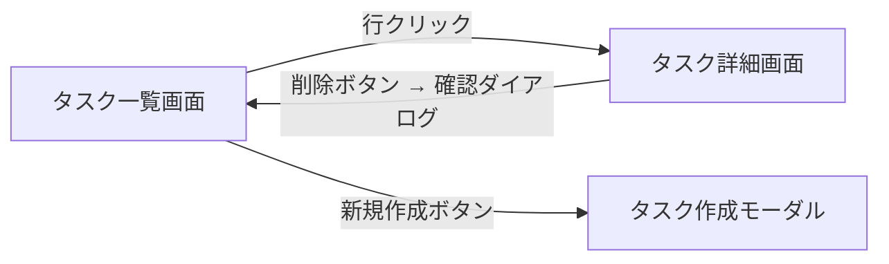

---
version:
  - number: 1.0.0
    changes: 初版
  - number: 1.1.0
    changes: セクション一覧に担当列を追加
  - number: 1.2.0
    changes: タスク一覧の作成担当を epic-conductor に変更し、モック作成と E2E テストコード作成の行を追加
  - number: 1.3.0
    changes: イシュー本文の要件セクションを統合
---

# ai-monitor テンプレート: PR 本文 / エピック

`layer:epic` が付いた PR の本文書式。

epic PR は **機能全体の要件を確定し、複合ユースケースシナリオと画面の方向性（UI 全体設計）を作るための PR**。
本文で確定した `## ユースケース一覧` + `## 横断要件` を元に、配下の成果物ブランチで `docs/wiki/設計図/シナリオ/複合ユースケース/*.md` を作成 / 更新し、画面の新規作成 / レイアウト変更を含む場合は `## UI 設計` で画面の方向性を確定する。

## セクション一覧

| セクション | サブセクション | 必須or条件 | 担当 | 補足 |
| --- | --- | --- | --- | --- |
| `## 紐づく Issue` | - | 必須（PR 作成時） | intake-issue-triager（PR 作成者） | 起点の intake Issue 番号 |
| `## 概要` | - | 必須 | epic-conductor | - |
| `## 背景` | - | 必須 | epic-conductor | - |
| `## ユースケース一覧` | - | 必須 | epic-conductor が草案、ユーザー承認後に確定 | - |
| `## 横断要件` | - | 必須 | epic-conductor が草案、ユーザー承認後に確定 | - |
| `## PoC 結果` | - | 実現可能性 PoC を実施した場合のみ | epic-poc-runner | - |
| `## タスク一覧` | - | 必須（複合 UC 影響なしで下位へ通過する場合は不要） | epic-conductor | モック作成・Wiki 修正・複合 UC E2E テストの作成 / 実行の To Do。チェックは各行を担当した作業者が入れる |
| `## UI 設計` | `### 画面一覧` / `### 画面遷移` / `### モック` | 画面の新規作成 / レイアウト変更を含む epic | mock-designer | - |
| `## 複合ユースケースシナリオテスト結果` | - | 必須（テスト実装時にセクション新設 → 実行後に結果記入） | complex-scenario-tester | 作成 / 変更した複合 UC E2E テストの結果（新規 + 回帰） |

## `## 紐づく Issue`

### 記述例

```markdown
## 紐づく Issue

- #90 プロフィール自己管理エピック
```

### 補足

- 起点の intake Issue（system レイヤーから始まる場合は立ち上げ Issue）の番号を書く
- 階層は base と GitHub のスタック表示で辿るため、親 PR の番号は書かない

## `## 概要`

### 記述例

```markdown
## 概要

ログイン中ユーザーが自身のプロフィール（氏名・自己紹介・アバター画像）を編集・閲覧・削除できる機能を追加する。
```

### 補足

- 機能全体（複数ユースケース横断）を 1〜3 行でまとめる
- **ユーザー入力の範囲内に留める**（推測・実装方針は書かない）
- 「{誰} が {何} をできるようになる」というユーザーストーリー形が望ましい
- 初回に書いた内容のまま保ち、後から情報を足さない。
  確定した内容は `## 背景` 以降の各セクションに書く（両方に書くと同じ内容を 2 箇所で持つことになる）。
  対象そのものが変わったときだけ既存の記述を書き換える

## `## 背景`

### 記述例

```markdown
## 背景

現在プロフィールは管理者画面からしか更新できず、ユーザーから「自分で更新したい」という要望が Issue#102 / Issue#145 として複数件寄せられている。
```

### 補足

- 起票に至った経緯・きっかけを整形（ユーザー入力の範囲内）
- 関連する既存 Issue / 顧客要望 / 障害発生日時があれば明示
- 概要と重複しない（概要は「何を実現したいか」、背景は「なぜ必要か」）

## `## ユースケース一覧`

epic に属する **ユースケース（1 UC = 1 story）** を列挙。
各ユースケース固有の要件は対応 story 側の `## ユースケース要件` に書く（本表は「どの UC が epic に属するか」の索引に徹する）。


### 記述例

```markdown
## ユースケース一覧

| ユースケース | 概要 | 対応 story | 補足 |
| --- | --- | --- | --- |
| プロフィール編集 | 氏名・自己紹介・アバター画像を編集する | #123 | - |
| プロフィール閲覧 | 自身のプロフィールを閲覧する | #124 | - |
| アバター画像削除 | アバター画像だけを削除する | #125 | 削除後はデフォルト画像に戻る |

複合ユースケースへの影響: あり（プロフィール編集から一覧反映までの連鎖が変わる）
```

### 補足

**ユースケース列:**
- **業務ドメイン視点の 1 単位**で書く（「{ユーザー} が {何} をする」）
- 実装用語（API / DB カラム / コンポーネント名）を避ける

**概要列:**
- 1 行で中身を要約

**対応 story 列:**
- 該当する子 story の Issue 番号（`#xxx` 形式）
- 起票前は `未起票`、起票後にリンクを埋める

**複合ユースケースへの影響の行:**
- 表の直後に `複合ユースケースへの影響: あり / なし（{根拠}）` の 1 行を置く
- 判定は epic-conductor が要件確定で行う（判定フローチャート（レイヤー）の ※2）
- `なし` の場合は複合シナリオ設計を挟まず子 story の起票へ進むため、後続ターンがこの行を読んで経路を決める

**補足:**
- 1 行 = 1 ユースケース = 1 story を厳守
- ユースケース固有の要件（バリデーション数値・具体操作 等）はここには書かず、対応 story 側の `## ユースケース要件` に書く
- 本表は「epic → story の分割マップ」として機能する

## `## 横断要件`

**複数のユースケースに共通で効く要件**をまとめる。
個別 UC に閉じる要件は書かない（それは story 側）。
非機能要件（セキュリティ / 性能 / 対応環境 等）と、複数 UC を跨ぐ機能要件（同時性ルール / 統一 UI 挙動 等）を扱う。

### 記述例

```markdown
## 横断要件

| カテゴリ | 要件 | 対象 UC | 補足 |
| --- | --- | --- | --- |
| セキュリティ | 他ユーザーのプロフィールは編集・閲覧できない | 全 UC | - |
| 性能 | 保存操作は 3 秒以内にフィードバックが返る | #1, #3 | - |
| 対応環境 | デスクトップ・タブレット・スマホで利用可能 | 全 UC | レスポンシブ対応 |
| 同時性 | 同時編集を検知して警告を表示 | #1 | 楽観的ロック方式 |
```

### 補足

**カテゴリ列:**
- 非機能要件: `セキュリティ` / `性能` / `対応環境` / `可用性` / `監査`
- 機能側の横断要件: `同時性` / `通知` / `統一 UI 挙動` など、**複数 UC に横串で効くもの**
- **単一 UC に閉じる要件は書かない**（それは対応 story の `## ユースケース要件` に書く）
- 実装側の詳細（バリデーション数値・ライブラリ選定 等）は subsystem 側で扱うのでここでは書かない

**要件列:**
- **ユーザー視点の 1 文** で書く

**対象 UC 列:**
- どのユースケースに効くかを `#N` で列挙、全 UC 共通なら `全 UC`
- story 側が横断要件を参照するときの起点

**補足:**
- 1 行 = 1 要件
- ここが「ユースケース間の整合性」を担保する場所。
  story はここを参照して個別要件を組み立てる

## `## PoC 結果`（実現可能性 PoC を実施した場合のみ）

epic の成立条件になっている核心機構の実現可能性 PoC（epic-poc-runner 実施）の結論を記録する。
詳細（検証項目・実測値・最小再現コード）は PoC PR 本文側にあり、ここは結論とリンクだけ。

### 記述例

```markdown
## PoC 結果

| 検証構成 | 成功条件 | 結果 | PoC PR | 補足 |
| --- | --- | --- | --- | --- |
| WebSocket リレー方式 | 反映遅延 500ms 以内 | ✅ 120ms | #12（closed） | 採用 |
| ポーリング方式 | 反映遅延 500ms 以内 | ❌ 平均 2.1 秒 | #13（closed） | 不採用 |
```

### 補足

- **実現可能性 PoC を実施しなかった epic では本セクション自体を作らない**（条件付きセクション）
- 結果列: `✅` / `❌` + 実測値 1 語
- PoC PR 列: マージせず close した PR の番号。
  **closed PR の diff はブランチ削除後も参照可能**なのでこれが恒久記録
- ライブラリ銘柄選定の PoC はここではなく subsystem の SS設計フェーズで実施する（architect 担当・結果はライブラリ PoC PR 本文に記録）

## `## タスク一覧`

### 記述例

```markdown
## タスク一覧

- [ ] `タスク一覧` 画面のモックを作成
- [ ] `設計図/シナリオ/複合ユースケース/新規登録から初回タスク作成.md` を新規作成
- [ ] `設計図/シナリオ/複合ユースケース/タスク作成から他ユーザー編集.md` を新規作成
- [ ] `設計図/シナリオ/README.md` の `## 一覧` に該当行を追加
- [ ] 複合ユースケース E2E テストコードを作成
- [ ] 複合ユースケース E2E テストを実行
```

### 補足

- チェックボックス形式で **やることリスト**を列挙
- 各タスクは 1 行 = 1 To Do とし、1 行を 1 人の担当で完結させる（E2E テストは「作成」と「実行」で担当が分かれるため行を分ける）
- モック作成の行は画面の新規作成 / レイアウト変更を含む epic のときだけ先頭に置く
- モック作成・Wiki 修正・テスト作成・テスト実行の 4 種類に分けて書く
- `[x]` はその行の作業をした本人が commit 直後に入れる（指示者は全行チェック済みかを確認するだけ）
- 全行がチェックされてからマージする

## `## UI 設計`

### 記述例

````markdown
## UI 設計

### 画面一覧

| 画面 | 新規/変更 | 対応 UC | 概要 | 補足 |
| --- | --- | --- | --- | --- |
| タスク詳細画面 | 新規 | タスク編集 / タスク削除 | タスクの閲覧・編集・削除を 1 画面に集約 | - |
| タスク一覧画面 | 変更 | タスク作成 | 新規作成ボタンをヘッダーに追加 | - |

### 画面遷移



### モック

| 画面 | 案 | URL | 補足 |
| --- | --- | --- | --- |
| タスク詳細画面 | a-two-column | https://raw.githack.com/{owner}/{repo}/epic/task-detail/docs/mock/pages/task-detail/issues/90/a-two-column/index.html | 採用 |
| タスク詳細画面 | b-tab-layout | https://raw.githack.com/{owner}/{repo}/epic/task-detail/docs/mock/pages/task-detail/issues/90/b-tab-layout/index.html | - |
````

### 補足

- **画面一覧**: 対応 UC 列は親 epic の `## ユースケース一覧` の UC 名と一致させる（1 画面 : N UC）
- **画面遷移**: 画面をまたぐ全体像を 1 枚で（各 UC 内の詳細遷移は subsystem 側の `## UI 設計` に委譲）
- **モック**: 配置は `docs/mock/pages/{画面名}/issues/{epic番号}/{案名}/`（書式は `規約/モック画面構成.md`）。
  採用案の補足列に `採用` と記す

## `## 複合ユースケースシナリオテスト結果`

### 記述例

```markdown
## 複合ユースケースシナリオテスト結果

| ファイル | メソッド | 結果 | 補足 |
| --- | --- | --- | --- |
| `tests/e2e/onboarding/signup-to-first-task.spec.ts` | 全実行 | ✅ | 対応シナリオ: `新規登録から初回タスク作成` |
| `tests/e2e/tasks/create-then-edit-by-other.spec.ts` | 全実行 | ✅ | 対応シナリオ: `タスク作成から他ユーザー編集` |
```

### 補足

- 本 epic で作成 / 変更した複合 UC E2E テストを全て実行して結果を記録
- 結果列: `✅`（pass）/ `❌`（fail）
- 補足列に対応シナリオ名を明記（`docs/wiki/設計図/シナリオ/複合ユースケース/{論理名}.md` と 1:1 対応）
- 複合ユースケースシナリオが無い epic の場合も本セクションは残し、本文に「なし」と記載
