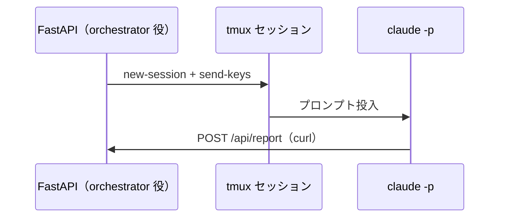

# ai-monitor テンプレート: PR 本文 / エピックPoC

epic の実現可能性 PoC 用 Draft PR（`poc/{epic#}-{テーマ}`、base=master・マージせず close）の本文書式。
PR タイトルは `PoC: {検証テーマ}（epic #{番号}）`（例: `PoC: tmux×Claude 疎通検証（epic #90）`）。

## 担当セクション一覧

| No | セクション | サブセクション | 必須or条件 | 担当 |
| --- | --- | --- | --- | --- |
| 1 | `## 紐づく Issue` | - | 必須（PR 作成時） | epic-poc-runner |
| 2 | `## リスク仮説` | - | 必須（PR 作成時に草案 → ユーザー承認で確定） | 〃 |
| 3 | `## 検証構成` | - | 〃 | 〃 |
| 4 | `## 成功条件` | - | 〃 | 〃 |
| 5 | `## 検証結果` | - | 必須（検証実行後に記入。PR 作成時は空のまま） | 〃 |
| 6 | `## 最小再現コード` | - | 〃 | 〃 |

## `## 紐づく Issue`

### 記述例

```markdown
## 紐づく Issue

- #90 AI モニターオーケストレーター epic
```

### 補足

- 親 epic Issue 番号を書く

## `## リスク仮説`

### 記述例

```markdown
## リスク仮説

orchestrator（FastAPI）→ tmux → Claude → HTTP callback の一周が成立しなければ、
モニターの完了通知が polling 頼みになり、本 epic のリアルタイム性が成立しない。
```

### 補足

- 「{機構} が成立しなければ {epic への影響}」の形で 1〜3 文
- epic 本文の `## 概要` / `## 横断要件` から epic-poc-runner が抽出した仮説を書く

## `## 検証構成`

### 記述例

````markdown
## 検証構成



| No | ライブラリ / ツール | バージョン | 用途 | 補足 |
| --- | --- | --- | --- | --- |
| 1 | FastAPI | 0.115 | callback 受信サーバ | 代表選定（銘柄比較はしない） |
| 2 | tmux | 3.4 | セッション管理 | - |
| 3 | claude CLI | 2.1.205 | headless 実行 | `--allowedTools Bash` |
```` 

### 補足

- 構成図は Mermaid（sequenceDiagram or flowchart）で **最安直構成** を示す
- 検証で使った重要パラメータ（ポート・タイムアウト値・オプション）は補足列に書く

## `## 成功条件`

### 記述例

```markdown
## 成功条件

| No | 条件 | 基準 | 補足 |
| --- | --- | --- | --- |
| 1 | callback 着弾 | tmux 起動から 60 秒以内 | 検証の主目的 |
| 2 | ペイロード整合 | 送信 JSON がそのまま受信される | - |
```

### 補足

- **数値 or 観測可能な基準**で書く

## `## 検証結果`

### 記述例

```markdown
## 検証結果

| No | 検証項目 | 実測値 | 判定 | 補足 |
| --- | --- | --- | --- | --- |
| 1 | callback 着弾時間 | 18 秒 | ✅ | 基準 60 秒以内 |
| 2 | ペイロード整合 | 完全一致 | ✅ | - |

**所感:**
- `claude -p` の起動オーバーヘッドは約 10 秒。フェーズ単位の実行なら無視できる
- ユーザーグローバルの Stop フックがモニターにも発火する点は実装時に要考慮
```

### 補足

- 判定列: `✅` / `❌`（成功条件の行と 1:1 対応）
- 所感には **後続フェーズへの申し送り**（ハマりどころ・副作用・制約）を箇条書きで残す

## `## 最小再現コード`

### 記述例

````markdown
## 最小再現コード

```python
# poc_server.py — callback 受信の核心部（全体は PR diff 参照）
app = FastAPI()

@app.post("/api/report")
def report(r: Report) -> dict:
    received.append(r.model_dump())
    return {"received": True}
```

```bash
# tmux 起動 + プロンプト投入
tmux new-session -d -s poc -c "$DIR"
tmux send-keys -t poc 'claude -p "POST {...} to http://127.0.0.1:8765/api/report" --allowedTools Bash' Enter
```

**diff の見どころ:** `poc_server.py`（受信側）と `run_claude.sh`（起動側）の 2 ファイルだけ。他は補助スクリプト。
```` 

### 補足

- **10〜30 行の核心部だけ**抜粋（全文は PR diff で見られるので重複させない）
- 末尾に **diff の見どころ**（どのファイルが本体か）を 1〜2 行で案内
