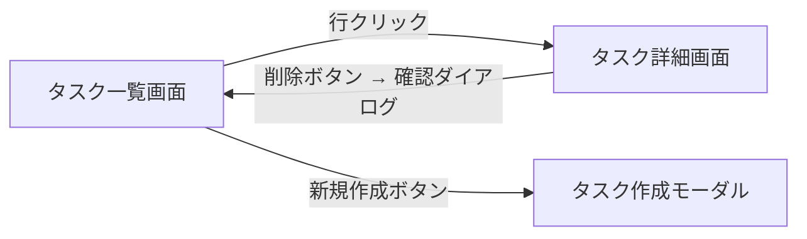

---
version:
  - number: 1.0.0
    changes: 初版
---

# ai-monitor テンプレート: PR 本文 / モック

モックの成果物ブランチ（`docs/epic/{ドメイン}/mock`）の PR 本文書式。

モックの成果物 PR は **画面の方向性を確定するための PR**。
確定した画面一覧・画面遷移・モックの所在をこの本文に置き、親 epic のベース PR は要件だけを持つ。

## セクション一覧

| セクション | サブセクション | 必須or条件 | 担当 | 補足 |
| --- | --- | --- | --- | --- |
| `## 紐づく Issue` | - | 必須（PR 作成時） | epic-conductor（PR 作成者） | 起点の Issue 番号 |
| `## タスク一覧` | - | 必須 | epic-conductor | モック作成の To Do |
| `## UI 設計` | `### 画面一覧` / `### 画面遷移` / `### モック` | 必須 | mock-designer | - |

## `## 紐づく Issue`

### 記述例

```markdown
## 紐づく Issue

- #200 プロフィール編集機能
```

### 補足

- 起点の Issue の番号を書く（1 件のみ）

## `## タスク一覧`

### 記述例

```markdown
## タスク一覧

- [ ] {この成果物でやること}
```

### 補足

- 書式はテンプレート「成果物」の `## タスク一覧` と同じ
- `[x]` はその行の作業をした本人が commit 直後に入れる

## `## UI 設計`

### 記述例

````markdown
## UI 設計

### 画面一覧

| 画面 | 変更種別 | 対応 UC | 概要 | 補足 |
| --- | --- | --- | --- | --- |
| タスク詳細画面 | 新規 | タスク編集 / タスク削除 | タスクの閲覧・編集・削除を 1 画面に集約 | - |
| タスク一覧画面 | 変更 | タスク作成 | 新規作成ボタンをヘッダーに追加 | - |

### 画面遷移



### モック

| 画面 | 案 | URL | 補足 |
| --- | --- | --- | --- |
| タスク詳細画面 | a-two-column | https://raw.githack.com/{owner}/{repo}/epic/task-detail/docs/mock/pages/task-detail/90/a-two-column/index.html | 採用 |
| タスク詳細画面 | b-tab-layout | https://raw.githack.com/{owner}/{repo}/epic/task-detail/docs/mock/pages/task-detail/90/b-tab-layout/index.html | - |
````

### 補足

- **画面一覧**: 対応 UC 列は親 epic の `## ユースケース一覧` の UC 名と一致させる（1 画面 : N UC）。
  変更種別列は `新規` / `変更` / `削除` で、mock-designer が現状モックの要否を判断する材料になる
- **画面遷移**: 画面をまたぐ全体像を 1 枚で（各 UC 内の詳細遷移は subsystem 側の `## UI 設計` に委譲）
- **モック**: 配置は `docs/mock/pages/{画面名}/{epic PR 番号}/{案名}/`（書式は `規約/モック画面構成.md`）。
  採用案の補足列に `採用` と記す
