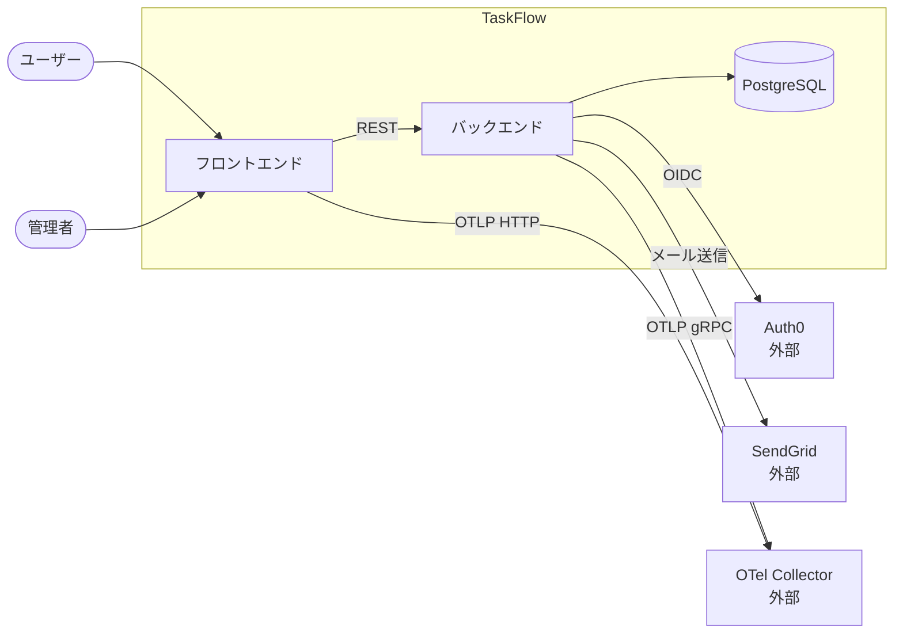

---
version:
  - number: 1.0.0
    changes: 初版
  - number: 1.1.0
    changes: 外部システム連携の対応テスト列を非機能要件テストへ変更
---

# ai-monitor テンプレート: アーキテクチャ図

システム全体の輪郭を 1 ページで示す書式。
サブシステムがいくつあり、どの外部システムと繋がるかを扱う。

配置先は `docs/wiki/設計図/アーキテクチャ図.md`（1 プロジェクト 1 ファイル・フォルダは切らない）。

扱う粒度は「後から変えると全サブシステムに波及するもの」だけ。
サブシステム内部の構造は `設計図/モジュール構成/`、実行時のコンテナ配置は `設計図/コンテナ構成/`、1 データの流れは `設計図/データフロー/` が持つ。

`## 外部システム連携` の 1 行が非機能要件テスト（外部疎通の分類）1 ファイルと対応する。
外部との境界を設計書側で定義し、その境界が実際に繋がることをテストで確認する。
本ページが持つのは境界の宣言だけで、認証方法・レートリミット・エンドポイントの詳細は `外部API/{名前}.md` / `外部ライブラリ/{名前}.md` が持つ。

## セクション一覧

| セクション | サブセクション | 必須or条件 | 担当 | 補足 |
| --- | --- | --- | --- | --- |
| `## システム全体図` | - | 必須 | system-architect | サブシステムと外部システムの関係を 1 枚で |
| `## リポジトリ構成` | - | 必須 | system-architect | モノレポ / ポリレポの別と配置 |
| `## サブシステム一覧` | - | 必須 | system-architect | subsystem の分割単位と `scope:*` ラベルの名前 |
| `## 外部システム連携` | - | 必須 | system-architect | 非機能要件テスト（外部疎通）と 1:1。外部システムが 1 つも無ければ「なし」 |

## `## システム全体図`

アクター・サブシステム・外部システムの関係を 1 枚で示す。

### 記述例

````markdown
## システム全体図


````

### 補足

- 図種別は `flowchart LR` 固定（左から右へ流す）
- 自プロジェクトのサブシステムは `subgraph {システム名}` で囲み、外部システムは枠の外に置く
- 外部システムのノードは `{名前}<br>外部` と書いて自前のものと区別する
- アクターは `([{名前}])` の角丸で、権限や役割が違うものは分けて置く（`ユーザー` / `管理者` / `バッチ` 等）
- データストアは `[({名前})]` の円柱で書く。
  自プロジェクトが所有するものは枠の内側、マネージドサービスとして借りるものは外側に置く
- 矢印ラベルにはプロトコルか用途を 1 語で書く（`REST` / `OIDC` / `メール送信` / `OTLP gRPC`）
- モジュール・クラス・エンドポイントは載せない（サブシステムの粒度で止める）

## `## リポジトリ構成`

コードをどう分けて置くかを記録する。

### 記述例

```markdown
## リポジトリ構成

| 項目 | 内容 | 補足 |
| --- | --- | --- |
| 方式 | モノレポ | サブシステムをトップレベルディレクトリで分ける |
| リポジトリ | `owner/taskflow` | - |
| 配置 | `frontend/` / `backend/` | `docs/wiki/` は共通 |
```

### 補足

**方式列:**
- `モノレポ` / `ポリレポ` のいずれか

**リポジトリ列:**
- `owner/name` 形式。
  ポリレポの場合はサブシステムごとに行を分ける

**補足:**
- ブランチ戦略はここではなく `規約/ブランチ戦略.md` が持つ（本ページはコードの置き場所だけ）

## `## サブシステム一覧`

独立してテスト・デプロイできる単位を並べる。
本表の `scope` 列が subsystem PR の分割単位になり、`scope:*` ラベルの名前もここから取る。

### 記述例

```markdown
## サブシステム一覧

| サブシステム | scope | 役割 | 言語・ランタイム | 補足 |
| --- | --- | --- | --- | --- |
| フロントエンド | `scope:frontend` | 画面描画とユーザー操作の受付 | TypeScript 5 / Node.js 22 | - |
| バックエンド | `scope:backend` | 業務ロジックと永続化 | Python 3.12 | AI 推論も本サブシステムに同梱 |
```

### 補足

**サブシステム列:**
- 業務的な役割で命名する（`フロントエンド` / `バックエンド` / `AI サーバー` / `バッチ`）

**scope 列:**
- `scope:{英小文字のケバブケース}` 形式。
  GitHub 側のラベルは、subsystem PR を作成する側がラベル作成 MCP で必要になった時点で作る

**役割列:**
- 何を担うかを 1 行で。
  責務の境界が読み取れる粒度にする

**言語・ランタイム列:**
- 言語とメジャーバージョンまで。
  フレームワーク・DB・テスト基盤は書かない（subsystem の SS 設計で決まる）

**補足:**
- 分ける基準は「独立してテスト・デプロイできるか」。
  同一プロセスで動くものは分けない
- 本表を増減させる変更はシステム全体に波及するため、subsystem 単独では決めずエスカレーションする

## `## 外部システム連携`

自プロジェクトの外にあり、境界を越えて通信する相手を並べる。
1 行 = 非機能要件テスト（外部疎通の分類）1 ファイルに対応する。

### 記述例

```markdown
## 外部システム連携

| 外部システム | 用途 | 方向 | 詳細 | 対応非機能要件テスト | 補足 |
| --- | --- | --- | --- | --- | --- |
| OTel Collector | ログ・トレースの送出 | 送信のみ | [外部ライブラリ/opentelemetry](../外部ライブラリ/opentelemetry.md) | `tests/external/test_otel_collector.py` | 別リポジトリで運用 |
| SendGrid | メール送信 | 送信のみ | [外部API/SendGrid](../外部API/SendGrid.md) | `tests/external/test_sendgrid.py` | 副作用: 実メール送信 |
| 認証基盤（銘柄未定） | ユーザー認証 | 双方向 | - | - | 銘柄は認証の subsystem の SS 設計で決定 |
```

### 補足

**記入の 2 段階:**
- 立ち上げ時は「外部と繋がる箇所がいくつあるか」を確定させる。
  銘柄が決まっていない行は外部システム列に `{種別}（銘柄未定）` と書き、詳細列と対応非機能要件テスト列を `-` にする
- 銘柄が決まった subsystem の SS 設計で、同じ PR 内で外部システム名・詳細リンク・テストのパスを埋める

**外部システム列:**
- 自プロジェクトの外にあり、プロセス境界を越えて通信する相手を書く。
  API 提供元に限らず、ログ収集基盤・メッセージキュー・オブジェクトストレージ・SMTP サーバー なども含む

**用途列:**
- 何のために繋ぐかを 1 行で（`ユーザー認証` / `メール送信` / `ログ・トレースの送出`）

**方向列:**
- `送信のみ` / `受信のみ` / `双方向` のいずれか。
  受信がある場合は Webhook / コールバックの受け口が要るので実装への影響が大きい

**詳細列:**
- 認証方法・エンドポイント・レートリミット・料金を書いたページへのリンク。
  API なら `外部API/{名前}.md`、SDK 経由なら `外部ライブラリ/{名前}.md`。
  銘柄未定・どちらも無い場合は `-`

**対応非機能要件テスト列:**
- 非機能要件テストのうち外部疎通の分類にあたるテストファイルのパス（`tests/external/test_{名前}.py` 形式）。
  1 外部システム = 1 テストファイルを厳守する（テストケースはファイル内で分ける）
- 銘柄未定の行は `-`。
  銘柄を決めた subsystem がテストファイルと合わせて埋める

**補足:**
- 本表は「何と繋がるか」だけを持ち、繋ぎ方の詳細は詳細列のリンク先が持つ（二重管理を避ける）
- 外部システムが 1 つも無いプロジェクトでは、表を出さず本文に「なし」と記載する
- 料金・副作用が発生する連携は補足列に必ず明記する
- 銘柄を差し替えた場合は本表を更新し、疎通テストファイルも合わせて差し替える
- ライブラリ採用によって新しい外部システムと繋がる場合、SS 設計の PR 内で本表に行を追加する
