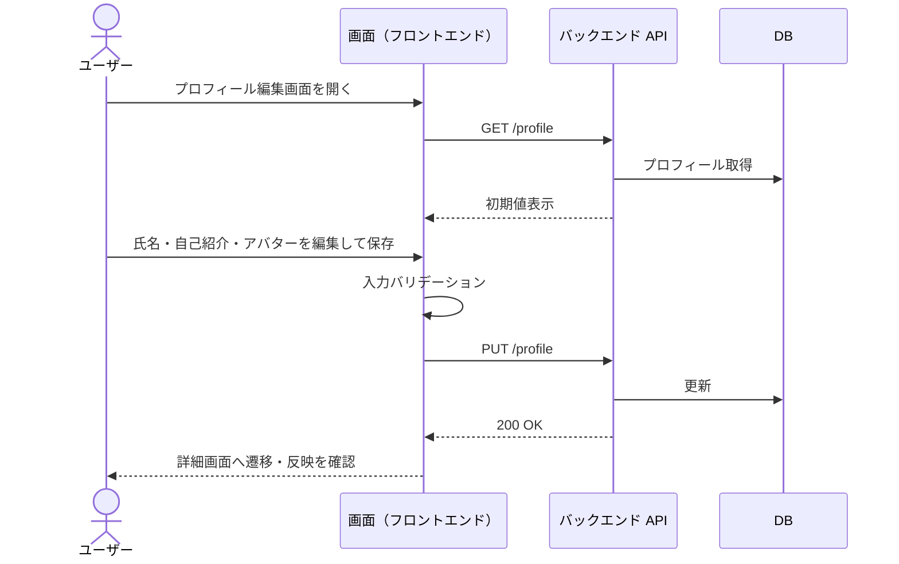
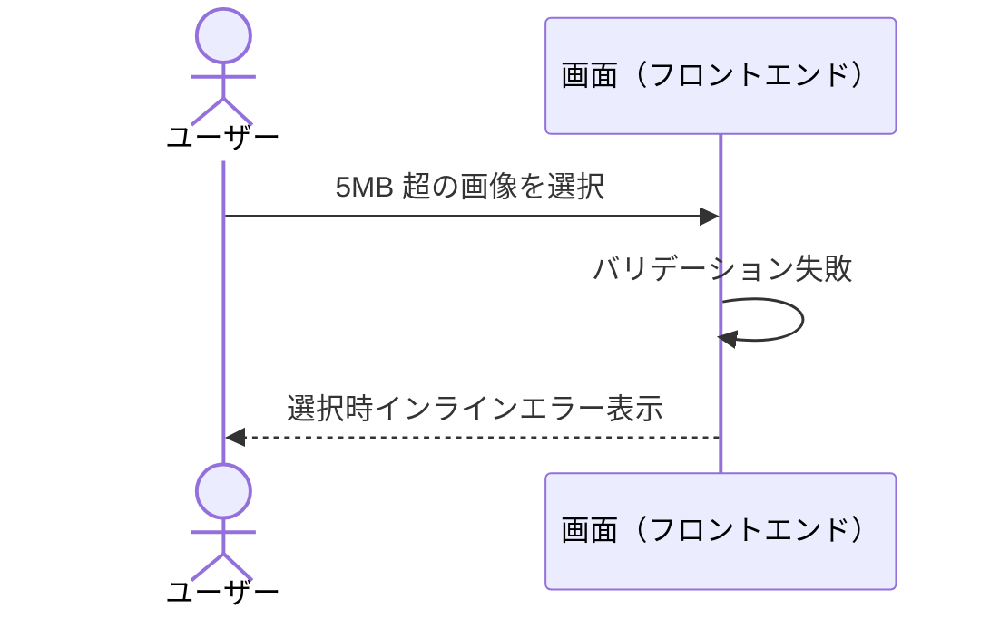
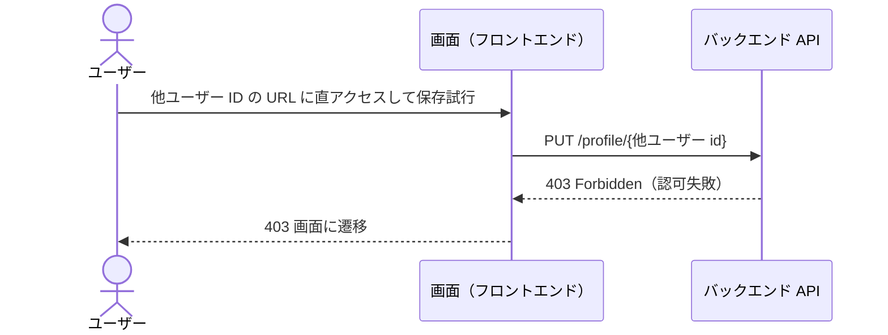
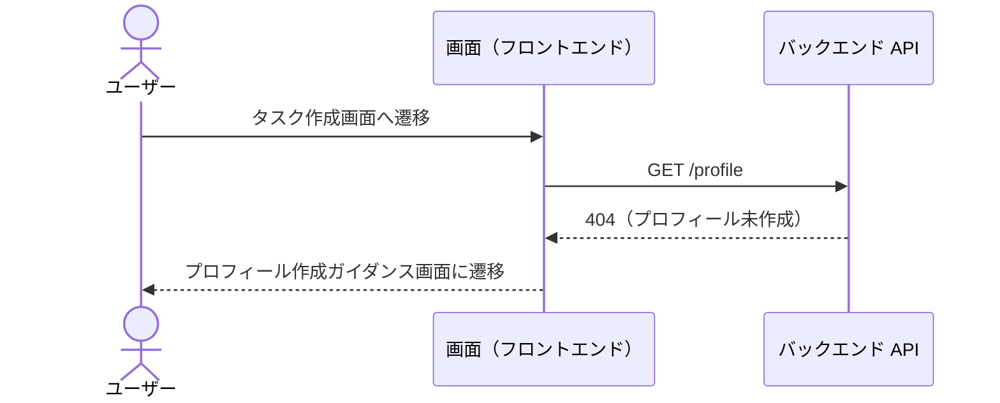
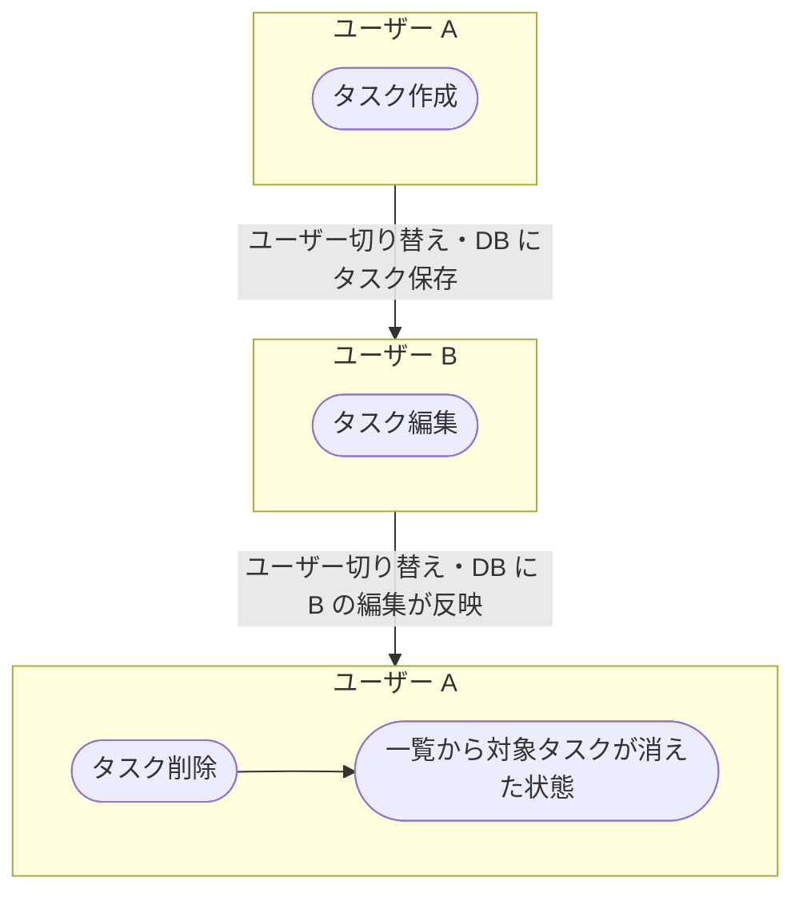
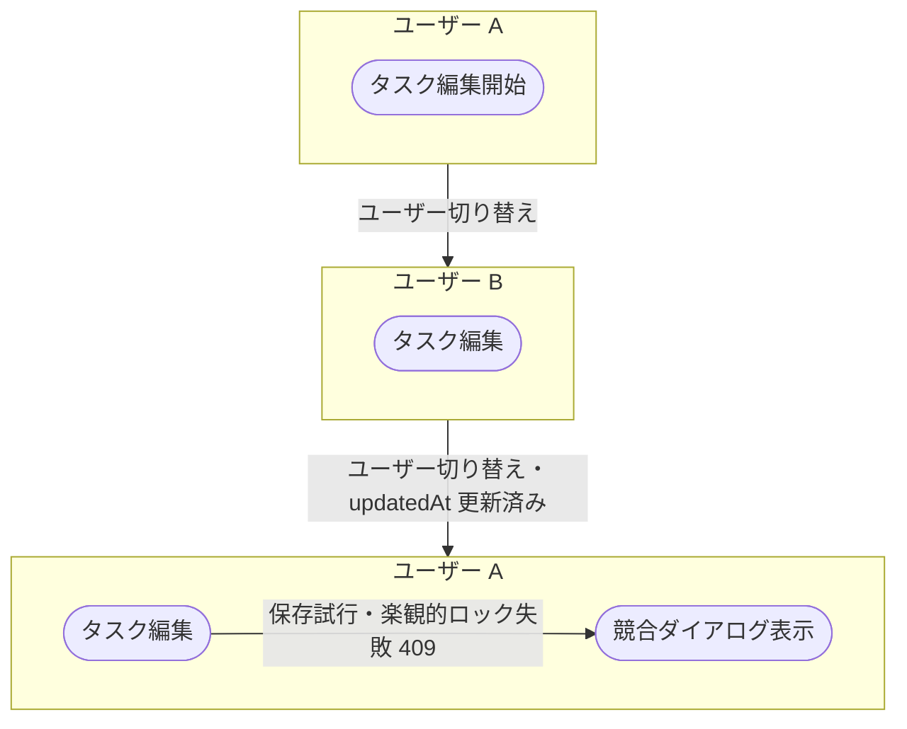

# ai-monitor テンプレート: シナリオ

シナリオは **単一ユースケース** と **複合ユースケース** の 2 種類に分ける。

| 種別 | 扱う範囲 | 1 ファイル = 何 | 担当（Layer / 対応 docs task） |
| --- | --- | --- | --- |
| 単一ユースケース | **ユーザーの 1 操作**（ファイル登録・編集・削除 等）の正常系 + 異常系。結合をサブシステム単位で繋いだもの | 1 操作 = 1 ファイル（正常系 + 異常系を集約） | `layer:story` 側の docs task が生成 |
| 複合ユースケース | 複数の単一 UC を連鎖させた業務フロー（画面 / ユーザーをまたぐ） | 1 シナリオ = 1 ファイル（正常系 + 異常系を集約） | `layer:epic` 直下の docs task が生成 |

粒度の階層: **複合 UC ⊃ 単一 UC（ユーザーの 1 操作、サブシステム貫通）⊃ 結合（サブシステムごとに区切ったもの。BE 結合 = 1 エンドポイント / FE 結合 = 1 画面操作）⊃ 単体（モジュールごと）**。
単一 UC より細かい「1 エンドポイントの中身」はシナリオではなく結合ドキュメントの領分。

- 対応は 1:1 ではなく 1:N / N:M（1 UC が同一サブシステムの結合を複数含むことがあり、共通エンドポイントは複数 UC から共有される）
- 「1 操作」= 1 クリックではなく「1 つのまとまったゴール（終わったらユーザーが満足して離れられる単位）」
- 命名テスト: 単一 UC は「{対象}を{動詞}する」の 1 動詞句で表せる粒度。1 動詞句で意味が消えるなら細かすぎ、複数動詞に分解できるなら粗すぎ（= 複合 UC 行き）

外部 API は **Mock 前提**（実通信は外部疎通テストで別途）。シナリオは「自プロジェクト内のフロー結合確認」が主眼。

## ファイル構成

`docs/wiki/設計図/シナリオ/` 配下にサブフォルダ 2 個を切り、親 `README.md` で **単一 / 複合を横断した 1 つの索引** を提供する。
サブフォルダ配下には README を置かない（親 README で全ファイル索引済み、Wiki 管理ルールの例外）。

```
docs/wiki/設計図/シナリオ/
├── README.md                                     ← 全シナリオの索引（種別カラム付き）
├── 単一ユースケース/
│   ├── プロフィール編集.md                       ← 1 機能 = 1 ファイル、正常系 + 異常系を集約
│   └── タスク作成.md
└── 複合ユースケース/
    ├── 新規ユーザー登録から初回タスク作成.md      ← 1 シナリオ = 1 ファイル、正常系 + 異常系を集約
    └── タスク作成から他ユーザー編集.md            ← 同時編集競合 等の例外系も本ファイル内に集約
```

ファイル命名:
- 単一ユースケース: **機能名だけ**（例: `プロフィール編集.md` / `タスク作成.md`）
- 複合ユースケース: **業務シナリオの論理名**（例: `新規ユーザー登録から初回タスク作成.md`）

## 担当セクション一覧

| No | 対象ファイル | セクション | サブセクション | 必須or条件 | 担当 | 補足 |
| --- | --- | --- | --- | --- | --- | --- |
| 1 | インデックス | 冒頭リード | - | 必須 | `layer:epic` 起票時に issue-triage が骨組み | 索引の説明 |
| 2 | インデックス | `## 一覧` | - | 必須 | 単一 / 複合 追加時に随時追記 | 種別カラム付きの単一表 |
| 3 | シナリオ詳細 | 冒頭リード | - | 必須 | `layer:story` / `layer:epic` 側の docs task | 対応 Issue + テストファイル参照 |
| 4 | シナリオ詳細 | `## 正常シナリオ` | `### 前提条件` / `### 図` | 必須 | 〃 | 正常フロー 1 本 + 前提条件表 |
| 5 | シナリオ詳細 | `## 異常シナリオ（{条件}）` | `### 前提条件` / `### 図` | 例外パターンごとに 1 | 〃 | 1 異常 = 1 H2 セクション。H2 見出しに条件を括弧書きで含める |

- 正常 / 異常はすべて **H2 で並列**
- 単一 UC と複合 UC で **セクション構造は共通**。違いは冒頭リードと図の粒度のみ（下記「複合ユースケースの粒度ルール」参照）

**複合ユースケースの粒度ルール:**

複合ユースケースの図は **単一ユースケースを「箱」として連鎖**させる。UC の内部には踏み込まない。

- 中間ノード名は **`単一ユースケース/{UC名}.md` のファイル名と 1:1**（同じ名前をそのまま使う）
- UC 内部のステップ（画面操作・コメント・承認・ラベル操作 等）は複合側に書かない（単一 UC 側の責務）
- 矢印ラベルには **UC 間の受け渡し**（生成物 + 次の UC の起動トリガー）だけを書く
- 目的: 単一 UC の修正が複合側に波及しない（DRY）+ 複合図が「epic → story 分割マップ」として機能する
- epic シナリオ設計時点では対応する単一 UC ファイルは未作成でよい。**epic 本文のユースケース一覧の UC 名**をノード名に使い、後続 story の単一シナリオ設計が同名でファイルを作る

## `冒頭リード`（インデックスファイル）

### 記述例

```markdown
# シナリオ

単一ユースケース / 複合ユースケース の 2 種類を扱う。
1 ファイル = 1 テストファイル（または手動シナリオテストの 1 ケース）に対応する。
```

### 補足

- シナリオの 2 種類の役割を 1〜2 行で明示

## `## 一覧`（インデックスファイル）

種別カラム付きの単一表で全シナリオを索引化する。

### 記述例

```markdown
## 一覧

| No | 種別 | シナリオ / 機能名 | 概要 | リンク | 補足 |
| --- | --- | --- | --- | --- | --- |
| 1 | 単一ユースケース | プロフィール編集 | 編集フォーム / バリデーション / 保存 | [プロフィール編集](./単一ユースケース/プロフィール編集.md) | - |
| 2 | 〃 | タスク作成 | 新規タスク登録 + 入力エラー | [タスク作成](./単一ユースケース/タスク作成.md) | - |
| 3 | 複合ユースケース | 新規ユーザー登録から初回タスク作成 | サインアップ → メール認証 → 初回サインイン → タスク作成 | [新規ユーザー登録から初回タスク作成](./複合ユースケース/新規ユーザー登録から初回タスク作成.md) | オンボーディング |
| 4 | 〃 | タスク作成から他ユーザー編集 | ユーザー A がタスク作成 → ユーザー B が編集 → A の一覧に反映（同時編集競合等の例外系含む） | [タスク作成から他ユーザー編集](./複合ユースケース/タスク作成から他ユーザー編集.md) | - |
```

### 補足

**種別列:**
- `単一ユースケース` / `複合ユースケース` のいずれか
- 同種別が連続する行は `〃` で省略

**シナリオ / 機能名列:**
- 単一ユースケースは **機能名だけ**（`プロフィール編集` / `タスク作成` 等）
- 複合ユースケースは **業務シナリオの論理名**（`新規ユーザー登録から初回タスク作成` 等）

**概要列:**
- 1 行で中身を要約（主要ステップは `→` で繋ぐ）

**リンク列:**
- `[表示](./{サブフォルダ}/{ファイル名}.md)` 形式

**補足:**
- 種別ごとにまとめて並べる（単一を先に、複合を後に）
- 新規追加時は **必ずこの索引にも 1 行追加**（手動更新）

## `冒頭リード`（単一ユースケース詳細ファイル）

### 記述例

```markdown
# プロフィール編集

ログイン中ユーザーが自身のプロフィール（氏名・自己紹介・アバター画像）を編集する単一ユースケース。

```

### 補足

- 1 行目は **機能名**（ファイル名と一致）

## `## 正常シナリオ`（単一 / 複合 UC 共通）

**成功フロー 1 本** を Mermaid で示す。

### 記述例

````markdown
## 正常シナリオ

### 前提条件

| No | Factory | 説明 | 補足 |
| --- | --- | --- | --- |
| 1 | `createUser` | ログイン中ユーザー A | - |
| 2 | `createProfile` | userA に紐づくプロフィール | `visible: true` |

### 図



**期待動作:**
- 編集内容がプロフィール表示画面に反映される

### 補足（任意）

- セッション Cookie は全リクエストに含まれる前提
````

### 補足

**`### 前提条件`:**
- **表形式**: `No / Factory / 説明 / 補足`
- **Factory 列**: 関数名だけ（引数は書かない）。同じ Factory を複数呼ぶ場合は行を分けて 2 行目以降 `〃` で省略
- **説明列**: そのオブジェクトの意味・役割・依存関係を日本語で書く（例: `userA に紐づくプロフィール` で依存が読み取れる）
- **補足列**: 引数に指定する重要な値・オプションだけ書く（`visible: true` / `expiresAt: 過去日時` など）。無ければ `-`
- **打ち消し表現の 2 パターン**:
  - Factory を **書かない**（プロフィール未作成でエラー確認 等）
  - **補足列にバグらせ値**（`expiresAt: 過去日時` で期限切れ 等）
- 前提が「特にない」（未ログイン状態から始まる 等）の場合でも `### 前提条件` セクション自体は作成する。「なし」を記載

**`### 図`:**
- 図種別は固定: **単一 UC = `sequenceDiagram`** / **複合 UC = `flowchart TD`**（UC 箱チェーン、粒度ルール参照）
  - 単一 UC はアクター間のやり取りそのものなのでシーケンス図
- **ユーザー視点で書く**（観測可能な境界まで。内部実装の関数呼び出しは書かない）
- flowchart の場合: 起点 / 終点ノードは `([ユーザー])` / `([{結果}状態])`、**中間ノードは「ユーザーが観測できる画面 / 状態」の粒度**（例: `プロフィール編集画面` / `タスク一覧画面`）
- sequenceDiagram の場合: `actor` = 人間、`participant` = 観測可能なシステム境界（GitHub Issue / orchestrator / モニター / 画面 等）。前提状態は `Note over`、応答ループは `loop`、条件分岐は `alt` で表現

**期待動作（図の直下）:**
- 図の直後に **`**期待動作:**`** を書く（テストアサートの元）

**`### 補足`（任意）:**
- 図に書ききれない前提（セッション / DB シード / Mock の振る舞い 等）を箇条書きで

## `## 異常シナリオ（{条件}）`（単一 / 複合 UC 共通）

異常パターンごとに **H2 見出し** で並列に並べる（`## 異常系` の下に H3 で束ねる形は取らない）。見出しに `（{条件}）` を括弧書きで含める。中身の構造は `## 正常シナリオ` と同じ（前提条件表 → 図 → 期待動作）。

### 記述例

````markdown
## 異常シナリオ（5MB 超の画像アップロード）

### 前提条件

| No | Factory | 説明 | 補足 |
| --- | --- | --- | --- |
| 1 | `createUser` | ログイン中ユーザー A | - |
| 2 | `createProfile` | userA に紐づくプロフィール | - |

### 図



**期待動作:**
- 画像選択直後にインラインエラー表示、選択されない

## 異常シナリオ（他ユーザーのプロフィール編集を試みる）

### 前提条件

| No | Factory | 説明 | 補足 |
| --- | --- | --- | --- |
| 1 | `createUser` | ログイン中ユーザー A | - |
| 2 | 〃 | 他人ユーザー B | - |
| 3 | `createProfile` | userB に紐づくプロフィール | - |

### 図



**期待動作:**
- 認可失敗して 403 画面に遷移

## 異常シナリオ（プロフィール未作成でタスク作成を試みる）

### 前提条件

| No | Factory | 説明 | 補足 |
| --- | --- | --- | --- |
| 1 | `createUser` | ログイン中ユーザー A | プロフィールは作らない |

### 図



**期待動作:**
- プロフィール作成を促すガイダンス画面に遷移
````

### 補足

**H2 見出し:**
- `## 異常シナリオ（{条件}）` の形式
- `{条件}` は **簡潔な日本語** で書く（`5MB 超の画像アップロード` / `他ユーザーの編集を試みる` 等）
- 1 異常 = 1 H2 セクション

**内部構造:**
- `## 正常シナリオ` と同じ（前提条件表 → 図 → 期待動作）
- **前提条件・図・期待動作の書き方は `## 正常シナリオ` と同様** — 詳細は正常シナリオ節参照

**補足:**
- 異常パターンがない機能でも `## 異常シナリオ（該当なし）` セクションを 1 つ残して本文に「なし」と記載する（H2 自体は削除しない）
- 個別 API のバリデーションエラー（400 系）は結合ドキュメント側でカバーされるので、シナリオ側では **業務的に意味のある異常だけ** 書く（バリデーション NG / 認可失敗 / 楽観的ロック競合 等）

## `冒頭リード`（複合ユースケース詳細ファイル）

### 記述例

```markdown
# 新規ユーザー登録から初回タスク作成

新規ユーザーがサインアップ → メール認証 → 初回サインイン → 初回タスクを作成するまでの業務シナリオ。

```

### 補足

- 1 行目は **業務シナリオの論理名**（ファイル名と一致）

## 複数ユーザー版の記述例（複合ユースケース向け）

複合ユースケースで複数ユーザーがアクションを取るシナリオは、`## 正常シナリオ` / `## 異常シナリオ（{条件}）` の中身を **1 つの Mermaid 内で `subgraph` で区切る** 形で書く。
ユーザーごとに subgraph を作り、**subgraph 間は実線矢印で時系列（ユーザー切り替え）を示す**（E2E テストは実際には順次実行なので「同時」ではなく順番に並ぶ）。
セクション構造（前提条件表 → 図 → 期待動作）は単一ユーザー版と同じ。

### 記述例（複数ユーザーの正常シナリオ）

例: A がタスク作成 → B が編集 → A が削除（タスク 1 件のライフサイクルを 2 ユーザーで往復）

````markdown
## 正常シナリオ

### 前提条件

| No | Factory | 説明 | 補足 |
| --- | --- | --- | --- |
| 1 | `createUser` | ログイン中ユーザー A | - |
| 2 | 〃 | ログイン中ユーザー B | - |

### 図



**期待動作:**
- ユーザー A の一覧画面から対象タスクが消え、B の履歴に「A が削除」のログが残る

### 補足（任意）

- 各ノードは `単一ユースケース/{UC名}.md` と 1:1（粒度ルール参照）。タスク作成の中の画面遷移・入力・保存手順は `単一ユースケース/タスク作成.md` 側に書く
- ユーザー A / B はそれぞれ別ブラウザコンテキスト（Playwright `context.newPage()`）で操作
- 各 subgraph = E2E テスト内の 1 フェーズ（`test.step('ユーザー A: タスク作成', ...)`）
- subgraph 間の実線矢印 = ユーザー切り替え + DB を介したデータ伝播（直接呼び出しではない）
````

### 記述例（複数ユーザーの異常シナリオ）

````markdown
## 異常シナリオ（同時編集競合）

### 前提条件

| No | Factory | 説明 | 補足 |
| --- | --- | --- | --- |
| 1 | `createUser` | ユーザー A | - |
| 2 | 〃 | ユーザー B | - |
| 3 | `createTask` | userA が所有し両者で編集する対象タスク | 編集対象タスク |

### 図



**期待動作:** 
- ユーザー A に競合ダイアログ表示、B の更新内容が見える形でリトライ導線を提示
````

### 補足

**`subgraph` の書き方:**
- ユーザーが 2 人以上登場する場合は **`subgraph` で「ユーザー単位」のフェーズに区切り、中身は UC 箱のみ置く**（粒度ルール参照）
- subgraph 名は `"ユーザー {名前}"` 形式。同じユーザーが再登場しても表示名は同じでよい（subgraph の ID `PHASE1` / `PHASE3` で区別されるため）
- 同じユーザーが複数回登場する場合も **登場ごとに別 subgraph**（時系列順に並べる）
- subgraph 間は **実線矢印 `-->|{切り替え内容}|` で繋ぐ**（E2E テストは実際には順次実行なので「同時」ではなく「時系列」として表現）
  - 矢印ラベルには `ユーザー切り替え` を必ず入れ、必要に応じて `・DB に {内容} が反映` `・{セッション/通知} を介して伝播` などを続ける
- 「並列実行を強調したい」特殊ケースだけ点線 `-.{伝播内容}.->` を使う（デフォルトは実線）
- 縦に長くなって OK（1 シナリオ = 1 図を維持）
- 異常系の結末ノード（エラー表示等）だけは UC 箱の直後に置いてよい（そこが検証ポイントのため）

**E2E テストとの対応:**
- 図の入口（上のユーザー）= テスト開始（ブラウザ起動 + 画面アクセス）
- 図の出口（下のユーザー / エラー状態）= 最終状態確認（DOM アサート / DB 検証）
- 各 UC 箱 = 対応する単一 UC テストの操作手順を再利用する 1 ブロック
- 各 subgraph = `test.step('ユーザー A: タスク作成', ...)` の 1 ステップ
