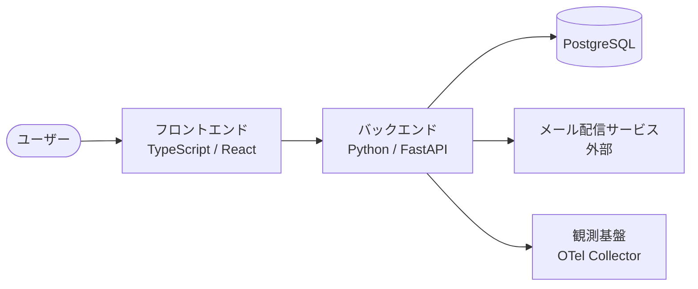

---
version:
  - number: 1.0.0
    changes: 初版
---

# ai-monitor テンプレート: プロジェクト README

リポジトリルートの `README.md` の書式。
このリポジトリを初めて触る人向けの説明書で、読み手はユーザーと開発者の両方。

初期化時点で書けるのは骨格だけで、内容は工程が進むにつれて埋まる。
セクションごとに「誰がいつ埋めるか」を担当列で決め、まだ決まっていないセクションは見出しだけ置いて本文に `未確定` と書く。

`docs/wiki/` 配下の `README.md`（目次ページ）は書式が違う（[README書式](./README書式.md) 参照）。

## セクション一覧

| セクション | サブセクション | 必須or条件 | 担当 | 補足 |
| --- | --- | --- | --- | --- |
| `# {プロジェクト名}` | - | 必須 | system-architect | 見出し + 1 行説明 |
| `## 概要` | - | 必須 | system-architect | 何を解決するかをユーザー視点で |
| `## 機能` | - | 必須 | epic-conductor（epic ごとに 1 行追記） | 提供機能の一覧 |
| `## システム構成` | - | 必須 | system-architect | サブシステムと外部システムの関係図 |
| `## ディレクトリ構成` | - | 必須 | system-architect | トップレベルのみ |
| `## セットアップ` | - | 必須 | 技術スタックを確定した epic の architect | 前提 + 手順 |
| `## 開発` | - | 必須 | 技術スタックを確定した epic の architect | 起動 + テスト |
| `## ドキュメント` | - | 必須 | system-architect | Wiki への入口 |

## `# {プロジェクト名}`

### 記述例

```markdown
# TaskFlow

チームのタスクを 1 画面で共有・編集できるタスク管理ツール。
```

### 補足

- 1 行目はリポジトリ名ではなくプロダクト名（同じでもよい）
- 直後の 1 行で「誰の何を解決するか」を書く。
  技術要素はここに書かない

## `## 概要`

読み手が「自分に関係あるか」を判断できる分量で書く。

### 記述例

```markdown
## 概要

複数人でタスクを持ち回るチーム向けに、タスクの作成・割り当て・進捗更新を 1 画面で完結できるようにする。
メール通知や外部カレンダーとの連携で、ツールを開いていない間の取りこぼしを防ぐ。

```

### 補足

- ユーザー視点の文章で書く（アーキテクチャ・使用技術は `## システム構成` の領分）
- 対象ユーザー・想定規模を最後に 1 行添える（性能要件の前提になる）

## `## 機能`

提供している機能を 1 行 = 1 機能で並べる。

### 記述例

```markdown
## 機能

| 機能 | 概要 | 補足 |
| --- | --- | --- |
| タスク管理 | タスクの作成・編集・削除・担当者の割り当て | - |
| ダッシュボード | 担当タスクと期限を 1 画面で俯瞰 | - |
| 通知 | 期限前日と担当者変更時にメール通知 | 通知先はユーザー設定で変更可 |
```

### 補足

**機能列:**
- epic の単位と対応させる（1 epic = 1 行を目安にする）

**概要列:**
- ユーザーが何をできるようになるかを 1 行で

**補足:**
- 新しい epic が master にマージされたときに 1 行追記する（epic-conductor の epic マージ時）
- 機能がまだ 1 つも無い段階では本文に `未確定` と書く

## `## システム構成`

サブシステムと外部システムの関係を 1 枚の図で示す。
詳細は `設計図/アーキテクチャ図.md` が持ち、ここは全体像だけを見せる。

### 記述例

````markdown
## システム構成



| サブシステム | 役割 | 補足 |
| --- | --- | --- |
| フロントエンド | 画面描画とユーザー操作の受付 | - |
| バックエンド | 業務ロジックと永続化 | - |

詳細は [設計図/アーキテクチャ図](./docs/wiki/設計図/アーキテクチャ図.md) を参照。
````

### 補足

- 図は `flowchart LR` で書く（左から右へ流す）
- 図に載せるのは自プロジェクトのサブシステムと、境界を越える外部システム（DB / 外部 API / 観測基盤）だけ。
  モジュール・クラスは載せない
- 外部システムのノードには `外部` と明示する（自前で持つものと区別する）
- 図の下にサブシステムの役割表を置き、最後に `設計図/アーキテクチャ図.md` へのリンクを 1 行添える
- サブシステムの一覧は `設計図/アーキテクチャ図.md` の `## サブシステム一覧` が SoT。
  ここは名前と役割だけを転記し、`scope` ラベル・言語のバージョンは書かない

## `## ディレクトリ構成`

トップレベルのディレクトリだけを並べる。

### 記述例

````markdown
## ディレクトリ構成

```
taskflow/
├── frontend/          # フロントエンド（TypeScript / React）
├── backend/           # バックエンド（Python / FastAPI）
├── docs/wiki/         # 設計ドキュメント
└── README.md
```
````

### 補足

- サブシステムの単位までで止める（配下の内部構成は `設計図/モジュール構成/` の領分）
- 各行の右に 1 行コメントで役割を書く
- リポジトリ構成が単一リポジトリでない場合は、本セクションに他リポジトリへのリンクを添える

## `## セットアップ`

初めてクローンした人が動かせる状態にするまでの手順。

### 記述例

````markdown
## セットアップ

**前提:**

- Node.js 22 以上 + pnpm 9 以上
- Python 3.12 以上 + uv
- Docker（PostgreSQL 用）

**手順:**

```bash
# 依存インストール
pnpm install
uv sync

# 環境変数
cp .env.example .env

# DB 起動 + マイグレーション
docker compose up -d postgres
uv run alembic upgrade head
```
````

### 補足

- `**前提:**` にランタイムとバージョン、`**手順:**` に上から順に実行するコマンドを置く
- コマンドは言語指定 `bash` のコードブロックで書く（GitHub の 1 クリックコピーで貼り付け可能）
- 技術スタックが未確定の段階では本文に `未確定` と書く

## `## 開発`

日常的に使うコマンドだけを載せる。

### 記述例

````markdown
## 開発

**起動:**

```bash
pnpm dev          # フロントエンド（http://localhost:5173）
uv run fastapi dev backend/src/main.py --port 8000
```

**テスト:**

実行コマンドは [テスト/テスト実行方法](./docs/wiki/テスト/テスト実行方法.md) を参照。
````

### 補足

- 起動コマンドはサブシステムごとに 1 行、末尾にアクセス先の URL を添える
- テストの実行方法は `テスト/テスト実行方法.md` が SoT なのでリンクだけを置く（コマンドを転記しない）
- 技術スタックが未確定の段階では本文に `未確定` と書く

## `## ドキュメント`

Wiki への入口を並べる。

### 記述例

```markdown
## ドキュメント

| リソース | 内容 |
| --- | --- |
| [設計ドキュメント](./docs/wiki/) | シナリオ / 設計図 / 規約の全体 |
| [設計図/アーキテクチャ図](./docs/wiki/設計図/アーキテクチャ図.md) | システム全体の構成と外部システム連携 |
| [外部API](./docs/wiki/外部API/) | 連携している外部 API の一覧 |
| [外部ライブラリ](./docs/wiki/外部ライブラリ/) | 採用ライブラリと選定理由の一覧 |
```

### 補足

- 依存ライブラリを README に列挙しない。
  `外部ライブラリ/` が索引を持つのでリンクだけを置く（二重管理を避ける）
- リンク先は Wiki のディレクトリ単位にする（個別ページを並べると増え続けるため）。
  例外は `アーキテクチャ図.md`（フォルダを持たない 1 ファイルのため）
