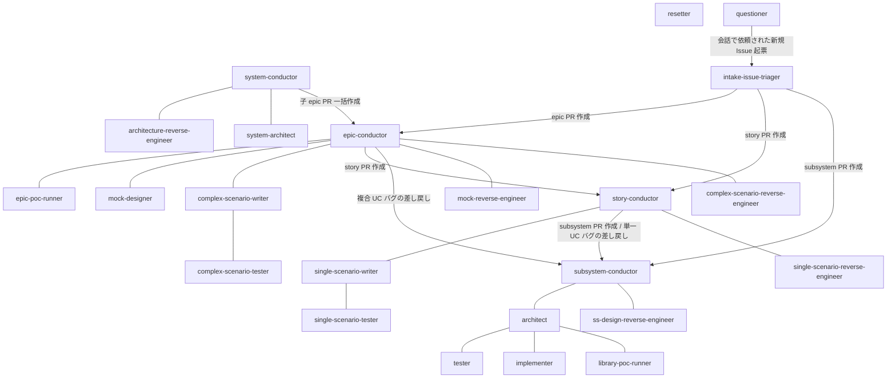

# エージェント組織図

エージェント間の指揮系統と連絡網（誰が誰を認知して `確認:{宛先}` + `@{宛先}` 宛コメントを送れるか）の SoT。
指揮系統は再帰構造で、**各エージェントは自分の親と子とだけやり取りする**（上位 → 下位は指示・タスク割り当て、下位 → 上位は完了報告・差し戻し報告）。
レイヤーを跨ぐ連絡（バグ差し戻し・エスカレーション）は conductor 同士で行い、worker はレイヤーを跨がない。
エスカレーションは指揮系統を 1 段ずつ遡る。
受けた指揮役は素通しせず、自レイヤーの解決案と上位への中継を選択肢にしてユーザーに確認し、選ばれた方針で下位へ再開指示を出す（詳細は `設計図/シナリオ/単一ユースケース/エスカレーション対応.md`）。
ユーザーは全 Issue / PR の応答ループで任意のエージェントと会話できるため、図と表からは省略する。

入口は 2 つある。
プロジェクトの立ち上げ（新規 / 既存の移行とも）は system-conductor、以降の機能開発は intake-issue-triager が受ける。
system-conductor は `docs/wiki/` が未整備の状態で動くため intake を経由せず、ユーザーが直接 立ち上げ Issue を起票して確認ラベルを付ける。

## 組織図

実線 = 指揮系統（指示 ⇄ 報告）。
矢印 = 子 PR の作成（作成のみで以降の会話なし）。

成果物ブランチが担当ごとに分かれるため、worker から worker への直接の引き継ぎは行わない。
1 つの成果物が終わったら発注元の conductor へ返し、conductor が成果物 PR をマージしてから次の担当のブランチを切る。

## 連絡先一覧

| エージェント | 連絡できる相手 | 連絡の内容 |
| --- | --- | --- |
| system-conductor | architecture-reverse-engineer・system-architect・epic-conductor（PR 作成） | RE PR での現状のアーキテクチャ図の作成依頼と完了報告の受領・system-architect への土台生成の委任・system → master マージの実行・承認済みエピック一覧からの子 epic PR 一括作成（以降の会話なし）。ユーザー起点で親を持たない |
| system-architect | system-conductor | 土台生成の完了報告（発注元 = 依頼コメントの送信者） |
| architecture-reverse-engineer | system-conductor | 完了報告（発注元 = 依頼コメントの送信者） |
| mock-reverse-engineer | epic-conductor | 完了報告（発注元 = 依頼コメントの送信者） |
| complex-scenario-reverse-engineer | epic-conductor | 完了報告（発注元 = 依頼コメントの送信者） |
| single-scenario-reverse-engineer | story-conductor | 完了報告（発注元 = 依頼コメントの送信者） |
| ss-design-reverse-engineer | subsystem-conductor | 完了報告（発注元 = 依頼コメントの送信者） |
| intake-issue-triager | epic-conductor | 子 PR の作成 + 確認ラベル付与（以降の会話なし）。作業単位は全て epic として作る |
| epic-conductor | mock-reverse-engineer / complex-scenario-reverse-engineer / epic-poc-runner / mock-designer / complex-scenario-writer / story-conductor（PR 作成） / subsystem-conductor（PR 作成） | 各子への指示・タスク割り当て（PoC 再検証 / モック / シナリオ設計 / 統合テストの委任）・子 story PR 作成・複合 UC バグの subsystem への差し戻し・エスカレーションの終端判断と story への決定通知・epic → master マージの実行 |
| story-conductor | single-scenario-reverse-engineer / single-scenario-writer / subsystem-conductor（PR 作成） / epic-conductor | 各子への指示・タスク割り当て（シナリオ設計 / 統合テストの委任）・子 subsystem PR の直列作成・単一 UC バグの subsystem への差し戻し・story → epic マージの実行・上位への完了報告・エスカレーション対応（story レベルの判断 / 上位への中継 / 発生元 subsystem への決定通知） |
| subsystem-conductor | ss-design-reverse-engineer / architect / story-conductor | architect への一式委任（設計〜実装レビュー）・マージ起動 + subsystem → story マージの実行・上位への完了報告・インターフェース確定報告・エスカレーション対応（subsystem レベルの判断 / 上位への中継 / architect への再開指示） |
| epic-poc-runner | epic-conductor | 完了報告 |
| mock-designer | epic-conductor | 完了報告 |
| complex-scenario-writer | epic-conductor・complex-scenario-tester | 完了報告（シナリオ設計 / 全 pass）・失敗報告（トリアージ後）・配下テスターへのタスク割り当て（実装 / 実行 / 指摘対応） |
| complex-scenario-tester | complex-scenario-writer | 完了報告（テスト実装 / 全 pass）・失敗報告 |
| single-scenario-writer | story-conductor・single-scenario-tester | 完了報告（シナリオ設計 / 全 pass）・失敗報告（トリアージ後）・配下テスターへのタスク割り当て（実装 / 実行 / 指摘対応） |
| single-scenario-tester | single-scenario-writer | 完了報告（テスト実装 / 全 pass）・失敗報告 |
| architect | subsystem-conductor・tester・implementer・library-poc-runner | 成果物 PR の完了報告・インターフェース確定報告・エスカレーション・配下 worker のレビューと指摘対応の指示・PoC 検証の発注 / 再発注。テスト作成 / 実装の発注は成果物ブランチが別になるため subsystem-conductor 経由で行う |
| library-poc-runner | architect | 検証の完了報告（発注元 = 検証指示コメントの送信者） |
| tester | architect | 完了報告・差し戻し報告（設計の見直し）・質問 |
| implementer | architect | 完了報告・差し戻し報告（設計レベルの判断）・質問 |
| resetter | - | なし（巻き戻しの確認はユーザーとのみ） |
| questioner | intake-issue-triager（起票） | 会話中に依頼された新規 intake Issue の起票 + 確認ラベル付与（作成のみで以降の会話なし） |
