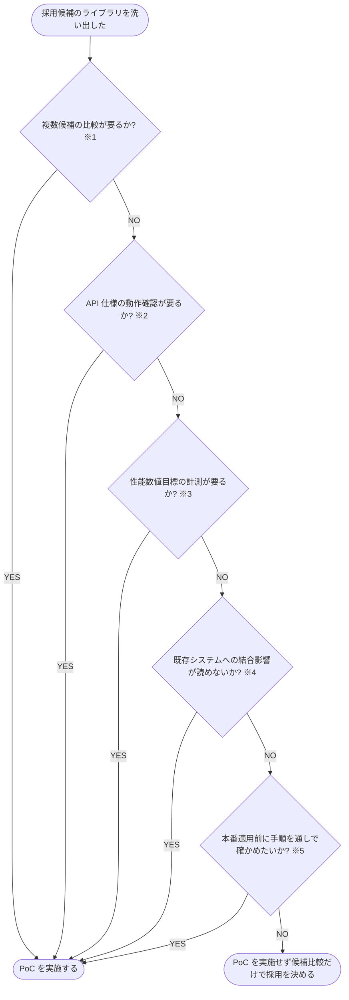

# PoC要否 判定フローチャート

- **※1 ライブラリ選定型**: 実績のない候補が複数あり、実コードで比べないと選べないもの（例: Faster-Whisper と whisper.cpp）
- **※2 動作確認型**: 採用方針は決まっているが、API の実挙動を確かめないと設計を確定できないもの（例: 定期課金フロー）
- **※3 パフォーマンス検証型**: 非機能要件に性能の数値目標があり、実測しないと成立可否が判断できないもの
- **※4 統合検証型**: 既存システムへの結合の影響範囲が読めないもの（例: 認証層の差し替え）
- **※5 手順検証型**: 本番適用をぶっつけで行うと復旧が難しいもの（例: DB マイグレーション）
