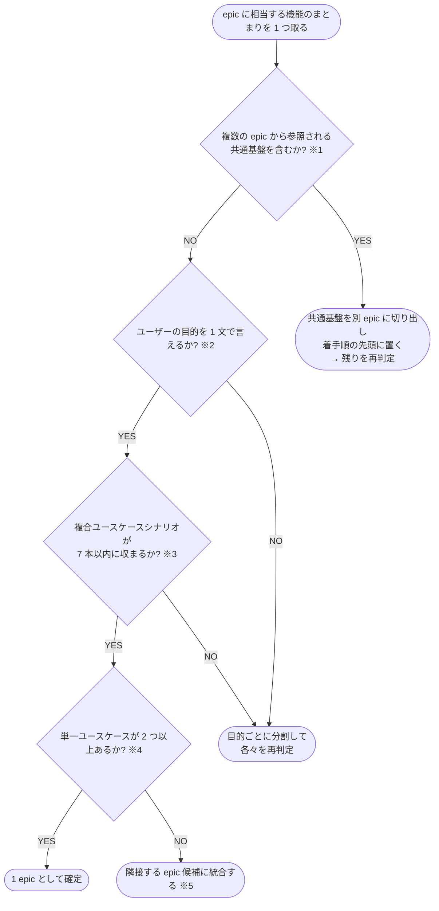

# エピック分割 判定フローチャート

- **※1 共通基盤**: 設定読み込み・外部クライアント・共有ランタイムなど、複数の epic が動くための土台になる部分。
  全 epic が依存するため独立した epic にして最初に着手する（並列に触ると設計が衝突する）
- **※2 ユーザーの目的**: 「{誰} が {何} をできるようになる」の 1 文で言える単位。
  画面単位・モジュール単位・技術レイヤー単位で切らない
- **※3 複合ユースケースシナリオ**: 複数の単一ユースケースを連鎖させた業務フロー。
  8 本以上になる候補は epic ではなくサブドメインなので、目的の粒度を 1 段下げて分割する
- **※4 単一ユースケース**: 「{対象}を{動詞}する」の 1 動詞句で表せる操作。
  1 つしかない候補は epic ではなく story 相当
- **※5 統合**: 単独では小さすぎる候補は、目的が最も近い隣接 epic に吸収する。
  吸収先が無い場合は story として親 epic を作らずに扱う
