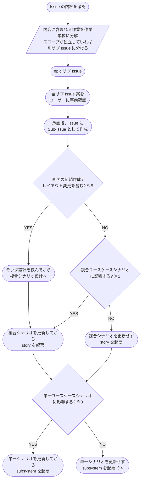

# レイヤー判定フローチャート

Issue は全て epic から起票し、シナリオへの影響は各レイヤーの指揮役が判定する。
レイヤーを飛ばすと「複合ユースケースに影響するか」「単一ユースケースに影響するか」の判定が行われないまま実装に入るため、影響がない修正でも epic → story → subsystem の順に必ず通す。

判定の担当は次のとおり。

| 判定 | 担当 | 判定するタイミング |
| --- | --- | --- |
| 作業単位への分解 | intake-issue-triager | Issue 起票直後 |
| 画面変更の有無（※5）・複合ユースケースへの影響（※2） | epic-conductor | epic の要件確定 |
| 単一ユースケースへの影響（※3） | story-conductor | story の要件確定 |

- **※2 複合**: ユースケース間の連鎖 / 複数 UC を跨ぐ振る舞い / 認証フロー刷新 のような **`設計図/シナリオ/複合ユースケース/*.md` を新規 / 更新** する変更
- **※3 単一**: 1 ユースケース内の要件追加 / UC 単位のバグ修正 / 単一 UC の挙動変更 のような **`設計図/シナリオ/単一ユースケース/*.md` を新規 / 更新** する変更
- **※4 実装のみ**: 内部リファクタ / パフォーマンス改善 / 実装バグ修正 / ログ追加 / typo 修正 など、**シナリオ不変で実装だけ変更** するもの。
  この経路でもシナリオへの影響判定は上位レイヤーで済ませている
- **※5 画面変更**: 新規画面の追加 / 既存画面のレイアウト・配置変更（サイドバー追加 等）。
  画面デザインは複数 UC に波及しやすく、モックで方向性を先にユーザーと合意するため epic に集約する（色・文言の微調整は対象外）
