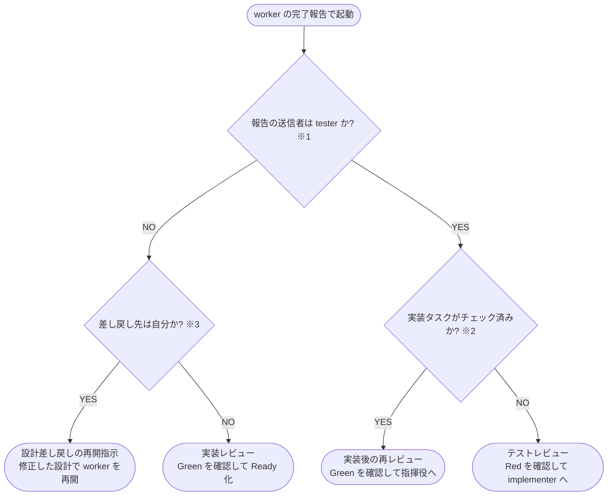

# 差し戻し復帰先 判定フローチャート

- **※1 送信者**: 完了報告コメントの from 行が指すエージェント名。tester / single-scenario-tester / complex-scenario-tester がテスト側、implementer が実装側
- **※2 実装タスク**: 対象 PR 本文の `## タスク一覧` にある実装タスクのチェック状態。チェック済みなら実装は完了しており、テストは Green を期待する
- **※3 差し戻し先が自分**: 設計側の問題と判定して自分で設計 Wiki を修正した場合。修正報告への承認が戻りの契機になる
