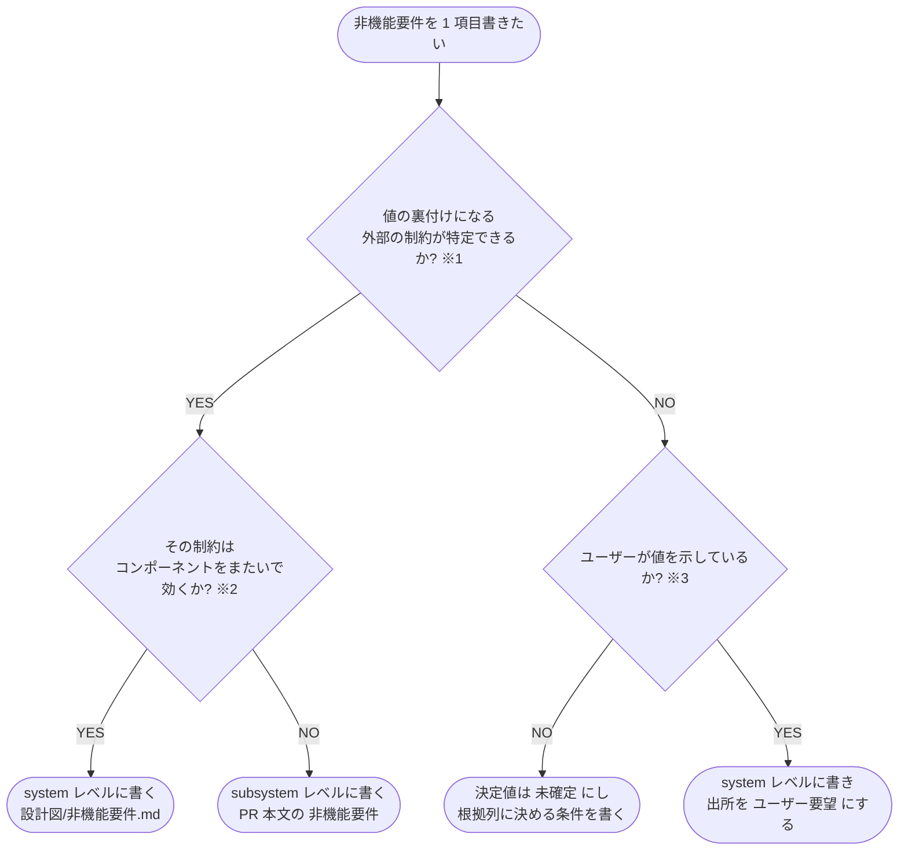

# 非機能要件のレイヤー判定フローチャート

- **※1 外部の制約**: 外部 API の上限・外部ライブラリの制限・実行基盤の公開仕様・PC 性能など、バージョンが特定できる資料で裏づけられる値。どれにも当たらないなら「制限なし」
- **※2 コンポーネントをまたいで効く**: 複数のサブシステムが同じ値を守らないと成立しないもの（API のレート制限・全体のコスト予算・外部障害時の挙動）。1 コンポーネント内で閉じるもの（画面の応答時間・ユーザビリティ・プレビュー表示）は subsystem レベル
- **※3 ユーザーが値を示している**: コスト予算・想定利用者数のように外部から逆算できず、ユーザーの意向で決まる値。示されていなければ決めずに `未確定` で残す
