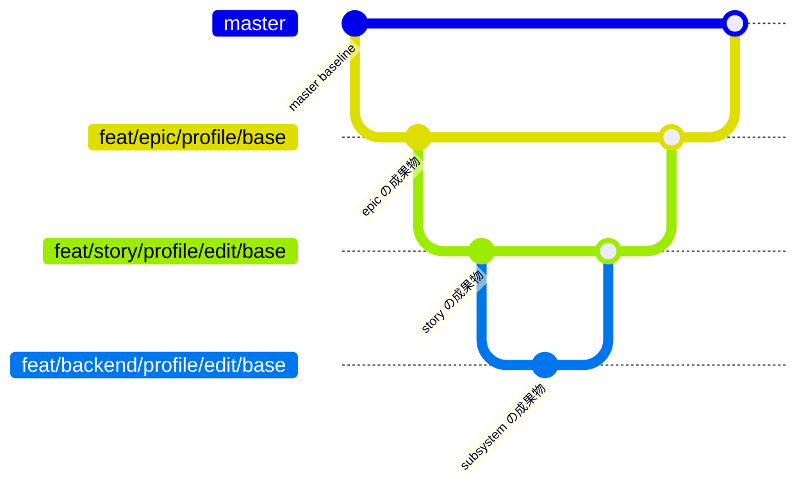
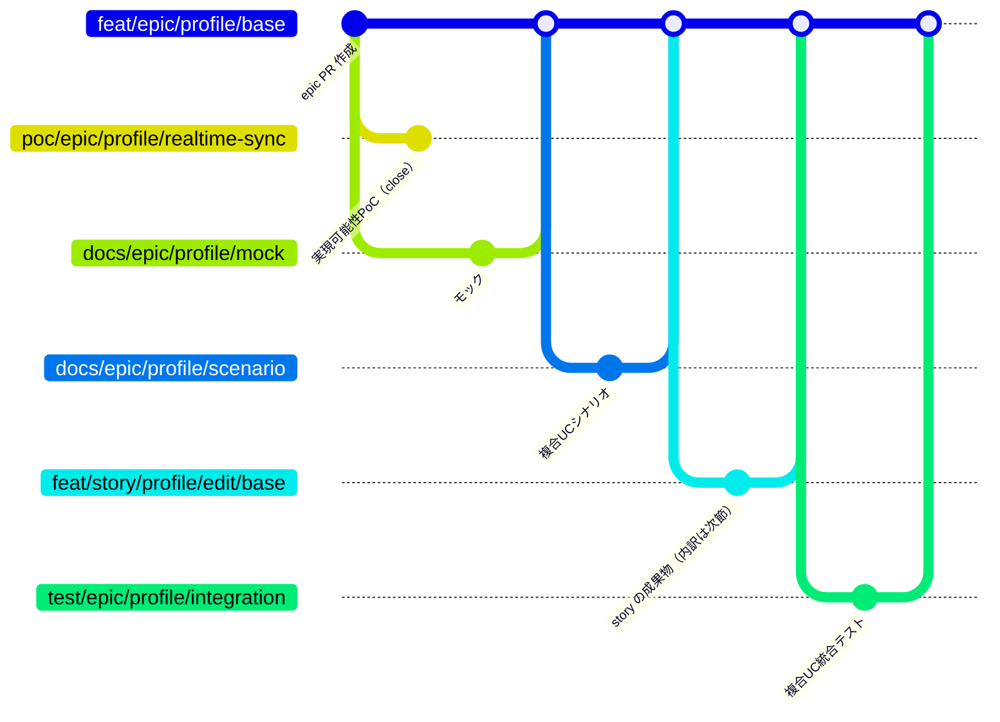
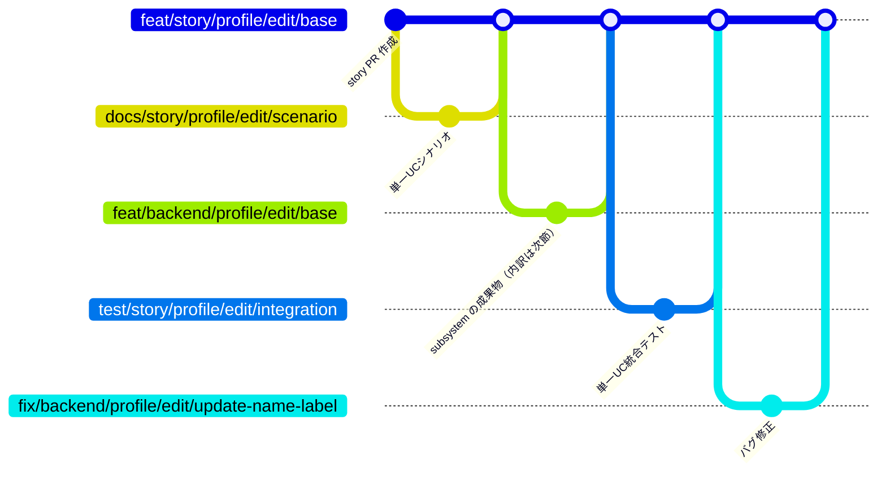
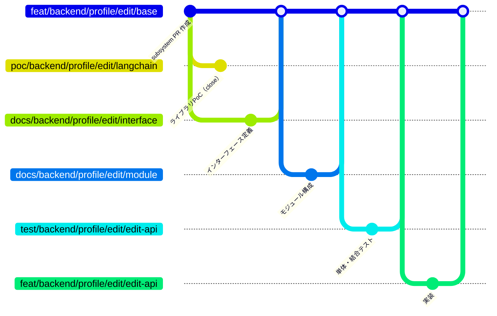
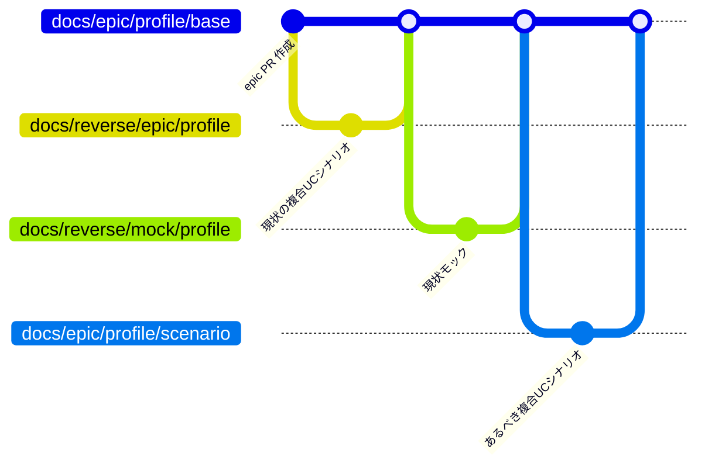

# 規約: ブランチ戦略

ブランチの命名・base・ライフサイクルの規約。

## レイヤーと面の対応

各レイヤーの作業単位はブランチと PR で表す。
Issue を持つのはユーザーが要望を投げる intake だけで、system / epic / story / subsystem の要件は PR 本文が SoT になる。

| レイヤー | 面 | 要件の置き場所 | ブランチと PR の作成者 |
| --- | --- | --- | --- |
| intake | Issue | Issue 本文 | ユーザー（questioner 経由の起票を含む） |
| system | ブランチ + PR | PR 本文 | ユーザー（立ち上げ Issue に 確認:system-conductor を付けた後、system-conductor が作成） |
| epic | ブランチ + PR | PR 本文 | intake-issue-triager |
| story | ブランチ + PR | PR 本文 | epic-conductor |
| subsystem | ブランチ + PR | PR 本文 | story-conductor |

ブランチは各レイヤーに入った時点で切り、同じブランチに Draft PR を載せてそれを面にする。
面が Issue ではなく PR になるだけで、確認ラベルによる手番の受け渡しと応答ループの進め方は変わらない。

### 親子関係の表し方

親子は PR の base で表す。
子 PR の base は親 PR の head ブランチになり、base を 1 段辿ると親の PR に着く。
レイヤー PR も成果物 PR も同じ辿り方になる。

どの PR も本文の `## 紐づく Issue` には起点の Issue（intake Issue、system レイヤーから始まる場合は立ち上げ Issue）の番号を書く。
これは階層ではなく「どの依頼から出た作業か」を示すもので、モニターが 1 つの依頼の配下をまとめて扱うために読む。
階層は base、出自は `## 紐づく Issue`、と役割を分ける。
親 PR の番号は本文に書かない（base と GitHub のスタック表示から辿れる）。

### PR スタック

階層を GitHub 上で辿れるようにするため、子 PR を作ったら親のスタックへ繋ぐ。
繋ぐ操作と外す操作は MCP ツールで行い、手順書には「ツールを呼ぶ」とだけ書く（順序を間違えると base が壊れるため、手作業で API や `gh stack` を叩かない）。

スタックには次の制約があるため、繋げない場合がある（詳細は外部API『GitHub』）。

| 制約 | 影響 |
| --- | --- |
| 1 つの PR が属せるスタックは 1 つだけ | 親の下に子が 2 本以上ぶら下がると、2 本目以降は親を含むスタックに入れない |
| スタックは線形 | 木構造をそのまま載せることはできない |
| 下位 PR を巻き込まずにマージできない | マージの前にスタックを解除する必要がある |

繋がらない子 PR は繋がないまま進める。
スタックは階層の表示手段であって進行の条件ではないので、繋がっていなくてもワークフローは変わらない。

着手順に依存がある兄弟は、先行 PR の上に積む形でスタックに載せる。
スタックは下から上への一本道なので、並びがそのまま着手順になる。
モニターはスタック上の位置を見て、自分より下に open な PR が残っているうちは確認ラベルが付いていても起動を見送る。

GitHub の依存関係（blocked by）は Issue にしか張れないため、PR では使わない。

## 命名形式

```
{githubのtype}/{名前}/{分類}/{変更内容}
```

| スロット | 値 | 例 |
| --- | --- | --- |
| githubのtype | `feat` / `fix` / `refactor` / `docs` / `chore` / `poc`（intake Issue の `type:*` ラベルに対応） | `feat` |
| 名前 | レイヤーまたは対象システム（`epic` / `story` / `backend` / `frontend` 等） | `backend` |
| 分類 | ドメイン名。epic では 1 段、story 以下では `{ドメイン}/{UC名}` の 2 段 | `profile` / `profile/edit` |
| 変更内容 | 何をするかの要約（kebab-case） | `update-name-label` / `delete-test-button` |

## レイヤーブランチ

面（PR）を載せるブランチ。
このブランチに直接 commit はせず、配下の成果物ブランチを squash マージして育てる。

| 種類 | 形式 | 例 | base | 削除タイミング |
| --- | --- | --- | --- | --- |
| system | `docs/system/{ドメイン}/base` | `docs/system/aituber/base` | `master` | system → master マージ後 |
| epic | `{type}/epic/{ドメイン}/base` | `feat/epic/profile/base` | 親 system があれば system ブランチ、無ければ `master` | epic → 親ブランチ マージ後 |
| story | `{type}/story/{ドメイン}/{UC名}/base` | `feat/story/profile/edit/base` | epic ブランチ | story → epic マージ後 |
| subsystem | `{type}/{scope}/{ドメイン}/{UC名}/base` | `feat/backend/profile/edit/base` | story ブランチ | subsystem → story マージ後 |
| chore | `chore/{分類}/{変更内容}` | `chore/readme/fix-typo` | `master` | master マージ後 |

- 全スロット英小文字 + 数字 + ハイフンの kebab-case（命名はブランチを作成する側が行う）
- 分類は epic ではドメイン名 1 段、story 以下では `{ドメイン}/{UC名}` の 2 段（UC 名は単一 UC の「{対象}を{動詞}する」の動詞部分に対応する短い語）
- レイヤーブランチは変更内容スロットに固定値 `base` を置く（そのレイヤー全体が対象なので変更内容は無いが、末尾を空けると配下の成果物ブランチと ref 名前空間が衝突する。理由は次節）
- 同じ修正内容で 2 回目の差し戻しが発生した場合は変更内容の末尾に `-2` 以降の連番を付ける
- chore はレイヤーに属さず対象システムも持たないため、名前スロットを省略して master へ直接マージする（成果物ブランチも切らない）
- epic の base は親 system の有無だけで決まる（intake 起点の通常開発では system レイヤーが存在しないため `master`）

### レイヤーブランチに `base` を付ける理由

git はブランチを `.git/refs/heads/` 配下のファイルとして持つため、あるブランチ名を別のブランチ名の先頭部分にできない。

末尾を空けてレイヤーブランチを `docs/system/aituber` にすると、配下の成果物ブランチ `docs/system/aituber/foundation` を作るときに `aituber` をファイルとディレクトリの両方にする必要が生じ、作成に失敗する。

```
fatal: cannot lock ref 'refs/heads/docs/system/aituber/foundation':
'refs/heads/docs/system/aituber' exists
```

末尾に `base` を置いてレイヤーブランチと成果物ブランチを兄弟にすることで、両方が同時に存在できる。

```
refs/heads/docs/system/aituber/base        レイヤーブランチ（面）
refs/heads/docs/system/aituber/foundation  土台生成の成果物ブランチ
```

このため、成果物ブランチの変更内容スロットに `base` は使わない（レイヤーブランチと同名になる）。

## 成果物ブランチ

レイヤーのブランチには直接 commit しない。
成果物 1 件ごとに作業用のブランチと PR を切り、レイヤーのブランチへ squash マージする。

理由は、成果物を作る作業がユーザーや上位担当とのやり取りで必ず複数コミットになるため。
レイヤーのブランチへ直接 commit すると、モックの手直しやシナリオの応答ループがそのままレイヤーの PR の履歴に並び、何が成果物なのか読めなくなる。
成果物ごとに PR を分けて squash マージすれば、レイヤーの PR には成果物 1 件につき 1 コミットだけが載る。

判断の基準は「コミットが 2 つ以上になりうるか」。
なりうるなら成果物ブランチを切る。

### 一覧

| 成果物 | ブランチ | base とマージ先 | 切る担当 | 作業する担当 |
| --- | --- | --- | --- | --- |
| 土台生成 | `docs/system/{ドメイン}/foundation` | system ブランチ | system-conductor | system-architect |
| モック | `docs/epic/{ドメイン}/mock` | epic ブランチ | epic-conductor | mock-designer |
| 複合UCシナリオ | `docs/epic/{ドメイン}/scenario` | epic ブランチ | epic-conductor | complex-scenario-writer |
| 複合UC統合テスト | `test/epic/{ドメイン}/integration` | epic ブランチ | epic-conductor | complex-scenario-tester |
| 単一UCシナリオ | `docs/story/{ドメイン}/{UC名}/scenario` | story ブランチ | story-conductor | single-scenario-writer |
| 単一UC統合テスト | `test/story/{ドメイン}/{UC名}/integration` | story ブランチ | story-conductor | single-scenario-tester |
| SS設計（インターフェース定義） | `docs/{scope}/{ドメイン}/{UC名}/interface` | subsystem ブランチ | subsystem-conductor | architect |
| SS設計（モジュール構成） | `docs/{scope}/{ドメイン}/{UC名}/module` | subsystem ブランチ | subsystem-conductor | architect |
| 単体・結合テスト | `test/{scope}/{ドメイン}/{UC名}/{変更内容}` | subsystem ブランチ | subsystem-conductor | tester |
| 実装 | `{type}/{scope}/{ドメイン}/{UC名}/{変更内容}` | subsystem ブランチ | subsystem-conductor | implementer |

インターフェース定義とモジュール構成を分けるのは、それぞれにユーザーレビューが入るため。
片方の指摘でもう片方の PR が動かない形にする。

### マージしないブランチ

| 種類 | ブランチ | base | 切る担当 | 扱い |
| --- | --- | --- | --- | --- |
| 実現可能性 PoC | `poc/epic/{ドメイン}/{テーマ}` | epic ブランチ | epic-conductor | マージせず PR close |
| ライブラリ PoC | `poc/{scope}/{ドメイン}/{UC名}/{lib名}` | subsystem ブランチ | architect | マージせず PR close |

PoC は結論だけを親レイヤーの PR 本文へ書き戻し、コードはマージしない。
検証の記録は closed PR の diff に残る。

### バグ修正のブランチ

| 種類 | ブランチ | base とマージ先 | 切る担当 | 作業する担当 |
| --- | --- | --- | --- | --- |
| バグ修正 | `fix/{scope}/{ドメイン}/{UC名}/{変更内容}` | 差し戻し元で統合テストを実行しているブランチ | subsystem-conductor | architect 配下 |

バグ修正のブランチが実装と別なのは、subsystem PR が story へマージされた後に統合テストで見つかるため。
マージ済みの成果物には戻れないので、差し戻し元のブランチから新しく切り直す。
差し戻しが story レベルなら story ブランチ、epic レベルなら epic ブランチが base になる（story ブランチは削除済みのため）。

## ツリーと base の対応

レイヤーが縦に連なり、その各段に成果物ブランチがぶら下がるため、1 枚の図には収まらない。
まずレイヤーの連なりだけを示し、続けてレイヤーごとの内訳を示す。

### レイヤー全体

intake 起点（system レイヤーなし）の例。
各レイヤーの commit は、そのレイヤーに載った成果物ブランチのマージをまとめて 1 点で表している（内訳は後続の各節）。



system レイヤーがある場合は master と epic の間に system ブランチが 1 段入り、epic の base と epic のマージ先がその system ブランチになる。
master へのマージは最上位レイヤーの完了時 1 回だけになる。

### epic レイヤーの内訳

epic ブランチにぶら下がるもの。
story ブランチの内部は次節で開く。



複合UC統合テストを story のマージ後に置くのは、配下の story が出揃ってからでないと UC をまたぐ流れを通せないため。
実現可能性 PoC だけが枝を伸ばしたまま終わる（マージせず PR close）。

### story レイヤーの内訳

story ブランチにぶら下がるもの。
subsystem ブランチの内部は次節で開く。



subsystem が複数ある場合は、同じ形の枝が並ぶ。
バグ修正が統合テストの後ろに来るのは、統合テストの失敗を受けて差し戻すため（subsystem ブランチは既にマージ済みで戻れない）。

### subsystem レイヤーの内訳

subsystem ブランチにぶら下がるもの。
ここが実装の実体で、成果物ブランチが最も細かく分かれる。



インターフェース定義とモジュール構成が別の枝なのは、それぞれにユーザーレビューが入るため。
テストを実装より先に置くのは V 字モデルの順（テストが仕様の写しになる）。
ライブラリ PoC だけが枝を伸ばしたまま終わる（マージせず PR close）。

### 全レイヤーに共通すること

レイヤーブランチには直接 commit が無く、成果物ブランチのマージだけが並ぶ。
成果物ブランチの中では応答ループで commit が何本積まれてもよく、squash マージでレイヤー側には 1 コミットに畳まれる。

## リバースエンジニアリング時のブランチ

`リバースエンジニアリング` ラベルが付いた対象では、通常 PR の前に現状の設計書だけを入れる RE PR を 1 本挟む。

狙いは PR 単位で差分を読めるようにすること。
RE PR の diff が「現状をコードから起こした設計書」だけになり、通常 PR ではその上での変更を読める。
同じことを 1 本の PR の中で commit を分けて表現すると、差分を見るのに commit を指定する操作が要る。

### ブランチ一覧

| 種類 | 形式 | 例 | base | マージ先 | 作成者 |
| --- | --- | --- | --- | --- | --- |
| アーキテクチャ図 RE | `docs/reverse/system/{ドメイン}` | `docs/reverse/system/aituber` | system ブランチ | system ブランチ | system-conductor |
| 現状モック RE | `docs/reverse/mock/{ドメイン}` | `docs/reverse/mock/profile` | epic ブランチ | epic ブランチ | epic-conductor |
| 複合UCシナリオ RE | `docs/reverse/epic/{ドメイン}` | `docs/reverse/epic/profile` | epic ブランチ | epic ブランチ | epic-conductor |
| 単一UCシナリオ RE | `docs/reverse/story/{ドメイン}/{UC名}` | `docs/reverse/story/profile/edit` | story ブランチ | story ブランチ | story-conductor |
| SS設計 RE | `docs/reverse/{scope}/{ドメイン}/{UC名}` | `docs/reverse/backend/profile/edit` | subsystem ブランチ | subsystem ブランチ | subsystem-conductor |

- RE ブランチも成果物ブランチの一種で、base とマージ先は自レイヤーのブランチにする（master へ直接マージするとレイヤー構造が失われる）
- そのため自レイヤーのブランチは RE PR より先に作る
- RE PR は同じレイヤーの他の成果物ブランチより先に作り、先にマージする（現状を起こしてからあるべき姿を設計する順のため）
- マージ後にブランチを削除する（他のブランチと同じ短命運用）

### RE ブランチを含むツリー

RE ブランチは自レイヤーの成果物ブランチの 1 本目として入る。
現状を起こしてからあるべき姿を設計する順になるので、同じレイヤーの他の成果物ブランチより先にマージする。

epic レイヤーを例にすると次の形になる。



system / story / subsystem も同じ形で、自レイヤーのブランチへ RE ブランチを先にマージしてから、あるべき姿の成果物ブランチを重ねる。

### 承認とマージ

RE PR は担当エージェントの完了報告後、作成した conductor がユーザーへ最終確認を出す。
現状を写しただけなので設計上の判断は無く、確認するのは「起こし漏れが無いか」だけ。

| 手順 | 実施者 |
| --- | --- |
| 自レイヤーのブランチ + RE ブランチ + RE PR の作成 | 各レイヤーの conductor |
| 現状の設計書の作成 + 完了報告 | `*-reverse-engineer` |
| ユーザーへの最終確認 + マージ | RE PR を作った conductor |
| 通常 PR の作成 → あるべき姿への設計 | 通常フローどおり |

画面一覧・画面遷移は epic PR 本文に書くためファイルにならないが、これらは現状モック（`docs/mock/pages/{画面名}/{RE PR 番号}/`）を見れば書ける。
mock-designer は現状モックを入力にして記入し、実装コードは読まない。

## ライフサイクル

- 全ブランチが squash マージ + 削除の短命運用。
  恒久記録は closed / merged PR の diff
- PoC ブランチはマージせず、PR close 時にローカル / リモートとも削除する（closed PR の diff が恒久記録）
