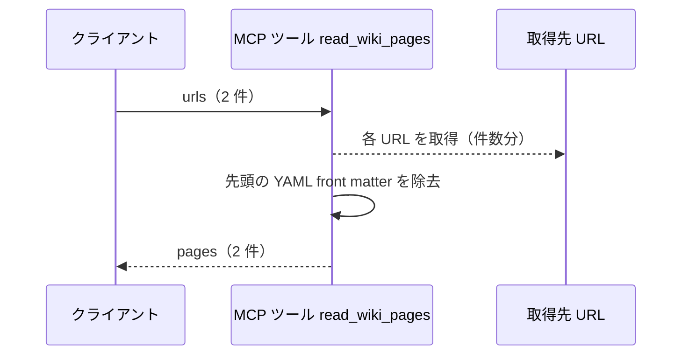
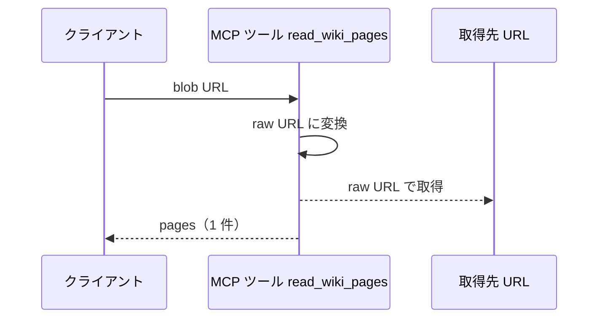
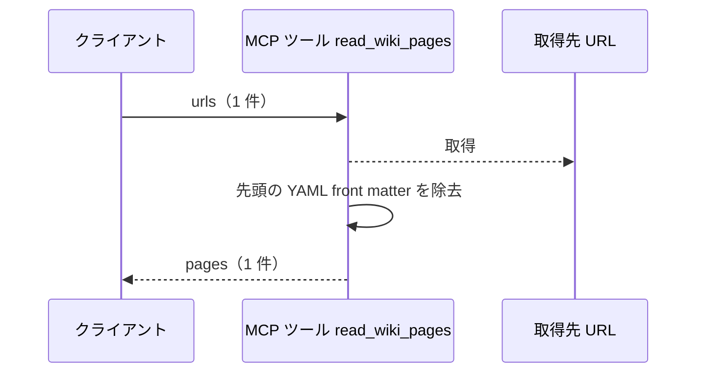
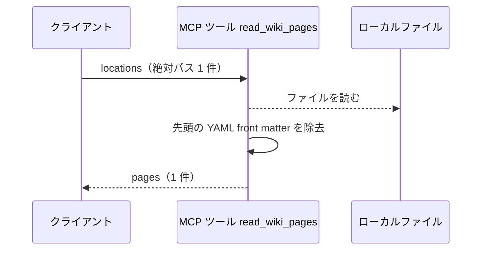
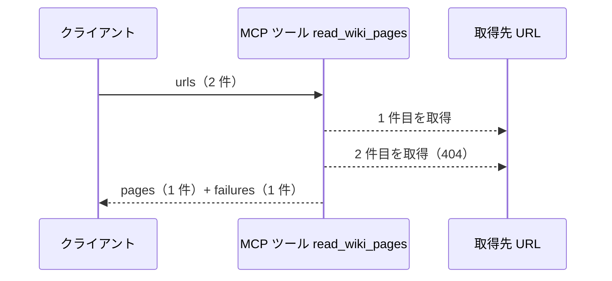

# Wikiページ取得

MCP ツール: `read_wiki_pages`

エージェントが自ターンの実行中に、事前注入されていない Wiki ページを読むための取得口。

- 対応テストファイル: `tests/integration/mcp/test_read_wiki_pages.py`

## インターフェース

### リクエスト

| パラメータ | 型 | 必須 | デフォルト | 説明 | 制限 | 補足 |
| --- | --- | --- | --- | --- | --- | --- |
| `locations` | list[str] | ✅ | - | 取得対象の場所の配列 | 1 件以上 | raw URL / GitHub blob URL / ローカル絶対パスのいずれか。blob URL は raw URL に変換して取得する |

リクエスト例:

```json
{
  "locations": [
    "/home/user/repo/ai-monitor/docs/wiki/テンプレート/シナリオ.md",
    "https://raw.githubusercontent.com/shuhei1101/ai-monitor/master/docs/wiki/規約/コメント.md"
  ]
}
```

### レスポンス

| フィールド | 型 | 説明 | 制限 | 補足 |
| --- | --- | --- | --- | --- |
| `pages` | object[] | 取得できたページの配列 | - | 並びは `locations` の指定順 |
| `pages[].url` | str | 実際に取得した場所 | - | blob URL を渡した場合は変換後の raw URL。ローカルはパスのまま |
| `pages[].body` | str | ページ本文 | - | 先頭の YAML front matter は除去済み |
| `failures` | object[] | 取得できなかったページの配列 | - | 全件成功なら空配列 |
| `failures[].url` | str | 取得に失敗した場所 | - | 正規化後の値 |
| `failures[].reason` | str | 失敗の理由 | - | HTTP ステータス・接続エラー・ファイル不在の内容 |

レスポンス例:

```json
{
  "pages": [
    {
      "url": "https://raw.githubusercontent.com/shuhei1101/ai-monitor/master/docs/wiki/テンプレート/シナリオ.md",
      "body": "# ai-monitor テンプレート: シナリオ\n\nシナリオは ..."
    }
  ],
  "failures": [
    {
      "url": "https://raw.githubusercontent.com/shuhei1101/ai-monitor/master/docs/wiki/設計図/README.md",
      "reason": "HTTP Error 404: Not Found"
    }
  ]
}
```

**補足:**

- 同じ場所を複数回渡した場合はその回数分の要素を返す（重複除去はしない）
- 1 件も取得できなかった場合も `pages` が空配列・`failures` に全件でツールエラーにはしない（呼び出し側が読めた分だけで判断できるようにする）

## 制約

| 項目 | 制約 | 補足 |
| --- | --- | --- |
| タイムアウト | 制限なし | - |
| 対象プロジェクト | 参照しない | 取得先は引数の場所だけで決まる |
| 認可 | なし（認証情報を付けない） | ネットワーク経由の対象は公開 URL のみ |
| フォールバック | なし（取得できなかった場所は `failures` に載せる） | 取得できたページは返し、欠落は呼び出し側が結果から判断する |

## フロー一覧

| 分類 | フロー名 | 概要 | 補足 |
| --- | --- | --- | --- |
| 正常 | 正常系 | 複数の場所の取得 → 本文配列で返却 | - |
| 正常 | 正常系（blob URL） | GitHub blob URL を raw URL に変換して取得 | - |
| 正常 | 正常系（front matter あり） | 本文先頭の YAML front matter を除去して返却 | - |
| 正常 | 正常系（ローカルパス） | ローカル絶対パスをファイルとして読む | - |
| 正常 | 正常系（一部が取得失敗） | 取得できたページを返し、失敗した場所を `failures` に載せる | - |

## 正常系

### セットアップ

| セットアップ | 説明 | 補足 |
| --- | --- | --- |
| Mock | HTTP（ページ 2 本の応答を返す） | - |

### フロー



### 期待値

- `pages` が引数順で 2 件返る
- 各要素の `url` が取得先 URL、`body` がページ本文になっている

## 正常系（blob URL）

### セットアップ

| セットアップ | 説明 | 補足 |
| --- | --- | --- |
| Mock | HTTP（raw URL でページ 1 本の応答を返す） | - |
| 入力 | `github.com/{owner}/{repo}/blob/...` 形式の URL を渡す | 変換分岐を決定的に誘発 |

### フロー



### 期待値

- raw URL（`raw.githubusercontent.com`）でリクエストされる
- `pages[0].url` が変換後の raw URL になっている

## 正常系（front matter あり）

### セットアップ

| セットアップ | 説明 | 補足 |
| --- | --- | --- |
| Mock | HTTP（先頭に YAML front matter が付いたページ 1 本の応答を返す） | - |

### フロー



### 期待値

- `pages[0].body` に YAML front matter が含まれない

## 正常系（ローカルパス）

### セットアップ

| セットアップ | 説明 | 補足 |
| --- | --- | --- |
| Mock | なし（一時ディレクトリにページを作成） | - |
| 入力 | 一時ディレクトリ内のファイルの絶対パスを渡す | ローカル分岐を決定的に誘発 |

### フロー



### 期待値

- `pages[0].body` にファイル本文が入る
- `pages[0].url` が渡した絶対パスのままになっている
- ネットワークアクセスが発生していない

## 正常系（一部が取得失敗）

### セットアップ

| セットアップ | 説明 | 補足 |
| --- | --- | --- |
| Mock | HTTP（1 件目は本文を返し、2 件目は 404 を返す） | 部分失敗を決定的に誘発 |

### フロー



### 期待値

- `pages` に取得できた 1 件だけが入る
- `failures` に取得できなかった URL と理由が入る

## 異常系

なし
