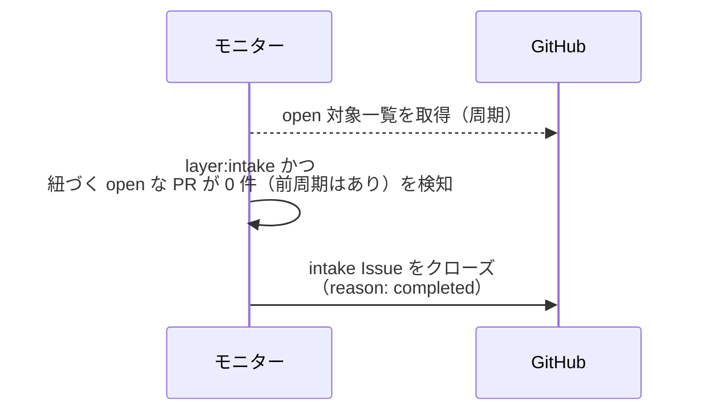
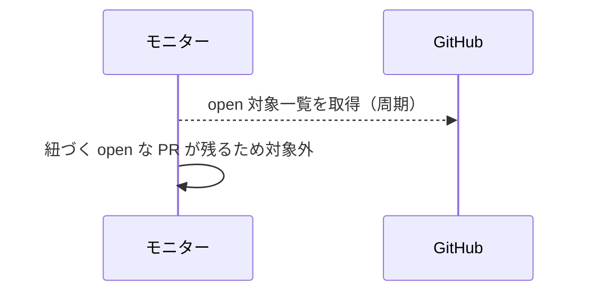
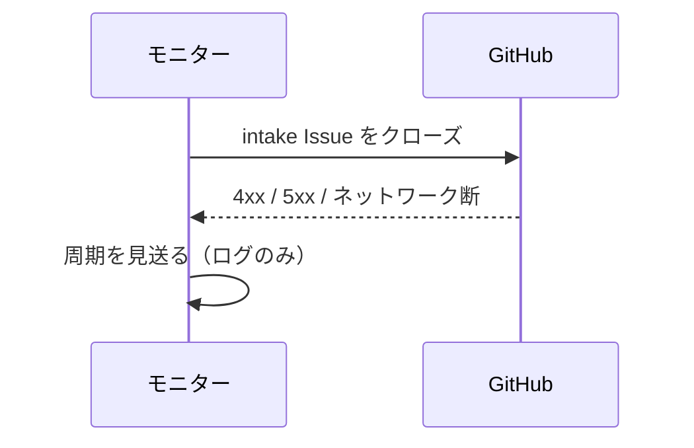

# intake自動クローズ

トリガー: polling 周期（open 対象一覧の取得結果で判定）

intake Issue に紐づく PR が全てマージされたことを検知し、intake Issue を自動クローズする。

- 対応テストファイル: `tests/integration/monitor/test_intake自動クローズ.py`

## 制約

| 項目 | 制約 | 補足 |
| --- | --- | --- |
| 対象 | `layer:intake` ラベル付きの open Issue | 紐づく PR が 1 件も無いものは対象外 |
| 判定材料 | open 対象一覧に含まれる PR の本文の `## 紐づく Issue` | 追加の API 呼び出しはしない。open な PR が 1 件も残っていなければ全てマージ済みとみなす |

## フロー一覧

| 分類 | フロー名 | 概要 | 補足 |
| --- | --- | --- | --- |
| 正常 | 正常系 | 紐づく PR が全て open 一覧から消えたのを検知して intake をクローズ | - |
| 正常 | 正常系（未マージの PR あり） | open な PR が残っていれば何もしない | - |
| 異常 | 異常系（GitHub API エラー） | クローズ失敗で周期を見送る | - |

## 正常系

### セットアップ

| セットアップ | 説明 | 補足 |
| --- | --- | --- |
| Mock | GitHub API を差し替え | - |
| 対象 | `layer:intake` の open Issue を open 一覧に含める | この Issue を `## 紐づく Issue` に持つ PR は open 一覧に 1 件も無い（前周期には 2 件あった） |

### フロー

### 期待値

- intake Issue がクローズされている（`reason: completed`）

## 正常系（未マージの PR あり）

### セットアップ

| セットアップ | 説明 | 補足 |
| --- | --- | --- |
| Mock | GitHub API を差し替え | - |
| 対象 | `layer:intake` の open Issue を open 一覧に含める | この Issue を `## 紐づく Issue` に持つ PR が 1 件 open で残っている。見送りを誘発 |

### フロー

### 期待値

- クローズ操作が発生していない

## 異常系（GitHub API エラー）

### セットアップ

| セットアップ | 説明 | 補足 |
| --- | --- | --- |
| Mock | GitHub API を差し替え（クローズで 4xx / 5xx を返す） | 異常を決定的に誘発 |
| 対象 | 紐づく open な PR が 0 件になった intake Issue を open 一覧に含める | - |

### フロー

### 期待値

- モニタープロセスが落ちない
- intake Issue は open のまま残り、次周期で再試行される
