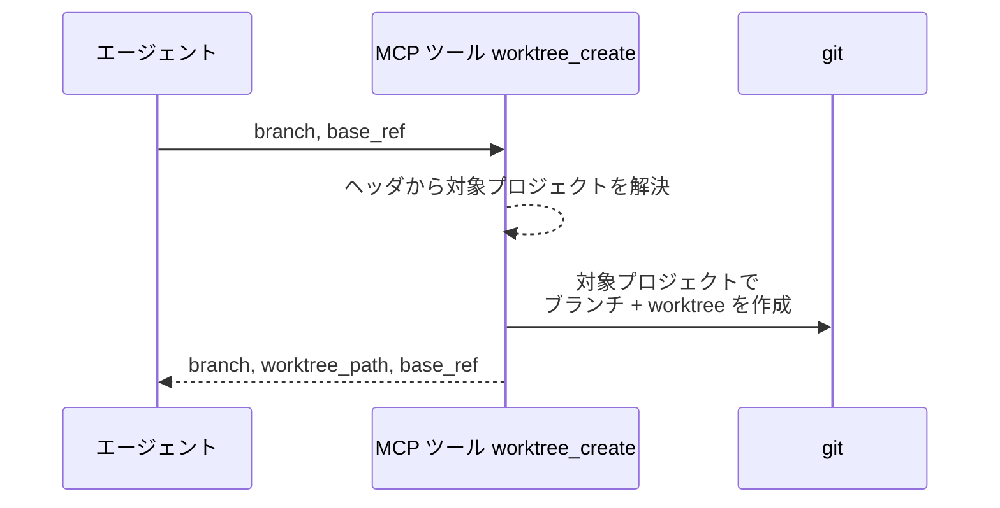
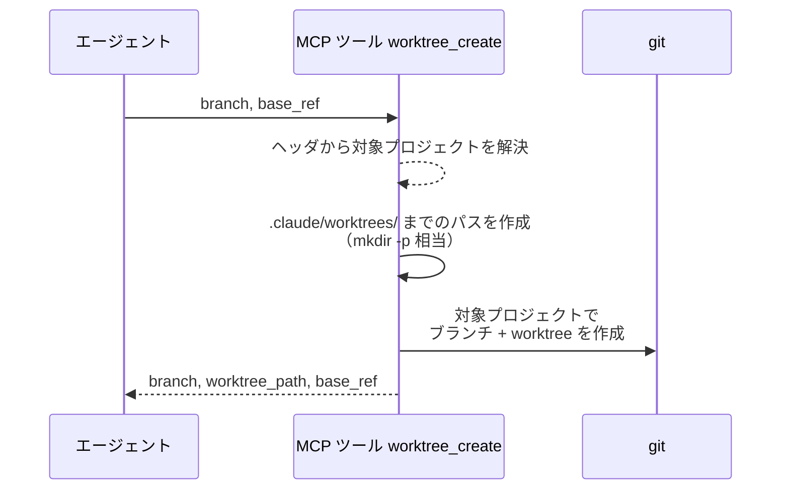
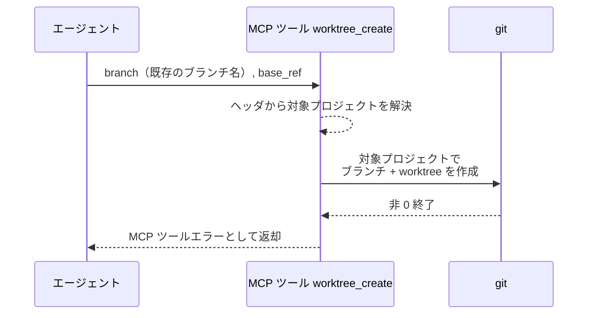
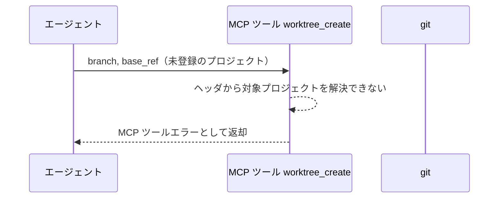

# worktree作成

MCP ツール: `worktree_create`

フルブランチ名と分岐元を受け取り、ブランチと worktree（`.claude/worktrees/` 配下）を作成する。

- 対応テストファイル: `tests/integration/mcp/test_worktree_create.py`

## インターフェース

### リクエスト

| パラメータ | 型 | 必須 | デフォルト | 説明 | 制限 | 補足 |
| --- | --- | --- | --- | --- | --- | --- |
| `branch` | str | ✅ | - | 作成するフルブランチ名 | `{type}/{名前}/{分類}/{変更内容}` 体系（`規約/ブランチ戦略.md`） | - |
| `base_ref` | str | ✅ | - | 分岐元の ref | 対象リポジトリで解決できる ref | 作成する PR の base と同じブランチを指定する |

リクエスト例:

```json
{
  "branch": "feat/backend/profile/edit/edit-api",
  "base_ref": "origin/feat/story/profile/edit"
}
```

### レスポンス

| フィールド | 型 | 説明 | 制限 | 補足 |
| --- | --- | --- | --- | --- |
| `branch` | str | 作成したブランチ名 | - | - |
| `worktree_path` | str | worktree の絶対パス | - | 以降の作業 CWD。対象プロジェクト配下 |
| `base_ref` | str | 分岐元の base ref | - | リクエストで指定した値 |

レスポンス例:

```json
{
  "branch": "feat/backend/profile/edit/edit-api",
  "worktree_path": "/path/to/monitored-project/.claude/worktrees/feat-backend-profile-edit-edit-api",
  "base_ref": "origin/feat/story/profile/edit"
}
```

## 制約

| 項目 | 制約 | 補足 |
| --- | --- | --- |
| タイムアウト | git 1 回あたり設定の `git_timeout_sec`（既定 120 秒） | 超えたら打ち切ってツールエラーにする。常駐プロセスに戻らない呼び出しを残さない |
| 認証 | 非対話で実行する（対話を求められた時点で失敗させる） | 応答できる人が居ないため、聞かれると戻らなくなる |
| 対象リポジトリ | ヘッダで解決した監視対象プロジェクトの作業ディレクトリに限る | 解決できない場合は 異常系（プロジェクト不明） |

## フロー一覧

| 分類 | フロー名 | 概要 | 補足 |
| --- | --- | --- | --- |
| 正常 | 正常系 | ブランチ作成 + worktree 追加 | - |
| 正常 | 正常系（worktree フォルダ未作成時） | `.claude/worktrees/` までのパスを作成してから worktree 追加 | mkdir -p 相当 |
| 異常 | 異常系（git 実行失敗） | 既存ブランチ名 / 不正なブランチ名 | - |
| 異常 | 異常系（プロジェクト不明） | ヘッダのプロジェクトが設定に無い | 誤ったリポジトリを操作しないための防壁 |

## 正常系

### セットアップ

| セットアップ | 説明 | 補足 |
| --- | --- | --- |
| Mock | なし（テスト用に一時作成した git リポジトリで実行） | - |
| 監視対象プロジェクト | 一時 git リポジトリを `local_path` として設定に登録 | MCP プロセスの作業ディレクトリとは別の場所 |
| ブランチ名 | 未使用のフルブランチ名を指定 | 命名は `規約/ブランチ戦略.md` |
| base_ref | 対象リポジトリに存在する ref を指定 | - |

### フロー



### 期待値

- 指定名のブランチと `.claude/worktrees/` 配下の worktree が、監視対象プロジェクトのリポジトリに作成されている
- MCP プロセスの作業ディレクトリ側のリポジトリには、ブランチも worktree も作成されていない
- 戻り値の `branch` / `worktree_path` / `base_ref` が実体と一致している
- `worktree_path` が監視対象プロジェクトの `local_path` 配下を指している

## 正常系（worktree フォルダ未作成時）

### セットアップ

| セットアップ | 説明 | 補足 |
| --- | --- | --- |
| Mock | なし（テスト用に一時作成した git リポジトリで実行） | - |
| 監視対象プロジェクト | 一時 git リポジトリを `local_path` として設定に登録 | - |
| 対象リポジトリ | `.claude/worktrees/` フォルダが存在しない | リポジトリでの初回実行を再現 |

### フロー



### 期待値

- `.claude/worktrees/` フォルダが作成され、その配下に worktree が作成されている
- エラーにならず、戻り値は正常系と同じ形で返る

## 異常系（git 実行失敗）

### セットアップ

| セットアップ | 説明 | 補足 |
| --- | --- | --- |
| Mock | なし（テスト用に一時作成した git リポジトリで実行） | - |
| 監視対象プロジェクト | 一時 git リポジトリを `local_path` として設定に登録 | - |
| 入力 | 既存のブランチ名を指定して呼び出す | git の非 0 終了を決定的に誘発 |

### フロー



### 期待値

- MCP ツールエラーが返る（git の stderr を含む）
- ブランチ・worktree は追加されていない

## 異常系（プロジェクト不明）

### セットアップ

| セットアップ | 説明 | 補足 |
| --- | --- | --- |
| Mock | なし（テスト用に一時作成した git リポジトリで実行） | - |
| リクエストヘッダ | 設定に存在しないプロジェクト名を指定する | プロジェクト解決の失敗を決定的に誘発 |

### フロー



### 期待値

- MCP ツールエラーが返る
- git が一度も実行されていない（どのリポジトリにもブランチ・worktree が作成されていない）
