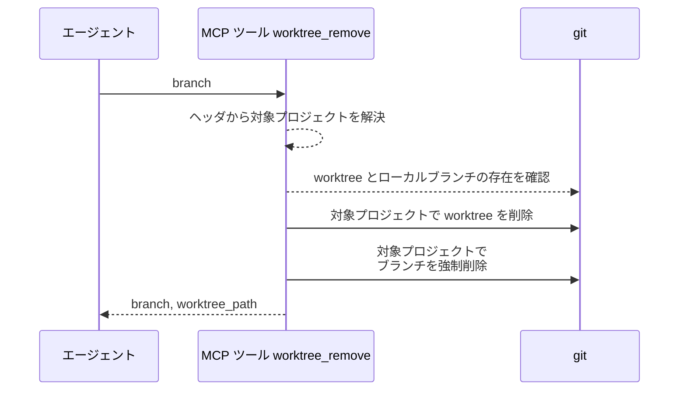
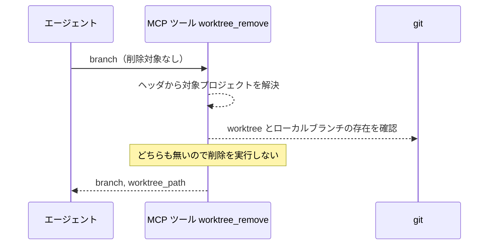
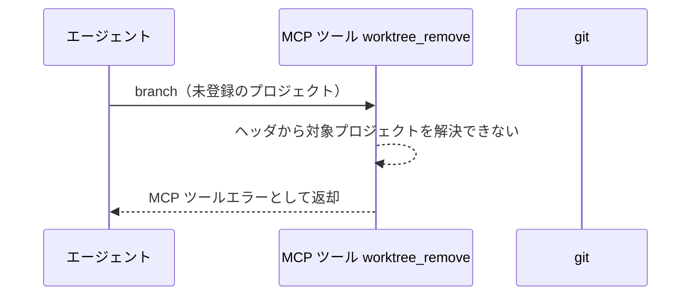

# worktree削除

MCP ツール: `worktree_remove`

worktree とローカルブランチを両方削除する（ブランチは強制削除）。

- 対応テストファイル: `tests/integration/mcp/test_worktree_remove.py`

## インターフェース

### リクエスト

| パラメータ | 型 | 必須 | デフォルト | 説明 | 制限 | 補足 |
| --- | --- | --- | --- | --- | --- | --- |
| `branch` | str | ✅ | - | 削除対象のブランチ名 | - | 対応する worktree も削除される |

リクエスト例:

```json
{
  "branch": "feat/backend/profile/edit/edit-api"
}
```

### レスポンス

| フィールド | 型 | 説明 | 制限 | 補足 |
| --- | --- | --- | --- | --- |
| `branch` | str | 削除対象のブランチ名 | - | - |
| `worktree_path` | str | 削除した worktree の絶対パス | - | 対象プロジェクト配下 |

レスポンス例:

```json
{
  "branch": "feat/backend/profile/edit/edit-api",
  "worktree_path": "/path/to/monitored-project/.claude/worktrees/feat-backend-profile-edit-edit-api"
}
```

## 制約

| 項目 | 制約 | 補足 |
| --- | --- | --- |
| タイムアウト | 制限なし | - |
| 対象リポジトリ | ヘッダで解決した監視対象プロジェクトの作業ディレクトリに限る | 解決できない場合は 異常系（プロジェクト不明） |

## フロー一覧

| 分類 | フロー名 | 概要 | 補足 |
| --- | --- | --- | --- |
| 正常 | 正常系 | worktree 削除 → ブランチ強制削除 | - |
| 正常 | 正常系（削除対象が残っていない） | worktree / ローカルブランチが既に無い | 何度呼んでも同じ結果になる |
| 異常 | 異常系（プロジェクト不明） | ヘッダのプロジェクトが設定に無い | 誤ったリポジトリを操作しないための防壁 |

## 正常系

### セットアップ

| セットアップ | 説明 | 補足 |
| --- | --- | --- |
| Mock | なし（テスト用に一時作成した git リポジトリで実行） | - |
| 監視対象プロジェクト | 一時 git リポジトリを `local_path` として設定に登録 | MCP プロセスの作業ディレクトリとは別の場所 |
| 対象 | squash マージ済みのブランチと worktree が存在 | base の履歴に元 commit は残っていない |

### フロー



### 期待値

- 監視対象プロジェクトのリポジトリで worktree とローカルブランチが両方削除されている
- `worktree_path` が監視対象プロジェクトの `local_path` 配下を指している

## 正常系（削除対象が残っていない）

巻き戻し・マージ後の後片付けは、worktree を作っていないブランチや、既に片付いたブランチにも呼ばれる。
残っているものだけを消し、無いものは飛ばして正常終了する（何度呼んでも同じ結果になる）。

### セットアップ

| セットアップ | 説明 | 補足 |
| --- | --- | --- |
| Mock | なし（テスト用に一時作成した git リポジトリで実行） | - |
| 監視対象プロジェクト | 一時 git リポジトリを `local_path` として設定に登録 | - |
| 入力 | worktree もローカルブランチも存在しないブランチ名を指定して呼び出す | 削除対象が無い状態を決定的に誘発 |

### フロー



### 期待値

- MCP ツールエラーにならず `branch` / `worktree_path` が返る
- 削除の git コマンド（`worktree remove` / `branch -D`）が一度も実行されていない
- リポジトリの他の worktree・ブランチが変化していない

## 異常系（プロジェクト不明）

### セットアップ

| セットアップ | 説明 | 補足 |
| --- | --- | --- |
| Mock | なし（テスト用に一時作成した git リポジトリで実行） | - |
| リクエストヘッダ | 設定に存在しないプロジェクト名を指定する | プロジェクト解決の失敗を決定的に誘発 |

### フロー



### 期待値

- MCP ツールエラーが返る
- git が一度も実行されていない（どのリポジトリの worktree・ブランチも削除されていない）
