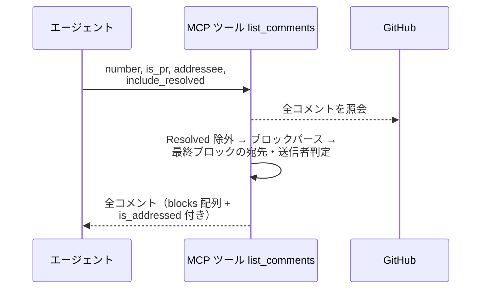
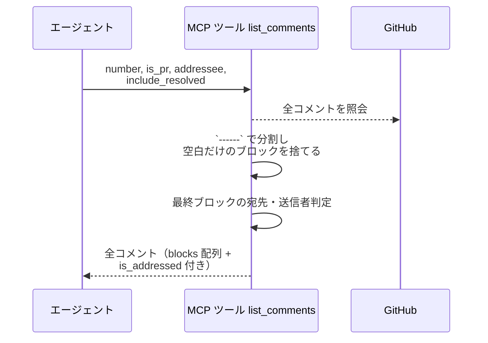
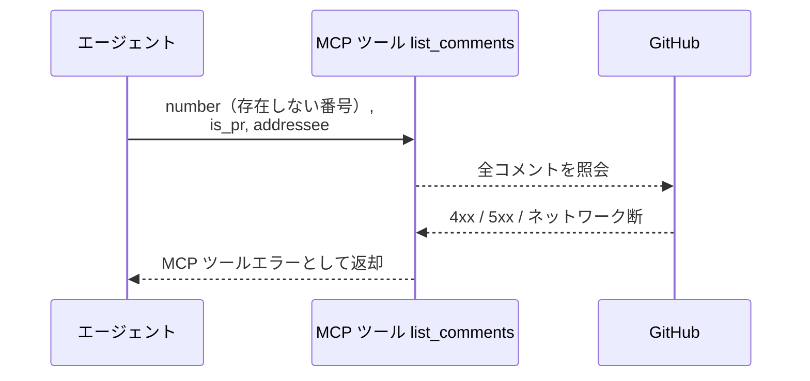

# コメント一覧

MCP ツール: `list_comments`

対象の全コメントを `------` 区切りのブロック配列にパースし、自分宛かどうかの判定を添えて返す。

- 対応テストファイル: `tests/integration/mcp/test_list_comments.py`

## インターフェース

### リクエスト

| パラメータ | 型 | 必須 | デフォルト | 説明 | 制限 | 補足 |
| --- | --- | --- | --- | --- | --- | --- |
| `number` | int | ✅ | - | 対象の Issue / PR 番号 | - | - |
| `is_pr` | bool | ✅ | - | PR なら `True` | - | - |
| `addressee` | str | ✅ | - | 自分宛判定に使う名前。この名前で `is_addressed` を決める（絞り込みには使わない） | - | `@` は不要 |
| `include_resolved` | bool | - | `False` | Resolved 済みも含めるか | - | - |

リクエスト例:

```json
{
  "number": 52,
  "is_pr": true,
  "addressee": "architect"
}
```

### レスポンス

コメントの配列（投稿順）。

| フィールド | 型 | 説明 | 制限 | 補足 |
| --- | --- | --- | --- | --- |
| `[].node_id` | str | コメントの GraphQL node_id | - | Resolve / 返信の対象指定に使う |
| `[].blocks` | object[] | `------` 区切りのブロック配列（投稿順） | - | 会話の往復がそのまま並ぶ |
| `[].blocks[].sender` | str \| None | from 行の送信者名 | - | `None` = ユーザー投稿 |
| `[].blocks[].receiver` | str \| None | to 行の宛先名 | - | `None` = 現担当宛 |
| `[].blocks[].body` | str | ヘッダー行を除いた本文 | - | - |
| `[].author` | str \| None | 投稿者の GitHub ログイン名 | - | 欠落時 `None` |
| `[].url` | str | コメントの html URL | - | - |
| `[].is_resolved` | bool | Resolved 済みか | - | `include_resolved=True` のときのみ `true` があり得る |
| `[].is_addressed` | bool | `addressee` 宛か | - | 応答・一括 Resolve の対象判定に使う |

レスポンス例:

```json
[
  {
    "node_id": "IC_kwDOAbc123xyz",
    "blocks": [
      { "sender": "tester", "receiver": "architect", "body": "Red 状態で push しました。" },
      { "sender": null, "receiver": "architect", "body": "観点の追加をお願いします" }
    ],
    "author": "shuhei1101",
    "url": "https://github.com/{owner}/{repo}/pull/52#issuecomment-123456",
    "is_resolved": false,
    "is_addressed": true
  },
  {
    "node_id": "IC_kwDOAbc456uvw",
    "blocks": [
      { "sender": "implementer", "receiver": "subsystem-conductor", "body": "実装が完了しました。" }
    ],
    "author": "shuhei1101",
    "url": "https://github.com/{owner}/{repo}/pull/52#issuecomment-123457",
    "is_resolved": false,
    "is_addressed": false
  }
]
```

## 制約

| 項目 | 制約 | 補足 |
| --- | --- | --- |
| タイムアウト | 制限なし | - |
| 取得件数 | コメントは先頭 100 件まで照会 | - |
| 自分宛の判定 | 最後のブロックで行う（to が `addressee` / to なしのユーザーブロック = 現担当宛 / from が `addressee` = 自身の投稿、のいずれか） | 判定結果を `is_addressed` に入れる |

## フロー一覧

| 分類 | フロー名 | 概要 | 補足 |
| --- | --- | --- | --- |
| 正常 | 正常系 | 全コメント取得 → Resolved 除外 → ブロックパース → 最終ブロックの宛先判定 | 宛先違いも落とさず `is_addressed` を付けて返す |
| 正常 | 正常系（ユーザーが区切り線の後に書き足した） | 末尾の区切り線の有無に関わらず同じブロック数でパース | エージェントのブロックは末尾が `------` で終わる |
| 異常 | 異常系（API エラー） | 認証切れ / 対象不存在 / ネットワーク断 | - |

## 正常系

### セットアップ

| セットアップ | 説明 | 補足 |
| --- | --- | --- |
| Mock | GitHub API を差し替え（正常応答を返す） | - |
| コメント | 宛先違い・Resolved 済み・宛先なしのユーザーコメントを混在させて投稿済み | 宛先判定の検証用 |

### フロー



### 期待値

- Resolved 済みを除く全コメントが投稿順で返る（宛先違いのコメントも落とさない）
- 最後のブロックの to が `addressee` のコメント・to なしのユーザーコメント（現担当宛）・from が `addressee` のコメント（自身の投稿）は `is_addressed` が `true` になる
- 他エージェント宛のコメントは `is_addressed` が `false` で返る
- 各要素の `blocks` に `------` 区切りの全ブロックが投稿順で入っている

## 正常系（ユーザーが区切り線の後に書き足した）

### セットアップ

| セットアップ | 説明 | 補足 |
| --- | --- | --- |
| Mock | GitHub API を差し替え（正常応答を返す） | - |
| コメント A | エージェントのブロック（末尾が `------`）+ ユーザーの書き足しで終わる本文 | ユーザーが区切り線を置かなかったケース |
| コメント B | 同じ内容で、ユーザーの書き足しの後にも `------` がある本文 | ユーザーが区切り線を置いたケース |

### フロー



### 期待値

- コメント A / B とも `blocks` が 2 件（エージェントのブロック + ユーザーのブロック）で、末尾の区切り線の有無で件数が変わらない
- どちらも最終ブロックが from なし（ユーザー投稿）と判定され、`is_addressed` が `true` になる
- `blocks` に空のブロックが含まれていない

## 異常系（API エラー）

### セットアップ

| セットアップ | 説明 | 補足 |
| --- | --- | --- |
| Mock | GitHub API を差し替え（4xx / 5xx を返す） | - |
| 対象番号 | 存在しない番号を指定して呼び出す | API エラーを決定的に誘発 |

### フロー



### 期待値

- MCP ツールエラーが返る（HTTP ステータスと本文を含む）
