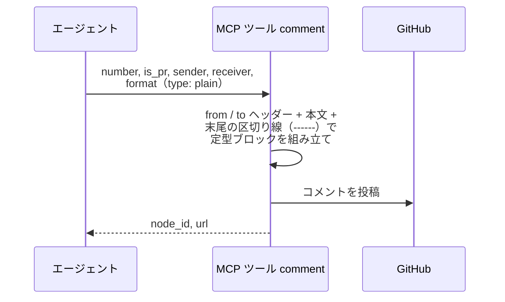
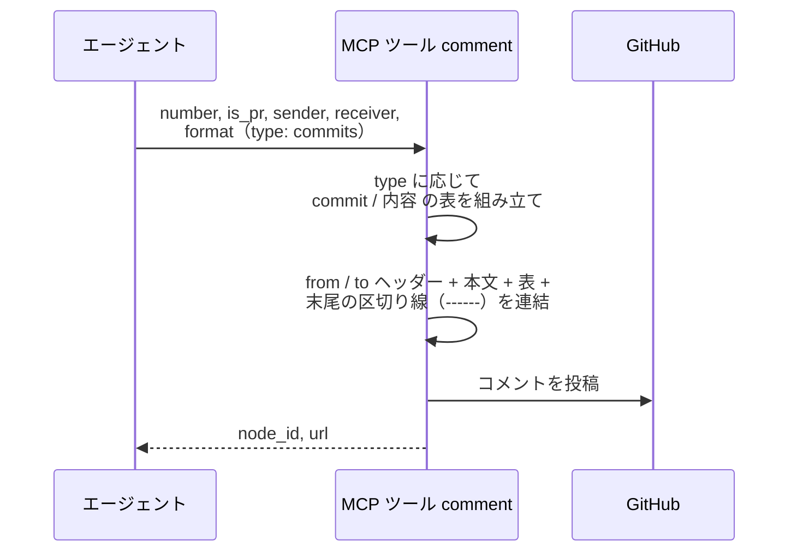
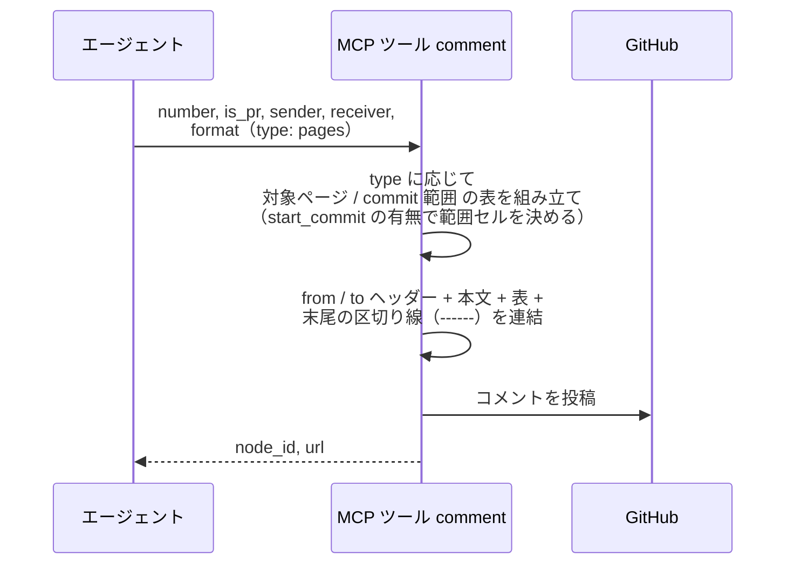
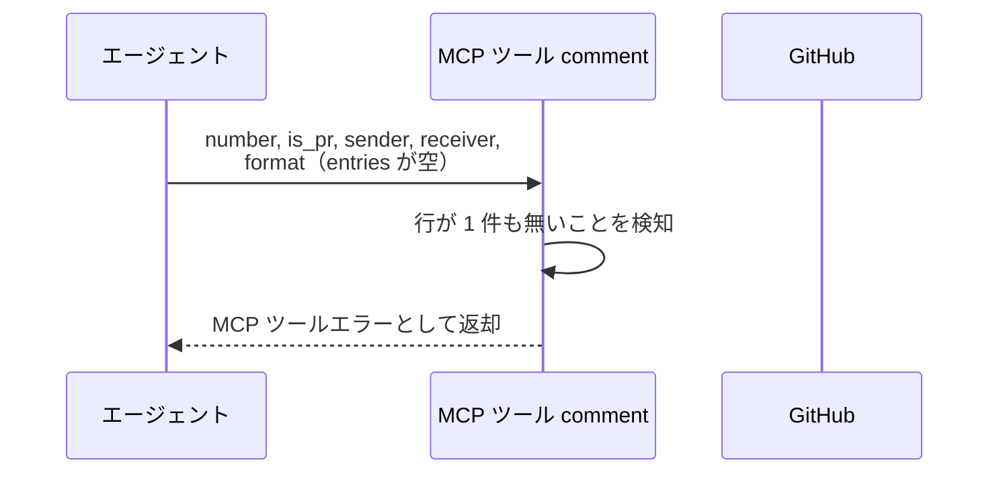
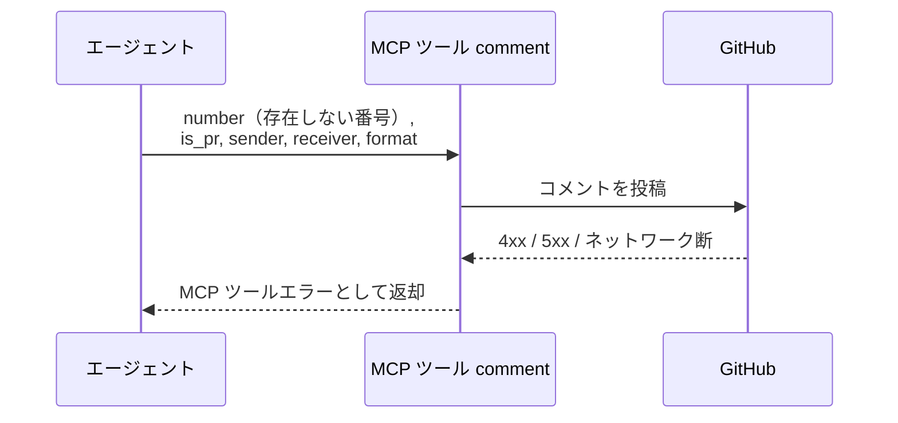

# コメント投稿

MCP ツール: `comment`

Issue / PR に定型フォーマット（`> from: @{送信者}` + `> to: @{宛先}` + 本文 + 末尾の区切り線）でコメントを投稿する。

- 対応テストファイル: `tests/integration/mcp/test_comment.py`

## インターフェース

### リクエスト

| パラメータ | 型 | 必須 | デフォルト | 説明 | 制限 | 補足 |
| --- | --- | --- | --- | --- | --- | --- |
| `number` | int | ✅ | - | 対象の Issue / PR 番号 | - | - |
| `is_pr` | bool | ✅ | - | PR なら `True` | - | 投稿 API は Issue / PR 共通 |
| `sender` | str | ✅ | - | 送信者のエージェント名（`> from: @sender` 行になる） | - | `@` は不要（自動付与） |
| `receiver` | str | - | なし（to 行なし = 現担当宛） | 宛先名（`> to: @receiver` 行になる） | - | `list_comments` の宛先判定に使われる |
| `format` | object | ✅ | - | 本文の構成 | - | `type` で構成が決まる判別可能ユニオン |
| `format.type` | `"plain"` \| `"commits"` \| `"pages"` | ✅ | - | 本文の形式 | - | `type` により以降のフィールドが変わる |

`format.type` ごとのフィールド:

| type | フィールド | 型 | 必須 | 説明 | 補足 |
| --- | --- | --- | --- | --- | --- |
| `plain` | `body` | str | ✅ | 本文 | Markdown 可 |
| `commits` | `body` | str | ✅ | 表の前に置く本文 | - |
| `commits` | `entries` | object[] | ✅ | commit 表の行（1 件以上・渡した順） | - |
| `commits` | `entries[].commit` | str | ✅ | commit ID | 短縮 SHA |
| `commits` | `entries[].summary` | str | ✅ | その commit で何をしたか | 1 行 |
| `pages` | `body` | str | ✅ | 表の前に置く本文 | - |
| `pages` | `entries` | object[] | ✅ | ページ範囲表の行（1 件以上・渡した順） | - |
| `pages` | `entries[].page` | str | ✅ | 対象ページのパス | リポジトリルートからの相対パス |
| `pages` | `entries[].start_commit` | str | - | 範囲の起点になる commit ID | 省略時は単一 commit |
| `pages` | `entries[].commit` | str | ✅ | そのページを最後に更新した commit ID | - |

新しい形式が必要になったら `type` を足す（本文が 2 つ・表が 2 つ といった構成も `type` 側で表現する）。

リクエスト例（本文のみ）:

```json
{
  "number": 40,
  "is_pr": true,
  "sender": "architect",
  "receiver": "implementer",
  "format": {
    "type": "plain",
    "body": "戻り値が `User | null` です。L42 に null チェックを追加してください。"
  }
}
```

リクエスト例（commit 表付き）:

```json
{
  "number": 40,
  "is_pr": true,
  "sender": "tester",
  "receiver": "architect",
  "format": {
    "type": "commits",
    "body": "テスト作成が完了しました。",
    "entries": [
      { "commit": "a1b2c3d", "summary": "ユーザー編集の結合テストを追加" }
    ]
  }
}
```

リクエスト例（ページ範囲表付き）:

```json
{
  "number": 40,
  "is_pr": true,
  "sender": "architect",
  "receiver": "tester",
  "format": {
    "type": "pages",
    "body": "以下の設計でテストを作成してください。",
    "entries": [
      { "page": "docs/wiki/設計図/インターフェース定義/バックエンド/ユーザー登録.py.md", "commit": "a1b2c3d" },
      { "page": "docs/wiki/設計図/モジュール構成/バックエンド/ユーザー.py.md", "start_commit": "e4f5g6h", "commit": "i7j8k9l" }
    ]
  }
}
```

### レスポンス

| フィールド | 型 | 説明 | 制限 | 補足 |
| --- | --- | --- | --- | --- |
| `node_id` | str | 投稿コメントの GraphQL node_id | - | Resolve / 返信の対象指定に使う |
| `url` | str | コメントの html URL | - | - |

レスポンス例:

```json
{
  "node_id": "IC_kwDOAbc123xyz",
  "url": "https://github.com/{owner}/{repo}/pull/40#issuecomment-123456"
}
```

## 制約

| 項目 | 制約 | 補足 |
| --- | --- | --- |
| タイムアウト | 制限なし | - |
| 表の書式 | `format.type` ごとに列とセルの装飾が決まる | 呼び出し元は素の値を渡し、Markdown を組み立てない |

## フロー一覧

| 分類 | フロー名 | 概要 | 補足 |
| --- | --- | --- | --- |
| 正常 | 正常系 | 定型ブロック組み立て → REST 投稿 | `type: "plain"` |
| 正常 | 正常系（commit 表付き） | `commit` / `内容` の表を本文末尾に足して投稿 | 完了報告 |
| 正常 | 正常系（ページ範囲表付き） | `対象ページ` / `commit 範囲` の表を本文末尾に足して投稿 | 割り当て |
| 異常 | 異常系（entries が空） | 表を持つ `type` で行が 1 件も無い | 呼び出し側の誤り |
| 異常 | 異常系（API エラー） | 認証切れ / 対象不存在 / ネットワーク断 | - |

## 正常系

### セットアップ

| セットアップ | 説明 | 補足 |
| --- | --- | --- |
| Mock | GitHub API を差し替え（正常応答を返す） | - |
| 対象 Issue / PR | sandbox に open の対象が存在 | 番号を入力に使う |

### フロー



### 期待値

- 対象にコメントが 1 件追加され、本文が定型ブロック（`> from: @sender` + `> to: @receiver` + 本文 + 末尾の `------`）になっている
- 本文が `------` と空行で終わっている（ユーザーがそのまま書き足せる状態）
- 戻り値の `node_id` / `url` が追加されたコメントを指している

## 正常系（commit 表付き）

### セットアップ

| セットアップ | 説明 | 補足 |
| --- | --- | --- |
| Mock | GitHub API を差し替え（正常応答を返す） | - |
| 対象 Issue / PR | sandbox に open の対象が存在 | - |
| 入力 | `format` に `type: "commits"` と 2 件の entries を指定 | 表の組み立てを誘発 |

### フロー



### 期待値

- 本文の末尾（区切り線の手前）に `| commit | 内容 |` の表が入っている
- 表の行が `entries` の順に並び、commit ID がバッククォートで囲まれている
- 本文が `------` と空行で終わっている

## 正常系（ページ範囲表付き）

### セットアップ

| セットアップ | 説明 | 補足 |
| --- | --- | --- |
| Mock | GitHub API を差し替え（正常応答を返す） | - |
| 対象 Issue / PR | sandbox に open の対象が存在 | - |
| 入力 | `format` に `type: "pages"` と、`start_commit` ありの行・なしの行を 1 件ずつ指定 | 両方の範囲表現を誘発 |

### フロー



### 期待値

- 本文の末尾（区切り線の手前）に `| 対象ページ | commit 範囲 |` の表が入っている
- `start_commit` を渡した行の範囲セルが `start_commit..commit`、渡さなかった行が `commit` 単体になっている
- ページ・commit 範囲がバッククォートで囲まれている

## 異常系（entries が空）

### セットアップ

| セットアップ | 説明 | 補足 |
| --- | --- | --- |
| Mock | GitHub API を差し替え（正常応答を返す） | - |
| 入力 | `format` の `entries` に空配列を指定して呼び出す | エラーを決定的に誘発 |

### フロー



### 期待値

- MCP ツールエラーが返る（1 件以上必要である旨を含む）
- コメントが投稿されていない

## 異常系（API エラー）

### セットアップ

| セットアップ | 説明 | 補足 |
| --- | --- | --- |
| Mock | GitHub API を差し替え（4xx / 5xx を返す） | - |
| 対象番号 | 存在しない番号を指定して呼び出す | API エラーを決定的に誘発 |

### フロー



### 期待値

- MCP ツールエラーが返る（HTTP ステータスと本文を含む）
- コメントは追加されていない
