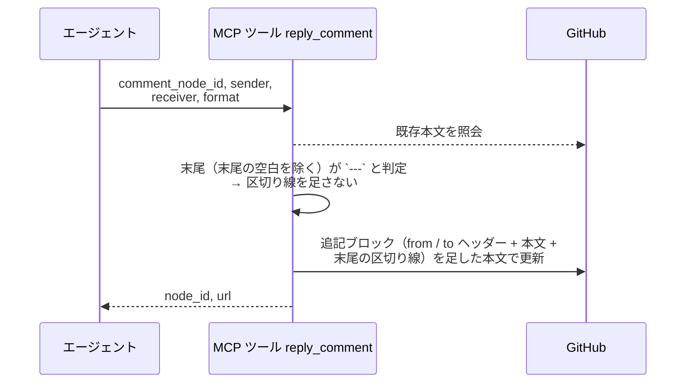
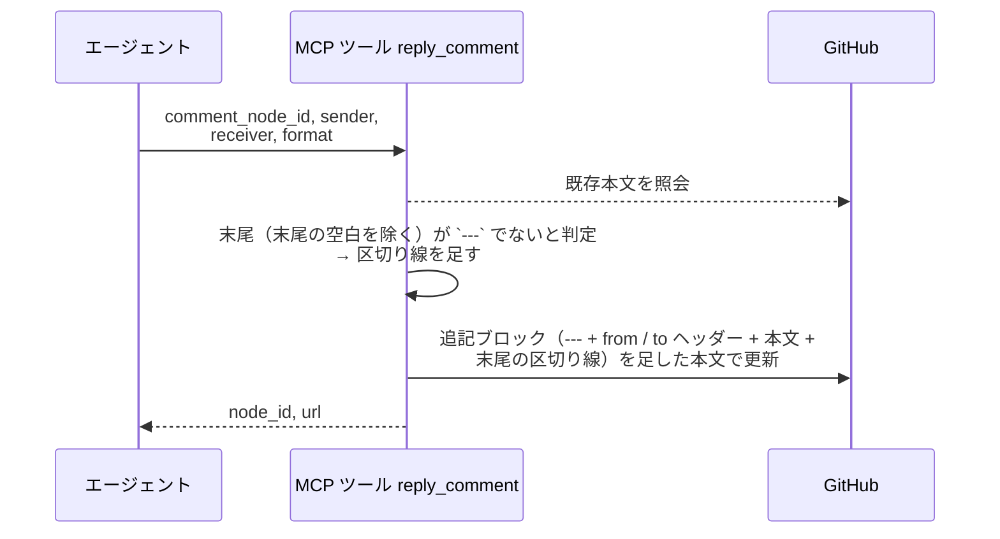
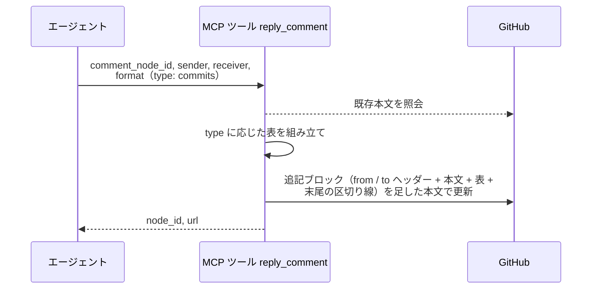
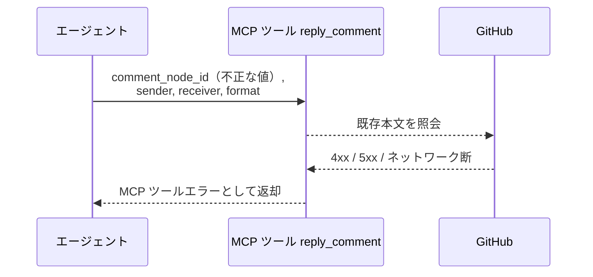
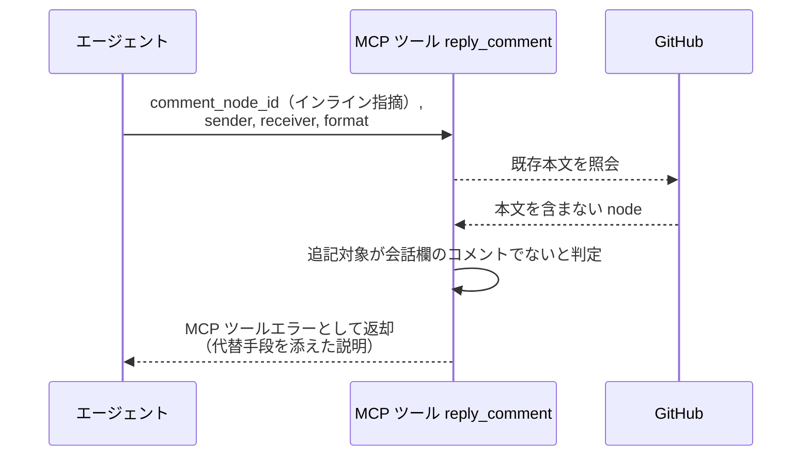

# コメント返信

MCP ツール: `reply_comment`

既存コメントに `---` 区切りで定型ブロックを追記する。
「1 つのコメント内で議論を続ける（返信は同一コメントに追記）」というコメント規約の実体で、対応依頼・修正完了・再開指示などのスレッド往復はすべてこのツールを通る。
追記ブロックの末尾にも `---` と空行を置き、ユーザーがそのまま書き足せる状態で返す。
本文の構成は `format` の `type` で決まる（コメント投稿と共通）。

- 対応テストファイル: `tests/integration/mcp/test_reply_comment.py`

## インターフェース

### リクエスト

| パラメータ | 型 | 必須 | デフォルト | 説明 | 制限 | 補足 |
| --- | --- | --- | --- | --- | --- | --- |
| `comment_node_id` | str | ✅ | - | 追記対象コメントの GraphQL node_id | - | `get_issue_or_pr` / `list_comments` で取得 |
| `sender` | str | ✅ | - | 送信者のエージェント名 | - | `@` は不要 |
| `receiver` | str | - | なし（to 行なし = 現担当宛） | 宛先名 | - | `@` は不要 |
| `format` | object | ✅ | - | 追記ブロックの構成 | - | コメント投稿と同じ判別可能ユニオン（`type` で `plain` / `commits` / `pages`） |

リクエスト例（本文のみ）:

```json
{
  "comment_node_id": "IC_kwDOAbc123xyz",
  "sender": "architect",
  "receiver": "tester",
  "format": {
    "type": "plain",
    "body": "異常系ケースの欠落を指摘しました。修正後に同スレッドへ返信してください。"
  }
}
```

リクエスト例（commit 表付き）:

```json
{
  "comment_node_id": "IC_kwDOAbc123xyz",
  "sender": "tester",
  "receiver": "architect",
  "format": {
    "type": "commits",
    "body": "指摘 3 件に対応しました。",
    "entries": [
      { "commit": "a1b2c3d", "summary": "異常系ケースを追加" }
    ]
  }
}
```

### レスポンス

| フィールド | 型 | 説明 | 制限 | 補足 |
| --- | --- | --- | --- | --- |
| `node_id` | str | 追記先コメントの GraphQL node_id | - | 追記なので元コメントと同じ id |
| `url` | str | コメントの html URL | - | - |

レスポンス例:

```json
{
  "node_id": "IC_kwDOAbc123xyz",
  "url": "https://github.com/{owner}/{repo}/pull/52#issuecomment-123456"
}
```

## 制約

| 項目 | 制約 | 補足 |
| --- | --- | --- |
| タイムアウト | 制限なし | - |

## フロー一覧

| 分類 | フロー名 | 概要 | 補足 |
| --- | --- | --- | --- |
| 正常 | 正常系（既存本文が区切り線で終わっている） | 既存本文取得 → 区切り線を足さずに追記 → 本文更新 mutation | 本ツールが投稿したコメントへの追記 |
| 正常 | 正常系（既存本文が区切り線で終わっていない） | 既存本文取得 → 区切り線を足して追記 → 本文更新 mutation | ユーザーが書き足したコメントへの追記 |
| 正常 | 正常系（表付き） | `format.type` に応じた表を追記ブロックの末尾に足す | 完了報告・修正報告 |
| 異常 | 異常系（API エラー） | 認証切れ / node_id 不正 / ネットワーク断 | - |
| 異常 | 異常系（会話欄のコメント以外の node_id） | 照会は成功するが本文を取れないため追記せずエラーにする | インライン指摘（`PRRC_` 始まり）を渡した場合 |

## 正常系（既存本文が区切り線で終わっている）

### セットアップ

| セットアップ | 説明 | 補足 |
| --- | --- | --- |
| Mock | GitHub API を差し替え（正常応答を返す） | - |
| 追記対象コメント | 末尾が `---` の定型ブロックのコメントが投稿済み | `node_id` を入力に使う |

### フロー



### 期待値

- 元コメントの末尾に from / to ヘッダー付きの追記ブロックが足されている
- 追記の境目に `---` が 1 本だけ存在する（既存の末尾の区切り線がそのまま境目になる）
- 更新後の本文が `---` と空行で終わっている
- 既存本文は変化していない

## 正常系（既存本文が区切り線で終わっていない）

### セットアップ

| セットアップ | 説明 | 補足 |
| --- | --- | --- |
| Mock | GitHub API を差し替え（正常応答を返す） | - |
| 追記対象コメント | 末尾が `---` でないコメントが投稿済み | ユーザーが区切り線の後に書き足した状態を想定 |

### フロー



### 期待値

- 元コメントの末尾に `---` 区切り + from / to ヘッダー付きの追記ブロックが足されている
- 更新後の本文が `---` と空行で終わっている
- 既存本文は変化していない

## 正常系（表付き）

### セットアップ

| セットアップ | 説明 | 補足 |
| --- | --- | --- |
| Mock | GitHub API を差し替え（正常応答を返す） | - |
| 追記対象コメント | 末尾が `---` の定型ブロックのコメントが投稿済み | - |
| 入力 | `format` に `type: "commits"` と 2 件の entries を指定 | 表の組み立てを誘発 |

### フロー



### 期待値

- 追記ブロックの末尾（区切り線の手前）に `format.type` に対応する表が入っている
- 表の書式が コメント投稿 と同一（列名・セルの装飾・行順）
- 更新後の本文が `---` と空行で終わっている

## 異常系（API エラー）

### セットアップ

| セットアップ | 説明 | 補足 |
| --- | --- | --- |
| Mock | GitHub API を差し替え（4xx / 5xx を返す） | - |
| 入力 | 不正な `comment_node_id` を指定して呼び出す | API エラーを決定的に誘発 |

### フロー



### 期待値

- MCP ツールエラーが返る（HTTP ステータスと本文を含む）
- コメントは変化していない

## 異常系（会話欄のコメント以外の node_id）

### セットアップ

| セットアップ | 説明 | 補足 |
| --- | --- | --- |
| Mock | GitHub API を差し替え（照会は成功し、本文を含まない node を返す） | インライン指摘の node を渡した状態を再現 |
| 入力 | インライン指摘の `node_id`（`PRRC_` 始まり）を指定して呼び出す | 本文を取れない経路を決定的に誘発 |

### フロー



### 期待値

- MCP ツールエラーが返り、メッセージに対象の node_id と代替手段（インライン指摘は新規投稿で行う）が含まれる
- 本文更新の API が呼ばれていない
