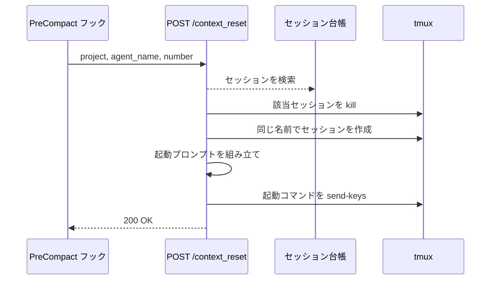
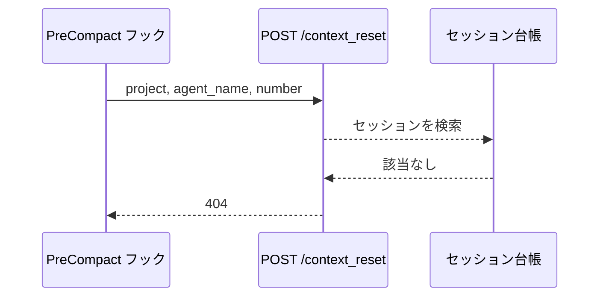

# コンテキストリセット

エンドポイント: POST /context_reset
送信元: Claude Code の `PreCompact` フック（コンパクト自体はフックがブロックする）

エージェントのコンテキストが上限に達したことを受け取り、その tmux セッションを同じ名前で作り直して起動時と同じプロンプトで claude を立ち上げ直す。

- 対応テストファイル: `tests/integration/monitor/test_コンテキストリセット.py`

## インターフェース

### リクエスト

| パラメータ | 型 | 必須 | デフォルト | 説明 | 制限 | 補足 |
| --- | --- | --- | --- | --- | --- | --- |
| `project` | str | ✅ | - | 監視対象プロジェクト名 | 設定に登録済みの名前 | 環境変数 `AI_MONITOR_PROJECT` の値 |
| `agent_name` | str | ✅ | - | エージェント名 | - | 環境変数 `AI_MONITOR_AGENT` の値 |
| `number` | int | ✅ | - | セッションの主番号 | - | 環境変数 `AI_MONITOR_NUMBER` の値 |

リクエスト例:

```json
{
  "project": "sandbox",
  "agent_name": "subsystem-conductor",
  "number": 170
}
```

### レスポンス

| フィールド | 型 | 説明 | 制限 | 補足 |
| --- | --- | --- | --- | --- |
| `ok` | bool | リセットを受理したか | - | 失敗はステータスコードで表現する |

レスポンス例:

```json
{ "ok": true }
```

### ステータスコード

| ステータスコード | 発生条件 | 補足 |
| --- | --- | --- |
| `200` | リセットを受理した | - |
| `404` | 台帳に該当セッションが無い | 解放済みのセッションからの通知 |
| `422` | リクエストの型不一致 | FastAPI のバリデーション |

## 制約

| 項目 | 制約 | 補足 |
| --- | --- | --- |
| 待受 | `127.0.0.1` のみ | ポートは設定 `port` |
| 実行順序 | kill → 同名で create → 起動コマンドの送信 | 稼働中のセッションへキー操作で `/clear` を通す方法は取らない（処理中の入力は queue に積まれ、効き方が端末アプリの実装に依存する） |
| ルーティング | MCP のルートマウントより先に登録する | MCP は `/` にマウントされるため、後だと本エンドポイントに到達しない |
| タイムアウト | 制限なし | フック側の既定は 600 秒 |

## フロー一覧

| 分類 | フロー名 | 概要 | 補足 |
| --- | --- | --- | --- |
| 正常 | 正常系 | 要求の受理 → セッション再作成 + 起動プロンプト送信 | - |
| 異常 | 異常系（セッション不明） | 台帳に無いセッションからの要求を拒否 | 解放済みセッションの取りこぼし |

## 正常系

### セットアップ

| セットアップ | 説明 | 補足 |
| --- | --- | --- |
| Mock | tmux を差し替え | 送信内容の検証用 |
| 台帳 | `project` / `agent_name` / `number` のセッションが登録済み | - |
| フェーズ設定 | 当該エージェントのフェーズ一覧が YAML に登録済み | 起動プロンプトの元 |

### フロー



### 期待値

- 該当セッションが kill された後に同じ名前で作成され、フェーズ + 参考資料 + Wiki 索引を追記システムプロンプトに載せて claude が起動されている
- `200` + `{"ok": true}` が返る

## 異常系（セッション不明）

### セットアップ

| セットアップ | 説明 | 補足 |
| --- | --- | --- |
| Mock | tmux を差し替え | 送信の有無の検証用 |
| 台帳 | 該当セッションが未登録 | 拒否を決定的に誘発 |

### フロー



### 期待値

- `404` が返る
- tmux への送信が発生していない
