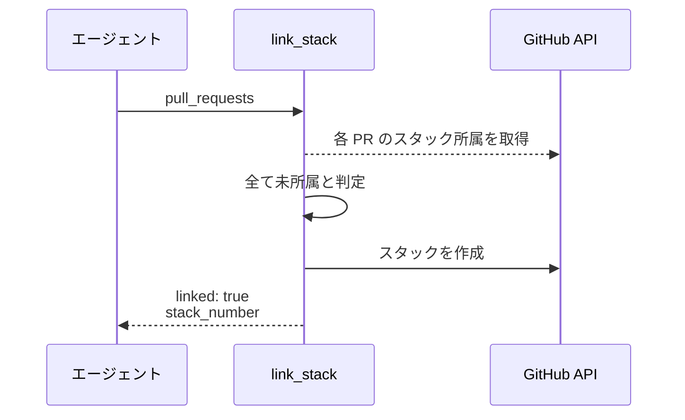
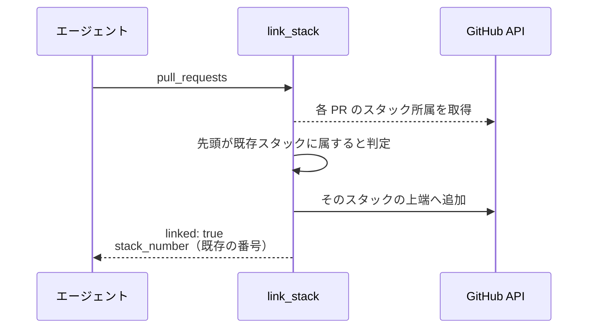
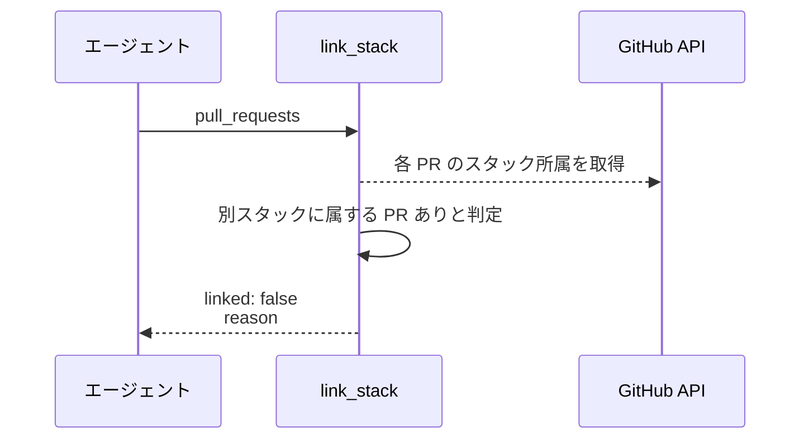
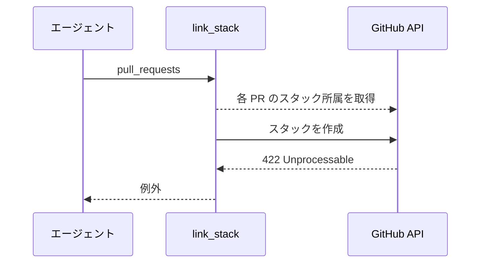

# スタック接続

MCP ツール: `link_stack`

複数の PR を GitHub の Stacked Pull Requests として繋ぎ、階層と着手順を GitHub 上で辿れるようにする。

- 対応テストファイル: `tests/integration/mcp/test_スタック接続.py`

## インターフェース

### リクエスト

| パラメータ | 型 | 必須 | デフォルト | 説明 | 制限 | 補足 |
| --- | --- | --- | --- | --- | --- | --- |
| `pull_requests` | int[] | ✅ | - | 下から上の順に並べた PR 番号 | 2 件以上 | 各 PR の base ref が直前の PR の head ref と一致していること |

リクエスト例:

```json
{
  "pull_requests": [120, 121, 122]
}
```

### レスポンス

| フィールド | 型 | 説明 | 制限 | 補足 |
| --- | --- | --- | --- | --- |
| `linked` | bool | スタックに繋がったか | - | 制約で繋げなかった場合は `false` |
| `stack_number` | int \| null | 接続後のスタック番号 | - | `linked` が `false` のときは `null` |
| `reason` | str \| null | 繋げなかった理由 | - | `linked` が `true` のときは `null` |

レスポンス例:

```json
{
  "linked": true,
  "stack_number": 123,
  "reason": null
}
```

**補足:**

- 既に同じ並びで繋がっている PR 群を渡しても増えない（冪等）
- 繋げなかった場合もエラーにせず `linked: false` と理由を返す。スタックは階層の表示手段であって進行の条件ではないため、呼び出し側は結果を見て分岐しない

## 制約

| 項目 | 制約 | 補足 |
| --- | --- | --- |
| タイムアウト | 制限なし | - |
| 対象 | 同一リポジトリの PR のみ | cross-fork のスタックは GitHub 側が非対応 |
| 所属 | 1 つの PR が属せるスタックは 1 つだけ | 既に別スタックに属する PR を含む場合は繋がず `linked: false` を返す |
| 並び | 線形（下から上への一本道）のみ | 木構造は表現できない |
| base の保持 | 各 PR の base ref を書き換えない | `gh stack link` は底の base をデフォルトブランチへ書き換えるため使わず、REST API を直接呼ぶ |

## フロー一覧

| 分類 | フロー名 | 概要 | 補足 |
| --- | --- | --- | --- |
| 正常 | 正常系 | 新しいスタックを作って PR を繋ぐ | - |
| 正常 | 正常系（既存スタックへの追加） | 既存スタックの上端へ積む | 底の PR が既にスタックに属している場合 |
| 正常 | 正常系（繋げない） | 制約に触れるため繋がずに返す | 分岐点の 2 本目など |
| 異常 | 異常系（API エラー） | PR 不存在 / 権限不足 | - |

## 正常系

### セットアップ

| セットアップ | 説明 | 補足 |
| --- | --- | --- |
| Mock | GitHub API を差し替え（正常応答を返す） | - |
| 対象 PR | base が連鎖する 2 件が open で存在し、どちらもスタック未所属 | - |

### フロー



### 期待値

- 新しいスタックが作成され、渡した順で PR が並んでいる
- 各 PR の base ref が呼び出し前と変わっていない
- `linked: true` とスタック番号が返る

## 正常系（既存スタックへの追加）

### セットアップ

| セットアップ | 説明 | 補足 |
| --- | --- | --- |
| Mock | GitHub API を差し替え（正常応答を返す） | - |
| 対象 PR | 先頭の PR が既存スタックに属しており、残りは未所属 | 追加の分岐を決定的に誘発 |

### フロー



### 期待値

- 既存スタックの上端に PR が積まれている
- 既にスタックにあった PR が外れていない
- 返る `stack_number` が既存スタックの番号と一致する

## 正常系（繋げない）

### セットアップ

| セットアップ | 説明 | 補足 |
| --- | --- | --- |
| Mock | GitHub API を差し替え（正常応答を返す） | - |
| 対象 PR | 渡した PR のうち 1 件が別のスタックに属している | 制約違反を決定的に誘発 |

### フロー



### 期待値

- スタックの作成も追加も行われていない
- 各 PR の所属と base ref が変わっていない
- `linked: false` と理由が返る（例外を投げない）

## 異常系（API エラー）

### セットアップ

| セットアップ | 説明 | 補足 |
| --- | --- | --- |
| Mock | GitHub API がスタック作成で 422 を返す | base ref の連鎖が繋がっていない状態 |
| 対象 PR | base が連鎖していない 2 件 | 失敗を決定的に誘発 |

### フロー



### 期待値

- 例外が送出される
- スタックが作成されていない
