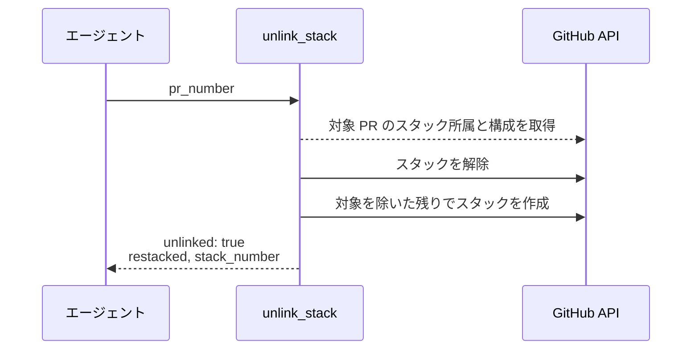
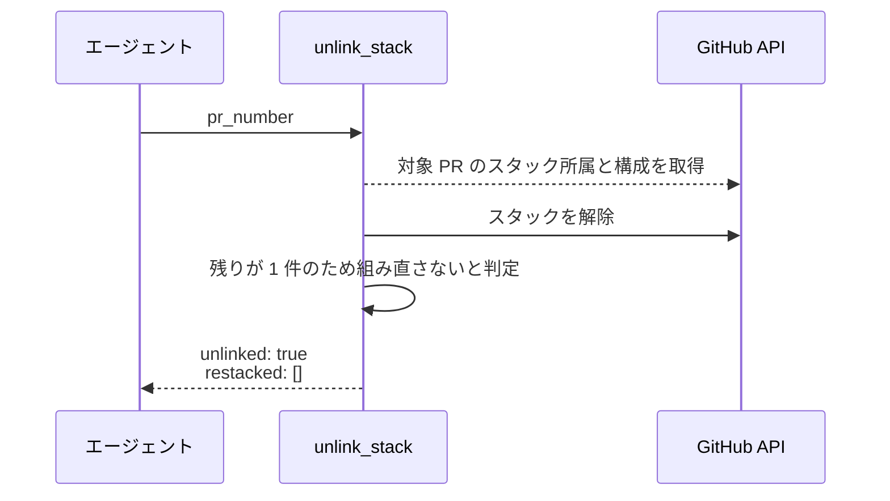
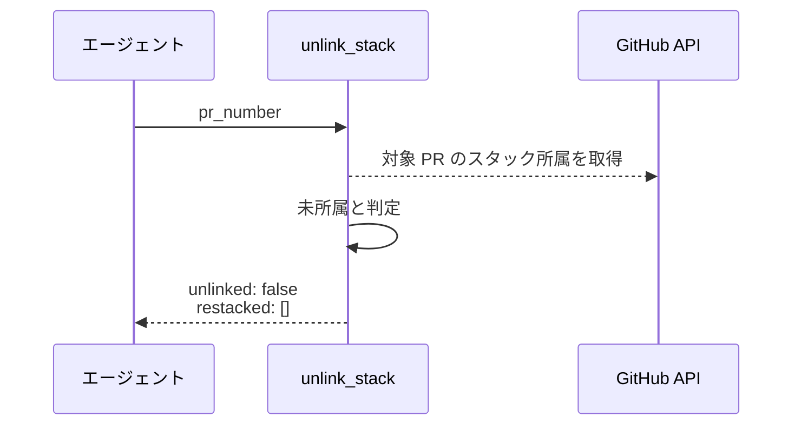
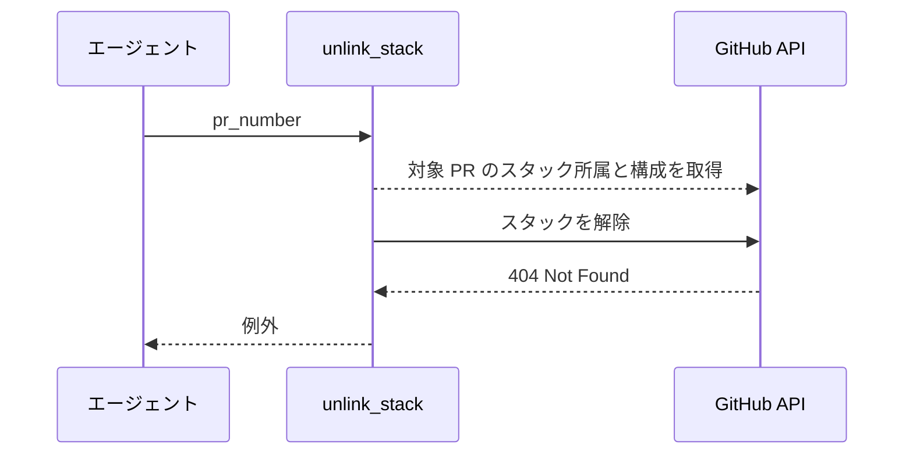

# スタック解除

MCP ツール: `unlink_stack`

マージ前の PR をスタックから外し、残りの PR を元の並びで組み直す。

- 対応テストファイル: `tests/integration/mcp/test_スタック解除.py`

## インターフェース

### リクエスト

| パラメータ | 型 | 必須 | デフォルト | 説明 | 制限 | 補足 |
| --- | --- | --- | --- | --- | --- | --- |
| `pr_number` | int | ✅ | - | スタックから外す PR 番号 | - | スタック未所属でもエラーにしない |

リクエスト例:

```json
{
  "pr_number": 122
}
```

### レスポンス

| フィールド | 型 | 説明 | 制限 | 補足 |
| --- | --- | --- | --- | --- |
| `unlinked` | bool | スタックから外したか | - | 未所属だった場合は `false` |
| `restacked` | int[] | 組み直した後のスタックを構成する PR 番号 | - | 残りが 1 件以下なら空配列 |
| `stack_number` | int \| null | 組み直した後のスタック番号 | - | 組み直さなかった場合は `null` |

レスポンス例:

```json
{
  "unlinked": true,
  "restacked": [120, 121],
  "stack_number": 124
}
```

**補足:**

- GitHub の unstack は 1 件指定でもスタック全体が解散するため、対象を除いた残りをこのツールの中で組み直す
- 組み直し後のスタック番号は解散前と変わる
- スタックに属していない PR を渡しても例外にせず `unlinked: false` を返す（マージ手順から無条件に呼べるようにするため）

## 制約

| 項目 | 制約 | 補足 |
| --- | --- | --- |
| タイムアウト | 制限なし | - |
| 解除の単位 | GitHub 側はスタック全体でしか解除できない | 残りの組み直しをツール内で補う |
| base の保持 | 解除でも組み直しでも base ref を書き換えない | 解除後に base が変わるとマージ先が壊れる |
| 組み直しの下限 | 残りが 1 件以下ならスタックを作らない | スタックは 2 件以上必要 |

## フロー一覧

| 分類 | フロー名 | 概要 | 補足 |
| --- | --- | --- | --- |
| 正常 | 正常系 | 対象を外して残りを組み直す | 残り 2 件以上 |
| 正常 | 正常系（残りが 1 件） | 対象を外し、組み直さずに終わる | - |
| 正常 | 正常系（スタック未所属） | 何もせずに返す | - |
| 異常 | 異常系（API エラー） | PR 不存在 / 権限不足 | - |

## 正常系

### セットアップ

| セットアップ | 説明 | 補足 |
| --- | --- | --- |
| Mock | GitHub API を差し替え（正常応答を返す） | - |
| 対象 PR | 3 件のスタックの上端に属している | 組み直しが走る条件 |

### フロー



### 期待値

- 対象 PR がどのスタックにも属していない
- 残りの PR が元の並びで新しいスタックを構成している
- 全 PR の base ref が呼び出し前と変わっていない

## 正常系（残りが 1 件）

### セットアップ

| セットアップ | 説明 | 補足 |
| --- | --- | --- |
| Mock | GitHub API を差し替え（正常応答を返す） | - |
| 対象 PR | 2 件のスタックの上端に属している | 組み直しをしない分岐を決定的に誘発 |

### フロー



### 期待値

- どちらの PR もスタックに属していない
- 新しいスタックが作成されていない
- `restacked` が空配列で返る

## 正常系（スタック未所属）

### セットアップ

| セットアップ | 説明 | 補足 |
| --- | --- | --- |
| Mock | GitHub API を差し替え（正常応答を返す） | - |
| 対象 PR | どのスタックにも属していない | - |

### フロー



### 期待値

- GitHub への解除・作成の呼び出しが行われていない
- `unlinked: false` が返る（例外を投げない）

## 異常系（API エラー）

### セットアップ

| セットアップ | 説明 | 補足 |
| --- | --- | --- |
| Mock | GitHub API がスタック解除で 404 を返す | 解散済みのスタック番号を指す状態 |
| 対象 PR | 解散済みのスタックに属していると見える | 失敗を決定的に誘発 |

### フロー



### 期待値

- 例外が送出される
- 組み直しの呼び出しが行われていない
