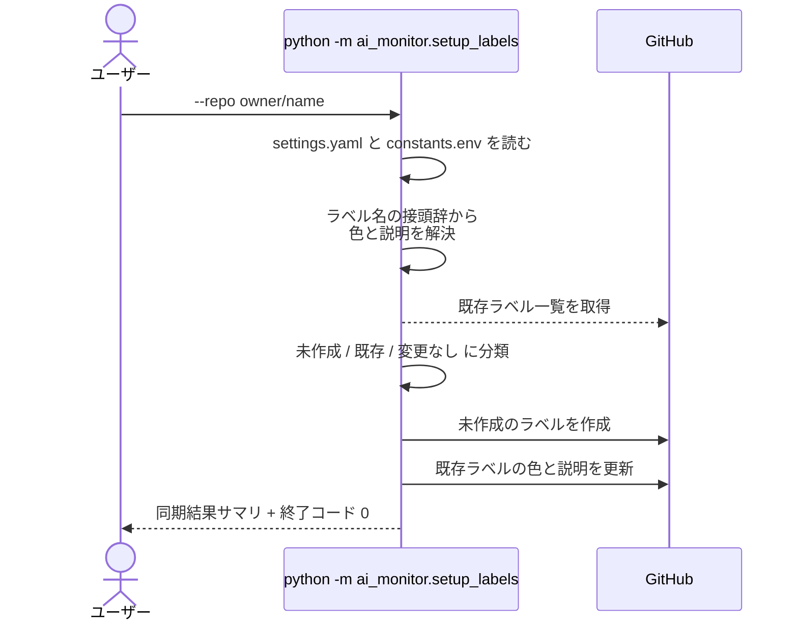
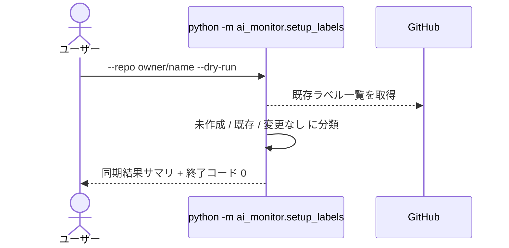
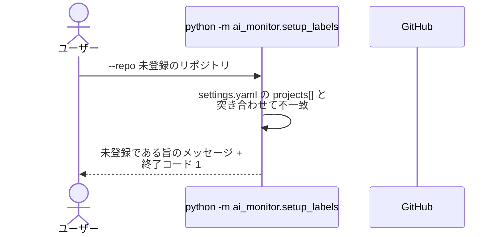
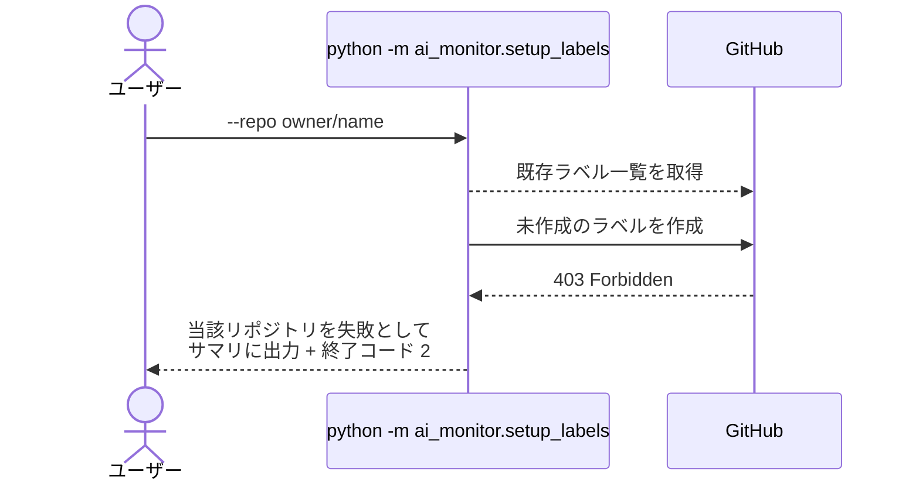
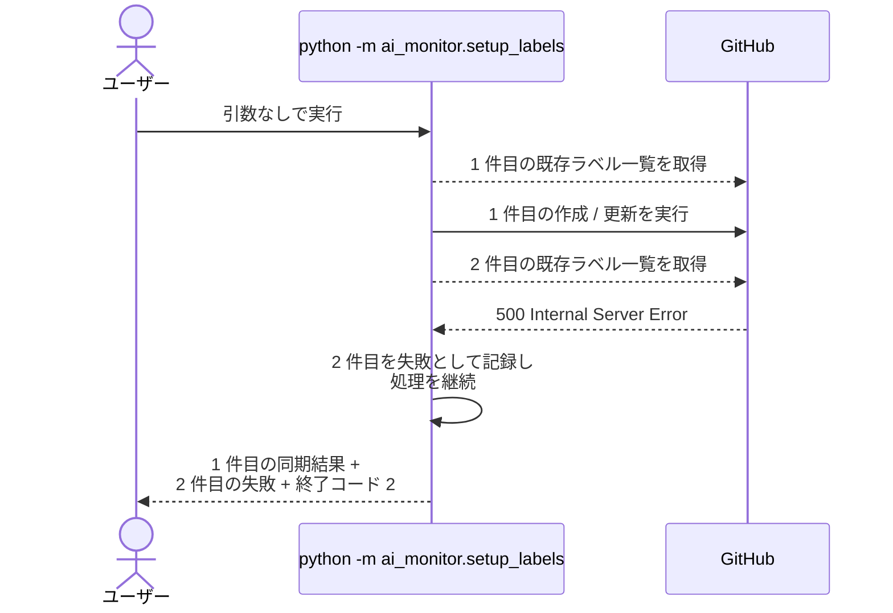

# ラベル一括作成

CLI: `python -m ai_monitor.setup_labels`

`constants.env` が持つ全ラベルを、監視対象リポジトリに作成 / 更新する。

- 対応テストファイル: `tests/integration/setup/test_setup_labels.py`

## インターフェース

### リクエスト

| パラメータ | 型 | 必須 | デフォルト | 説明 | 制限 | 補足 |
| --- | --- | --- | --- | --- | --- | --- |
| `--repo` | str | - | `settings.yaml` の `projects[]` 全件 | 対象リポジトリ（`owner/name`） | `projects[]` に登録済みのリポジトリのみ | 複数指定不可 |
| `--dry-run` | bool | - | `False` | 作成 / 更新の内容を出力するだけで API を呼ばない | - | 差分確認用 |

リクエスト例:

```bash
python -m ai_monitor.setup_labels --repo shuhei1101/ai-monitor
```

### レスポンス

| フィールド | 型 | 説明 | 制限 | 補足 |
| --- | --- | --- | --- | --- |
| 標準出力 | str | リポジトリごとの同期結果サマリ | - | 作成 / 更新 / 変更なし の 3 分類で件数と名前を出す |

レスポンス例:

```text
shuhei1101/ai-monitor: 作成 2 / 更新 1 / 変更なし 40
  作成: 確認:reverse-architect, 処理中:reverse-architect
  更新: 議論中
shuhei1101/aituber: 失敗（403 Forbidden）
```

### 終了コード

| 終了コード | 発生条件 | 補足 |
| --- | --- | --- |
| `0` | 全対象リポジトリの同期が成功 | - |
| `1` | 設定の読み込みに失敗 / `--repo` が `projects[]` に未登録 | 1 件も API を呼ばずに終了 |
| `2` | 1 件以上のリポジトリで GitHub API の呼び出しに失敗 | 失敗したリポジトリを飛ばして残りは実行済み。サマリに失敗として出る |

## 制約

| 項目 | 制約 | 補足 |
| --- | --- | --- |
| タイムアウト | 制限なし | - |
| 認可 | `github_token` に対象リポジトリの Issues 書き込み権限が必要 | 不足時は 異常系（権限不足） |
| 削除 | 行わない | `constants.env` から消えたラベルも GitHub 側には残す（付与済みの Issue / PR を壊さないため） |
| 失敗の波及 | リポジトリ単位で切り離す | 1 件が失敗しても残りのリポジトリは実行する（1 リポジトリの接続不具合で全体を止めない） |
| 対象ラベル | `constants.env` の `AI_MONITOR_LABEL_` で始まるキーの値 | `_COLOR_` / `_DESC_` を含むキー（体裁の定義）と `_PREFIX` で終わるキー（`確認:` / `処理中:` の接頭辞そのもの）は対象外 |
| 色と説明の解決 | ラベル名の接頭辞で引く | `確認:` / `処理中:` / `layer:` / `type:` / `優先度:` と、接頭辞を持たない `議論中` / `リバースエンジニアリング` |
| scope | 対象外 | プロジェクトごとに値が違うため、必要になった時点でラベル作成ツールが作る |

## フロー一覧

| 分類 | フロー名 | 概要 | 補足 |
| --- | --- | --- | --- |
| 正常 | 正常系 | 未作成は作成、既存は色 / 説明を更新 | - |
| 正常 | 正常系（`--dry-run` 指定時） | 差分を出力して API を呼ばずに終了 | - |
| 異常 | 異常系（未登録リポジトリ・終了コード 1） | `--repo` が `projects[]` にない | - |
| 異常 | 異常系（権限不足・終了コード 2） | トークンに Issues 書き込み権限がない | 対象 1 件のみのケース |
| 異常 | 異常系（一部リポジトリの失敗・終了コード 2） | 複数対象のうち 1 件が失敗し、残りは成功する | 失敗の切り離しの確認 |

## 正常系

### セットアップ

| セットアップ | 説明 | 補足 |
| --- | --- | --- |
| Mock | GitHub API を差し替え（正常応答を返す） | - |
| 設定 | `projects[]` に対象リポジトリを 1 件登録済み | - |
| 既存ラベル | `議論中` のみが別の色で存在する | 作成と更新の両方を 1 回で誘発する |

### フロー



### 期待値

- `constants.env` の全ラベルがリポジトリに存在している
- 既存の `議論中` の色が `constants.env` の定義値に更新されている
- 標準出力に 作成 / 更新 / 変更なし の件数と名前が出ている
- 終了コードが `0`

## 正常系（`--dry-run` 指定時）

### セットアップ

| セットアップ | 説明 | 補足 |
| --- | --- | --- |
| Mock | GitHub API を差し替え（一覧取得のみ正常応答を返す） | - |
| 設定 | `projects[]` に対象リポジトリを 1 件登録済み | - |
| 入力 | `--dry-run` を付けて実行 | 書き込みの抑止を決定的に誘発 |

### フロー



### 期待値

- GitHub への作成 / 更新の呼び出しが 1 回も発生していない
- 標準出力の内容が `--dry-run` なしで実行した場合と同じ
- 終了コードが `0`

## 異常系（未登録リポジトリ・終了コード 1）

### セットアップ

| セットアップ | 説明 | 補足 |
| --- | --- | --- |
| Mock | GitHub API を差し替え（呼ばれないことを検証する） | - |
| 入力 | `projects[]` にないリポジトリを `--repo` に指定 | 設定解決の失敗を決定的に誘発 |

### フロー



### 期待値

- GitHub API の呼び出しが 1 回も発生していない
- 標準エラー出力に対象が未登録である旨と、登録済みリポジトリの一覧が出ている
- 終了コードが `1`

## 異常系（権限不足・終了コード 2）

### セットアップ

| セットアップ | 説明 | 補足 |
| --- | --- | --- |
| Mock | GitHub API を差し替え（一覧取得は成功、作成で 403 を返す） | 権限不足を決定的に誘発 |
| 設定 | `projects[]` に対象リポジトリを 1 件登録済み | - |
| 既存ラベル | 1 件も存在しない | 作成を必ず発生させる |

### フロー



### 期待値

- 標準出力のサマリに当該リポジトリが `失敗（403 Forbidden）` として出ている
- 標準エラー出力に HTTP ステータスが出ている
- 終了コードが `2`

## 異常系（一部リポジトリの失敗・終了コード 2）

### セットアップ

| セットアップ | 説明 | 補足 |
| --- | --- | --- |
| Mock | GitHub API を差し替え（1 件目は正常応答、2 件目は一覧取得で 500 を返す） | 一部失敗を決定的に誘発 |
| 設定 | `projects[]` に対象リポジトリを 2 件登録済み | - |
| 入力 | `--repo` を付けずに実行 | 全件対象にする |

### フロー



### 期待値

- 1 件目のラベルが GitHub に反映されている
- 標準出力のサマリに 1 件目の作成 / 更新件数と、2 件目の `失敗（500 ...）` の両方が出ている
- 終了コードが `2`
