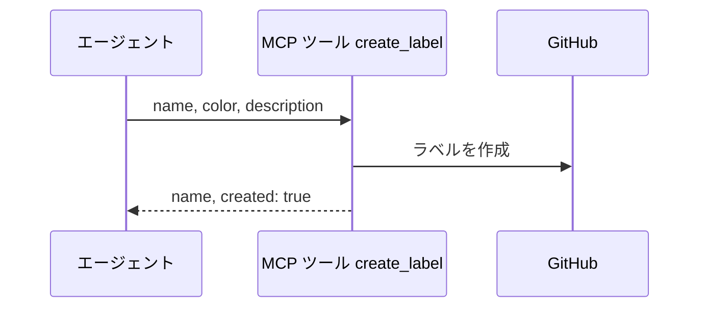
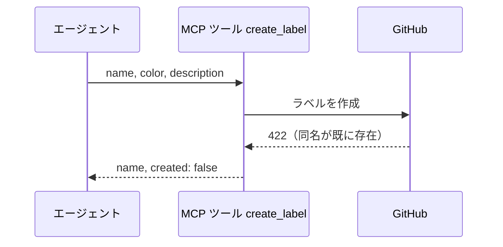
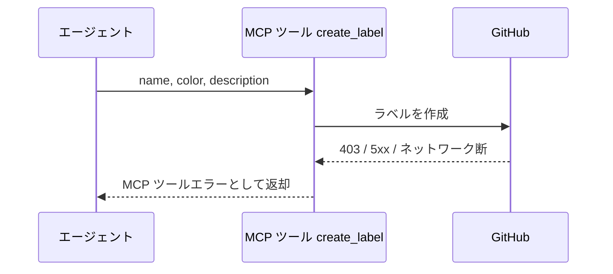

# ラベル作成

MCP ツール: `create_label`

リポジトリにラベル定義を作る。
`constants.env` に載らないプロジェクト固有のラベル（`scope:*` 等）を、必要になったエージェントがその場で用意するために使う。

Issue へのラベル付与 API は未作成のラベルをランダムな色で自動作成してしまうため、付与の前に本ツールで色と説明を決めて作る。

- 対応テストファイル: `tests/integration/mcp/test_create_label.py`

## インターフェース

### リクエスト

| パラメータ | 型 | 必須 | デフォルト | 説明 | 制限 | 補足 |
| --- | --- | --- | --- | --- | --- | --- |
| `name` | str | ✅ | - | ラベル名 | - | 大文字小文字を区別する |
| `color` | str | ✅ | - | 6 桁の 16 進カラーコード | `#` は含めない | `constants.env` の `AI_MONITOR_LABEL_COLOR_*` から取る |
| `description` | str | - | `""` | ラベルの説明 | - | `constants.env` の `AI_MONITOR_LABEL_DESC_*` から取る |

リクエスト例:

```json
{
  "name": "scope:backend",
  "color": "c2e0c6",
  "description": "担当サブシステム"
}
```

### レスポンス

| フィールド | 型 | 説明 | 制限 | 補足 |
| --- | --- | --- | --- | --- |
| `name` | str | 作成されたラベル名 | - | 既存だった場合も同じ名前を返す |
| `created` | bool | 本呼び出しで新規作成したか | - | 既存なら `false` |

レスポンス例:

```json
{
  "name": "scope:backend",
  "created": true
}
```

## 制約

| 項目 | 制約 | 補足 |
| --- | --- | --- |
| タイムアウト | 制限なし | - |
| 既存ラベル | 上書きしない | 同名が既にあれば色も説明も変えずに `created=false` を返す |
| 削除 | 行わない | 使われなくなったラベルは残す |

## フロー一覧

| 分類 | フロー名 | 概要 | 補足 |
| --- | --- | --- | --- |
| 正常 | 正常系 | 未作成のラベルを作成する | - |
| 正常 | 正常系（既存ラベル） | 同名が既にあるので何もしない | 冪等 |
| 異常 | 異常系（API エラー） | 認証切れ / 権限不足 / ネットワーク断 | - |

## 正常系

### セットアップ

| セットアップ | 説明 | 補足 |
| --- | --- | --- |
| Mock | GitHub API を差し替え（作成が正常応答を返す） | - |
| 既存ラベル | 同名のラベルが存在しない | 作成を決定的に誘発 |

### フロー



### 期待値

- リポジトリに指定した名前・色・説明のラベルが作成されている
- 戻り値の `created` が `true`

## 正常系（既存ラベル）

### セットアップ

| セットアップ | 説明 | 補足 |
| --- | --- | --- |
| Mock | GitHub API を差し替え（作成で 422 を返す） | 同名衝突を決定的に誘発 |
| 既存ラベル | 同名のラベルが別の色で存在する | - |

### フロー



### 期待値

- 既存ラベルの色と説明が変化していない
- 戻り値の `created` が `false`
- MCP ツールエラーにならない

## 異常系（API エラー）

### セットアップ

| セットアップ | 説明 | 補足 |
| --- | --- | --- |
| Mock | GitHub API を差し替え（作成で 403 を返す） | 権限不足を決定的に誘発 |

### フロー



### 期待値

- MCP ツールエラーが返る（HTTP ステータスと本文を含む）
- ラベルは作成されていない
