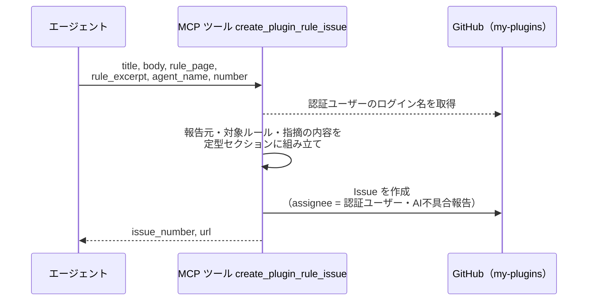
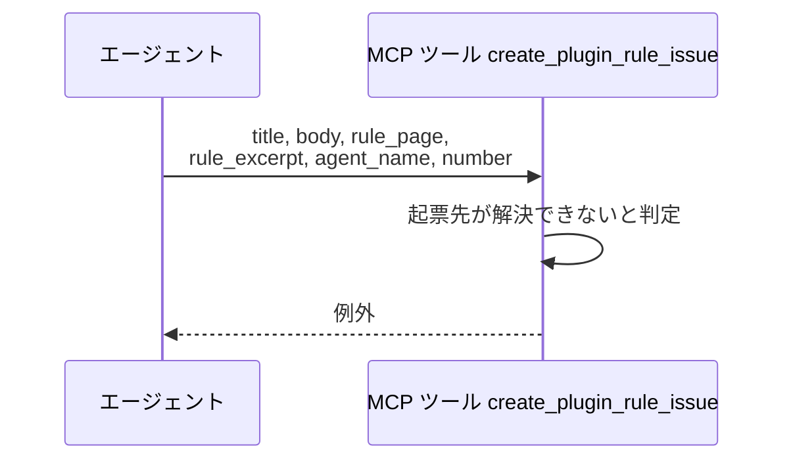
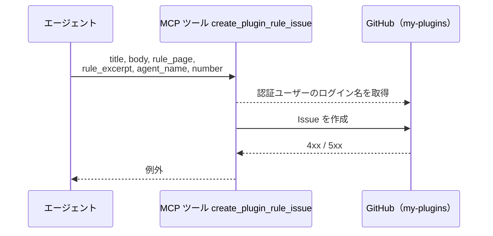

# ルール改修Issue起票（プラグイン）

MCP ツール: `create_plugin_rule_issue`

言語・フレームワークの規約に起因する指摘を、規約を持つ my-plugins リポジトリへルール改修 Issue として起票する。

- 対応テストファイル: `tests/integration/mcp/test_ルール改修Issue起票（プラグイン）.py`

## インターフェース

### リクエスト

| パラメータ | 型 | 必須 | デフォルト | 説明 | 制限 | 補足 |
| --- | --- | --- | --- | --- | --- | --- |
| `title` | str | ✅ | - | ルール改修の要約 | - | 1 行で「どのルールをどう直したいか」が分かるもの |
| `body` | str | ✅ | - | 指摘内容と指摘に至った経緯 | - | Markdown 可。定型セクションは本ツールが組み立てる |
| `rule_page` | str | ✅ | - | 対象ルールのページパス | 起票先リポジトリ内の相対パス | 起票先で該当箇所を開くために使う |
| `rule_excerpt` | str | ✅ | - | 指摘の元になったルールの記述 | - | 記述が無いことが問題の場合は、無いと分かる書き方にする |
| `agent_name` | str | ✅ | - | 報告元のエージェント名 | - | `@` は不要 |
| `number` | int | ✅ | - | 報告元の Issue / PR 番号 | - | 担当プロジェクト側の番号 |

リクエスト例:

```json
{
  "title": "Python の関数ファースト規約が DTO のファクトリ関数を禁止しているように読める",
  "body": "`architecture/TypeScriptスタイル適用.md` の「クラスを書いてよいのは DTO / ライブラリ要求 / 長期保持のランタイム状態のみ」に従って DTO の生成をコンストラクタに寄せたところ、ファクトリ関数に分けるよう指摘を受けました。\n",
  "rule_page": "docs/rules/python/architecture/TypeScriptスタイル適用.md",
  "rule_excerpt": "クラスを書いてよいのは: DTO / ライブラリ要求 / 長期保持のランタイム状態 のみ",
  "agent_name": "architect",
  "number": 152
}
```

### レスポンス

| フィールド | 型 | 説明 | 制限 | 補足 |
| --- | --- | --- | --- | --- |
| `issue_number` | int | 作成した Issue 番号 | - | my-plugins のリポジトリでの番号 |
| `url` | str | Issue の html URL | - | 報告元へリンクを残すときに使う |

レスポンス例:

```json
{
  "issue_number": 87,
  "url": "https://github.com/{owner}/my-plugins/issues/87"
}
```

本文例（作成される Issue の本文）:

```markdown
## 報告元

| 項目 | 値 |
| --- | --- |
| プロジェクト | sandbox |
| エージェント | architect |
| 対象 | shuhei1101/ai-monitor-e2e#152 |

## 対象ルール

- `docs/rules/python/architecture/TypeScriptスタイル適用.md`

> クラスを書いてよいのは: DTO / ライブラリ要求 / 長期保持のランタイム状態 のみ

## 指摘の内容

`architecture/TypeScriptスタイル適用.md` の「クラスを書いてよいのは DTO / ライブラリ要求 / 長期保持のランタイム状態のみ」に従って DTO の生成をコンストラクタに寄せたところ、ファクトリ関数に分けるよう指摘を受けました。
```

## 制約

| 項目 | 制約 | 補足 |
| --- | --- | --- |
| タイムアウト | 制限なし | - |
| 起票先 | 設定の `my_plugins_repo`（`owner/name`） | 呼び出し元セッションのプロジェクトではない。未設定なら起票せずエラー |
| 起票の粒度 | 1 回の呼び出しで 1 Issue | 同じルールへの報告が重なっても本ツールでは束ねない（重複の整理は intake-issue-triager が担う） |
| 付与ラベル | `AI不具合報告` のみ | 確認ラベルは付けないので、ユーザーが承認するまで改修フローに乗らない |
| assignee | 認証ユーザー 1 名で固定 | 呼び出し側が選べない |
| 呼び出し元への影響 | 起票の成否にかかわらず、呼び出し元の作業は続行できる | 本ツールは報告だけを行い、待機・ラベル操作をしない |

## フロー一覧

| 分類 | フロー名 | 概要 | 補足 |
| --- | --- | --- | --- |
| 正常 | 正常系 | 定型本文の組み立て → Issue 作成 → 番号と URL の返却 | - |
| 異常 | 異常系（起票先が未設定） | 設定に `my_plugins_repo` が無く起票できない | - |
| 異常 | 異常系（API エラー） | 認証切れ / ネットワーク断 | - |

## 正常系

### セットアップ

| セットアップ | 説明 | 補足 |
| --- | --- | --- |
| Mock | GitHub API を差し替え（正常応答を返す） | - |
| 設定 | `my_plugins_repo` を指す設定あり | 起票先の解決に使う |
| 呼び出し元 | 担当プロジェクト（my-plugins 以外）のセッション | 起票先が呼び出し元と別であることを確認するため |

### フロー



### 期待値

- `my_plugins_repo` のリポジトリに Issue が作成されている（呼び出し元セッションのプロジェクトではない）
- 本文に報告元（プロジェクト名・エージェント名・対象番号）・対象ルールのページパスと記述・指摘の内容が入っている
- assignee が認証ユーザーになっている
- ラベルが `AI不具合報告` の 1 つだけで、確認ラベルが付いていない
- 戻り値の `issue_number` / `url` が作成した Issue を指している

## 異常系（起票先が未設定）

### セットアップ

| セットアップ | 説明 | 補足 |
| --- | --- | --- |
| Mock | GitHub API を差し替え（呼ばれないことを確認する） | - |
| 設定 | `my_plugins_repo` が未設定 | 異常を決定的に誘発 |

### フロー



### 期待値

- 例外が送出される
- GitHub への呼び出しが行われていない

## 異常系（API エラー）

### セットアップ

| セットアップ | 説明 | 補足 |
| --- | --- | --- |
| Mock | GitHub API が Issue 作成で 4xx / 5xx を返す | 異常を決定的に誘発 |
| 設定 | `my_plugins_repo` を指す設定あり | - |

### フロー



### 期待値

- 例外が送出される
- 呼び出し元のターンは中断されず、報告なしで本来の作業を続けられる
