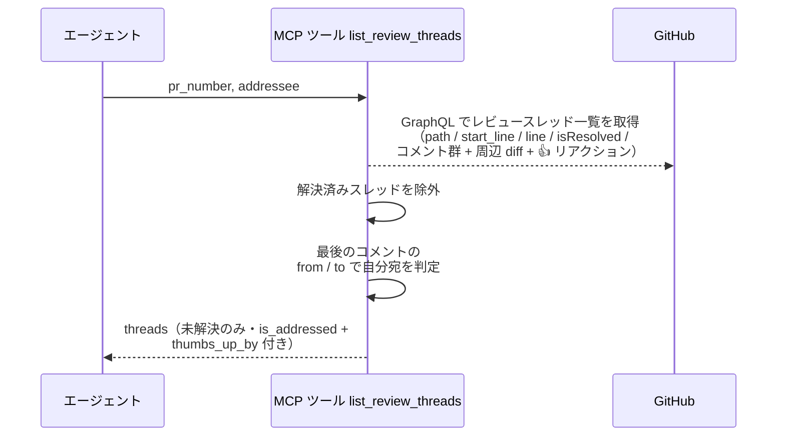
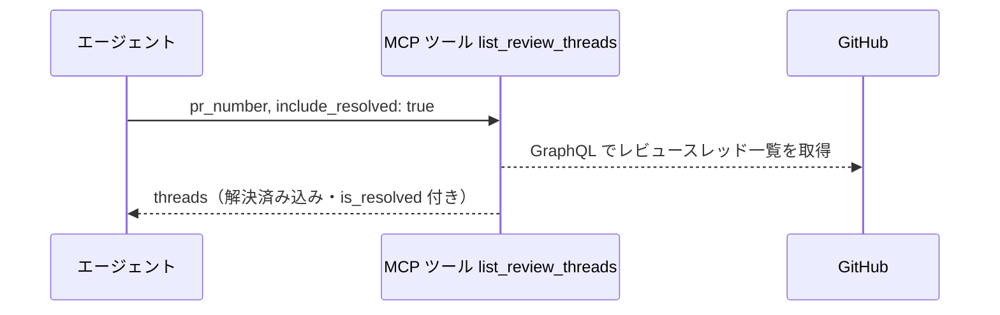
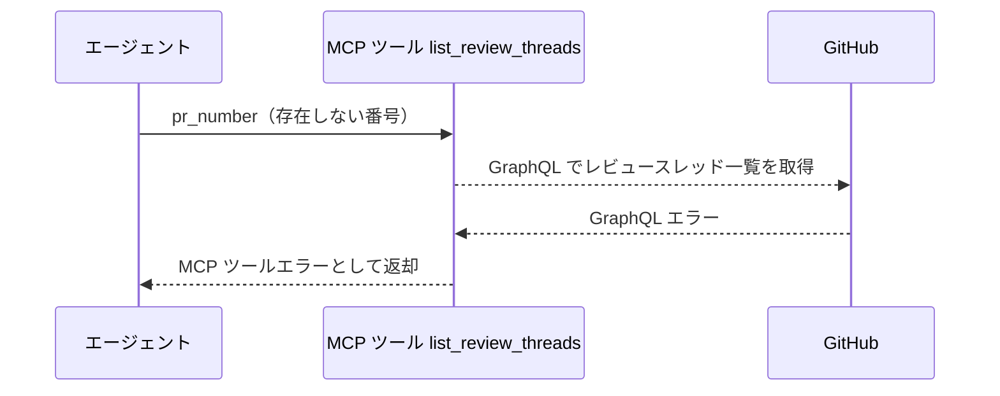

# レビュースレッド一覧

MCP ツール: `list_review_threads`

PR のレビュースレッド（インライン指摘のスレッド）を対象ファイル・行・解決状態・コメント群付きで取得する。

- 対応テストファイル: `tests/integration/mcp/test_list_review_threads.py`

## インターフェース

### リクエスト

| パラメータ | 型 | 必須 | デフォルト | 説明 | 制限 | 補足 |
| --- | --- | --- | --- | --- | --- | --- |
| `pr_number` | int | ✅ | - | 対象の PR 番号 | - | - |
| `addressee` | str | ✅ | - | 自分宛判定に使う名前。スレッド内の最後のコメントで判定する | - | `@` は不要 |
| `include_resolved` | bool | - | `False` | 解決済みスレッドも含めるか | - | - |

リクエスト例:

```json
{
  "pr_number": 52,
  "addressee": "implementer"
}
```

### レスポンス

| フィールド | 型 | 説明 | 制限 | 補足 |
| --- | --- | --- | --- | --- |
| `threads` | object[] | レビュースレッドの配列 | スレッド先頭 100 件・スレッド内コメント先頭 50 件 | - |
| `threads[].node_id` | str | スレッドの GraphQL node_id | - | `PRRT_` 始まり。レビュースレッド一括Resolve の対象指定に使う |
| `threads[].path` | str | 対象ファイルパス | - | - |
| `threads[].line` | int \| null | 対象行番号（範囲コメントは終端行） | - | diff の変化で outdated になった場合 null |
| `threads[].start_line` | int \| null | 範囲コメントの開始行 | - | 単一行コメントは null |
| `threads[].is_resolved` | bool | 解決済みか | - | `include_resolved=true` のときのみ `true` があり得る |
| `threads[].is_addressed` | bool | `addressee` 宛か | - | 返信すべきスレッドの判定に使う。最後のコメントの to / from で決まる |
| `threads[].comments` | object[] | スレッド内のコメント（投稿順） | - | - |
| `threads[].comments[].id` | str | コメントの GraphQL node_id | - | - |
| `threads[].comments[].body` | str | コメント本文 | - | - |
| `threads[].comments[].author` | str | 投稿者のログイン名 | - | - |
| `threads[].comments[].diff_hunk` | str \| null | 指摘箇所の周辺 diff | - | GitHub が付ける unified diff の断片。範囲・行数は GitHub 側が決める |
| `threads[].comments[].thumbs_up_by` | str[] | 👍 を付けたユーザーのログイン名 | 先頭 20 件 | 確認事項に対する「推奨で OK」の回答として読む（`規約/コメント.md`） |

レスポンス例:

```json
{
  "threads": [
    {
      "node_id": "PRRT_kwDOAbc123",
      "path": "src/ai_monitor/features/agents/service.py",
      "line": 48,
      "start_line": 42,
      "is_resolved": false,
      "is_addressed": true,
      "comments": [
        {
          "id": "PRRC_kwDOAbc123xyz",
          "body": "> from: @architect\n> to: @implementer\n\nnull チェックを追加してください。",
          "author": "shuhei1101",
          "diff_hunk": "@@ -40,6 +40,8 @@ def poll(\n     matched = [t for t in targets if agent.confirm_label in t.labels]\n+    session = registry.find(project.name, agent.name, target.number)\n+    send_keys(session.session_name, text)",
          "thumbs_up_by": ["shuhei1101"]
        }
      ]
    }
  ]
}
```

## 制約

| 項目 | 制約 | 補足 |
| --- | --- | --- |
| タイムアウト | 制限なし | - |
| 取得件数 | スレッド先頭 100 件・スレッド内コメント先頭 50 件・コメント 1 件あたりのリアクション先頭 20 件 | GraphQL のページ指定 |
| 取得するリアクション | 👍 のみ | 他の絵文字は意味を持たせないため取得しない |

## フロー一覧

| 分類 | フロー名 | 概要 | 補足 |
| --- | --- | --- | --- |
| 正常 | 正常系 | GraphQL でスレッド取得 → 解決済みを除外 → 最後のコメントで自分宛判定 | 宛先違いのスレッドも落とさず返す |
| 正常 | 正常系（解決済みを含める） | `include_resolved=true` で全スレッド返却 | - |
| 異常 | 異常系（API エラー） | PR 不存在 / 認証切れ | - |

## 正常系

### セットアップ

| セットアップ | 説明 | 補足 |
| --- | --- | --- |
| Mock | GitHub API を差し替え（未解決 + 解決済みが混在する応答を返す） | - |
| 対象 PR | sandbox にレビュースレッド付きの PR が存在 | 番号を入力に使う |
| スレッド | 自分宛・他エージェント宛・自分が最後に返信したものを混在させる | 宛先判定の検証用 |
| リアクション | 1 件のコメントに 👍 と 👀 を付けておく | 👍 だけを拾うことの検証用 |

### フロー



### 期待値

- 未解決スレッドだけが返り、各スレッドに `node_id` / `path` / `line` / コメント群（投稿順）が入っている
- 最後のコメントの to が `addressee`・to なしのユーザーコメント・from が `addressee` のスレッドは `is_addressed` が `true` になる
- 他エージェント宛のスレッドは `is_addressed` が `false` で返る
- 各コメントに `diff_hunk`（指摘箇所の周辺 diff）が入っている
- 👍 が付いたコメントの `thumbs_up_by` に、付けたユーザーのログイン名が入っている（👍 以外のリアクションは入らない）

## 正常系（解決済みを含める）

### セットアップ

| セットアップ | 説明 | 補足 |
| --- | --- | --- |
| Mock | GitHub API を差し替え（未解決 + 解決済みが混在する応答を返す） | - |
| 入力 | `include_resolved: true` で呼び出す | 分岐を決定的に誘発 |

### フロー



### 期待値

- 解決済みスレッドも `is_resolved: true` で含まれて返る

## 異常系（API エラー）

### セットアップ

| セットアップ | 説明 | 補足 |
| --- | --- | --- |
| Mock | GitHub API を差し替え（GraphQL エラーを返す） | - |
| 対象番号 | 存在しない PR 番号を指定して呼び出す | エラーを決定的に誘発 |

### フロー



### 期待値

- MCP ツールエラーが返る（GraphQL エラーの内容を含む）
