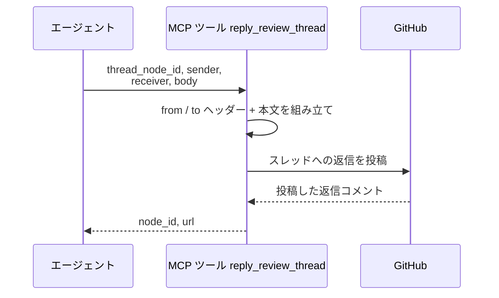
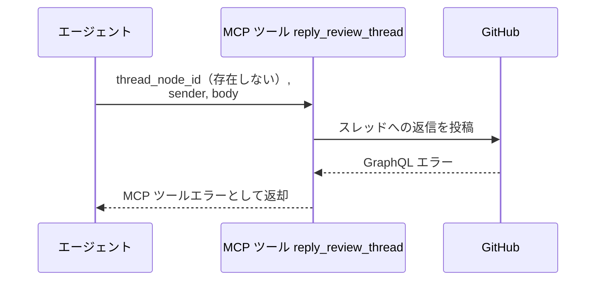

# レビュースレッド返信

MCP ツール: `reply_review_thread`

PR のインライン指摘スレッドに、GitHub ネイティブの返信としてコメントを投稿する。

- 対応テストファイル: `tests/integration/mcp/test_reply_review_thread.py`

## インターフェース

### リクエスト

| パラメータ | 型 | 必須 | デフォルト | 説明 | 制限 | 補足 |
| --- | --- | --- | --- | --- | --- | --- |
| `thread_node_id` | str | ✅ | - | 返信先スレッドの GraphQL node_id | - | `list_review_threads` が返す `PRRT_` 始まりの値 |
| `sender` | str | ✅ | - | 送信者のエージェント名 | - | `@` は不要 |
| `body` | str | ✅ | - | 返信本文 | - | ヘッダーはツールが付ける |
| `receiver` | str | - | なし（to 行なし = 現担当宛） | 宛先名 | - | 指摘した相手を指定する |

リクエスト例:

```json
{
  "thread_node_id": "PRRT_kwDOAbc123",
  "sender": "implementer",
  "receiver": "architect",
  "body": "ご指摘の箇所を commit abc1234 で修正しました。"
}
```

### レスポンス

| フィールド | 型 | 説明 | 制限 | 補足 |
| --- | --- | --- | --- | --- |
| `node_id` | str | 投稿した返信コメントの GraphQL node_id | - | `PRRC_` 始まり |
| `url` | str | 返信コメントの html URL | - | スレッド内の該当コメントを指す |

レスポンス例:

```json
{
  "node_id": "PRRC_kwDOAbc456",
  "url": "https://github.com/{owner}/{repo}/pull/52#discussion_r123456"
}
```

## 制約

| 項目 | 制約 | 補足 |
| --- | --- | --- |
| タイムアウト | 制限なし | - |
| 対象 | インライン指摘スレッドのみ | 会話欄のコメントへの追記は `reply_comment` |
| 解決状態 | 解決済みスレッドにも返信できる | Resolve の運用は変えない |

## フロー一覧

| 分類 | フロー名 | 概要 | 補足 |
| --- | --- | --- | --- |
| 正常 | 正常系 | ヘッダー付き本文を組み立て → スレッドへ返信を投稿 | 末尾に区切り線は付けない |
| 異常 | 異常系（API エラー） | スレッド不存在 / 認証切れ / ネットワーク断 | - |

## 正常系

### セットアップ

| セットアップ | 説明 | 補足 |
| --- | --- | --- |
| Mock | GitHub API を差し替え（正常応答を返す） | - |
| 対象スレッド | PR にインライン指摘のスレッドが 1 件存在 | node_id を入力に使う |

### フロー



### 期待値

- 対象スレッドのコメントが 1 件増え、返信としてスレッド内に並んでいる
- 返信本文の先頭に引用ヘッダー（送信者の from 行 + 宛先の to 行）が付いている
- 会話欄のコメントは増えていない
- 戻り値の `node_id` / `url` が追加された返信を指している

## 異常系（API エラー）

### セットアップ

| セットアップ | 説明 | 補足 |
| --- | --- | --- |
| Mock | GitHub API を差し替え（GraphQL エラーを返す） | - |
| 対象スレッド | 存在しない node_id を指定して呼び出す | API エラーを決定的に誘発 |

### フロー



### 期待値

- MCP ツールエラーが返る（GraphQL のエラーメッセージを含む）
- コメントは追加されていない
