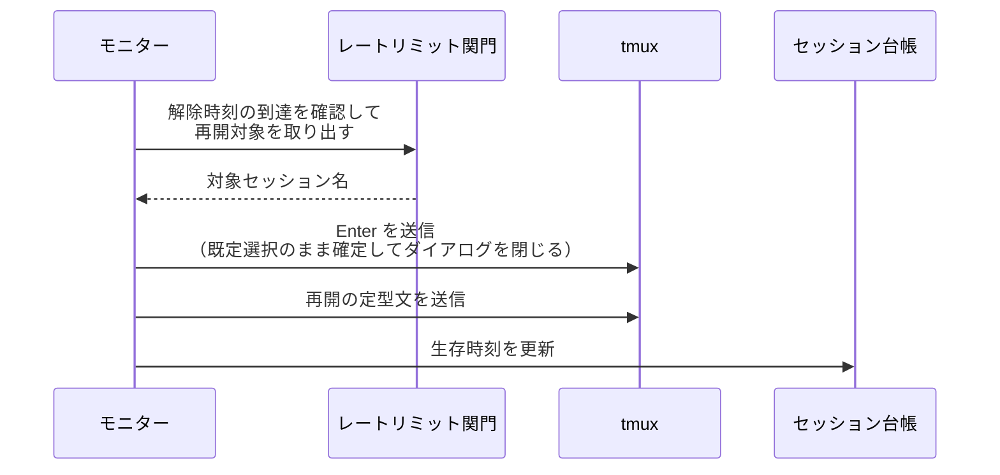
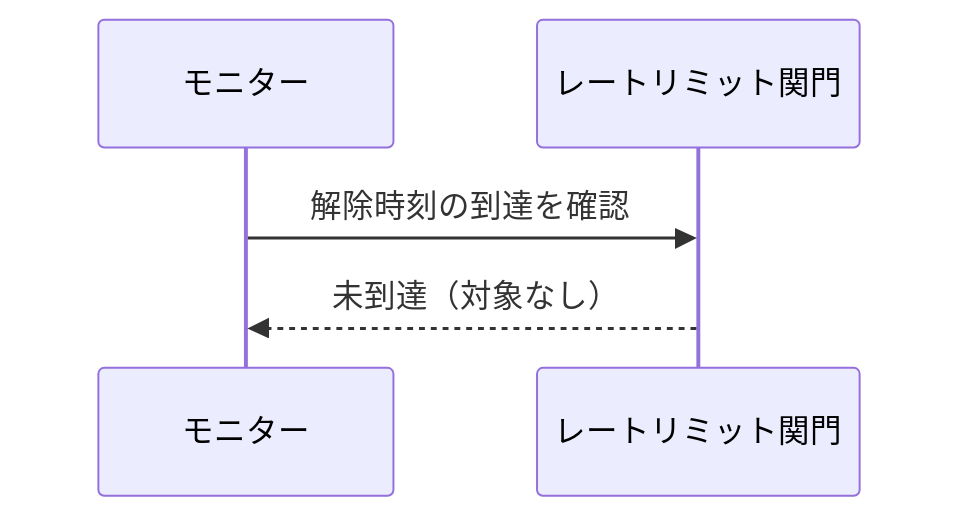
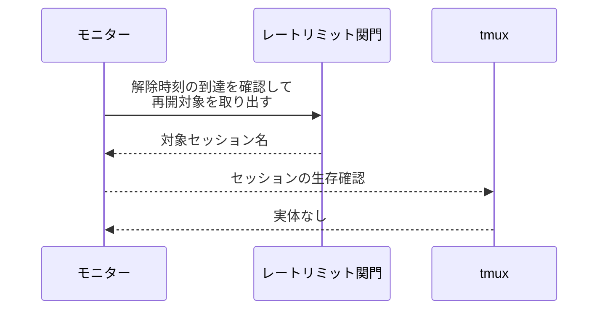

# レートリミット再開

トリガー: heartbeat 周期（`heartbeat_interval_sec` ごと）

利用上限のリセット時刻が過ぎたら、上限で止まっているセッションへ再開を送る。

- 対応テストファイル: `tests/integration/monitor/test_レートリミット再開.py`

## 制約

| 項目 | 制約 | 補足 |
| --- | --- | --- |
| 周期 | 設定 `heartbeat_interval_sec`（既定 60 秒） | タイムアウト検知と同じ周期に相乗りする |
| 実行順序 | 再開送信 → タイムアウト回収 | 逆順だと再開直後のセッションが回収される |
| 再送 | 同じ対象へ二度送らない | 取り出しと同時に待機状態を消す |

## フロー一覧

| 分類 | フロー名 | 概要 | 補足 |
| --- | --- | --- | --- |
| 正常 | 正常系 | 解除時刻の到達を検知 → 応答 + 再開の定型文を送信 → 生存時刻を更新 | - |
| 正常 | 正常系（待機中） | 解除時刻の前は何もしない | 周期ごとに判定するだけ |
| 正常 | 正常系（実体消失） | tmux にセッションが無い対象は飛ばす | 解放済みセッション |

## 正常系

### セットアップ

| セットアップ | 説明 | 補足 |
| --- | --- | --- |
| Mock | tmux を差し替え | 送信内容の検証用 |
| 関門 | 解除時刻が現在より前 + 再開待ちに 1 件 | 解除を決定的に誘発 |
| 台帳 | 該当セッションが登録済みで `last_seen_at` が古い | 生存時刻の更新を確認する |

### フロー

### 期待値

- 対象セッションへ `Enter` と再開の定型文がこの順に送られている
- 対象セッションが kill されていない（同じ名前のまま残っている）
- 対象セッションの `last_seen_at` が更新されている
- 関門の待機状態が消えている（次の周期で二重に送らない）

## 正常系（待機中）

### セットアップ

| セットアップ | 説明 | 補足 |
| --- | --- | --- |
| Mock | tmux を差し替え | 送信の有無の検証用 |
| 関門 | 解除時刻が現在より後 | 待機中を決定的に誘発 |

### フロー

### 期待値

- tmux への送信が発生していない
- 関門の待機状態が残っている

## 正常系（実体消失）

### セットアップ

| セットアップ | 説明 | 補足 |
| --- | --- | --- |
| Mock | tmux を差し替え（生存確認が偽を返す） | 実体消失を決定的に誘発 |
| 関門 | 解除時刻が現在より前 + 再開待ちに 1 件 | - |

### フロー

### 期待値

- その対象へ送信が発生していない
- 生存時刻が更新されていない
- 関門の待機状態は消えている（存在しない対象を持ち続けない）
