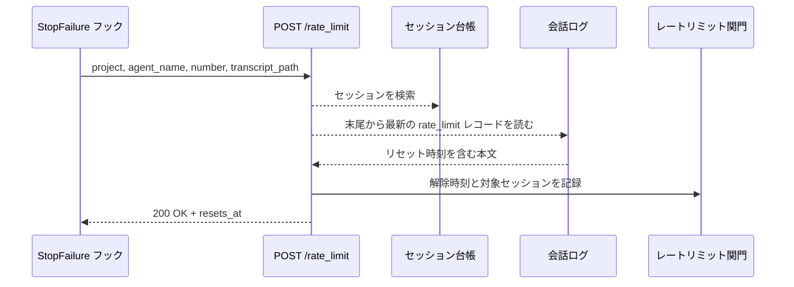
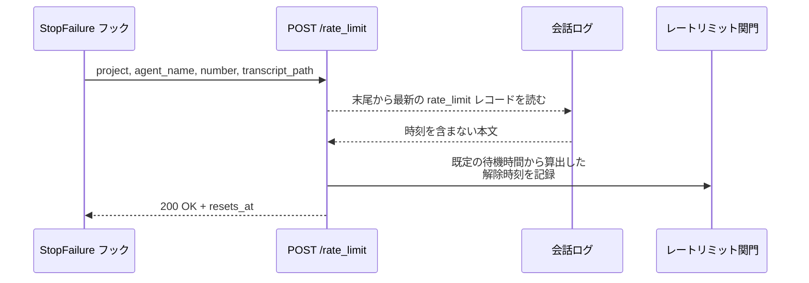
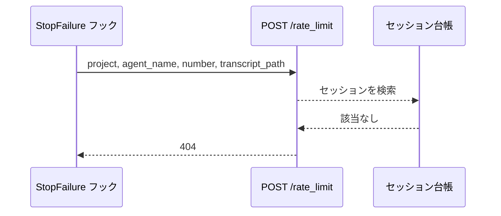

# レートリミット通知

エンドポイント: POST /rate_limit
送信元: Claude Code の `StopFailure` フック（`error_type` が `rate_limit` のときのみ発火）

Claude の利用上限に達したことを受け取り、リセット時刻まで新規セッションの起動とタイムアウト回収を止める。

- 対応テストファイル: `tests/integration/monitor/test_レートリミット通知.py`

## インターフェース

### リクエスト

| パラメータ | 型 | 必須 | デフォルト | 説明 | 制限 | 補足 |
| --- | --- | --- | --- | --- | --- | --- |
| `project` | str | ✅ | - | 監視対象プロジェクト名 | 設定に登録済みの名前 | 環境変数 `AI_MONITOR_PROJECT` の値 |
| `agent_name` | str | ✅ | - | エージェント名 | - | 環境変数 `AI_MONITOR_AGENT` の値 |
| `number` | int | ✅ | - | セッションの主番号 | - | 環境変数 `AI_MONITOR_NUMBER` の値 |
| `transcript_path` | str | ✅ | - | 会話ログのパス | 実在するファイル | フック入力の `transcript_path` |

リクエスト例:

```json
{
  "project": "sandbox",
  "agent_name": "epic-conductor",
  "number": 1069,
  "transcript_path": "/home/user/.claude/projects/-mnt-c-repo/5a00ce9c-0db7-4564-a6a0-548b57243b95.jsonl"
}
```

### レスポンス

| フィールド | 型 | 説明 | 制限 | 補足 |
| --- | --- | --- | --- | --- |
| `resets_at` | str | 待機を解除する時刻（ISO 8601） | - | 解析できなかった場合は既定の待機時間から算出した時刻 |

レスポンス例:

```json
{ "resets_at": "2026-07-29T02:30:00+09:00" }
```

### ステータスコード

| ステータスコード | 発生条件 | 補足 |
| --- | --- | --- |
| `200` | 到達を受理して待機を開始した | - |
| `404` | 台帳に該当セッションが無い | 解放済みのセッションからの通知 |
| `422` | リクエストの型不一致 | FastAPI のバリデーション |

## 制約

| 項目 | 制約 | 補足 |
| --- | --- | --- |
| 待受 | `127.0.0.1` のみ | ポートは設定 `port` |
| ルーティング | MCP のルートマウントより先に登録する | MCP は `/` にマウントされるため、後だと本エンドポイントに到達しない |
| 待機の適用範囲 | 全プロジェクト・全セッション | 上限はアカウント単位のため、通知元のプロジェクトに限定しない |
| 既定の待機時間 | 設定 `rate_limit_fallback_min` | リセット時刻を解析できなかった場合にだけ使う |
| タイムアウト | 制限なし | フック側の既定は 600 秒 |

## フロー一覧

| 分類 | フロー名 | 概要 | 補足 |
| --- | --- | --- | --- |
| 正常 | 正常系 | 会話ログからリセット時刻を読み、その時刻まで待機する | - |
| 正常 | 正常系（時刻を解析できない） | 既定の待機時間で待機する | 文言が想定と違う場合 |
| 異常 | 異常系（セッション不明） | 台帳に無いセッションからの通知を拒否 | 解放済みセッションの取りこぼし |

## 正常系

### セットアップ

| セットアップ | 説明 | 補足 |
| --- | --- | --- |
| Mock | 会話ログを一時ファイルに差し替え | 実際の API 呼び出しは行わない |
| 台帳 | `project` / `agent_name` / `number` のセッションが登録済み | - |
| 会話ログ | 末尾に `error: rate_limit` のレコードがあり、本文にリセット時刻を含む | - |

### フロー



### 期待値

- 会話ログの最新レコードから読んだ時刻が解除時刻になっている（複数レコードがあれば最後のもの）
- 対象セッションが再開待ちとして記録されている
- `200` + `{"resets_at": "..."}` が返る

## 正常系（時刻を解析できない）

### セットアップ

| セットアップ | 説明 | 補足 |
| --- | --- | --- |
| Mock | 会話ログを一時ファイルに差し替え | - |
| 台帳 | 該当セッションが登録済み | - |
| 会話ログ | `error: rate_limit` のレコードはあるが、本文に時刻が無い | 解析失敗を決定的に誘発 |

### フロー



### 期待値

- 解除時刻が「受信時刻 + 既定の待機時間」になっている
- 解析できなかったことが警告ログに残っている
- `200` + `{"resets_at": "..."}` が返る

## 異常系（セッション不明）

### セットアップ

| セットアップ | 説明 | 補足 |
| --- | --- | --- |
| Mock | 会話ログを一時ファイルに差し替え | 読み取りの有無の検証用 |
| 台帳 | 該当セッションが未登録 | 拒否を決定的に誘発 |

### フロー



### 期待値

- `404` が返る
- 待機が開始されていない（関門の状態が変わっていない）
