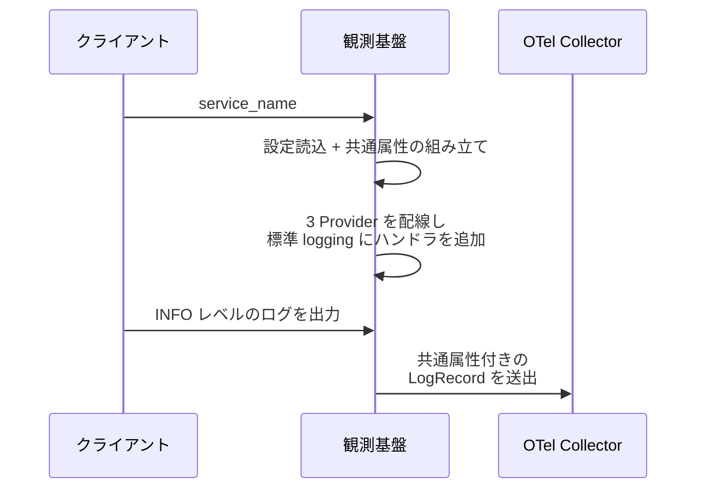
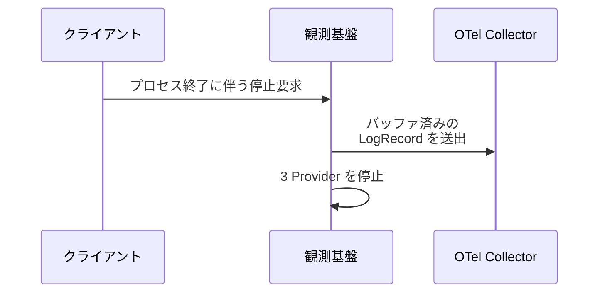
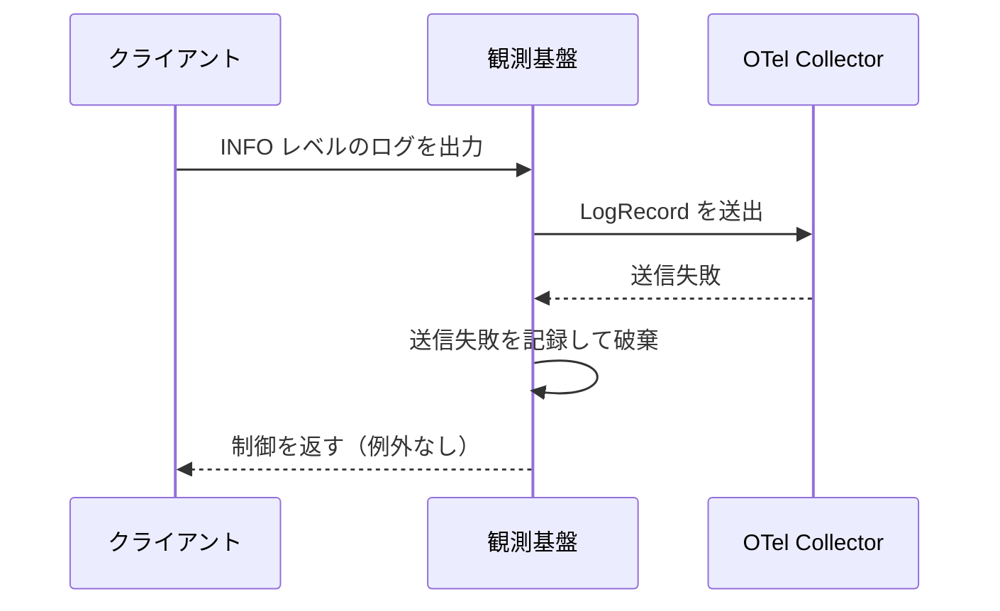

# ログ送出

初期化関数: `configure(service_name)`

常駐プロセス（モニター / MCP サーバー）の composition root で観測基盤を初期化し、以降に標準 `logging` へ出力されたログを OTel Collector（OTLP gRPC）へ送出する。
プロセス終了時はバッファ済みのレコードをフラッシュしてから停止する。

- 対応テストファイル: `tests/integration/observability/test_ログ送出.py`

## インターフェース

### リクエスト

| パラメータ | 型 | 必須 | デフォルト | 説明 | 制限 | 補足 |
| --- | --- | --- | --- | --- | --- | --- |
| `service_name` | str | ✅ | - | プロセス識別名 | - | `service.name` になる（`"monitor"` / `"github-mcp"`） |
| `AI_MONITOR_OTEL_OTLP_ENDPOINT` | str | - | `http://localhost:4317` | Collector の OTLP gRPC 受付 URL | - | 環境変数 |
| `AI_MONITOR_OTEL_OTLP_INSECURE` | bool | - | `true` | TLS を無効化するか | - | 環境変数 |
| `AI_MONITOR_OTEL_DEPLOYMENT_ENVIRONMENT` | `"dev"` \| `"staging"` \| `"prod"` | - | `"dev"` | 環境名 | - | 環境変数 |
| `AI_MONITOR_OTEL_SERVICE_NAMESPACE` | str | - | `"ai-monitor"` | サービス空間 | - | 環境変数 |

リクエスト例:

```python
configure("monitor")
logging.getLogger(__name__).info("ポーリングを開始します: project=sandbox")
```

### レスポンス

| フィールド | 型 | 説明 | 制限 | 補足 |
| --- | --- | --- | --- | --- |
| `resource["service.name"]` | str | 送出元プロセスの識別名 | - | `service_name` の値 |
| `resource["service.namespace"]` | str | サービス空間 | - | 全プロセス共通 |
| `resource["deployment.environment"]` | str | 環境名 | - | - |
| `body` | str | ログ本文 | - | フォーマット適用後の文字列 |
| `severity_text` | str | ログレベル名 | - | `INFO` / `WARNING` / `ERROR` 等 |

レスポンス例:

```json
{
  "resource": {
    "service.name": "monitor",
    "service.namespace": "ai-monitor",
    "deployment.environment": "dev"
  },
  "body": "ポーリングを開始します: project=sandbox",
  "severity_text": "INFO"
}
```

## 制約

| 項目 | 制約 | 補足 |
| --- | --- | --- |
| 初期化回数 | プロセスあたり 1 回 | composition root からのみ呼ぶ |
| 送信プロトコル | OTLP gRPC（4317）のみ | HTTP（4318）は使わない |
| 転送するログレベル | INFO 以上 | root logger を INFO に設定してハンドラを追加する |
| バッファ | キュー 2048 件 / フラッシュ間隔 5 秒 / 1 バッチ 512 件 | `BatchLogRecordProcessor` の既定値 |
| 送信失敗時の扱い | 呼び出し側に例外を伝播させない | Collector 停止中でもプロセスは継続する |
| 対象プロセス | 常駐プロセスのみ | 短命な inject / hook スクリプトは初期化しない |

## フロー一覧

| 分類 | フロー名 | 概要 | 補足 |
| --- | --- | --- | --- |
| 正常 | 正常系 | 初期化後の `logging` 出力が Resource 属性付きの LogRecord として Collector に届く | - |
| 正常 | 正常系（プロセス終了） | 停止処理でバッファ済みレコードが送出され、Provider が停止する | `atexit` から呼ばれる経路 |
| 異常 | 異常系（Collector 未起動） | 送出が失敗しても呼び出し側に例外が伝播しない | - |

## 正常系

### セットアップ

| セットアップ | 説明 | 補足 |
| --- | --- | --- |
| Mock | OTel Collector（送信部の OTLP Exporter）を送出レコード記録用のスタブに差し替え | Traces / Metrics 側の Exporter も同時に差し替える |
| 環境変数 | `AI_MONITOR_OTEL_*` を未設定にする | 既定値での送出を確認する |

### フロー



### 期待値

- 送出された LogRecord の `body` が出力したログ本文と一致する
- `severity_text` が出力したログレベル名と一致する
- `resource` に `service.name`（引数の値）/ `service.namespace`（`ai-monitor`）/ `deployment.environment`（`dev`）が載っている

## 正常系（プロセス終了）

### セットアップ

| セットアップ | 説明 | 補足 |
| --- | --- | --- |
| Mock | OTel Collector（送信部の OTLP Exporter）を送出レコード記録用のスタブに差し替え | Traces / Metrics 側の Exporter も同時に差し替える |
| ログ | 初期化後に INFO ログを 1 件出力してフラッシュしない | バッファ済みの状態を作る |

### フロー



### 期待値

- 停止処理の後、バッファ済みだった LogRecord が送出されている
- Exporter の停止処理が呼ばれている

## 異常系（Collector 未起動）

### セットアップ

| セットアップ | 説明 | 補足 |
| --- | --- | --- |
| Mock | OTel Collector（送信部の OTLP Exporter）を送出時に例外を投げるスタブに差し替え | 送信失敗を決定的に誘発する |
| ログ | 初期化後に INFO ログを 1 件出力する | - |

### フロー



### 期待値

- ログ出力とフラッシュの呼び出しで例外が発生しない
- Exporter の送出が試行されている
