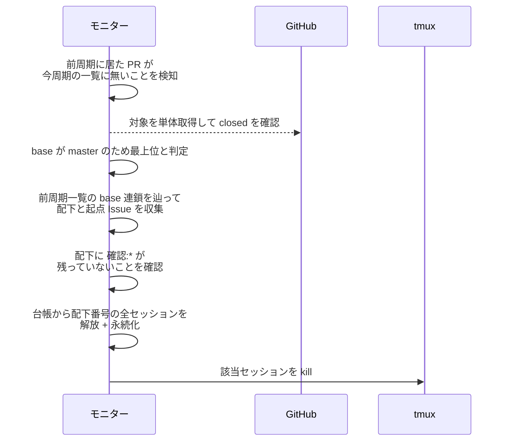
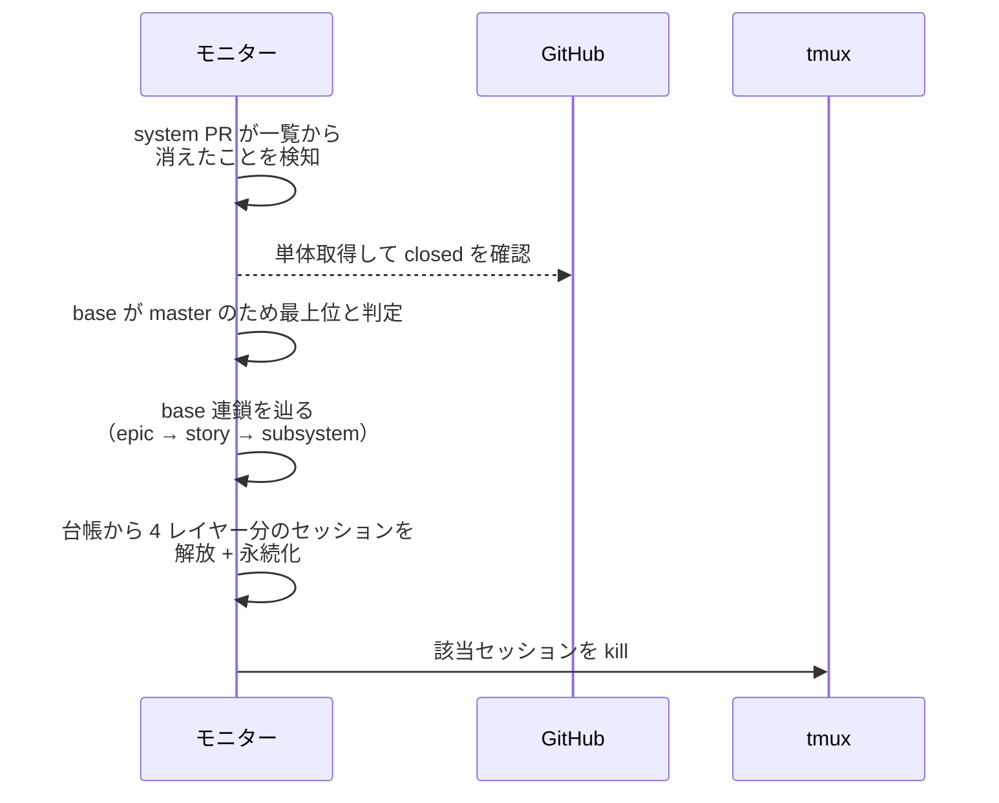
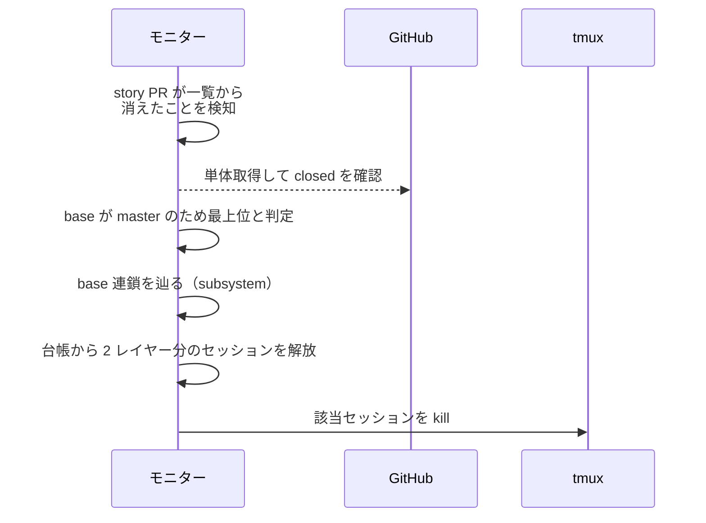
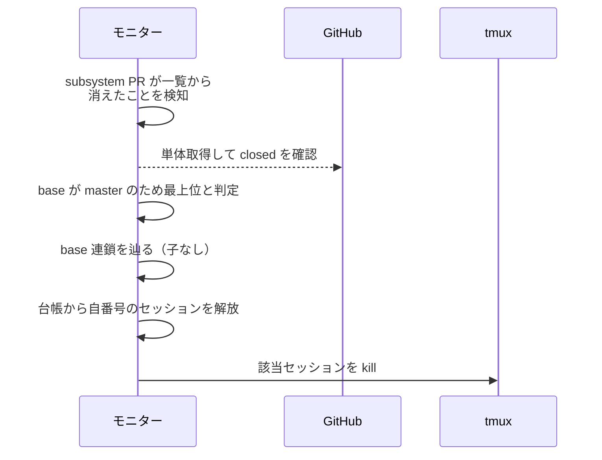
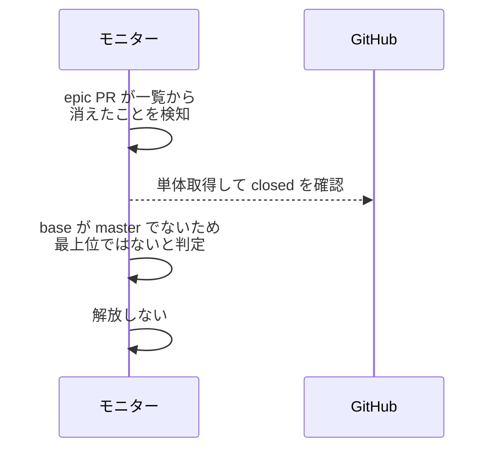
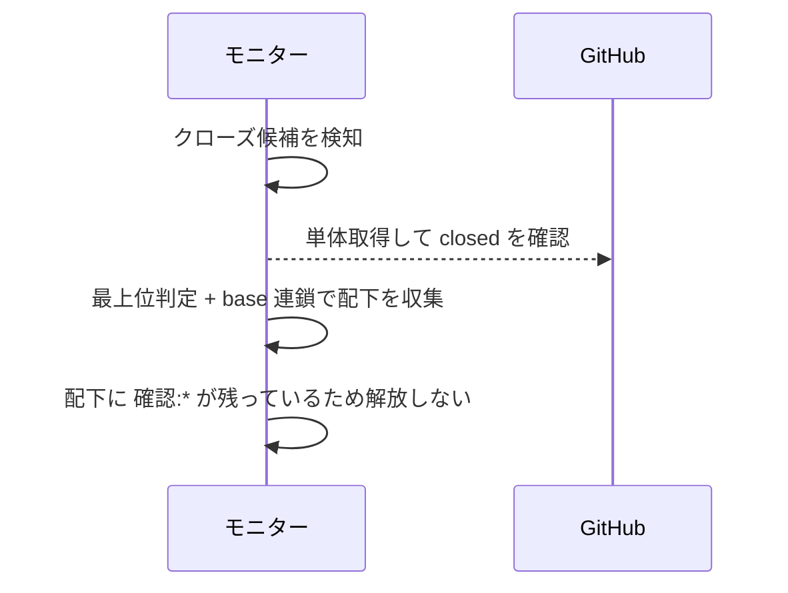
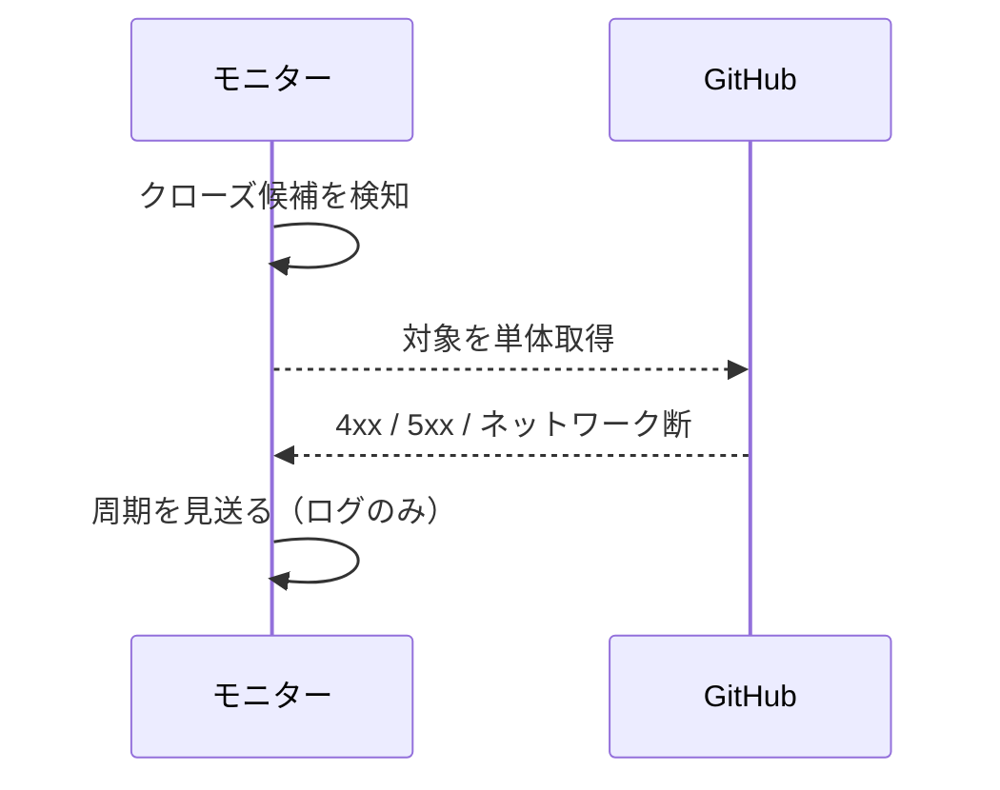

# 一括解放

トリガー: polling 周期（前周期の open 対象一覧との差分で、最上位 PR の消失を検知）

最上位 PR のマージ / クローズを検知し、その配下の全エージェントセッションを一括解放する。

- 対応テストファイル: `tests/integration/monitor/test_一括解放.py`

## 制約

| 項目 | 制約 | 補足 |
| --- | --- | --- |
| 前周期一覧 | メモリ保持のみ（永続化しない） | モニター再起動直後の周期は差分を検知できず、その間にクローズされた PR は解放されないまま残る |
| 最上位の判定 | base が `master` | 上位レイヤーの PR を持たないことを base で表す。`layer:*` の値では絞らない（着手レイヤーに依存しない） |
| 配下の収集 | 前周期の対象一覧上で base 連鎖を辿る | 追加の API 呼び出しをしない。起点の Issue は最上位 PR の `## 紐づく Issue` から加える |

## フロー一覧

| 分類 | フロー名 | 概要 | 補足 |
| --- | --- | --- | --- |
| 正常 | 正常系 | 最上位 PR のクローズ検知 → 配下の全セッションを kill + 台帳から解放 | 代表は epic |
| 正常 | 正常系（system が最上位） | system 配下の全レイヤーを 1 回で解放 | 立ち上げ経路 |
| 正常 | 正常系（story が最上位） | story から着手した場合の解放 | - |
| 正常 | 正常系（subsystem が最上位） | subsystem から着手した場合の解放 | 配下なし |
| 正常 | 正常系（親レイヤーを持つ PR のクローズ） | base が親レイヤーなので解放しない | system 配下の epic |
| 正常 | 正常系（確認ラベル残存） | 配下に `確認:*` が残っていれば解放しない | - |
| 異常 | 異常系（GitHub API エラー） | 単体取得の失敗で周期を見送る | - |

## 正常系

### セットアップ

| セットアップ | 説明 | 補足 |
| --- | --- | --- |
| Mock | GitHub API / tmux を差し替え | - |
| 前周期 | epic PR #35（base: `master`・起点 Issue #30）と配下の story PR #40 / subsystem PR #50 を含む open 一覧を前周期として保持 | base が連鎖する |
| 今周期 | #35 が open 一覧から消え、単体取得は closed を返す | - |
| 配下 | #40 / #50 とも `確認:*` なし | - |
| 台帳 | #30 / #35 / #40 / #50 を主番号とするセッションが登録済み | - |

### フロー

### 期待値

- 配下（起点の intake Issue 含む）の全セッションが台帳から除去され永続化されている
- 該当する tmux セッションが kill されている

## 正常系（system が最上位）

### セットアップ

| セットアップ | 説明 | 補足 |
| --- | --- | --- |
| Mock | GitHub API / tmux を差し替え | - |
| 前周期 | system PR #10（base: `master`）と配下の epic #35 / story #40 / subsystem #50 を含む open 一覧を前周期として保持 | 4 レイヤー分の base 連鎖 |
| 今周期 | #10 が open 一覧から消え、単体取得は closed を返す | - |
| 配下 | #35 / #40 / #50 とも `確認:*` なし | - |
| 台帳 | #10 / #35 / #40 / #50 を主番号とするセッションが登録済み | - |

### フロー

### 期待値

- system 配下の epic / story / subsystem の全セッションが台帳から除去されている
- 該当する tmux セッションが全て kill されている

## 正常系（story が最上位）

### セットアップ

| セットアップ | 説明 | 補足 |
| --- | --- | --- |
| Mock | GitHub API / tmux を差し替え | - |
| 前周期 | story PR #40（base: `master`）と配下の subsystem PR #50 を含む open 一覧を前周期として保持 | story から直接着手した場合 |
| 今周期 | #40 が open 一覧から消え、単体取得は closed を返す | - |
| 配下 | #50 は `確認:*` なし | - |
| 台帳 | #40 / #50 を主番号とするセッションが登録済み | - |

### フロー

### 期待値

- story と配下 subsystem のセッションが台帳から除去されている
- 該当する tmux セッションが kill されている

## 正常系（subsystem が最上位）

### セットアップ

| セットアップ | 説明 | 補足 |
| --- | --- | --- |
| Mock | GitHub API / tmux を差し替え | - |
| 前周期 | subsystem PR #50（base: `master`）を含む open 一覧を前周期として保持 | subsystem から直接着手した場合 |
| 今周期 | #50 が open 一覧から消え、単体取得は closed を返す | - |
| 配下 | なし（head を base に持つ PR が居ない） | 最下位レイヤーが最上位になるケース |
| 台帳 | #50 を主番号とするセッションが登録済み | - |

### フロー

### 期待値

- subsystem 自身のセッションが台帳から除去されている
- 該当する tmux セッションが kill されている

## 正常系（親レイヤーを持つ PR のクローズ）

### セットアップ

| セットアップ | 説明 | 補足 |
| --- | --- | --- |
| Mock | GitHub API / tmux を差し替え | - |
| 前周期 | epic PR #35（base: system ブランチ）と system PR #10 を含む open 一覧を前周期として保持 | 解放見送りを決定的に誘発 |
| 今周期 | #35 が open 一覧から消え、単体取得は closed を返す | - |
| 台帳 | #10 / #35 を主番号とするセッションが登録済み | - |

### フロー

### 期待値

- 台帳・tmux セッションが変化していない（上位の system が close するまで常駐する）

## 正常系（確認ラベル残存）

### セットアップ

| セットアップ | 説明 | 補足 |
| --- | --- | --- |
| Mock | GitHub API / tmux を差し替え | - |
| 今周期 | 最上位 #35 は closed だが、配下 subsystem PR #50 に `確認:subsystem-conductor` が残っている | 解放見送りを誘発 |

### フロー

### 期待値

- 台帳・tmux セッションが変化していない（次周期で再判定される）

## 異常系（GitHub API エラー）

### セットアップ

| セットアップ | 説明 | 補足 |
| --- | --- | --- |
| Mock | GitHub API を差し替え（単体取得で 4xx / 5xx を返す） | 異常を決定的に誘発 |

### フロー

### 期待値

- モニタープロセスが落ちない
- 台帳・tmux セッションが変化せず、次周期で再試行される
