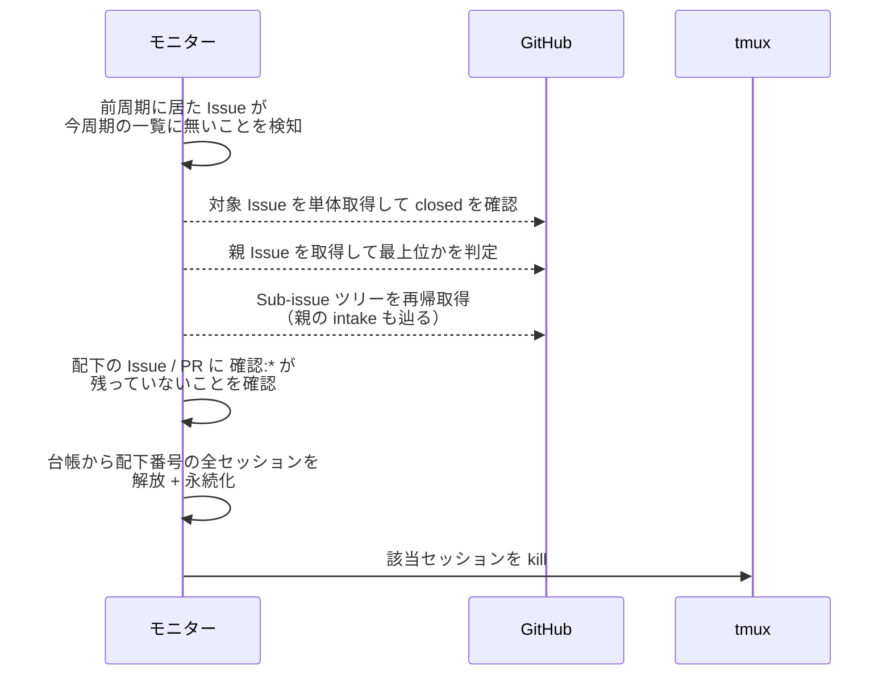
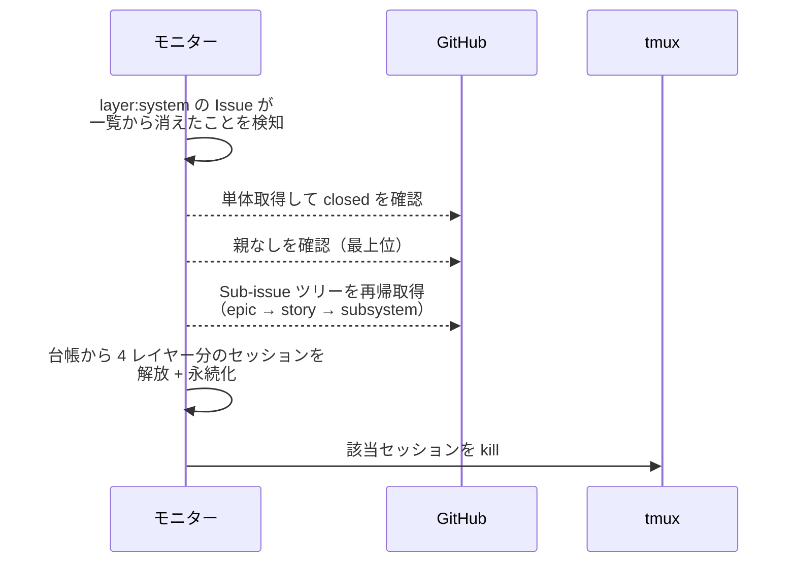
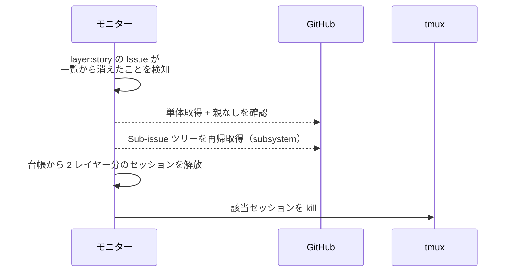
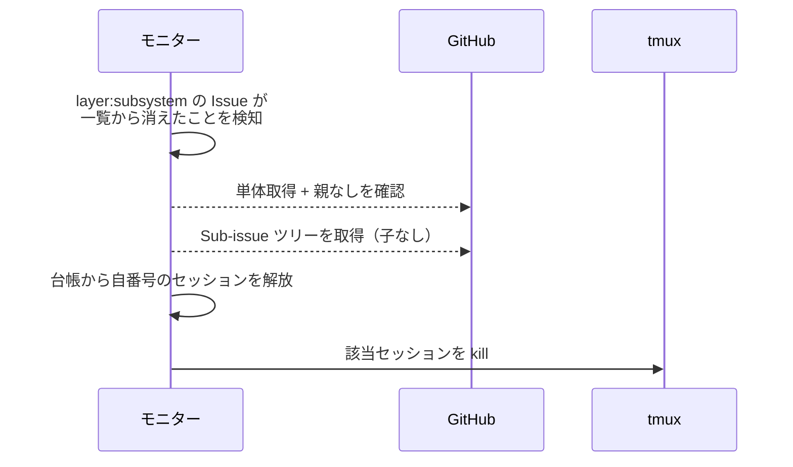
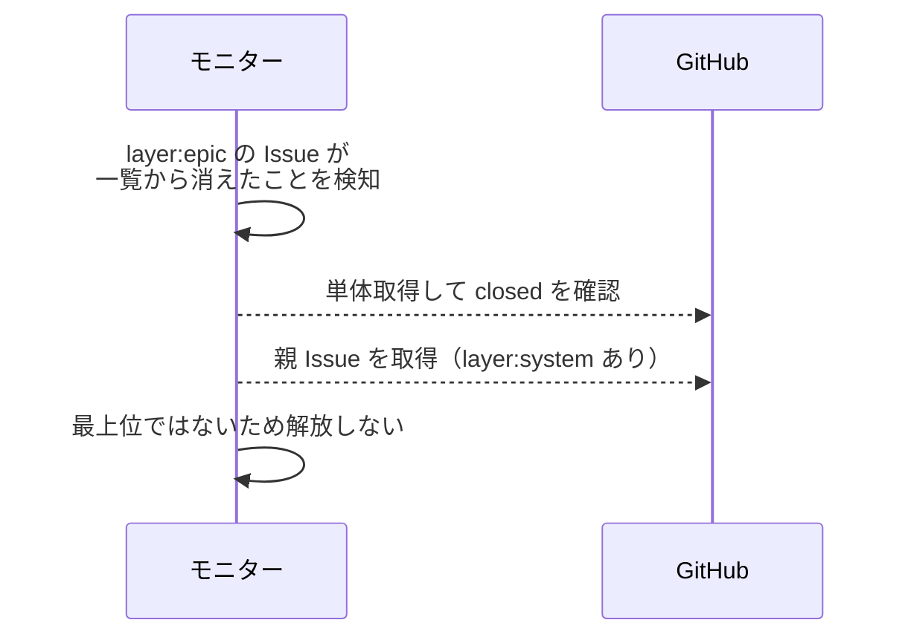
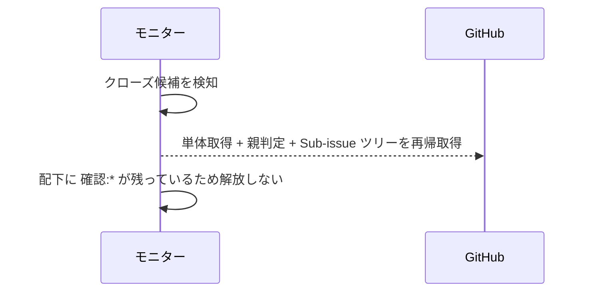

# 一括解放

トリガー: polling 周期（前周期の open 対象一覧との差分で、最上位 Issue の消失を検知）

最上位 Issue のクローズを検知し、その配下の全エージェントセッションを一括解放する。
最上位は「親 Issue を持たない」か「親が `layer:intake`」で判定する（`Claudeハーネス/共通ルール/最終マージの判定` と同じ基準）。
どのレイヤーから着手しても同じ判定で通るため、`layer:system` / `layer:epic` / `layer:story` / `layer:subsystem` のいずれが最上位でも対象になる。
親を持つ Issue（system 配下の epic 等）のクローズでは解放しない。
上位レイヤーが残っている間は、完了済みレイヤーの文脈を後工程で使うため待機中のセッションも常駐させる。
クローズは前周期の open 一覧との差分で候補化して単体取得で確認し、配下は検知時に Sub-issue ツリーを再帰取得して把握する（周期ごとの先回り取得はしない）。

- 対応テストファイル: `tests/integration/monitor/test_一括解放.py`

## 制約

| 項目 | 制約 | 補足 |
| --- | --- | --- |
| 前周期一覧 | メモリ保持のみ（永続化しない） | モニター再起動直後の周期は差分を検知できず、その間にクローズされた Issue は解放されないまま残る |
| 対象レイヤー | `layer:*` の値では絞らない | 親の有無だけで判定する（着手レイヤーに依存しない） |

## フロー一覧

| 分類 | フロー名 | 概要 | 補足 |
| --- | --- | --- | --- |
| 正常 | 正常系 | 最上位 close 検知 → 配下の全セッションを kill + 台帳から解放 | 代表は epic |
| 正常 | 正常系（system が最上位） | system 配下の全レイヤーを 1 回で解放 | 立ち上げ経路 |
| 正常 | 正常系（story が最上位） | story から着手した場合の解放 | - |
| 正常 | 正常系（subsystem が最上位） | subsystem から着手した場合の解放 | 配下なし |
| 正常 | 正常系（親を持つ Issue の close） | 親が居るので解放しない | system 配下の epic |
| 正常 | 正常系（確認ラベル残存） | 配下に `確認:*` が残っていれば解放しない | - |
| 異常 | 異常系（GitHub API エラー） | 単体取得 / ツリー取得の失敗で周期を見送る | - |

## 正常系

### セットアップ

| セットアップ | 説明 | 補足 |
| --- | --- | --- |
| Mock | GitHub API / tmux を差し替え | - |
| 前周期 | `layer:epic` の Issue #35 を含む open 一覧を前周期として保持 | - |
| 今周期 | #35 が open 一覧から消え、単体取得は closed を返す | - |
| 親 | #35 の親は `layer:intake` の #30 | 最上位判定を決定的に誘発 |
| 配下 | Sub-issue ツリー（story #40 / subsystem #50・いずれも `確認:*` なし） | - |
| 台帳 | #30 / #35 / #40 / #50 を主番号とするセッションが登録済み | - |

### フロー

### 期待値

- 配下（親の intake 含む）の全セッションが台帳から除去され永続化されている
- 該当する tmux セッションが kill されている

## 正常系（system が最上位）

### セットアップ

| セットアップ | 説明 | 補足 |
| --- | --- | --- |
| Mock | GitHub API / tmux を差し替え | - |
| 前周期 | `layer:system` の Issue #10 を含む open 一覧を前周期として保持 | - |
| 今周期 | #10 が open 一覧から消え、単体取得は closed を返す | - |
| 親 | #10 に親なし | 最上位判定を決定的に誘発 |
| 配下 | epic #35 / story #40 / subsystem #50（いずれも `確認:*` なし） | 4 レイヤー分 |
| 台帳 | #10 / #35 / #40 / #50 を主番号とするセッションが登録済み | - |

### フロー

### 期待値

- system 配下の epic / story / subsystem の全セッションが台帳から除去されている
- 該当する tmux セッションが全て kill されている

## 正常系（story が最上位）

### セットアップ

| セットアップ | 説明 | 補足 |
| --- | --- | --- |
| Mock | GitHub API / tmux を差し替え | - |
| 前周期 | `layer:story` の Issue #40 を含む open 一覧を前周期として保持 | story から直接着手した場合 |
| 今周期 | #40 が open 一覧から消え、単体取得は closed を返す | - |
| 親 | #40 に親なし | 最上位判定を決定的に誘発 |
| 配下 | subsystem #50（`確認:*` なし） | - |
| 台帳 | #40 / #50 を主番号とするセッションが登録済み | - |

### フロー

### 期待値

- story と配下 subsystem のセッションが台帳から除去されている
- 該当する tmux セッションが kill されている

## 正常系（subsystem が最上位）

### セットアップ

| セットアップ | 説明 | 補足 |
| --- | --- | --- |
| Mock | GitHub API / tmux を差し替え | - |
| 前周期 | `layer:subsystem` の Issue #50 を含む open 一覧を前周期として保持 | subsystem から直接着手した場合 |
| 今周期 | #50 が open 一覧から消え、単体取得は closed を返す | - |
| 親 | #50 に親なし | 最上位判定を決定的に誘発 |
| 配下 | なし（Sub-issue を持たない） | 最下位レイヤーが最上位になるケース |
| 台帳 | #50 を主番号とするセッションが登録済み | - |

### フロー

### 期待値

- subsystem 自身のセッションが台帳から除去されている
- 該当する tmux セッションが kill されている

## 正常系（親を持つ Issue の close）

### セットアップ

| セットアップ | 説明 | 補足 |
| --- | --- | --- |
| Mock | GitHub API / tmux を差し替え | - |
| 前周期 | `layer:epic` の Issue #35 を含む open 一覧を前周期として保持 | - |
| 今周期 | #35 が open 一覧から消え、単体取得は closed を返す | - |
| 親 | #35 の親は `layer:system` の #10（open） | 解放見送りを決定的に誘発 |
| 台帳 | #10 / #35 を主番号とするセッションが登録済み | - |

### フロー

### 期待値

- 台帳・tmux セッションが変化していない（上位の system が close するまで常駐する）

## 正常系（確認ラベル残存）

### セットアップ

| セットアップ | 説明 | 補足 |
| --- | --- | --- |
| Mock | GitHub API / tmux を差し替え | - |
| 今周期 | 最上位 #35 は closed だが、配下 subsystem #50 に `確認:subsystem-conductor` が残っている | 解放見送りを誘発 |

### フロー

### 期待値

- 台帳・tmux セッションが変化していない（次周期で再判定される）

## 異常系（GitHub API エラー）

### セットアップ

| セットアップ | 説明 | 補足 |
| --- | --- | --- |
| Mock | GitHub API を差し替え（単体取得で 4xx / 5xx を返す） | 異常を決定的に誘発 |

### フロー

### 期待値

- モニタープロセスが落ちない
- 台帳・tmux セッションが変化せず、次周期で再試行される
