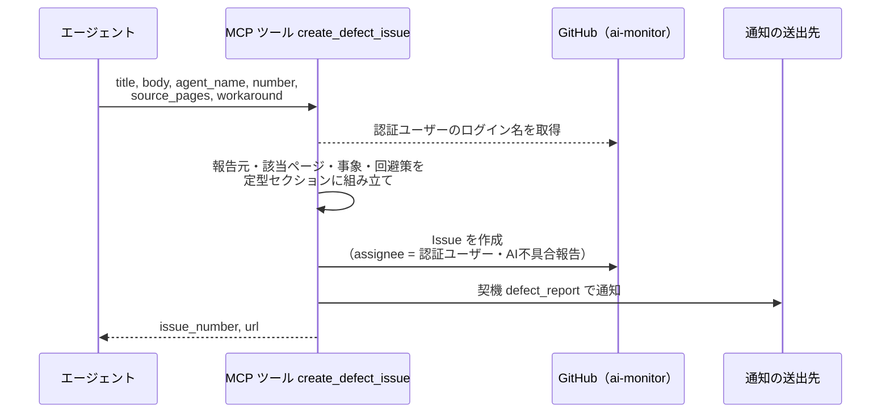
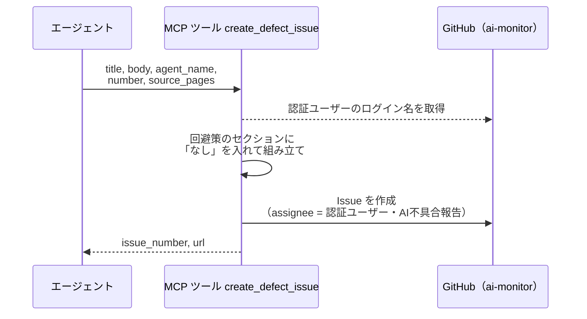
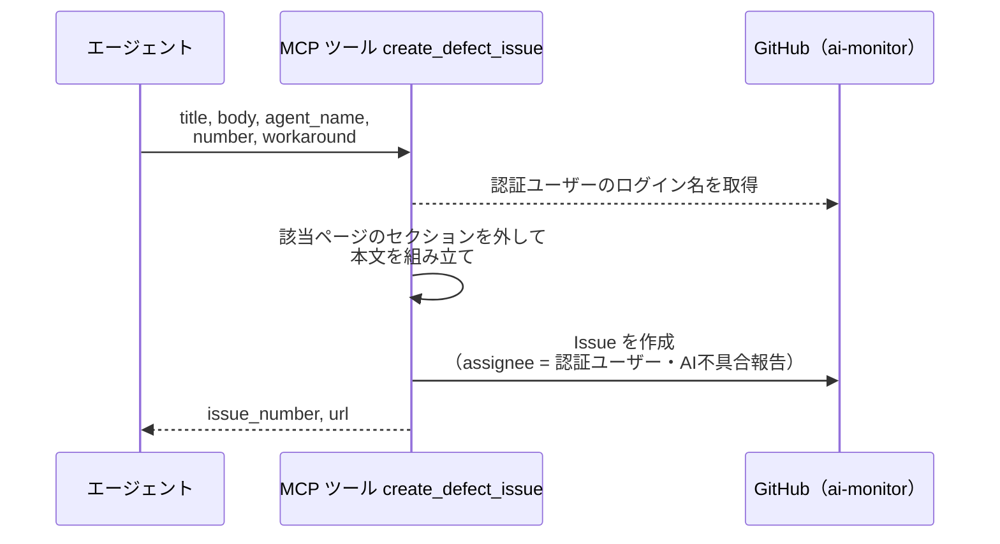
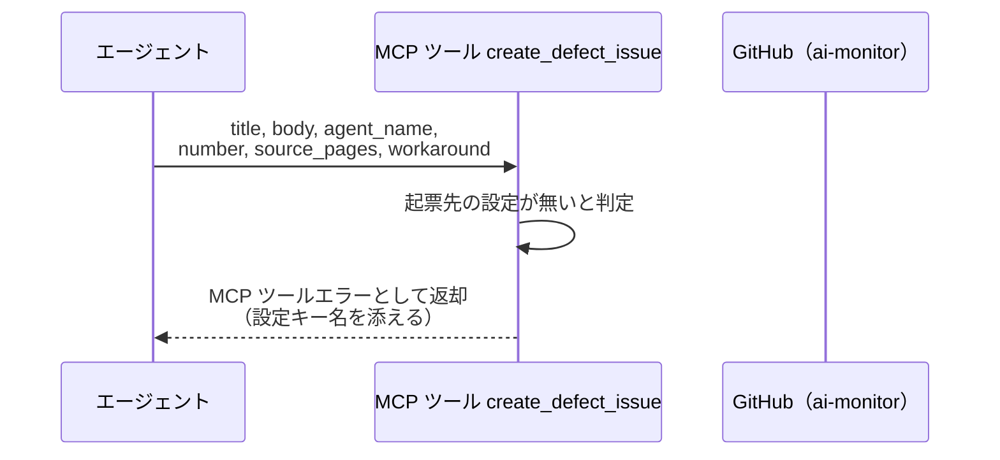
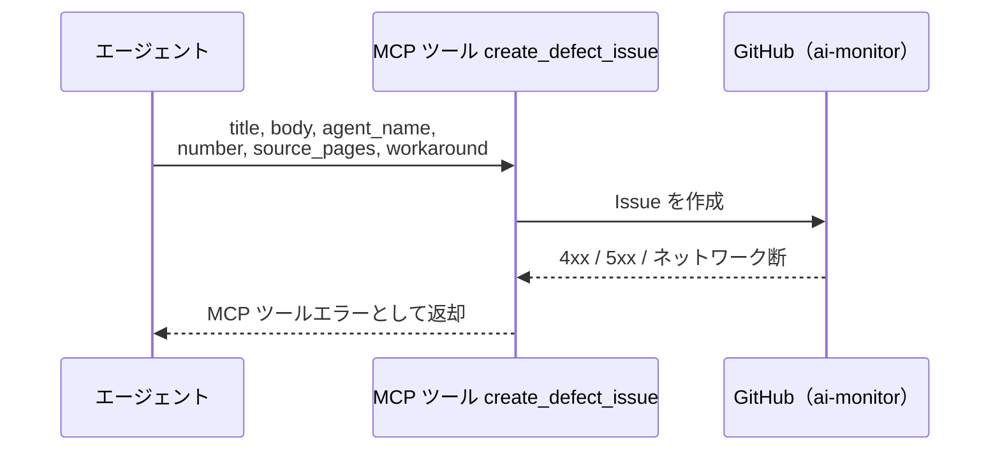

# 不具合Issue起票

MCP ツール: `create_defect_issue`

エージェントが手順書どおりに進められなかった事象を、ai-monitor 自身のリポジトリへ不具合 Issue として起票する。
1 回の呼び出しで 1 事象 = 1 Issue を作る。
1 つの事象が複数のページにまたがる場合は該当ページを配列で渡す（Issue を分けない）。

報告元（プロジェクト・エージェント・対象番号）・該当ページ・回避策を定型セクションに整えて本文にする。
回避策の有無は「そのターンで作業を続けられたか」を表し、Issue を見たときの緊急度の判断材料になる。
assignee は認証ユーザーで、ラベルは `AI不具合報告` だけを付ける（AI の報告であることを一覧で判別するため）。
確認ラベルは付けないので、ユーザーが内容を確認して `確認:intake-issue-triager` を付けるまで改修フローには乗らない。

[新規Issue起票](./新規Issue起票.py.md)との違いは起票先と入口の扱い。
あちらは呼び出し元セッションのプロジェクトへ起票して即座に intake へ流すが、こちらは担当プロジェクトではなく ai-monitor のリポジトリへ起票し、ユーザーの承認を挟む。

- 対応テストファイル: `tests/integration/mcp/test_create_defect_issue.py`

## インターフェース

### リクエスト

| パラメータ | 型 | 必須 | デフォルト | 説明 | 制限 | 補足 |
| --- | --- | --- | --- | --- | --- | --- |
| `title` | str | ✅ | - | 不具合の要約 | - | 1 行で事象が分かるもの |
| `body` | str | ✅ | - | 事象と再現の経緯 | - | Markdown 可。定型セクションは本ツールが組み立てる |
| `agent_name` | str | ✅ | - | 報告元のエージェント名 | - | `@` は不要 |
| `number` | int | ✅ | - | 報告元の Issue / PR 番号 | - | 担当プロジェクト側の番号 |
| `source_pages` | str[] | - | `[]`（該当ページのセクションを出さない） | 該当する Wiki ページのパス | - | 手順書・規約・テンプレートのいずれでもよい。1 事象が複数ページにまたがる場合に並べる |
| `workaround` | str | - | なし（回避策なしとして本文に出す） | 取った回避策 | - | 省略 = そのターンで作業を続けられなかった |

リクエスト例:

```json
{
  "title": "subsystemマージ の作業完了報告が監視面除去の後で失敗する",
  "body": "共通ルール『最終マージの判定』の監視面除去を先に実行すると、作業完了報告が処理中ラベルの付いた PR 番号で台帳を解決できず失敗しました。\n\n再現: subsystem PR をマージ → 監視面から PR 番号を除去 → 作業完了報告でセッション未検出エラー。\n",
  "agent_name": "subsystem-conductor",
  "number": 1179,
  "source_pages": [
    "Claudeハーネス/共通ルール/最終マージの判定.md",
    "エージェント/subsystem-conductor/フェーズ/subsystemマージ.md"
  ],
  "workaround": "主番号（subsystem Issue の番号）で作業完了報告を出し、PR に残った処理中ラベルは フェーズ遷移 で除去しました。"
}
```

### レスポンス

| フィールド | 型 | 説明 | 制限 | 補足 |
| --- | --- | --- | --- | --- |
| `issue_number` | int | 作成した Issue 番号 | - | ai-monitor のリポジトリでの番号 |
| `url` | str | Issue の html URL | - | 報告元へリンクを残すときに使う |

レスポンス例:

```json
{
  "issue_number": 214,
  "url": "https://github.com/{owner}/ai-monitor/issues/214"
}
```

本文例（作成される Issue の本文）:

```markdown
## 報告元

| 項目 | 値 |
| --- | --- |
| プロジェクト | sandbox |
| エージェント | subsystem-conductor |
| 対象 | shuhei1101/ai-monitor-e2e#1179 |

## 該当ページ

- `Claudeハーネス/共通ルール/最終マージの判定.md`
- `エージェント/subsystem-conductor/フェーズ/subsystemマージ.md`

## 事象

共通ルール『最終マージの判定』の監視面除去を先に実行すると、作業完了報告が処理中ラベルの付いた PR 番号で台帳を解決できず失敗しました。

再現: subsystem PR をマージ → 監視面から PR 番号を除去 → 作業完了報告でセッション未検出エラー。

## 回避策

主番号（subsystem Issue の番号）で作業完了報告を出し、PR に残った処理中ラベルは フェーズ遷移 で除去しました。
```

## 制約

| 項目 | 制約 | 補足 |
| --- | --- | --- |
| タイムアウト | 制限なし | - |
| 起票先 | ai-monitor 自身のリポジトリ（設定で指定） | 呼び出し元セッションのプロジェクトではない。未設定なら起票せずエラー |
| 起票の粒度 | 1 回の呼び出しで 1 Issue | 1 事象 = 1 Issue。複数ページにまたがる事象は `source_pages` に並べて 1 件にまとめる |
| 付与ラベル | `AI不具合報告` のみ | AI の報告であることの目印。確認ラベルは付けないので、ユーザーが `確認:intake-issue-triager` を付けるまで改修フローに乗らない |
| assignee | 認証ユーザー 1 名で固定 | 呼び出し側が選べない（承認する相手が常にユーザーのため） |
| 通知 | 起票のたびに契機 `defect_report` で送る | 承認するまで Issue が動かないため溜めずに知らせる。送出に失敗しても起票は成功として返す |

## フロー一覧

| 分類 | フロー名 | 概要 | 補足 |
| --- | --- | --- | --- |
| 正常 | 正常系 | 定型本文の組み立て → Issue 作成（assignee + `AI不具合報告`）→ 番号と URL の返却 | 回避策あり・該当ページあり |
| 正常 | 正常系（回避策なし） | 回避策のセクションに「なし」を出して起票する | そのターンで作業を続けられなかった場合 |
| 正常 | 正常系（該当ページが不明） | 該当ページのセクションを出さずに起票する | 手順書のどこが原因か特定できない場合 |
| 異常 | 異常系（起票先が未設定） | 設定に ai-monitor のリポジトリが無く起票できない | - |
| 異常 | 異常系（API エラー） | 認証切れ / ネットワーク断 | - |

## 正常系

### セットアップ

| セットアップ | 説明 | 補足 |
| --- | --- | --- |
| Mock | GitHub API を差し替え（正常応答を返す） | - |
| 設定 | ai-monitor のリポジトリを指す設定あり | 起票先の解決に使う |
| 呼び出し元 | 担当プロジェクト（ai-monitor 以外）のセッション | 起票先が呼び出し元と別であることを確認するため |
| 入力 | `source_pages` に 2 件、`workaround` に回避策を指定 | 全セクションが出る経路を通す |

### フロー



### 期待値

- ai-monitor のリポジトリに Issue が作成されている（呼び出し元セッションのプロジェクトではない）
- 本文に報告元（プロジェクト名・エージェント名・対象番号）・該当ページ・事象・回避策が入っている
- 該当ページのセクションに渡した 2 件が箇条書きで並んでいる
- assignee が認証ユーザーになっている
- ラベルが `AI不具合報告` の 1 つだけで、確認ラベルが付いていない
- 契機 `defect_report` の通知が送られ、本文から起票した Issue を辿れる
- 戻り値の `issue_number` / `url` が作成した Issue を指している

## 正常系（回避策なし）

### セットアップ

| セットアップ | 説明 | 補足 |
| --- | --- | --- |
| Mock | GitHub API を差し替え（正常応答を返す） | - |
| 設定 | ai-monitor のリポジトリを指す設定あり | - |
| 入力 | `workaround` を省略して呼び出す | 分岐を決定的に誘発 |

### フロー



### 期待値

- 本文の回避策のセクションに、回避できず作業を中断したことが分かる記載が入っている
- 本文の報告元・該当ページ・事象のセクションは正常系と同じ形で入っている
- assignee が認証ユーザーになっている

## 正常系（該当ページが不明）

### セットアップ

| セットアップ | 説明 | 補足 |
| --- | --- | --- |
| Mock | GitHub API を差し替え（正常応答を返す） | - |
| 設定 | ai-monitor のリポジトリを指す設定あり | - |
| 入力 | `source_pages` を省略して呼び出す | 分岐を決定的に誘発 |

### フロー



### 期待値

- 本文に該当ページのセクションが無い
- 本文の報告元・事象・回避策のセクションは正常系と同じ形で入っている
- assignee が認証ユーザーになっている

## 異常系（起票先が未設定）

### セットアップ

| セットアップ | 説明 | 補足 |
| --- | --- | --- |
| Mock | GitHub API を差し替え（呼ばれないことを確認する） | - |
| 設定 | ai-monitor のリポジトリを指す設定を書かない | 異常を決定的に誘発 |

### フロー



### 期待値

- MCP ツールエラーが返り、メッセージに必要な設定キー名が含まれる
- Issue の作成 API が呼ばれていない

## 異常系（API エラー）

### セットアップ

| セットアップ | 説明 | 補足 |
| --- | --- | --- |
| Mock | GitHub API を差し替え（4xx / 5xx を返す） | 異常を決定的に誘発 |
| 設定 | ai-monitor のリポジトリを指す設定あり | - |

### フロー



### 期待値

- MCP ツールエラーが返る（HTTP ステータスと本文を含む）
- Issue が作成されていない
