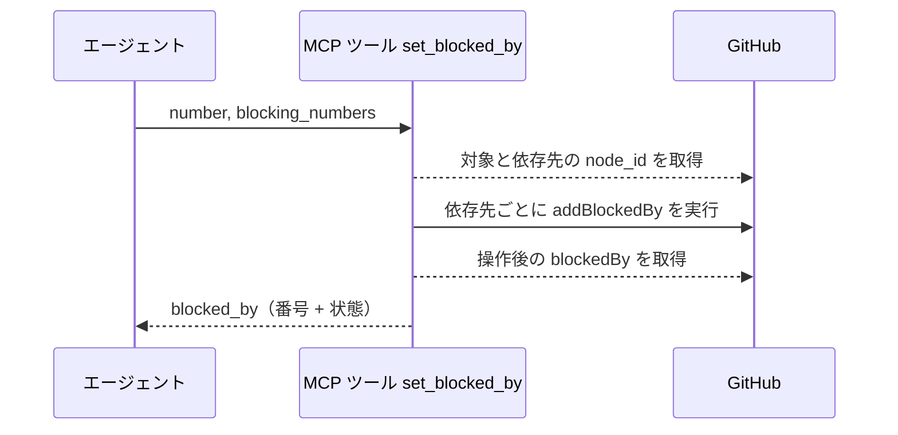
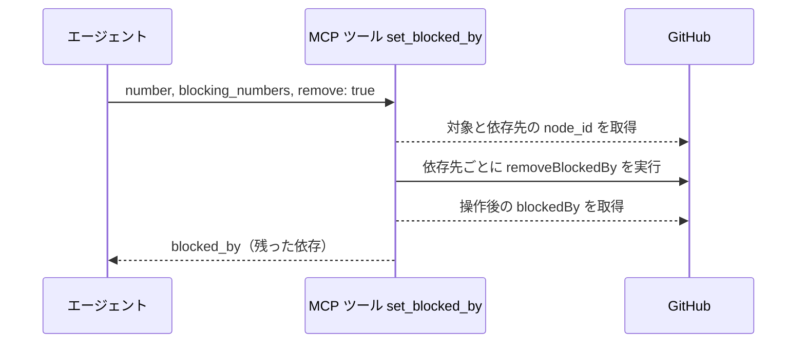
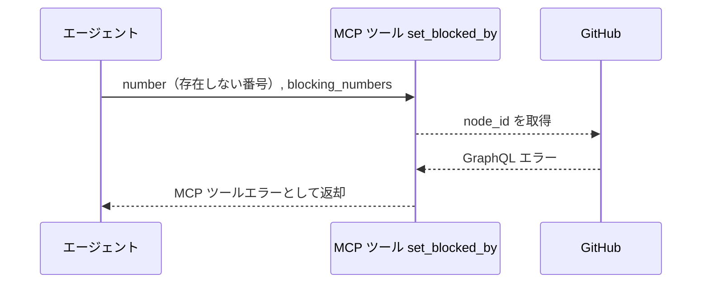

# 依存設定

MCP ツール: `set_blocked_by`

対象 Issue に「この Issue が終わるまで着手できない」という依存（GitHub の blocked by）を設定・解除する。

- 対応テストファイル: `tests/integration/mcp/test_依存設定.py`

## インターフェース

### リクエスト

| パラメータ | 型 | 必須 | デフォルト | 説明 | 制限 | 補足 |
| --- | --- | --- | --- | --- | --- | --- |
| `number` | int | ✅ | - | 依存を設定する Issue 番号 | - | ブロックされる側 |
| `blocking_numbers` | int[] | ✅ | - | 依存先の Issue 番号 | 1 件以上 | ブロックする側 |
| `remove` | bool | - | `False` | `True` で依存を解除する | - | - |

リクエスト例:

```json
{
  "number": 52,
  "blocking_numbers": [48, 49]
}
```

### レスポンス

| フィールド | 型 | 説明 | 制限 | 補足 |
| --- | --- | --- | --- | --- |
| `blocked_by` | object[] | 操作後の依存一覧 | - | 現況を返す（冪等操作の確認用） |
| `blocked_by[].number` | int | 依存先の Issue 番号 | - | - |
| `blocked_by[].state` | str | 依存先の状態 | - | `OPEN` / `CLOSED` |

レスポンス例:

```json
{
  "blocked_by": [
    { "number": 48, "state": "CLOSED" },
    { "number": 49, "state": "OPEN" }
  ]
}
```

## 制約

| 項目 | 制約 | 補足 |
| --- | --- | --- |
| タイムアウト | 制限なし | - |
| 対象 | Issue のみ | PR には設定しない |
| 親子関係 | 親 Issue / 子 Issue を依存先にしない | Sub-issue リンクと二重管理になるため |
| 冪等性 | 設定済みの依存を再設定しても増えない | 解除も同様に、未設定でもエラーにしない |

## フロー一覧

| 分類 | フロー名 | 概要 | 補足 |
| --- | --- | --- | --- |
| 正常 | 正常系 | 依存を設定して操作後の一覧を返す | 複数件をまとめて設定できる |
| 正常 | 正常系（解除） | `remove=true` で依存を解除する | - |
| 異常 | 異常系（API エラー） | Issue 不存在 / 権限不足 | - |

## 正常系

### セットアップ

| セットアップ | 説明 | 補足 |
| --- | --- | --- |
| Mock | GitHub API を差し替え（正常応答を返す） | - |
| 対象 Issue | 依存を設定する Issue が open で存在 | - |
| 依存先 Issue | 2 件存在し、片方は closed | 状態が混在する状況を作る |

### フロー



### 期待値

- 指定した依存先がすべて blocked by として設定されている
- 戻り値の `blocked_by` に依存先の番号と状態が入っている
- 同じ依存先を再度指定しても件数が増えない（冪等）

## 正常系（解除）

### セットアップ

| セットアップ | 説明 | 補足 |
| --- | --- | --- |
| Mock | GitHub API を差し替え（正常応答を返す） | - |
| 対象 Issue | 依存が 2 件設定済み | - |
| 入力 | `remove: true` で 1 件を指定 | 分岐を決定的に誘発 |

### フロー



### 期待値

- 指定した依存だけが解除され、残りは維持されている
- 未設定の依存先を指定してもエラーにならない（冪等）

## 異常系（API エラー）

### セットアップ

| セットアップ | 説明 | 補足 |
| --- | --- | --- |
| Mock | GitHub API を差し替え（GraphQL エラーを返す） | - |
| 対象番号 | 存在しない Issue 番号を指定して呼び出す | API エラーを決定的に誘発 |

### フロー



### 期待値

- MCP ツールエラーが返る（GraphQL のエラーメッセージを含む）
- 依存関係が変更されていない
