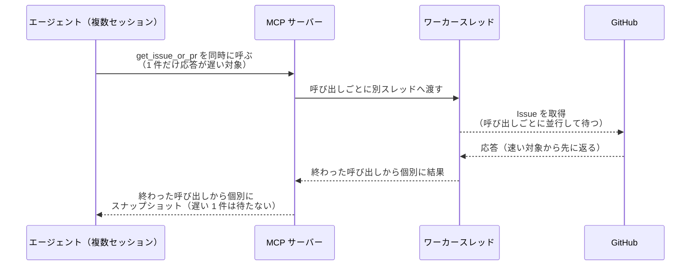
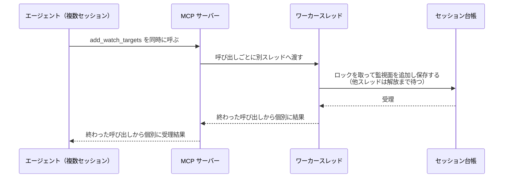

# 同時呼び出し

トリガー: 複数のエージェントセッションが同じ MCP サーバーへ同時にツール呼び出しを投げたとき

複数のエージェントセッションから同時に届くツール呼び出しを、ワーカースレッドへ逃がして並行に処理する。

- 対応テストファイル: `tests/integration/mcp/test_同時呼び出し.py`

## 制約

| 項目 | 制約 | 補足 |
| --- | --- | --- |
| 同時実行数 | `anyio` のワーカースレッド既定上限（40） | 同時稼働セッション数を上回るため設定値には出さない |
| タイムアウト | 制限なし | 打ち切りは呼び出し側（エージェント）の MCP クライアントが行う |

## フロー一覧

| 分類 | フロー名 | 概要 | 補足 |
| --- | --- | --- | --- |
| 正常 | 正常系 | 同時に呼ばれたツールが並行処理され、終わったものから返る | 待ち時間が加算されない |
| 正常 | 正常系（台帳を触るツール） | 同時更新でも全ての変更が台帳とファイルに残る | ロック自体の検証は台帳の単体テスト |

## 正常系

### セットアップ

| セットアップ | 説明 | 補足 |
| --- | --- | --- |
| Mock | githubkit クライアントを、応答までスリープするスタブに差し替え | ブロッキング I/O の再現 |
| 対象 | 読み取りツールを同時に呼ぶ。先に投げた 1 件だけ応答を遅くする | 直列化・待ち合わせの両方を決定的に炙り出す |

### フロー

### 期待値

- 呼び出した全件が対象番号のスナップショットを返す
- 応答が速い呼び出しは、先に投げた遅い呼び出しより先に返る
- 所要時間が最も遅い 1 件分に収まる（呼び出し件数に比例しない）

## 正常系（台帳を触るツール）

### セットアップ

| セットアップ | 説明 | 補足 |
| --- | --- | --- |
| Mock | githubkit クライアントを MagicMock に差し替え | 台帳操作のみを見る |
| 台帳 | 監視面が空のセッションを 4 件登録済み | 同時更新の対象 |
| 対象 | それぞれ別番号を追加する `add_watch_targets` を 4 件同時に呼ぶ | 読む → 変える → 保存する が重なる |

### フロー

### 期待値

- 4 セッションとも自分の追加番号が監視面に入っている
- 台帳ファイルにも 4 件分の追加が残っている
