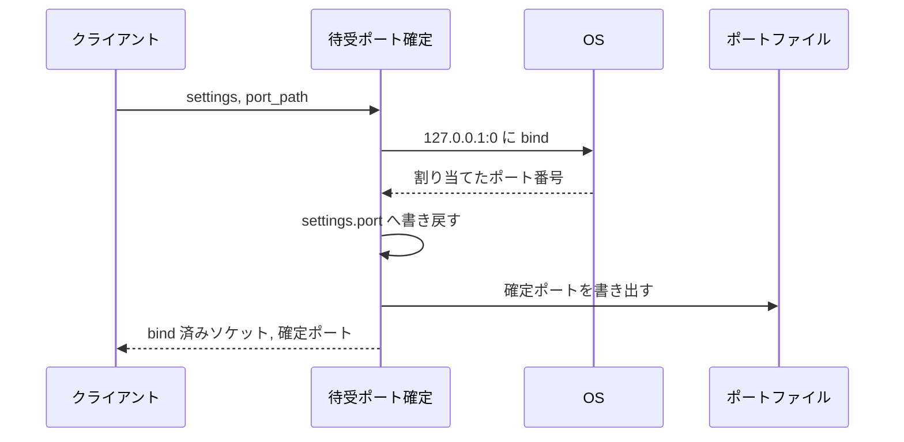
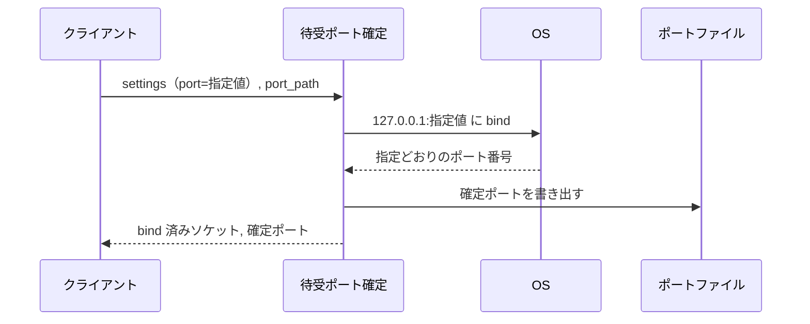
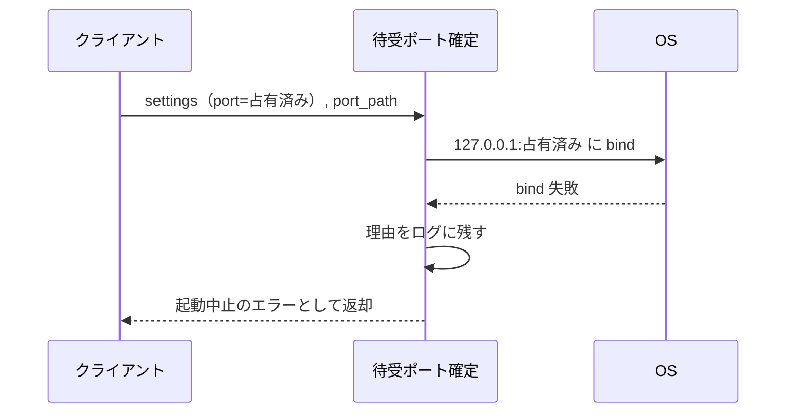

# 待受ポート確定

トリガー: モニターの起動時（`main()` が uvicorn を起動する前に 1 回）

設定の待受ポートから実際の待受ソケットを bind し、確定したポート番号を設定へ書き戻してファイルへ公開する。

- 対応テストファイル: `tests/integration/monitor/test_待受ポート確定.py`

## インターフェース

### リクエスト

| パラメータ | 型 | 必須 | デフォルト | 説明 | 制限 | 補足 |
| --- | --- | --- | --- | --- | --- | --- |
| `settings` | object | ✅ | - | 稼働中の全体設定 | - | `port` を読み、確定値を書き戻す |
| `port_path` | str | ✅ | - | 確定ポートの公開先ファイル | - | 親ディレクトリが無ければ作る |

`settings.port` の扱い:

| 値 | 挙動 |
| --- | --- |
| `0` | OS が空いているポートを選ぶ |
| `1` 以上 | その番号で bind する。使用中なら起動を中止する |

### レスポンス

| フィールド | 型 | 説明 | 制限 | 補足 |
| --- | --- | --- | --- | --- |
| `socket` | object | bind 済みの待受ソケット | - | uvicorn へそのまま渡す。確定ポートは `settings.port` と公開ファイルで伝える |

## 制約

| 項目 | 制約 | 補足 |
| --- | --- | --- |
| タイムアウト | 制限なし | - |
| 待受アドレス | `127.0.0.1` 固定 | 外部公開しない |
| ソケットの扱い | bind したソケットを閉じずに返す | 再 bind の隙間を作らないため |
| `SO_REUSEADDR` | 設定しない | 使用中ポートの指定を検出できなくなるため |
| 公開ファイル | 確定後に上書きする | bind に失敗した場合は書き込まない（古い値を残さない） |
| 台帳 | 持たない | 使用中ポートの一覧は管理せず、OS の割り当てに任せる |

## フロー一覧

| 分類 | フロー名 | 概要 | 補足 |
| --- | --- | --- | --- |
| 正常 | 正常系 | `0` 指定で OS が選んだポートを確定して公開する | - |
| 正常 | 正常系（ポート指定） | 指定した番号で bind して公開する | - |
| 異常 | 異常系（指定ポートが使用中） | bind に失敗し、起動を中止する | 公開ファイルは更新しない |

## 正常系

### セットアップ

| セットアップ | 説明 | 補足 |
| --- | --- | --- |
| Mock | なし（実際にソケットを bind する） | ポート確定が検証対象のため差し替えない |
| 設定 | `port` に `0` を指定 | 自動確定を決定的に誘発 |
| 公開先 | 一時ディレクトリのパスを指定 | 既存ファイルなし |

### フロー

### 期待値

- 戻り値のポートが 1 以上である
- `settings.port` が戻り値と同じ値に書き換わっている
- 公開ファイルの内容が戻り値と一致している
- 返ったソケットが `127.0.0.1` の当該ポートで listen できる状態にある

## 正常系（ポート指定）

### セットアップ

| セットアップ | 説明 | 補足 |
| --- | --- | --- |
| Mock | なし（実際にソケットを bind する） | - |
| 設定 | `port` に空いている固定値を指定 | 事前に空きを確認した番号を使う |
| 公開先 | 一時ディレクトリのパスを指定 | - |

### フロー

### 期待値

- 戻り値のポートが指定値と一致している
- 公開ファイルの内容が指定値と一致している

## 異常系（指定ポートが使用中）

### セットアップ

| セットアップ | 説明 | 補足 |
| --- | --- | --- |
| Mock | なし（実際にソケットを bind する） | - |
| 占有 | 対象ポートを別のソケットで bind 済みにする | bind 失敗を決定的に誘発 |
| 設定 | その占有済みポートを指定 | - |
| 公開先 | 既存の内容を書いたファイルを置く | 上書きされないことを見る |

### フロー

### 期待値

- エラーが返り、メッセージに使用中である旨と該当ポート番号が含まれている
- 公開ファイルの内容が実行前から変わっていない
- `settings.port` が書き換わっていない
