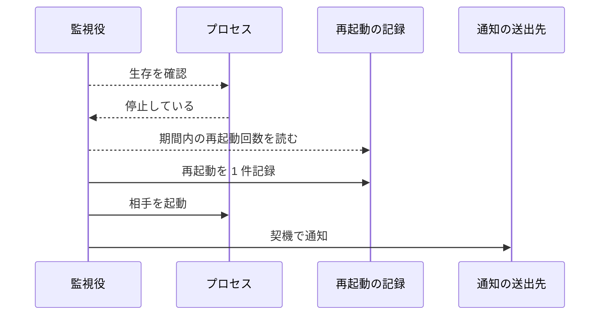
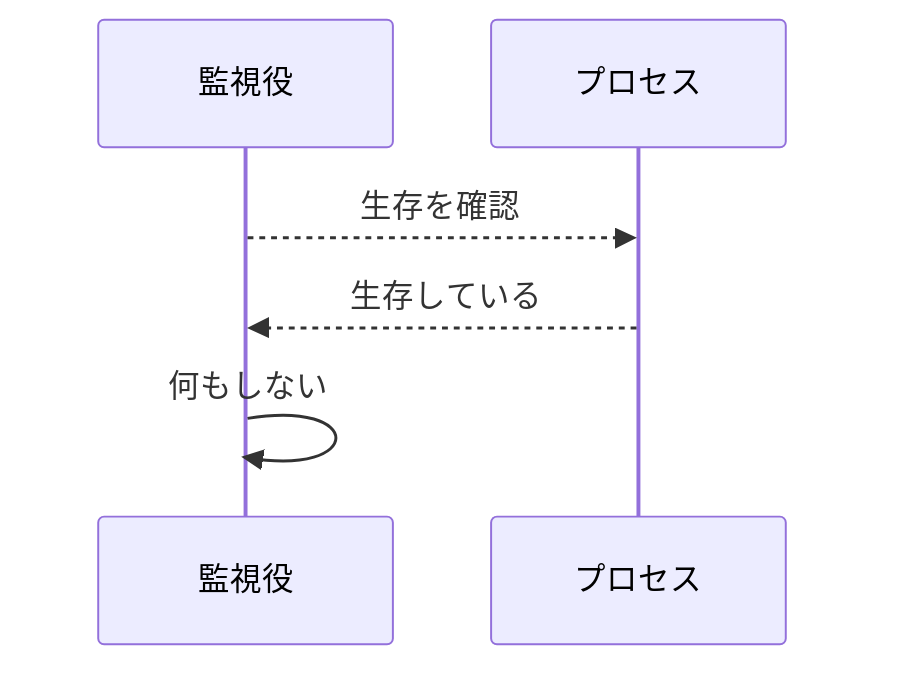
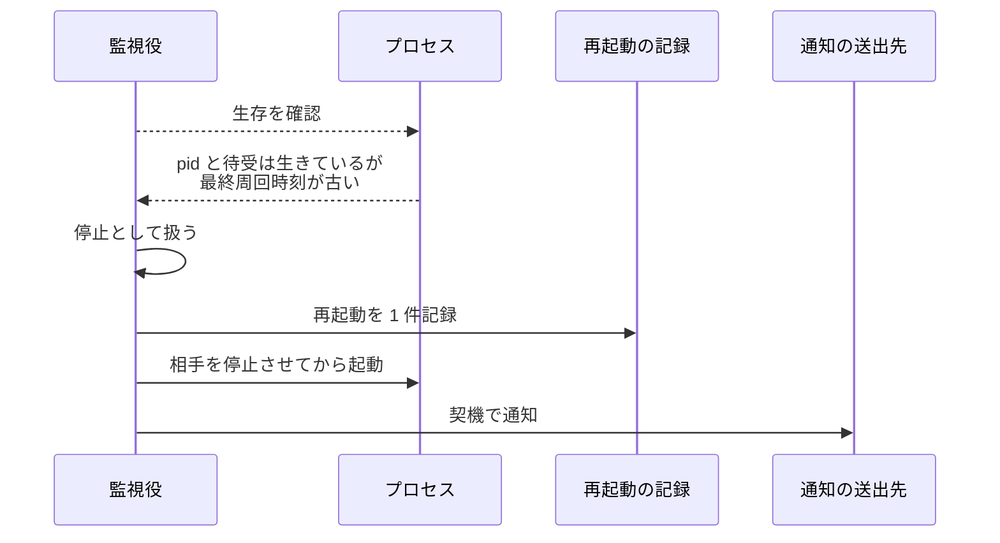
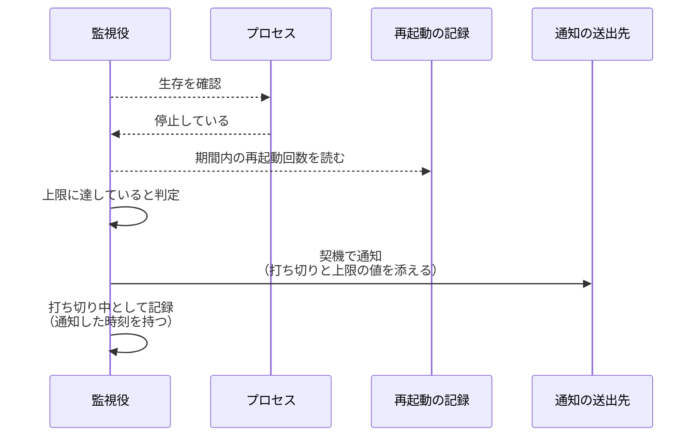
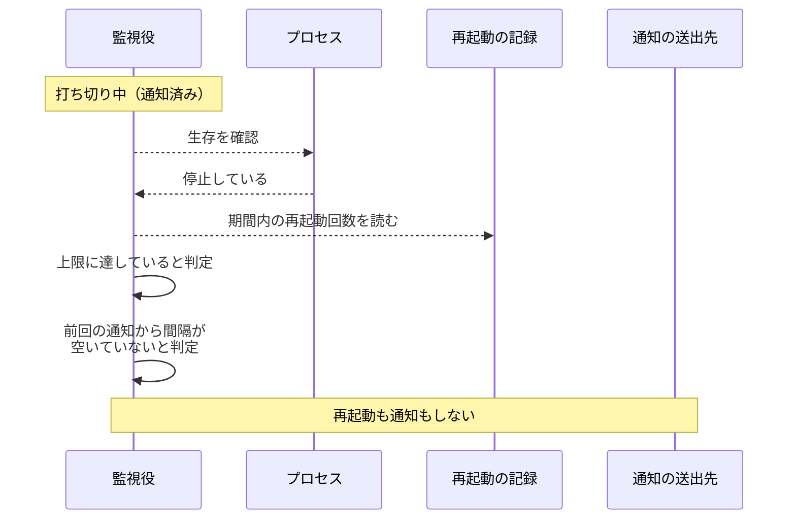
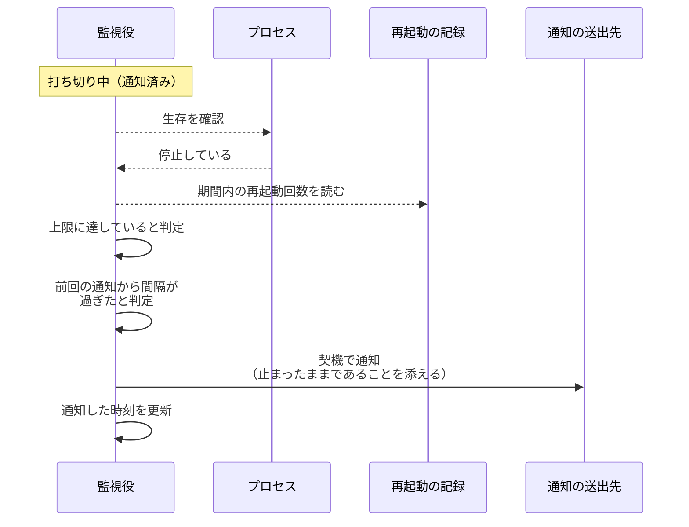
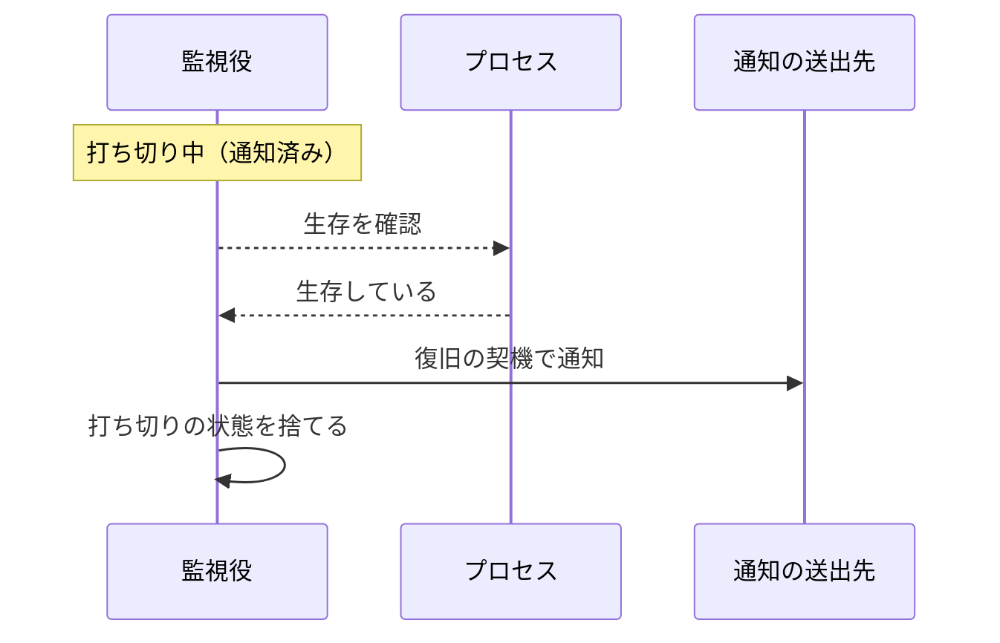
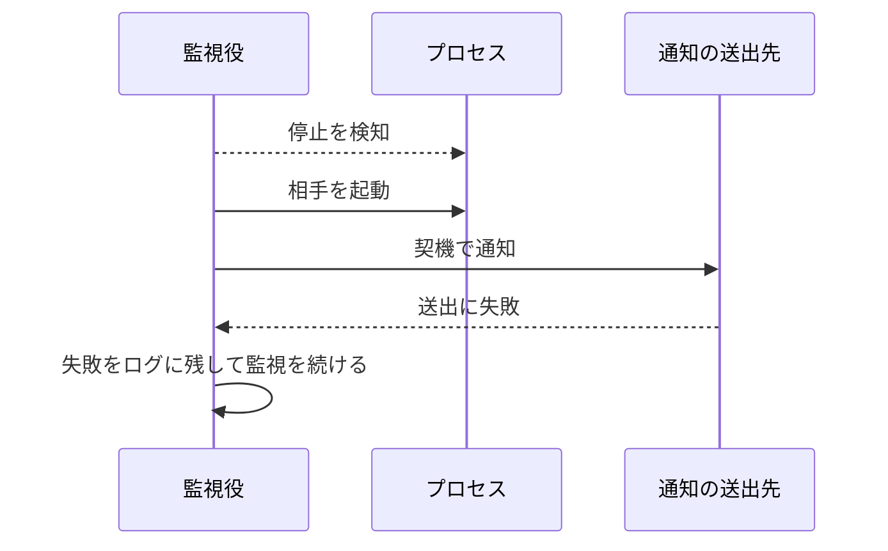
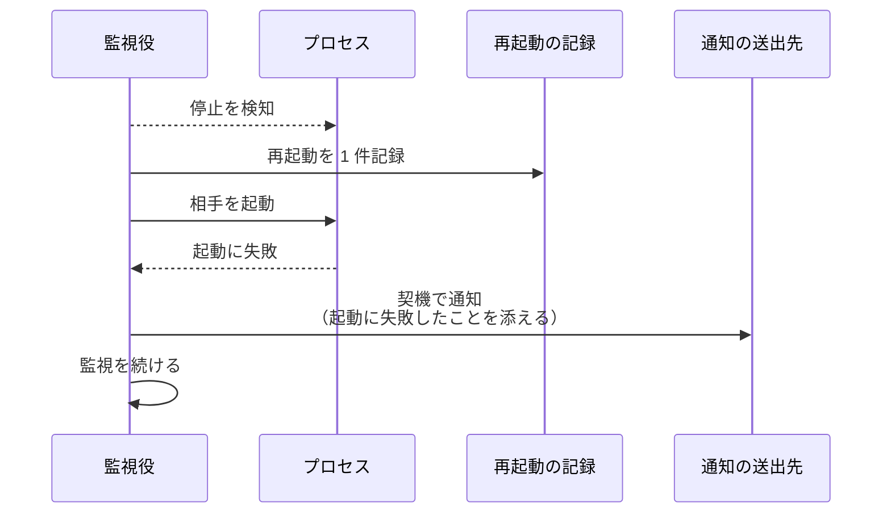

# 死活検知

トリガー: 監視周期（`watchdog.interval_sec` ごと）

相手プロセスの生存を確認し、停止していれば再起動して通知する。
監視役はモニターを、モニターは監視役を見る。

- 対応テストファイル: `tests/integration/monitor/test_死活検知.py`

## 制約

| 項目 | 制約 | 補足 |
| --- | --- | --- |
| 生存材料 | pid の生存と最終周回時刻の鮮度（両方の対象）+ 待受ポートの応答（モニターのみ） | 1 つでも欠けたら停止とみなす |
| 周期 | 設定 `watchdog.interval_sec`（既定 15 秒） | 監視役とモニターで同じ値を使う |
| 鮮度の閾値 | 最終周回時刻から `watchdog.liveness_timeout_sec`（既定 120 秒） | ポーリング周期より十分長くとる |
| 再起動の上限 | `watchdog.restart_window_min`（既定 60 分）内に `watchdog.restart_max` 回（既定 3 回） | 相手ごとに別勘定 |
| 打ち切り中の生存確認 | 周期で続ける | ファイルとソケットを見るだけなので負荷にならず、止めると復帰に気づけない |
| 打ち切り中の通知間隔 | 設定 `watchdog.suspended_notify_interval_min`（既定 60 分） | 打ち切りに入った最初は即時に送り、以降はこの間隔を空けて再通知する |
| 打ち切り状態の保持 | 監視する側のプロセス内（永続化しない） | プロセスが再起動すると失われるが、打ち切りの事実も引き継がないので齟齬は起きない |
| 上限超過からの復帰 | 期間が過ぎて古い記録が対象外になれば自動で再開 | 手動の解除操作は持たない |
| 再起動する相手 | 監視役 → モニター / モニター → 監視役 | 相手を落とす操作は持たない（往復ループを作らない） |

## フロー一覧

| 分類 | フロー名 | 概要 | 補足 |
| --- | --- | --- | --- |
| 正常 | 正常系 | 相手の停止を検知 → 記録 → 再起動 → 通知 | - |
| 正常 | 正常系（生存） | 生存材料が全て揃っているので何もしない | - |
| 正常 | 正常系（周回の停止） | プロセスも待受も生きているが最終周回時刻が古い | 停止として扱う |
| 正常 | 正常系（再起動の上限超過） | 期間内の再起動が上限に達している | 再起動せず通知して打ち切りに入る |
| 正常 | 正常系（打ち切り中の再通知抑制） | 前回の通知から間隔が空いていない | 生存の確認だけ続ける |
| 正常 | 正常系（打ち切り中の定期報告） | 前回の通知から間隔を過ぎている | 止まったままであることを再通知 |
| 正常 | 正常系（打ち切りからの復帰） | 打ち切り中に相手の生存を確認した | 復旧を通知して打ち切りの状態を捨てる |
| 異常 | 異常系（通知の送出に失敗） | 通知が失敗しても再起動は完了し監視を続ける | - |
| 異常 | 異常系（再起動に失敗） | 起動そのものが失敗する | 記録して次周期で再試行 |

## 正常系

### セットアップ

| セットアップ | 説明 | 補足 |
| --- | --- | --- |
| Mock | プロセスの生存確認 / 起動 / 通知の送出を差し替え | - |
| 相手 | pid の生存確認が偽を返す | 停止を決定的に誘発 |
| 再起動の記録 | 期間内の記録が上限未満 | 再起動する経路を通す |

### フロー

### 期待値

- 相手の起動が 1 回だけ呼ばれている
- 再起動の記録に 1 件が追加されている
- 対象に応じた契機（モニターなら `monitor_down` / 監視役なら `watchdog_down`）で通知が送られている

## 正常系（生存）

### セットアップ

| セットアップ | 説明 | 補足 |
| --- | --- | --- |
| Mock | プロセスの生存確認 / 起動 / 通知の送出を差し替え | - |
| 相手 | pid が生存・最終周回時刻が閾値内・待受ポートが応答 | 生存を決定的に誘発 |
| 打ち切りの状態 | 保持していない | 復旧の通知が出ない経路を通す |

### フロー

### 期待値

- 起動・記録・通知のいずれも呼ばれていない

## 正常系（周回の停止）

### セットアップ

| セットアップ | 説明 | 補足 |
| --- | --- | --- |
| Mock | プロセスの生存確認 / 起動 / 通知の送出を差し替え | - |
| 相手 | pid が生存・待受ポートも応答するが、最終周回時刻が閾値を超過 | 分岐を決定的に誘発 |
| 再起動の記録 | 期間内の記録が上限未満 | - |

### フロー

### 期待値

- 起動の前に停止が呼ばれている（pid が残ったまま二重起動しない）
- 通知の本文に、周回が止まっていたことが載っている

## 正常系（再起動の上限超過）

### セットアップ

| セットアップ | 説明 | 補足 |
| --- | --- | --- |
| Mock | プロセスの生存確認 / 起動 / 通知の送出を差し替え | - |
| 相手 | pid の生存確認が偽を返す | - |
| 再起動の記録 | 期間内の記録が上限回数ぶん存在 | 上限超過を決定的に誘発 |
| 打ち切りの状態 | 保持していない | 初回の通知を決定的に誘発 |

### フロー

### 期待値

- 相手の起動が呼ばれていない
- 再起動の記録が増えていない
- 通知の本文に、再起動を打ち切ったことと上限の値が載っている
- 打ち切りの状態が記録され、今回の通知時刻を持っている

## 正常系（打ち切り中の再通知抑制）

### セットアップ

| セットアップ | 説明 | 補足 |
| --- | --- | --- |
| Mock | プロセスの生存確認 / 起動 / 通知の送出を差し替え | - |
| 打ち切りの状態 | 前の周期で相手の停止を検知して再起動を打ち切り、通知間隔の内側に通知済み | 抑制を決定的に誘発 |
| 相手 | 停止したまま（pid の生存確認が偽を返す） | - |
| 再起動の記録 | 期間内の記録が上限回数ぶん存在 | 打ち切りが続く状態を保つ |

### フロー

### 期待値

- 相手の起動が呼ばれていない
- 通知が 1 件も送られていない
- 生存の確認は行われている（打ち切り中も監視を止めない）
- 打ち切りの状態が持つ通知時刻が変わっていない

## 正常系（打ち切り中の定期報告）

### セットアップ

| セットアップ | 説明 | 補足 |
| --- | --- | --- |
| Mock | プロセスの生存確認 / 起動 / 通知の送出を差し替え | - |
| 打ち切りの状態 | 前の周期までに相手の停止を検知して再起動を打ち切り、通知間隔より前に通知済み | 再通知を決定的に誘発 |
| 相手 | 停止したまま（pid の生存確認が偽を返す） | - |
| 再起動の記録 | 期間内の記録が上限回数ぶん存在 | 打ち切りが続く状態を保つ |

### フロー

### 期待値

- 相手の起動が呼ばれていない
- 通知が 1 件送られ、本文に打ち切りが続いていることと上限の値が載っている
- 打ち切りの状態が持つ通知時刻が今回の時刻に更新されている

## 正常系（打ち切りからの復帰）

### セットアップ

| セットアップ | 説明 | 補足 |
| --- | --- | --- |
| Mock | プロセスの生存確認 / 起動 / 通知の送出を差し替え | - |
| 打ち切りの状態 | 前の周期までに相手の停止を検知して再起動を打ち切り、通知済み | 復帰の起点になる状態 |
| 相手 | 打ち切りの後に外から起動され、生存している | 復帰を決定的に誘発 |

### フロー

### 期待値

- 対象に応じた復旧の契機（モニターなら `monitor_recovered` / 監視役なら `watchdog_recovered`）で通知が送られている
- 打ち切りの状態が捨てられている（次に打ち切りへ入ったときは再び最初の 1 回から通知される）
- 起動・再起動の記録のいずれも呼ばれていない

## 異常系（通知の送出に失敗）

### セットアップ

| セットアップ | 説明 | 補足 |
| --- | --- | --- |
| Mock | 通知の送出が失敗を返す | 異常を決定的に誘発 |
| 相手 | pid の生存確認が偽を返す | - |
| 再起動の記録 | 期間内の記録が上限未満 | - |

### フロー

### 期待値

- 相手の起動が完了している
- 監視のプロセスが落ちず、次周期の監視が続く

## 異常系（再起動に失敗）

### セットアップ

| セットアップ | 説明 | 補足 |
| --- | --- | --- |
| Mock | プロセスの起動が例外を送出する | 異常を決定的に誘発 |
| 相手 | pid の生存確認が偽を返す | - |
| 再起動の記録 | 期間内の記録が上限未満 | - |

### フロー

### 期待値

- 監視のプロセスが落ちず、次周期で再試行される
- 再起動の記録は 1 件追加されたままになる（失敗も上限の勘定に入れる）
- 通知の本文に、起動に失敗したことが載っている
