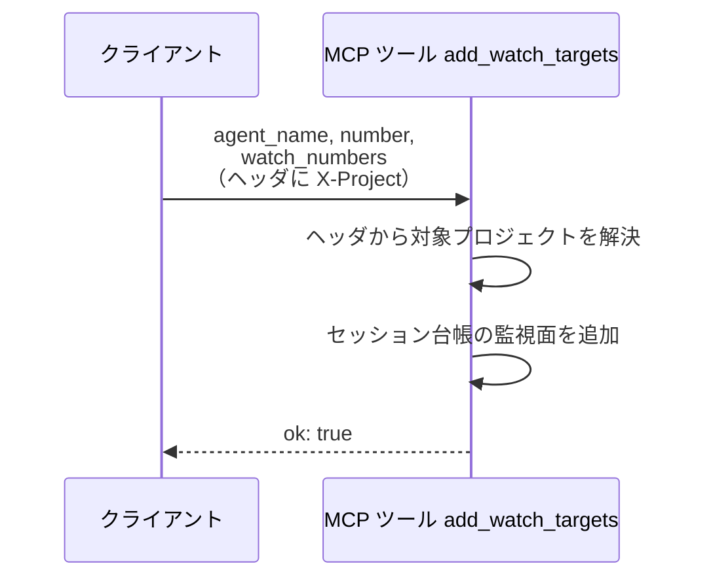
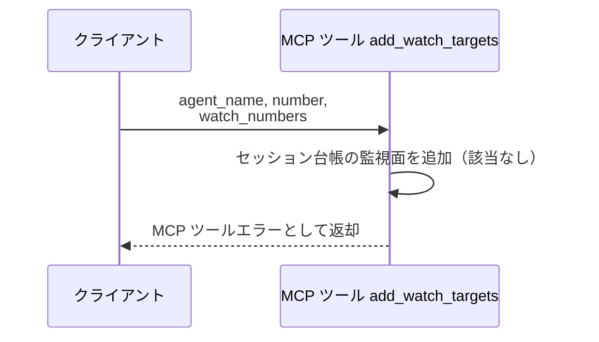

# 監視対象追加

MCP ツール: `add_watch_targets`

エージェントが自セッションの監視面として登録した Issue / PR 番号を登録する。
MCP サーバーはモニターと同一プロセスに同居するため、ツールがセッション台帳を直接操作する。
モニターは主番号と監視面番号一覧の両方でセッションを解決するため、派生 PR（PoC PR・Draft PR）のイベントも同じセッションへ届くようになる。

- 対応テストファイル: `tests/integration/mcp/test_add_watch_targets.py`

## インターフェース

### リクエスト

| パラメータ | 型 | 必須 | デフォルト | 説明 | 制限 | 補足 |
| --- | --- | --- | --- | --- | --- | --- |
| `agent_name` | str | ✅ | - | 報告するエージェント名 | - | セッションキーの片割れ |
| `number` | int | ✅ | - | 自セッションの主番号 | - | - |
| `watch_numbers` | list[int] | ✅ | - | 監視面追加する Issue / PR 番号 | 1 件以上 | - |

リクエスト例:

```json
{
  "agent_name": "architect",
  "number": 52,
  "watch_numbers": [60, 61]
}
```

### レスポンス

| フィールド | 型 | 説明 | 制限 | 補足 |
| --- | --- | --- | --- | --- |
| `ok` | bool | 台帳の更新が完了したか | - | 常に `true`（失敗はツールエラーで表現） |

レスポンス例:

```json
{
  "ok": true
}
```

**補足:**

- 同じ番号の再送は no-op で `ok: true` を返す（冪等）

## 制約

| 項目 | 制約 | 補足 |
| --- | --- | --- |
| タイムアウト | 制限なし | - |
| 対象プロジェクト | モニターは単一プロセスで複数プロジェクトを監視し、セッションは `project` + `agent_name` + `number` で特定する | `project` はリクエストヘッダ `X-Project` から解決する |
| 認可 | なし | ローカルの常駐サーバを前提にする |

## フロー一覧

| 分類 | フロー名 | 概要 | 補足 |
| --- | --- | --- | --- |
| 正常 | 正常系 | プロジェクト解決 → セッション検索 → 監視面追加 | - |
| 異常 | 異常系（セッション不明） | 台帳に該当セッションがない | コールドスタート・台帳喪失 |

## 正常系

### セットアップ

| セットアップ | 説明 | 補足 |
| --- | --- | --- |
| Mock | なし（台帳をテスト用の一時ファイルで実操作） | - |
| ヘッダ | `X-Project` に登録済みのプロジェクト名を指定 | - |
| セッション | 台帳に該当セッションが登録済み | - |

### フロー



### 期待値

- セッションの監視面番号一覧が追加後の状態になっている
- 台帳ファイルに永続化されている
- 戻り値が `ok: true`

## 異常系（セッション不明）

### セットアップ

| セットアップ | 説明 | 補足 |
| --- | --- | --- |
| Mock | なし（台帳をテスト用の一時ファイルで実操作） | - |
| セッション | 台帳から該当セッションを消した状態にする | 検索失敗を決定的に誘発 |

### フロー



### 期待値

- MCP ツールエラー（プロジェクト / エージェント名 / 番号を含む）が返る
- 台帳が変更されていない
