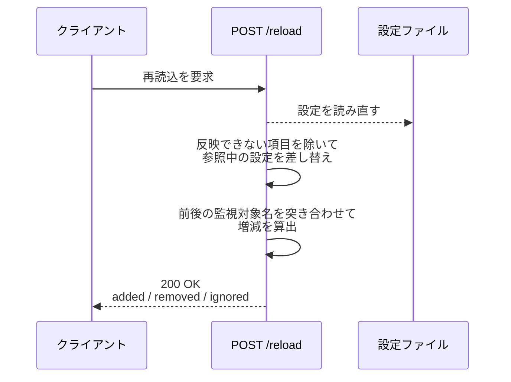
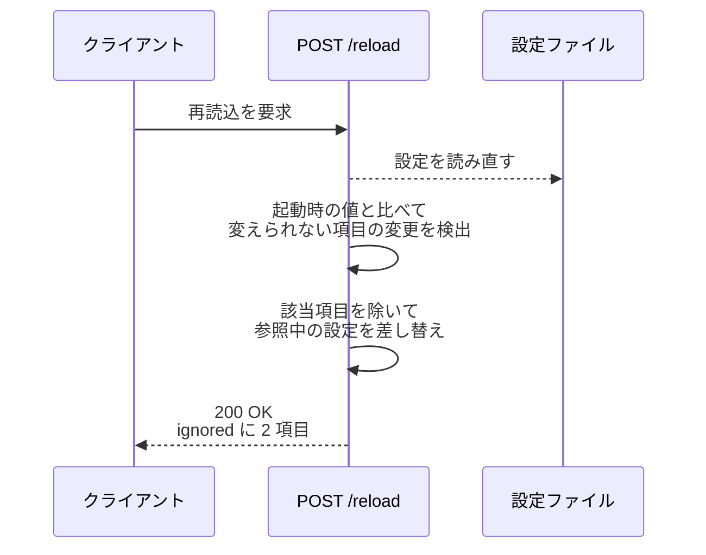
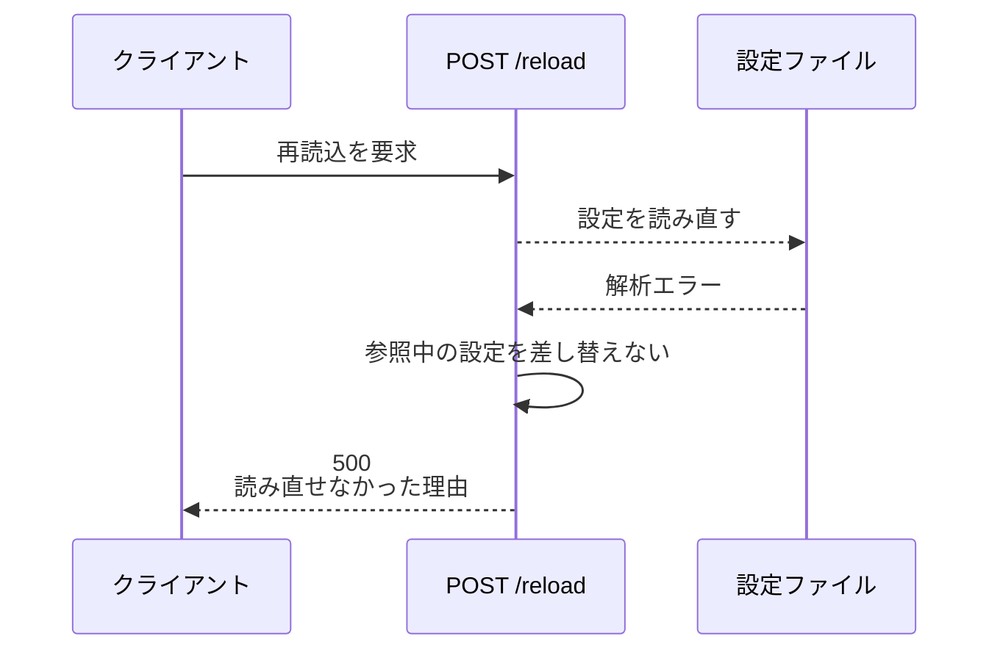

# 設定リロード

エンドポイント: POST /reload

設定ファイルを読み直し、ポーリングと MCP が参照する設定を差し替える。

- 対応テストファイル: `tests/integration/monitor/test_設定リロード.py`

## インターフェース

### リクエスト

リクエストボディを取らない。
再読込の契機を伝えるだけで、読む内容は設定ファイルが持つ。

### レスポンス

| フィールド | 型 | 説明 | 制限 | 補足 |
| --- | --- | --- | --- | --- |
| `added` | str[] | 追加された監視対象プロジェクト名 | - | 増減がなければ空配列 |
| `removed` | str[] | 削除された監視対象プロジェクト名 | - | 増減がなければ空配列 |
| `ignored` | object[] | 反映しなかった項目 | - | 実行中に変えられない項目のうち、値が変わっていたものだけ |
| `ignored[].item` | str | 反映しなかった項目名 | - | `port` / `state_path` |
| `ignored[].reason` | str | 反映しない理由 | - | 再起動が要る旨 |

レスポンス例:

```json
{
  "added": ["sandbox"],
  "removed": [],
  "ignored": [
    { "item": "port", "reason": "待受ポートは実行中に変えられません（再起動が必要です）" }
  ]
}
```

### ステータスコード

| ステータスコード | 発生条件 | 補足 |
| --- | --- | --- |
| `200` | 再読込成功 | 反映しなかった項目があっても 200 |
| `500` | 設定ファイルを読めない（構文エラー・必須項目の欠落 等） | 直前の設定のまま動き続ける |

## 制約

| 項目 | 制約 | 補足 |
| --- | --- | --- |
| タイムアウト | 制限なし | - |
| 契機 | 明示的な呼び出しのみ | 周期での自動再読込はしない（いつ切り替わったかを追えるようにするため） |
| 反映対象 | 監視対象プロジェクト・エージェントのモデル設定・ポーリング周期・セッションのタイムアウト・通知先 | 実行中に差し替えられるもの |
| 反映対象外 | 待受ポート・セッション台帳のパス | uvicorn とレジストリに束ねた後のため。値が変わっていれば `ignored` に載せる |
| 参照の一貫性 | ポーリングと MCP が同じ設定を見る | 片方だけの差し替えはしない |
| 失敗時の状態 | 直前の設定を保持する | 編集途中のファイルでモニターを止めないため。黙って古い値を使うことにならないよう、失敗は必ず 500 で返す |

## フロー一覧

| 分類 | フロー名 | 概要 | 補足 |
| --- | --- | --- | --- |
| 正常 | 正常系 | 設定を読み直して差し替え、プロジェクトの増減を返す | - |
| 正常 | 正常系（反映できない項目あり） | 変えられない項目を反映せず `ignored` に載せる | - |
| 異常 | 異常系（設定ファイルが読めない・500） | 直前の設定を保持してエラーを返す | - |

## 正常系

### セットアップ

| セットアップ | 説明 | 補足 |
| --- | --- | --- |
| Mock | GitHub API を差し替え（対象一覧に空を返す） | 実リポジトリを持たずにポーリングを回すため |
| モニター | 監視対象 1 件の設定で起動済み | - |
| 設定ファイル | 監視対象を 2 件に書き換え済み | 増減を決定的に誘発 |

### フロー



### 期待値

- `200` が返り、`added` に追加したプロジェクト名が入っている
- 差し替え後の周期で、追加したプロジェクトの対象一覧の取得が発生している
- MCP が追加したプロジェクト名を対象として解決できる
- `ignored` が空配列である

## 正常系（反映できない項目あり）

### セットアップ

| セットアップ | 説明 | 補足 |
| --- | --- | --- |
| Mock | GitHub API を差し替え（対象一覧に空を返す） | - |
| モニター | 監視対象 1 件の設定で起動済み | - |
| 設定ファイル | 待受ポートとセッション台帳のパスを書き換え済み | 分岐を決定的に誘発 |

### フロー



### 期待値

- `200` が返り、`ignored` に `port` と `state_path` が理由付きで入っている
- 元の待受ポートで応答し続けている
- セッション台帳の保存先が変わっていない

## 異常系（設定ファイルが読めない・500）

### セットアップ

| セットアップ | 説明 | 補足 |
| --- | --- | --- |
| Mock | GitHub API を差し替え（対象一覧に空を返す） | - |
| モニター | 監視対象 1 件の設定で起動済み | - |
| 設定ファイル | 構文が壊れた内容に書き換え済み | 読込エラーを決定的に誘発 |

### フロー



### 期待値

- `500` が返り、本文に読み直せなかった理由が含まれている
- 参照中の設定が差し替わっていない（既存プロジェクトの対象一覧の取得が続いている）
- モニターのプロセスが落ちていない
