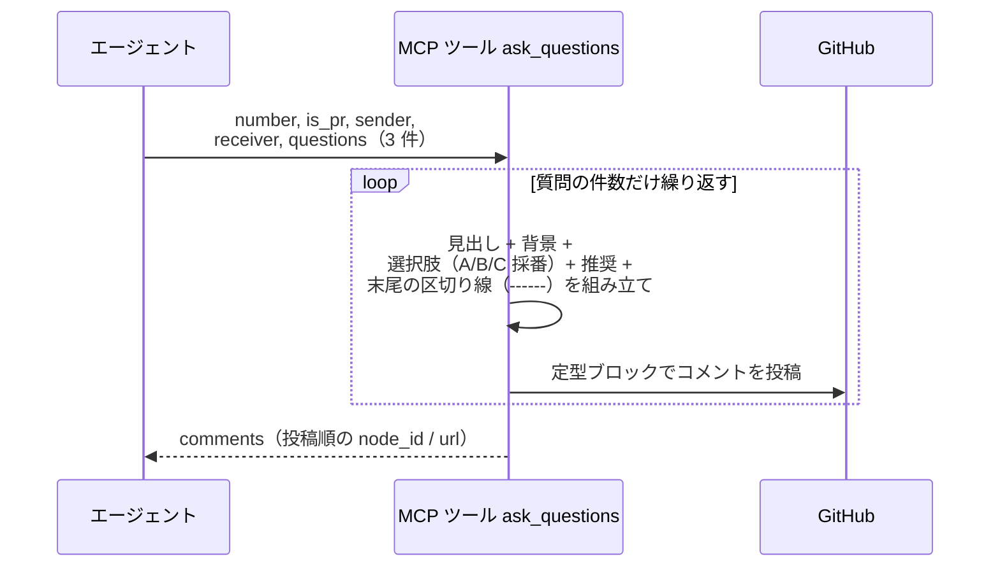
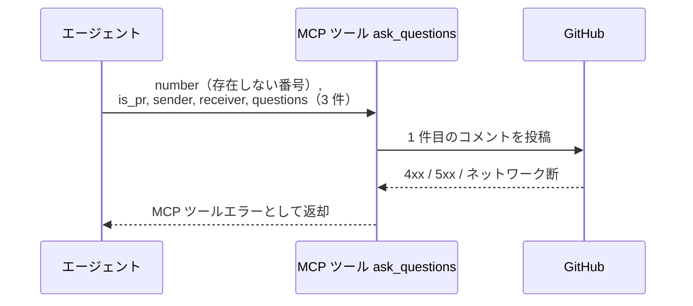
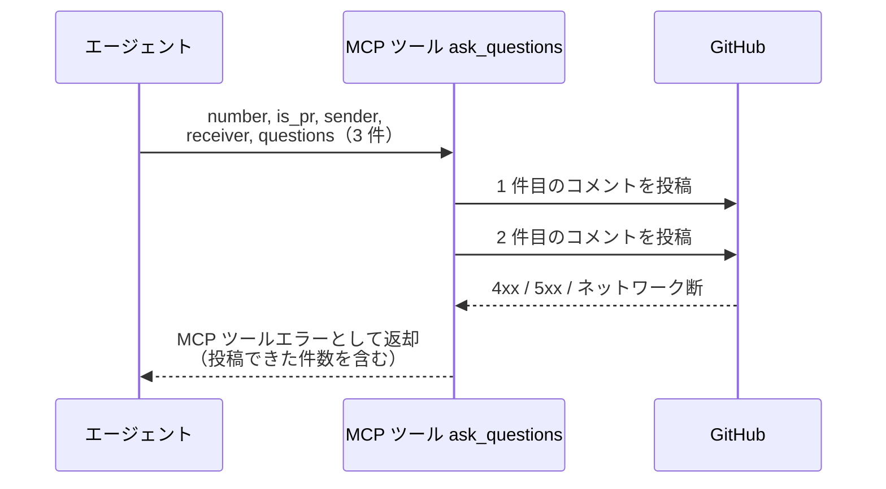

# 質問投稿

MCP ツール: `ask_questions`

選択肢 + 推奨マーク付きの確認質問を、質問 1 件ごとに独立したコメントとして投稿する。

- 対応テストファイル: `tests/integration/mcp/test_ask_questions.py`

## インターフェース

### リクエスト

| パラメータ | 型 | 必須 | デフォルト | 説明 | 制限 | 補足 |
| --- | --- | --- | --- | --- | --- | --- |
| `number` | int | ✅ | - | 対象の Issue / PR 番号 | - | - |
| `is_pr` | bool | ✅ | - | PR なら `True` | - | - |
| `sender` | str | ✅ | - | 送信者のエージェント名 | - | `@` は不要 |
| `receiver` | str | - | なし（to 行なし = 現担当宛） | 宛先名 | - | 通常はユーザーのログイン名 |
| `questions` | object[] | ✅ | - | 投稿する質問の配列 | 1 件以上 | 配列 1 要素がコメント 1 件になる |
| `questions[].question` | str | ✅ | - | 質問文 | - | 各質問の `##` 見出しになる |
| `questions[].background` | str | ✅ | - | 質問の背景説明（なぜこの確認が必要か） | - | 空文字なら省略される |
| `questions[].choices[].label` | str | ✅ | - | 選択肢の要約ラベル（1〜数語） | - | - |
| `questions[].choices[].reason` | str | ✅ | - | この選択肢を選ぶ理由・説明 | - | - |
| `questions[].recommended_index` | int | - | `-1` | 推奨する選択肢の 0-indexed | - | `-1` で推奨なし（推奨行が省略される） |
| `questions[].recommended_reason` | str | - | `""` | 推奨の理由 | - | - |

リクエスト例:

```json
{
  "number": 35,
  "is_pr": false,
  "sender": "epic-conductor",
  "receiver": "shuhei1101",
  "questions": [
    {
      "question": "実現可能性 PoC は必要ですか？",
      "background": "本 epic はリアルタイム同期という未検証の機構に依存しています。",
      "choices": [
        { "label": "必要", "reason": "核心機構が未検証のため先に成立確認する" },
        { "label": "不要", "reason": "既存技術の組み合わせで成立が自明" }
      ],
      "recommended_index": 0,
      "recommended_reason": "性能が成立条件になっているため"
    },
    {
      "question": "画面変更は伴いますか？",
      "background": "同期状態の提示先が未定です。",
      "choices": [
        { "label": "伴う", "reason": "同期状態を画面に出す必要がある" },
        { "label": "伴わない", "reason": "既存画面のままで足りる" }
      ],
      "recommended_index": 1,
      "recommended_reason": "既存の更新表示で足りるため"
    }
  ]
}
```

### レスポンス

| フィールド | 型 | 説明 | 制限 | 補足 |
| --- | --- | --- | --- | --- |
| `comments` | object[] | 投稿したコメントの一覧 | - | `questions` と同じ順序・同じ件数 |
| `comments[].node_id` | str | 投稿コメントの GraphQL node_id | - | Resolve / 返信の対象指定に使う |
| `comments[].url` | str | コメントの html URL | - | - |

レスポンス例:

```json
{
  "comments": [
    {
      "node_id": "IC_kwDOAbc123xyz",
      "url": "https://github.com/{owner}/{repo}/issues/35#issuecomment-123456"
    },
    {
      "node_id": "IC_kwDOAbc456uvw",
      "url": "https://github.com/{owner}/{repo}/issues/35#issuecomment-123457"
    }
  ]
}
```

## 制約

| 項目 | 制約 | 補足 |
| --- | --- | --- |
| タイムアウト | 制限なし | - |
| 投稿単位 | 質問 1 件 = コメント 1 件 | 分割はツール側が担い、呼び出し側は 1 回呼ぶだけ |
| 前置き文 | 持たない | 回答方法の案内は選択肢の並びから読み取れる。同じ文が全コメントに並ぶだけなので置かない |
| 選択肢の採番 | ツール側がコメントごとに先頭から振る | ラベル側の記号は検証しない（記号が二重に表示されるだけで投稿は成立する） |
| 原子性 | なし | 途中で失敗しても投稿済みのコメントは残る（GitHub にトランザクションがないため）。エラーに投稿できた件数を含める |

## フロー一覧

| 分類 | フロー名 | 概要 | 補足 |
| --- | --- | --- | --- |
| 正常 | 正常系 | 質問ごとに本文を組み立てて件数分のコメントを投稿 | - |
| 異常 | 異常系（API エラー） | 1 件目の投稿で失敗し、コメントが 1 件も残らない | 認証切れ / 対象不存在 / ネットワーク断 |
| 異常 | 異常系（途中で API エラー） | 2 件目以降の投稿で失敗し、投稿済みのコメントが残る | 原子性なしの確認 |

## 正常系

### セットアップ

| セットアップ | 説明 | 補足 |
| --- | --- | --- |
| Mock | GitHub API を差し替え（正常応答を返す） | - |
| 対象 Issue / PR | sandbox に open の対象が存在 | 番号を入力に使う |
| 入力 | 質問 3 件を 1 回の呼び出しで渡す | 分割の観測に複数件が要る |

### フロー



### 期待値

- 質問件数と同じ 3 件のコメントが追加されている
- 各コメントが質問 1 件だけを含み、質問見出し・背景・選択肢（A / B / C ...）・推奨行が揃っている
- 各コメントの先頭に引用ヘッダー（from / to 行）が付いている
- 各コメントの選択肢の採番が、そのコメント内で `A` から振られている
- 各コメントの本文が `------` と空行で終わっている（ユーザーがそのまま回答を書き足せる状態）
- 戻り値の `comments` が入力の質問と同じ順序で、件数が一致している

## 異常系（API エラー）

### セットアップ

| セットアップ | 説明 | 補足 |
| --- | --- | --- |
| Mock | GitHub API を差し替え（1 件目の投稿で 4xx / 5xx を返す） | - |
| 対象番号 | 存在しない番号を指定して呼び出す | API エラーを決定的に誘発 |
| 入力 | 質問 3 件を 1 回の呼び出しで渡す | - |

### フロー



### 期待値

- MCP ツールエラーが返る（HTTP ステータスと本文を含む）
- コメントは 1 件も追加されていない
- 2 件目以降の投稿が試行されていない

## 異常系（途中で API エラー）

### セットアップ

| セットアップ | 説明 | 補足 |
| --- | --- | --- |
| Mock | GitHub API を差し替え（1 件目は正常応答・2 件目で 4xx / 5xx を返す） | 部分失敗を決定的に誘発 |
| 対象 Issue / PR | sandbox に open の対象が存在 | - |
| 入力 | 質問 3 件を 1 回の呼び出しで渡す | - |

### フロー



### 期待値

- MCP ツールエラーが返り、投稿できた件数（1 件）を特定できる内容を含んでいる
- 1 件目のコメントは残っている（投稿済みを取り消さない）
- 3 件目の投稿が試行されていない
