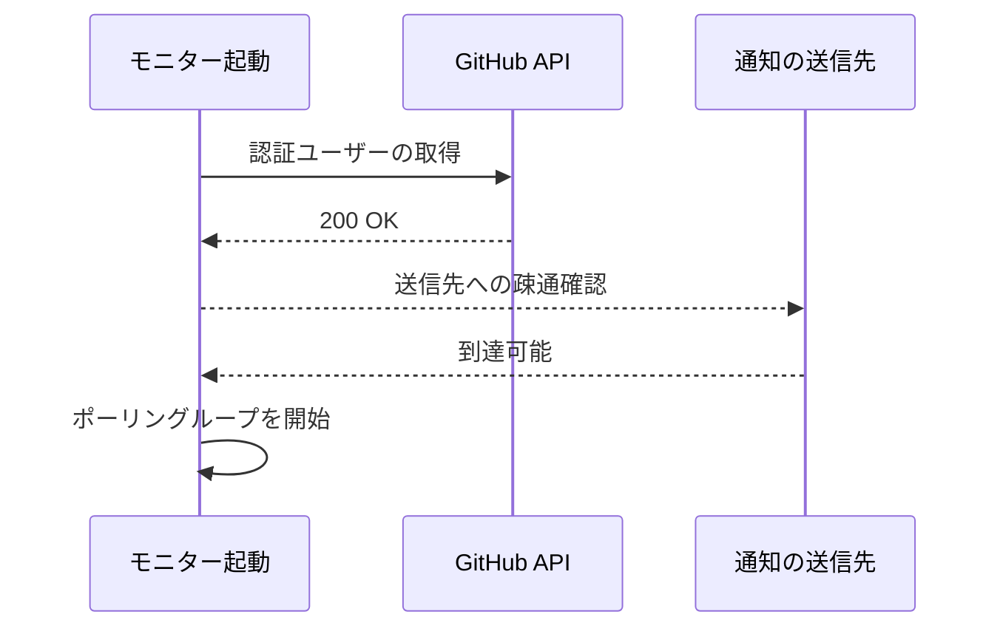
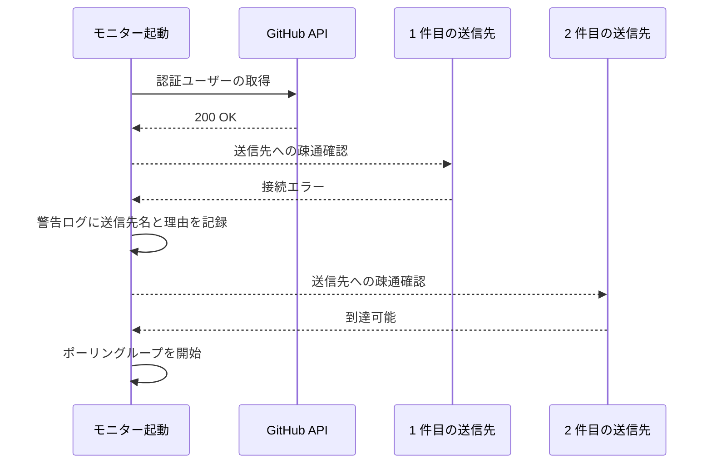
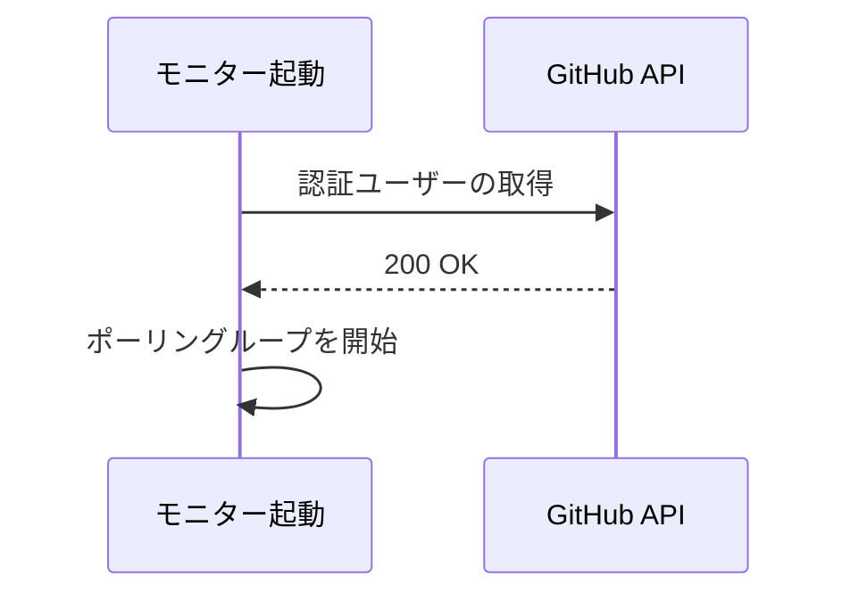
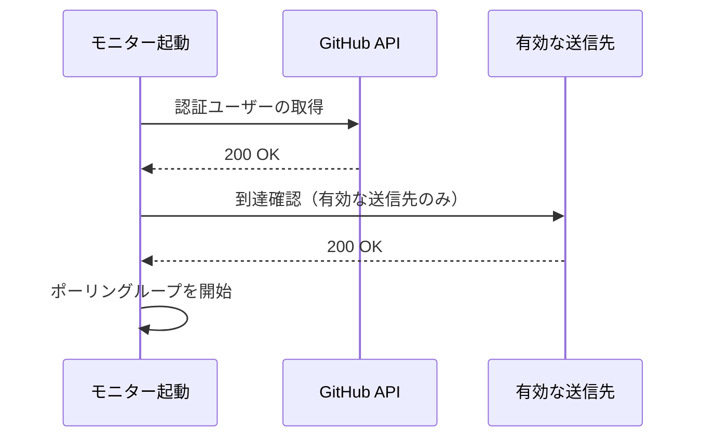
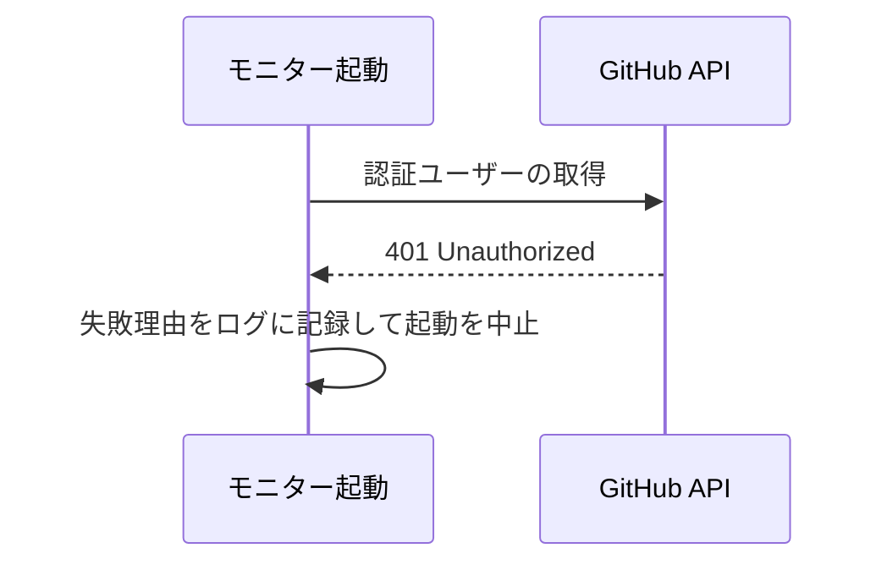

# 起動時接続チェック

トリガー: モニターの起動時（設定読込の直後・ポーリングループの開始前に 1 回）

設定に書かれた外部 API へ実際に接続し、繋がらない依存を起動時点で明らかにする。

- 対応テストファイル: `tests/integration/monitor/test_起動時接続チェック.py`

## 制約

| 項目 | 制約 | 補足 |
| --- | --- | --- |
| 実行回数 | 起動時に 1 回 | 実行中の再チェックは行わない（周期処理の失敗は各機能側で扱う） |
| タイムアウト | 依存ごとに 10 秒 | 起動が長時間ブロックされないようにする |
| リトライ | なし | 一時的な失敗は起動し直しで解消する |
| 送信の副作用 | なし | 通知の送信先には実メッセージを送らず、疎通の確認だけを行う |
| チェック対象 | 設定に書かれた依存のみ | 通知の送信先は `enabled: true` のものだけを対象にする |

## フロー一覧

| 分類 | フロー名 | 概要 | 補足 |
| --- | --- | --- | --- |
| 正常 | 正常系 | 全ての依存に繋がり、そのまま起動する | - |
| 正常 | 正常系（通知の送信先が繋がらない） | 警告ログを出して起動を続ける | 通知は補助手段 |
| 正常 | 正常系（通知の送信先が未設定） | 通知のチェックを行わずに起動する | 設定していないものは対象外 |
| 異常 | 異常系（GitHub API が繋がらない） | 起動を中止する | トークン失効・ネットワーク断 |

## 正常系

### セットアップ

| セットアップ | 説明 | 補足 |
| --- | --- | --- |
| Mock | GitHub API / Webhook の HTTP クライアントを stub に差し替え | どちらも成功応答を返す |
| 設定 | `github_token` と `notifies[]` に有効な送信先 1 件を登録済み | - |

### フロー

### 期待値

- GitHub API の認証確認が 1 回行われている
- 有効な送信先 1 件に対して疎通確認が行われ、実メッセージは送られていない
- 全依存に繋がった旨が起動ログに残っている
- ポーリングループが開始している

## 正常系（通知の送信先が繋がらない）

### セットアップ

| セットアップ | 説明 | 補足 |
| --- | --- | --- |
| Mock | GitHub API は成功・Webhook は接続エラーを返す stub に差し替え | 補助依存の失敗を決定的に誘発 |
| 設定 | `notifies[]` に有効な送信先 2 件を登録済み | 1 件目が失敗・2 件目は成功 |

### フロー

### 期待値

- 1 件目が失敗しても 2 件目の疎通確認が行われている
- 警告ログに失敗した送信先の識別名と理由が残っている
- ポーリングループが開始している（通知が使えないだけで停止しない）

## 正常系（通知の送信先が未設定）

### セットアップ

| セットアップ | 説明 | 補足 |
| --- | --- | --- |
| Mock | GitHub API の HTTP クライアントを stub に差し替え | 成功応答を返す |
| 設定 | `notifies[]` が空 | 未設定を決定的に誘発 |

### フロー

### 期待値

- 通知の疎通確認が 1 回も行われていない
- 警告ログが出ていない（設定していないものは異常ではない）
- ポーリングループが開始している

## 正常系（無効にした送信先がある）

### セットアップ

| セットアップ | 説明 | 補足 |
| --- | --- | --- |
| Mock | GitHub API の HTTP クライアントを stub に差し替え | 成功応答を返す |
| Mock | Webhook の HTTP クライアントを stub に差し替え | 送信先ごとの呼び出しを記録する |
| 設定 | `notifies[]` に `enabled: false` の送信先と有効な送信先を 1 件ずつ | 無効側を決定的に誘発 |

### フロー

### 期待値

- 疎通確認が有効な送信先にだけ行われている（無効にした送信先へは 1 回も行かない）
- ポーリングループが開始している

## 異常系（GitHub API が繋がらない）

### セットアップ

| セットアップ | 説明 | 補足 |
| --- | --- | --- |
| Mock | GitHub API が 401 を返す stub に差し替え | トークン失効を決定的に誘発 |
| 設定 | `github_token` に失効済みの値を登録 | - |

### フロー

### 期待値

- 起動が中止され、ポーリングループが開始していない
- ログに GitHub API へ繋がらなかった理由が残っている
- 通知の疎通確認が行われていない（必須依存の失敗時点で打ち切る）
