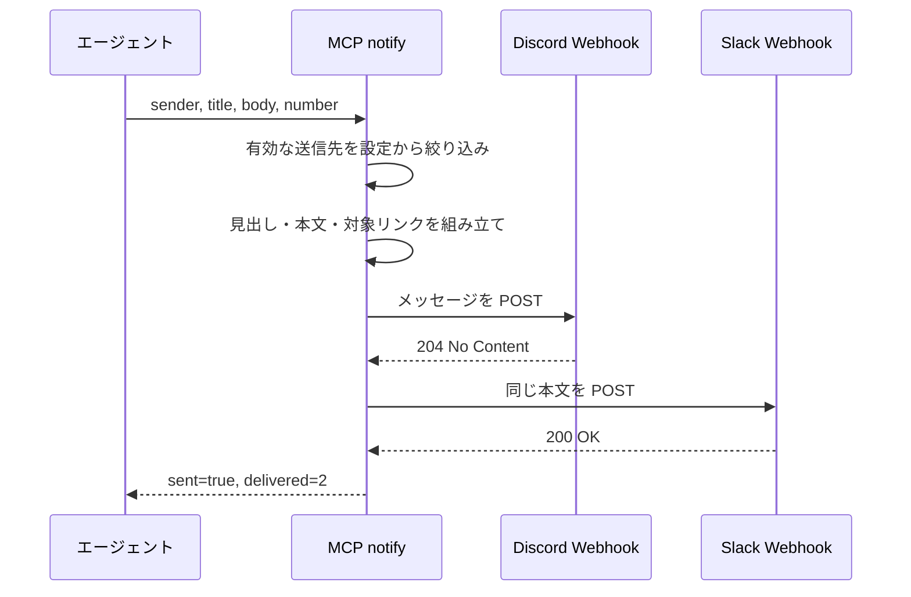
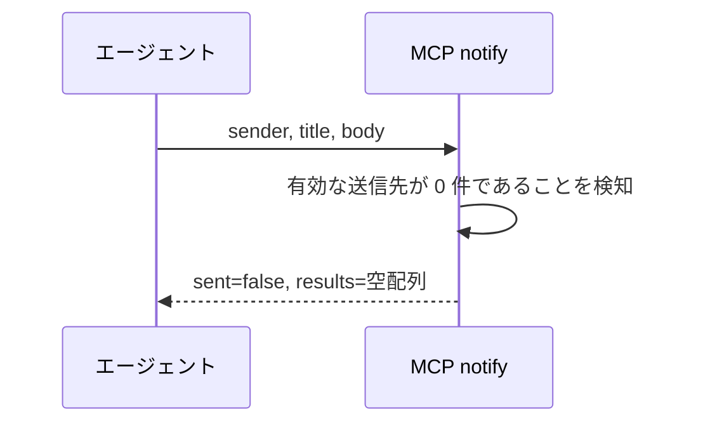
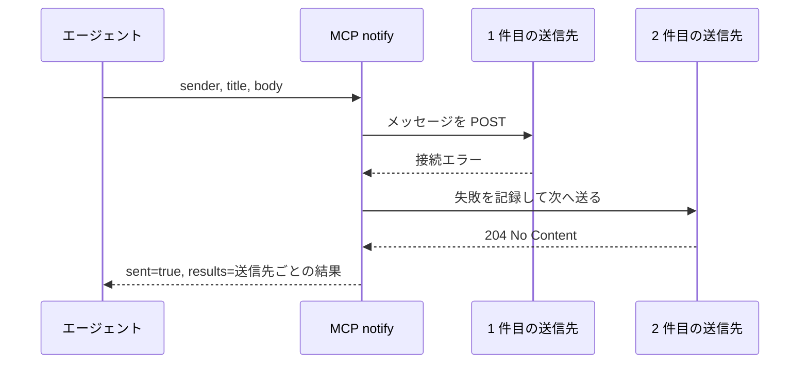

# 通知送出

MCP ツール: `notify`

設定した全ての送信先（Discord / Slack の Webhook）へメッセージを送る。

- 対応テストファイル: `tests/integration/mcp/test_notify.py`

## インターフェース

### リクエスト

| パラメータ | 型 | 必須 | デフォルト | 説明 | 制限 | 補足 |
| --- | --- | --- | --- | --- | --- | --- |
| `sender` | str | ✅ | - | 送信元のエージェント名 | 設定に登録済みの名前 | 本文の先頭に付ける |
| `title` | str | ✅ | - | 1 行の見出し | 100 文字以内 | 通知一覧で拾える粒度にする |
| `body` | str | ✅ | - | 本文 | 1500 文字以内 | Webhook 側の上限に収める |
| `number` | int | - | なし（対象を示さない） | 関連する Issue / PR 番号 | - | 指定すると本文末尾にリンクが付く |

リクエスト例:

```json
{
  "sender": "architect",
  "title": "ライブラリ選定の判断をお願いします",
  "body": "候補 3 件の PoC が全て成立しました。性能とライセンスのどちらを優先するか決めてください。",
  "number": 1069
}
```

### レスポンス

| フィールド | 型 | 説明 | 制限 | 補足 |
| --- | --- | --- | --- | --- |
| `sent` | bool | 1 件以上へ送信できたか | - | 有効な送信先が無い場合は `false` |
| `results` | object[] | 送信先ごとの結果 | - | 子フィールドは下の行で展開。有効な送信先が無い場合は空配列 |
| `results[].target` | str | 送信先の識別名 | - | 設定の `notifies[].name`（未設定なら `{type}:{kind}`） |
| `results[].sent` | bool | この送信先へ送れたか | - | - |
| `results[].reason` | str | この送信先の失敗理由 | - | 成功時は空文字。送信先ごとに原因が違うため個別に持つ |

レスポンス例:

```json
{
  "sent": true,
  "results": [
    { "target": "webhook:discord", "sent": true, "reason": "" },
    { "target": "社内 Slack", "sent": false, "reason": "ConnectError: 接続できない" }
  ]
}
```

**補足:**
- 送信先ごとに失敗の原因が異なる（片方は接続エラー・もう片方は 4xx など）ため、理由は 1 本にまとめず送信先ごとに返す
- 呼び出し側は `sent` だけ見て次へ進んでよい。
  `results` は失敗の切り分けとログ出力のために使う

## 制約

| 項目 | 制約 | 補足 |
| --- | --- | --- |
| 送信先 | 設定の `notifies[]` のうち `enabled` が `true` のもの全て | 0 件なら送信しない |
| 送信順 | 設定の並び順 | 途中で失敗しても後続の送信先へ送り続ける |
| タイムアウト | 送信先ごとに 10 秒 | 通知の遅延がエージェントのターンを止めないようにする |
| リトライ | なし | 通知は補助手段なので、失敗しても本処理を止めない |
| レート制限 | 制限なし | 送信先側の制限に達した場合は異常系で扱う |
| 本文の合計サイズ | 2000 文字以内 | `title` + `body` + リンクの合計。超過分は末尾を切る。全送信先へ同じ本文を送る |

## フロー一覧

| 分類 | フロー名 | 概要 | 補足 |
| --- | --- | --- | --- |
| 正常 | 正常系 | 有効な全送信先へ同じ本文を送る | - |
| 正常 | 正常系（有効な送信先なし） | 送信せず理由を返す | 未設定・全て `enabled: false` の両方 |
| 異常 | 異常系（一部の送信先が失敗） | 成功件数と失敗理由を返す | 失敗しても後続へ送り続ける |

## 正常系

### セットアップ

| セットアップ | 説明 | 補足 |
| --- | --- | --- |
| Mock | Webhook の HTTP クライアントを stub に差し替え | どちらの送信先も 204 を返す |
| 設定 | `notifies[]` に Discord と Slack を 1 件ずつ登録済み | 両方とも `enabled: true` |

### フロー



### 期待値

- 送信先ごとに 1 回ずつ POST されている（合計 2 回）
- ペイロードが各送信先の種別に対応したキー（Discord は `content` / Slack は `text`）で組み立てられている
- どちらにも同じ本文が渡り、送信元のエージェント名と対象 Issue / PR へのリンクを含んでいる
- 戻り値が `sent=true` で、`results` に送信先 2 件分の行が設定の並び順で入り、どちらも `sent=true` / `reason` が空文字

## 正常系（有効な送信先なし）

### セットアップ

| セットアップ | 説明 | 補足 |
| --- | --- | --- |
| Mock | Webhook の HTTP クライアントを stub に差し替え | 呼ばれないことの確認用 |
| 設定 | `notifies[]` の全要素が `enabled: false` | 有効 0 件を決定的に誘発 |

### フロー



### 期待値

- POST が 1 回も行われていない
- 戻り値が `sent=false` で、`results` が空配列
- 有効な送信先が無かったことがログに残っている

## 異常系（一部の送信先が失敗）

### セットアップ

| セットアップ | 説明 | 補足 |
| --- | --- | --- |
| Mock | Webhook の HTTP クライアントを stub に差し替え | 1 件目は接続エラー・2 件目は 204 を返す |
| 設定 | `notifies[]` に送信先を 2 件登録済み | 両方とも `enabled: true` |

### フロー



### 期待値

- 1 件目が失敗しても 2 件目へ POST されている
- 戻り値が `sent=true` で、`results` の 1 件目が `sent=false` + 接続エラーの理由、2 件目が `sent=true` + 空文字
- リトライしていない（各送信先への POST は 1 回だけ）
- 例外を送出していない（エージェントのターンが止まらない）
