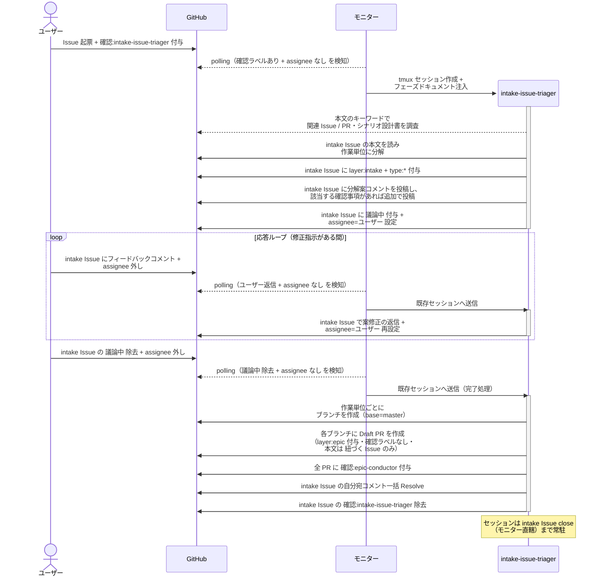
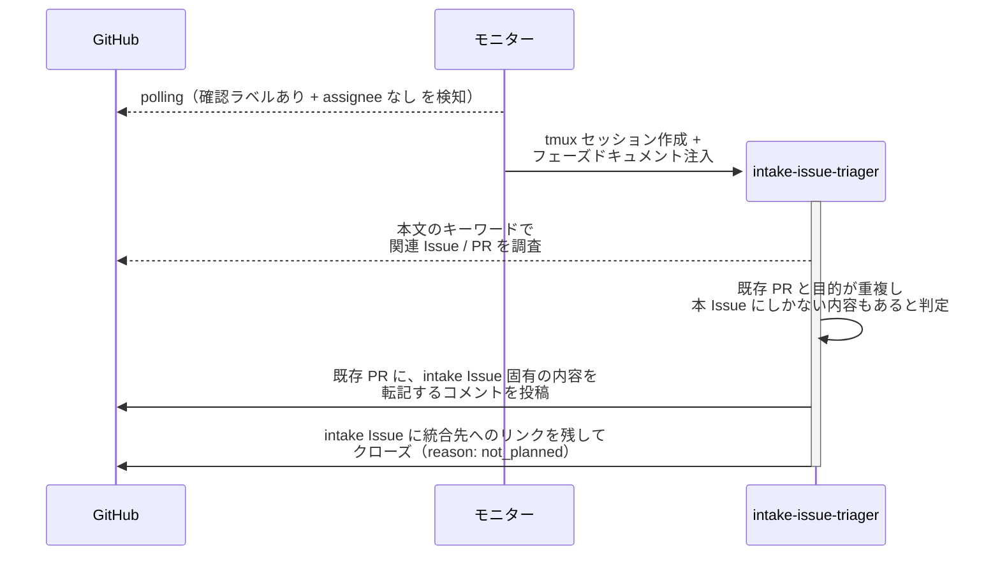
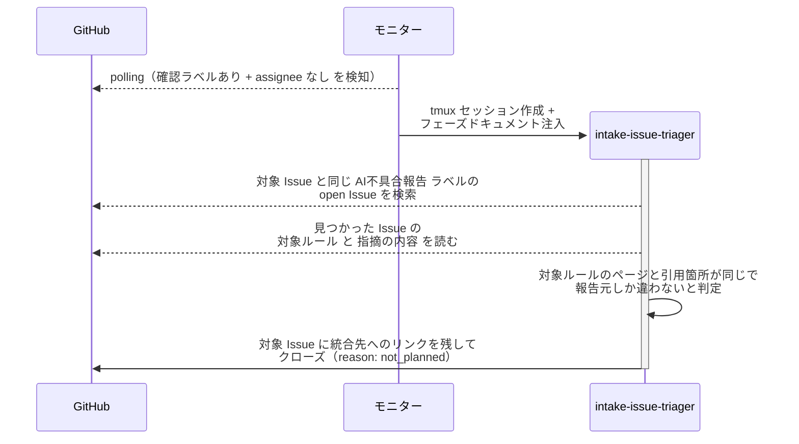
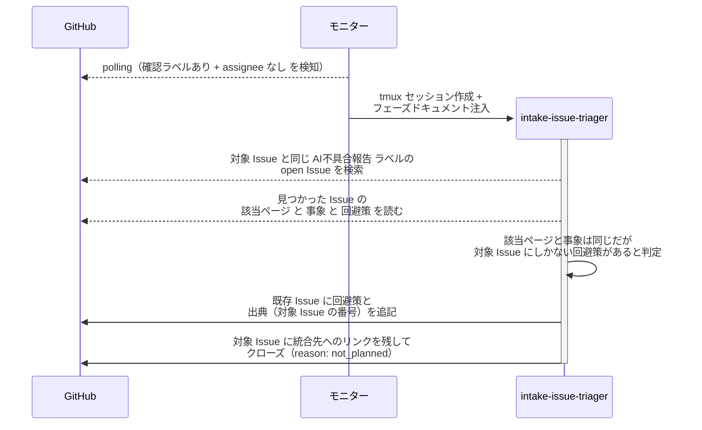

# Issue分解と子PR作成

ユーザーまたはエージェントが起票した Issue を intake-issue-triager が受け、既存の作業と重複していなければ作業単位に分解し、ユーザー承認を経て作業単位ごとのブランチと Draft PR を作成する単一ユースケース。

対応エージェント: `intake-issue-triager`

- 対応テストファイル: `tests/e2e/単一ユースケース/test_Issue分解と子PR作成.py`

## 正常シナリオ

### セットアップ

| セットアップ | 説明 | 補足 |
| --- | --- | --- |
| Mock | なし（実環境で実行） | - |
| intake Issue | ユーザー起票の Issue に `確認:intake-issue-triager` 付与済み | 本文はユーザーが書いたまま |
| assignee | 未設定 | エージェント起動条件 |
| モニター | 対象リポを polling 中 | - |

### フロー

### 期待値

- 承認された案と同数のブランチと Draft PR が存在する（`layer:epic` + `確認:epic-conductor` が付与）
- 各 PR の base が `master` になっている
- 各 PR 本文の `## 紐づく Issue` に intake Issue の番号が入っている
- 着手順の依存がある場合、確認ラベルは先頭の PR 1 本にだけ付いている（依存が無ければ全 PR に付く）
- 確認ラベルが付いていない PR に着手の痕跡が無い（`議論中` 未付与・assignee 未設定・epic-conductor の投稿コメントなし）
- intake Issue の本文がユーザー起票時のまま書き換わっていない
- intake Issue に `layer:intake` + `type:*` が残り、`確認:*` は除去済み
- 自分宛コメントが全て Resolve 済み

## 正常シナリオ（既存 PR と重複）

### セットアップ

| セットアップ | 説明 | 補足 |
| --- | --- | --- |
| Mock | なし（実環境で実行） | - |
| 既存 PR | 同じ目的の PR が open で存在し、担当エージェントの `確認:*` が付いている | 統合先 |
| intake Issue | 応答ループ中の依頼から起票された Issue に `確認:intake-issue-triager` 付与済み | 本文は既存 PR と同じ目的の内容 |
| assignee | 未設定 | エージェント起動条件 |
| モニター | 対象リポを polling 中 | - |

### フロー

### 期待値

- ブランチと Draft PR が 1 件も作られていない
- 既存 PR に、統合した intake Issue の固有内容と出典（intake Issue 番号）が転記されている
- intake Issue が closed になり、クローズ理由が `not_planned` として記録されている
- intake Issue に統合先へのリンクが残っている
- intake Issue に `議論中` と `assignee` が設定されていない（ユーザーの確認を挟まずに統合する）
- 既存 PR のラベル・担当は変わっていない（進行中の作業を止めない）

## 正常シナリオ（既存 Issue と重複）

### セットアップ

| セットアップ | 説明 | 補足 |
| --- | --- | --- |
| Mock | なし（実環境で実行） | - |
| 既存のルール改修 Issue | 同じルールページの同じ記述箇所を指摘する Issue が open で存在 | 統合先。`AI不具合報告` ラベル付き・確認ラベルなし |
| 対象 Issue | 別セッションが同じ記述箇所について起票したルール改修 Issue に `確認:intake-issue-triager` 付与済み | `## 対象ルール` の引用箇所と `## 指摘の内容` が既存 Issue と一致し、報告元だけが違う。追加情報なしの分岐を決定的に誘発 |
| assignee | 未設定 | エージェント起動条件 |
| モニター | 対象リポを polling 中 | - |

### フロー

### 期待値

- ブランチと Draft PR が 1 件も作られていない
- 既存 Issue にコメントが投稿されていない（転記する内容が無いため）
- 対象 Issue が closed になり、クローズ理由が `not_planned` として記録されている
- 対象 Issue に統合先の Issue 番号へのリンクが残っている
- 対象 Issue に `議論中` と `assignee` が設定されていない（ユーザーの確認を挟まずにクローズする）
- 既存 Issue のラベル・assignee は変わっていない

## 正常シナリオ（既存 Issue と重複・追加情報あり）

### セットアップ

| セットアップ | 説明 | 補足 |
| --- | --- | --- |
| Mock | なし（実環境で実行） | - |
| 既存の不具合 Issue | 同じ手順書ページの同じ事象を報告する Issue が open で存在 | 統合先。`AI不具合報告` ラベル付き・`## 回避策` は `なし` |
| 対象 Issue | 別のエージェントが同じ事象を報告した不具合 Issue に `確認:intake-issue-triager` 付与済み | `## 回避策` に既存 Issue が持たない回避策が入っている。追加情報ありの分岐を決定的に誘発 |
| assignee | 未設定 | エージェント起動条件 |
| モニター | 対象リポを polling 中 | - |

### フロー

### 期待値

- ブランチと Draft PR が 1 件も作られていない
- 既存 Issue に、対象 Issue にしかない回避策と出典（対象 Issue の番号）が追記されている
- 対象 Issue が closed になり、クローズ理由が `not_planned` として記録されている
- 対象 Issue に統合先の Issue 番号へのリンクが残っている
- 対象 Issue に `議論中` と `assignee` が設定されていない
- 既存 Issue のラベル・assignee は変わっていない

## 異常シナリオ

なし
