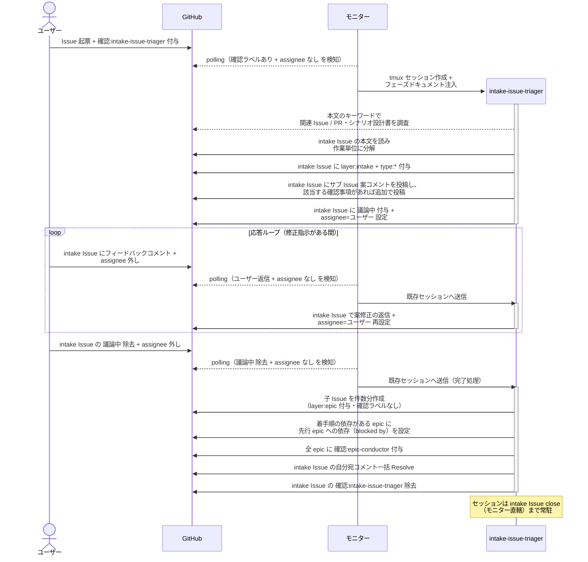
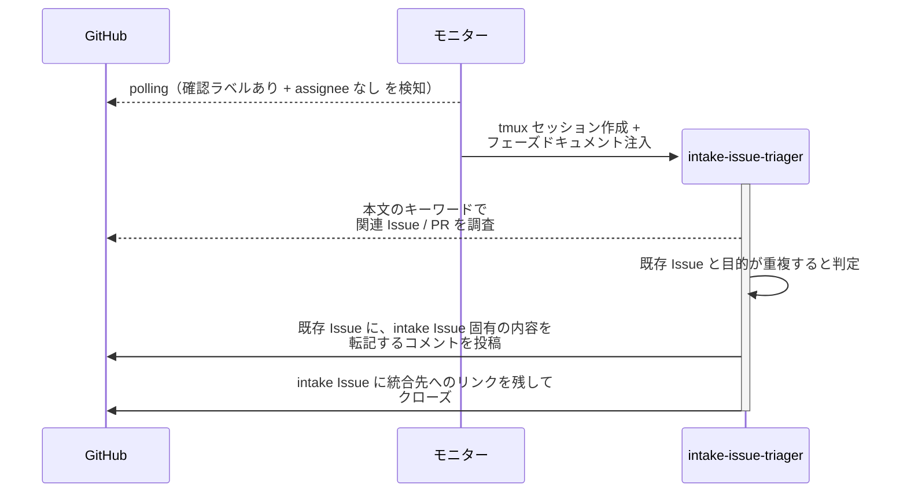

# Issue分解と子起票

ユーザーが起票した Issue を intake-issue-triager が作業単位に分解し、ユーザー承認を経て epic / story / subsystem / chore の Sub-issue を作成する単一ユースケース。

対応エージェント: `intake-issue-triager`

- 対応テストファイル: `tests/e2e/単一ユースケース/test_Issue分解と子起票.py`

## 正常シナリオ

### セットアップ

| セットアップ | 説明 | 補足 |
| --- | --- | --- |
| Mock | なし（実環境で実行） | - |
| intake Issue | ユーザー起票の Issue に `確認:intake-issue-triager` 付与済み | 本文はユーザーが書いたまま |
| assignee | 未設定 | エージェント起動条件 |
| モニター | 対象リポを polling 中 | - |

### フロー

### 期待値

- 承認された案と同数の Sub-issue が親 Issue に紐づいて存在する（`layer:epic` + `確認:epic-conductor` が付与）
- 着手順の依存がある epic に blocked by が設定され、配下の story / subsystem には設定されていない
- 依存（blocked by）が未解決の epic に着手の痕跡が無い（`議論中` 未付与・assignee 未設定・epic-conductor の投稿コメントなし）
- intake Issue の本文がユーザー起票時のまま書き換わっていない
- intake Issue に `layer:intake` + `type:*` が残り、`確認:*` は除去済み
- 自分宛コメントが全て Resolve 済み

## 正常シナリオ（既存 Issue と重複）

### セットアップ

| セットアップ | 説明 | 補足 |
| --- | --- | --- |
| Mock | なし（実環境で実行） | - |
| 既存 Issue | 同じ目的の Issue が open で存在し、担当エージェントの `確認:*` が付いている | 統合先 |
| intake Issue | 応答ループ中の依頼から起票された Issue に `確認:intake-issue-triager` 付与済み | 本文は既存 Issue と同じ目的の内容 |
| assignee | 未設定 | エージェント起動条件 |
| モニター | 対象リポを polling 中 | - |

### フロー

### 期待値

- サブ Issue が 1 件も起票されていない
- 既存 Issue に、統合した intake Issue の固有内容と出典（intake Issue 番号）が転記されている
- intake Issue が closed になり、統合先へのリンクが残っている
- intake Issue に `議論中` と `assignee` が設定されていない（ユーザーの確認を挟まずに統合する）
- 既存 Issue のラベル・担当は変わっていない（進行中の作業を止めない）

## 異常シナリオ

なし
