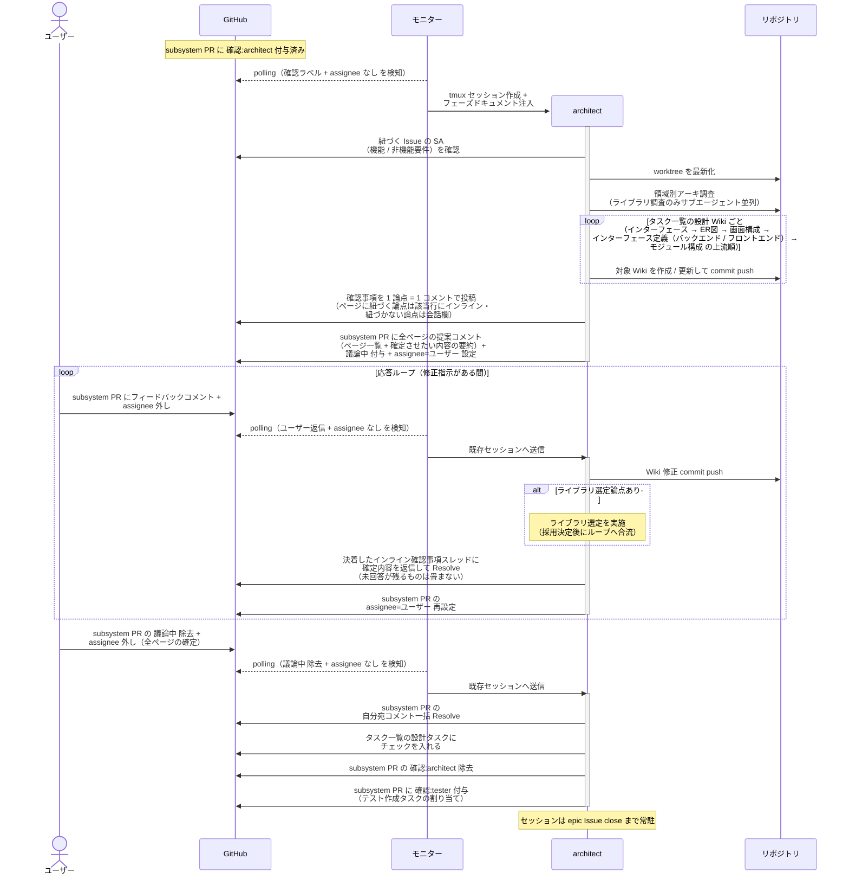
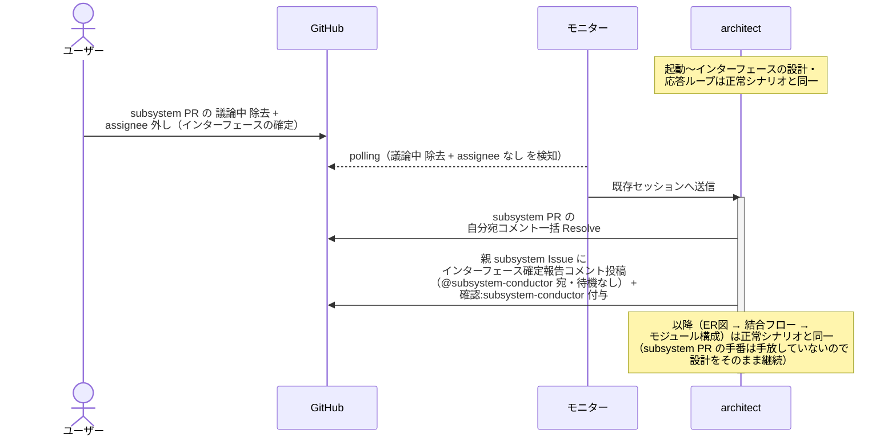
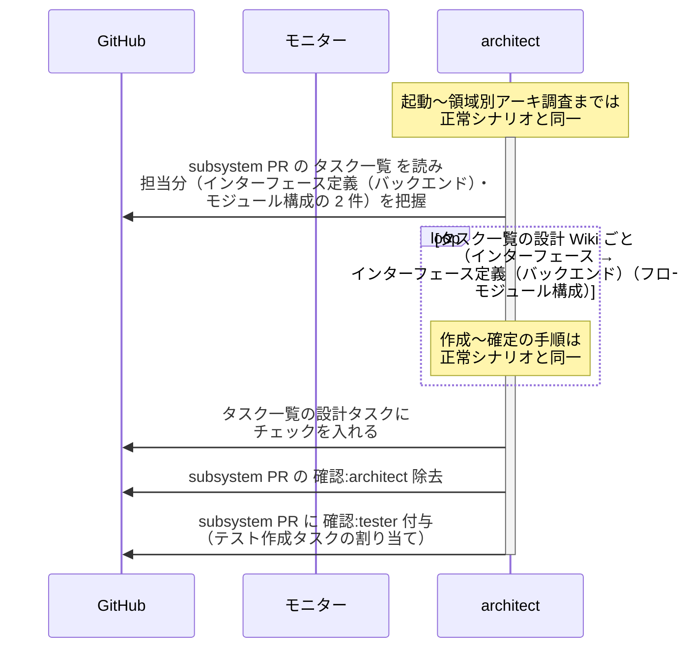
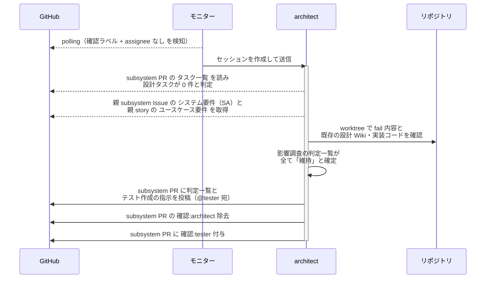
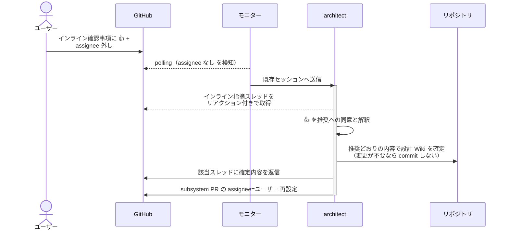
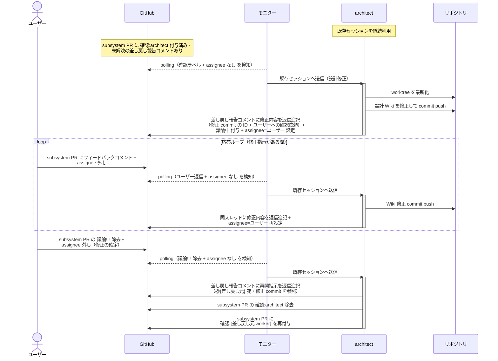
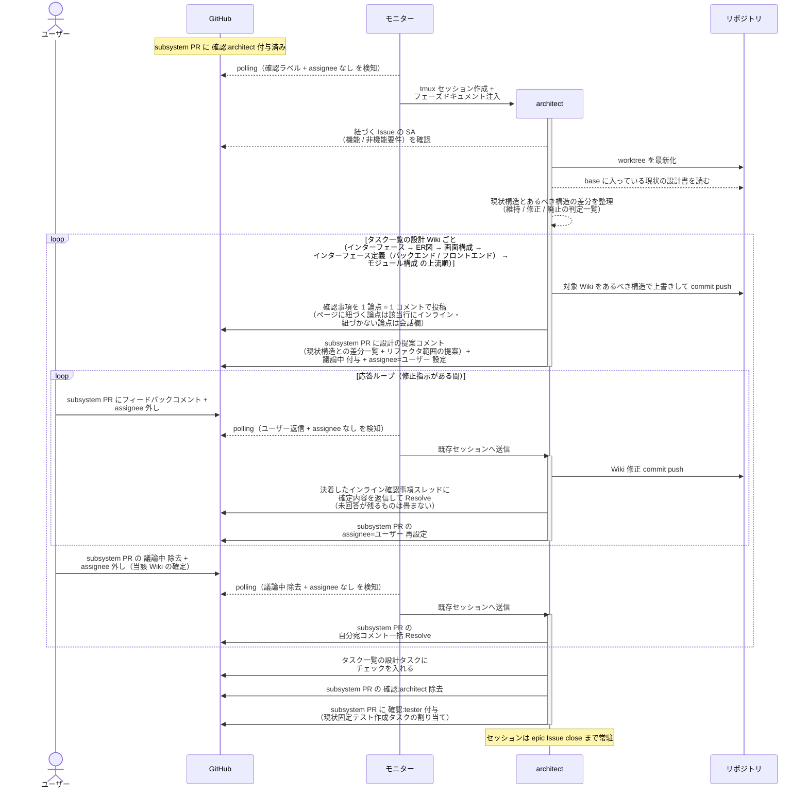

# SS設計

architect が設計 Wiki（インターフェース → ER図 → 画面構成 → インターフェース定義（バックエンド / フロントエンド）（フロー）→ モジュール構成）をタスク一覧の上流順に 1 ページずつ作成し、応答ループでユーザーと確定させる単一ユースケース。

対応エージェント: `architect`

- 対応テストファイル: `tests/e2e/単一ユースケース/test_SS設計.py`

## 正常シナリオ

### セットアップ

| セットアップ | 説明 | 補足 |
| --- | --- | --- |
| Mock | なし（実環境で実行） | - |
| subsystem Draft PR | `確認:architect` 付与済み・`## タスク一覧` 承認済み | - |
| subsystem Issue | SA 確定済み | 設計の元ネタ |
| assignee | PR に未設定 | エージェント起動条件 |

### フロー

### 期待値

- 確認事項が 1 論点 = 1 コメントで投稿され、ページの特定箇所に紐づく論点は該当行のインライン、紐づかない論点は会話欄に振り分けられている
- タスク一覧の担当分の設計 Wiki（`設計図/ER図/{分類}.md` / `設計図/画面構成/{画面名}.md` / `設計図/インターフェース定義/バックエンド/{論理名}.md` / `設計図/インターフェース定義/フロントエンド/{論理名}.md` / `設計図/モジュール構成/{サブシステム}/{分類}.md`）が上流順に作成され、subsystem ブランチに commit されている
- ユーザーの確認が全ページで 1 回にまとまっている（`議論中` の付与がページ数ぶん繰り返されていない）
- `## タスク一覧` の設計タスクがチェック済み
- テスト作成の割り当てコメントに、確定した設計 Wiki のページ名と各ページの commit 範囲が記載されている
- subsystem PR に `確認:tester` が付与され、`確認:architect` が除去されている
- 自分宛コメントが全て Resolve 済み
- 応答ループの各ターンで、決着したインライン確認事項スレッドが確定内容の返信付きで Resolve されている
- 応答ループの返信が、ユーザーが指摘したコメントのスレッドに積まれている（自分の過去の報告コメントに追記していない）
- 完了処理に入った時点で未解決のインライン確認事項が残っていない（残る場合は `議論中` を戻して聞き直す）

## 正常シナリオ（インターフェース確定報告）

### セットアップ

| セットアップ | 説明 | 補足 |
| --- | --- | --- |
| Mock | なし（実環境で実行） | - |
| subsystem Draft PR | `確認:architect` 付与済み・`## タスク一覧` 承認済み | - |
| タスク一覧 | 設計タスクにインターフェース定義（バックエンド）が含まれる | 報告を誘発 |
| assignee | PR に未設定 | エージェント起動条件 |

### フロー

### 期待値

- `設計図/インターフェース定義/バックエンド/{論理名}.md` の `## インターフェース` が確定され、subsystem ブランチに commit されている
- 親 subsystem Issue に `確認:subsystem-conductor` + インターフェース確定報告コメント（@subsystem-conductor 宛・未解決）が付与・投稿されている
- subsystem PR には `確認:architect` だけが残っている（報告を別の面で行うので設計が止まらず、1 つの面に確認ラベルも 2 つ立たない）

## 正常シナリオ（タスク一覧に ER図 なし）

### セットアップ

| セットアップ | 説明 | 補足 |
| --- | --- | --- |
| Mock | なし（実環境で実行） | - |
| subsystem Draft PR | `確認:architect` 付与済み・`## タスク一覧` 承認済み | - |
| タスク一覧 | 設計タスクが インターフェース定義（バックエンド）・モジュール構成 のみ | DB 変更を伴わない subsystem。分岐を決定的に誘発 |
| assignee | PR に未設定 | エージェント起動条件 |

### フロー

### 期待値

- インターフェース定義（バックエンド）（インターフェース + フロー）→ モジュール構成 の 2 ページだけが確定・commit されている
- `設計図/ER図/` 配下への commit が存在しない（タスク一覧にない Wiki は作成されない）
- subsystem PR に `確認:tester` が付与され、`確認:architect` が除去されている

## 正常シナリオ（設計変更なし）

### セットアップ

| セットアップ | 説明 | 補足 |
| --- | --- | --- |
| Mock | なし（実環境で実行） | - |
| subsystem Draft PR | `確認:architect` 付与済みの修正用 PR | バグ差し戻しを受けた subsystem-conductor が作成したもの |
| タスク一覧 | 設計タスクが 0 件（実装とテスト実行のみ） | 分岐を決定的に誘発 |
| 既存テスト | 差し戻された fail を再現するテストが base ブランチに commit 済み | 実行すると fail する |
| assignee | PR に未設定 | エージェント起動条件 |

### フロー

### 期待値

- 設計 Wiki への commit が 1 件も存在しない
- subsystem PR に判定一覧とテスト作成の指示コメント（@tester 宛・未解決）が投稿されている
- subsystem PR に `確認:tester` が付与され、`確認:architect` が除去されている
- `議論中` が付与されていない（ユーザー確認を挟まずに次担当へ渡る）

## 正常シナリオ（インライン確認事項に 👍 で回答）

### セットアップ

| セットアップ | 説明 | 補足 |
| --- | --- | --- |
| Mock | なし（実環境で実行） | - |
| subsystem Draft PR | `確認:architect` 付与済み | - |
| 設計 Wiki | 対象ページを commit 済み | 確認事項の対象になる行を含む |
| インライン確認事項 | 選択肢と推奨を含む確認事項を該当行に投稿済み（ユーザー宛） | 推奨は本文に明記されている |
| ラベル | `議論中` 付与済み | 応答ループ待ちの状態 |
| リアクション | ユーザーがインライン確認事項に 👍 を付与 | 回答手段を決定的に誘発 |
| ユーザー返信 | 本文のコメントは投稿しない | 👍 だけで判断できるかを見る |
| assignee | PR から外し済み | エージェント起動条件 |

### フロー

### 期待値

- 推奨どおりの内容で設計 Wiki が確定している（別案へ変更されていない）
- 該当スレッドに確定した旨の返信が投稿されている
- ユーザーへ回答内容を問い直す確認コメントが投稿されていない（👍 だけで判断できている）
- subsystem PR に `議論中` と `assignee=ユーザー` が残っている（当該ページの確定はユーザーの `議論中` 除去で行う）

## 正常シナリオ（差し戻しからの設計修正）

### セットアップ

| セットアップ | 説明 | 補足 |
| --- | --- | --- |
| Mock | なし（実環境で実行） | - |
| subsystem PR | `確認:architect` 付与済み + tester / implementer の差し戻し報告コメント（設計の見直し・自分宛・未解決）あり | - |
| assignee | PR に未設定 | エージェント起動条件 |

### フロー

### 期待値

- 設計 Wiki の修正 commit が subsystem ブランチに積まれている（修正はユーザー承認済み）
- 差し戻し報告コメントのスレッドに修正内容（修正 commit の ID）と再開指示（@{差し戻し元} 宛）が返信追記されている（スレッドは未解決のまま = 差し戻し元 worker が処理時に Resolve する）
- subsystem PR に `確認:{差し戻し元 worker}`（例: `確認:tester`）が付与され、`確認:architect` が除去されている

## 正常シナリオ（リバースエンジニアリング）

### セットアップ

| セットアップ | 説明 | 補足 |
| --- | --- | --- |
| Mock | なし（実環境で実行） | - |
| `リバースエンジニアリング` ラベル | 対象の Issue / PR に付与済み | 本経路を選ぶ判定材料。ユーザーが system Issue に付け、子 Issue へ引き継がれる |
| subsystem Draft PR | `確認:architect` 付与済み・`## タスク一覧` 承認済み | 設計タスクは全て新規作成 |
| subsystem Issue | `type:docs` で SA 確定済み | 設計の元ネタ |
| assignee | PR に未設定 | エージェント起動条件 |
| 設計 Wiki | 当該サブシステムの結合 / モジュール構成が現状の内容で base に存在 | RE PR がマージ済みであることが前提 |

### フロー

### 期待値

- タスク一覧の担当分の設計 Wiki が上流順に 1 ページずつ確定され、subsystem ブランチに commit されている
- architect が実装コードを読み出した記録がない（入力は SA と base の設計書に閉じる）
- 本 PR の Files changed が現状からあるべき姿への変更範囲になっている
- 各設計 Wiki の構成要素が実装の物理名と対応づいている（コンテナ列・物理名の引用行が実ファイル / 実シンボルを指す）
- 現状構造とあるべき構造の差分が提案コメントに一覧化され、リファクタ範囲がユーザーと合意されている
- `## タスク一覧` の設計タスクがチェック済み
- subsystem PR に `確認:tester` が付与され、`確認:architect` が除去されている
- 自分宛コメントが全て Resolve 済み
- 応答ループの各ターンで、決着したインライン確認事項スレッドが確定内容の返信付きで Resolve されている
- 応答ループの返信が、ユーザーが指摘したコメントのスレッドに積まれている（自分の過去の報告コメントに追記していない）
- 完了処理に入った時点で未解決のインライン確認事項が残っていない（残る場合は `議論中` を戻して聞き直す）

## 異常シナリオ

なし
