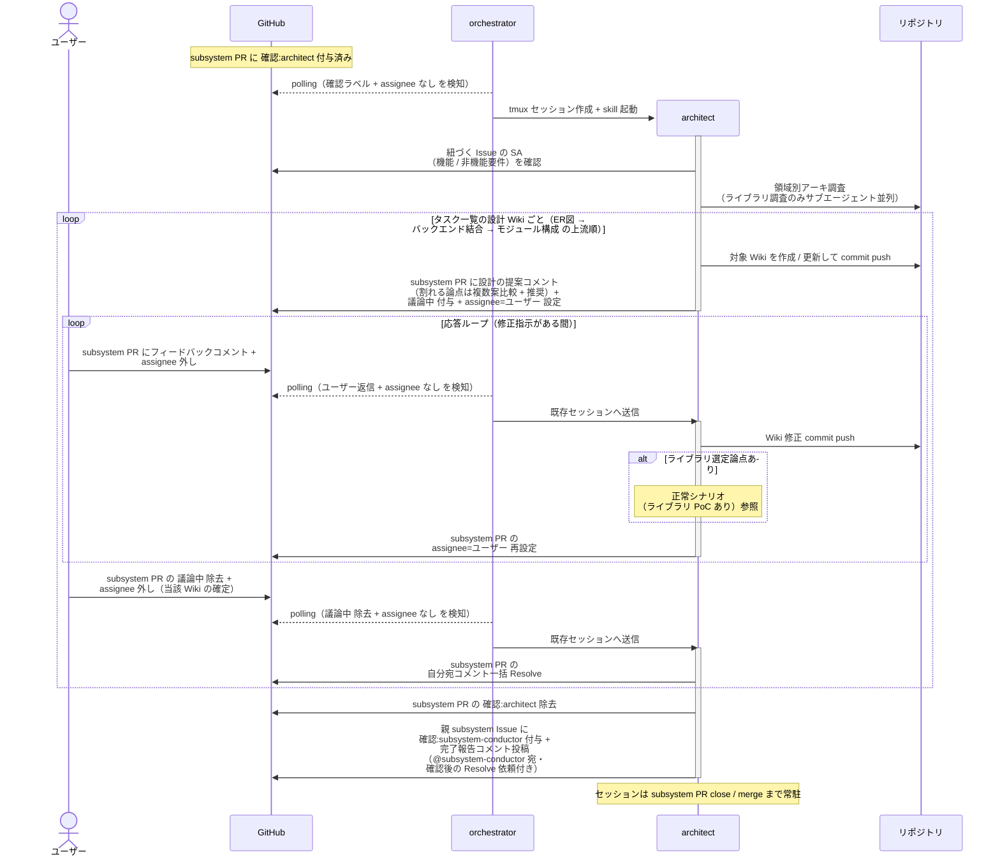
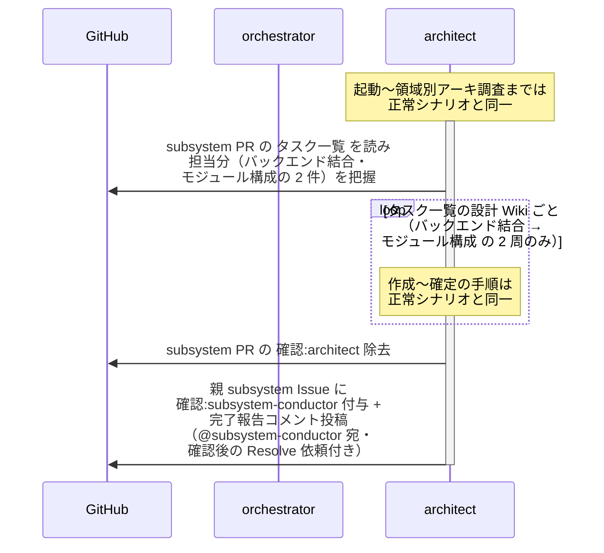
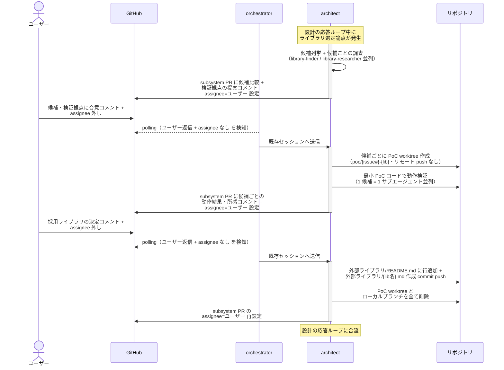

# SS設計と実装計画

architect が BE 設計 Wiki（ER図 → バックエンド結合 → モジュール構成）をタスク一覧の上流順に 1 ページずつ作成し、応答ループでユーザーと確定させる単一ユースケース。ライブラリ選定で必要なら PoC（カテゴリ A〜E）も本 UC 内で実施する。

対応モニター: `architect`

## 正常シナリオ

### 前提条件

| No | セットアップ | 説明 | 補足 |
| --- | --- | --- | --- |
| 1 | subsystem Draft PR | `確認:architect` 付与済み・`## タスク一覧` 承認済み | 画面ありの場合は FE 設計 Wiki 確定済み |
| 2 | subsystem Issue | SA 確定済み | 設計の元ネタ |
| 3 | assignee | PR に未設定 | モニター起動条件 |

### 図

**期待動作:**
- タスク一覧の担当分の BE 設計 Wiki（`設計図/ER図/{分類}.md` / `設計図/バックエンド結合/{論理名}.md` / `設計図/モジュール構成/{分類}.md`）が上流順に 1 ページずつ確定され、subsystem ブランチに commit されている
- ライブラリ PoC を実施した場合は PoC PR が closed（マージなし）で残り、PoC worktree / ブランチが削除済み
- 親 subsystem Issue に `確認:subsystem-conductor` + 完了報告コメント（@subsystem-conductor 宛・未解決）が付与・投稿されている
- 自分宛コメントが全て Resolve 済み

## 正常シナリオ（タスク一覧に ER図 なし）

### 前提条件

| No | セットアップ | 説明 | 補足 |
| --- | --- | --- | --- |
| 1 | subsystem Draft PR | `確認:architect` 付与済み・`## タスク一覧` 承認済み | - |
| 2 | タスク一覧 | 設計タスクが バックエンド結合・モジュール構成 のみ | DB 変更を伴わない subsystem。分岐を決定的に誘発 |
| 3 | assignee | PR に未設定 | モニター起動条件 |

### 図

**期待動作:**
- バックエンド結合 → モジュール構成 の 2 ページだけが確定・commit されている
- `設計図/ER図/` 配下への commit が存在しない（タスク一覧にない Wiki は作成されない）
- 親 subsystem Issue に `確認:subsystem-conductor` + 完了報告コメントが付与・投稿されている

## 正常シナリオ（ライブラリ PoC あり）

### 前提条件

| No | セットアップ | 説明 | 補足 |
| --- | --- | --- | --- |
| 1 | 設計の応答ループ中 | バックエンド結合 または モジュール構成 の応答ループ中にライブラリ選定論点が発生 | 例: LLM クライアントの採用 |
| 2 | 採用候補 | 未経験のライブラリで PoC 要否判定カテゴリ（A〜E）に該当 | PoC を誘発 |

### 図

**期待動作:**
- `外部ライブラリ/README.md` の行と `外部ライブラリ/{lib名}.md` が subsystem ブランチに commit されている
- PoC worktree・ローカルブランチが全て削除済み（リモートに PoC ブランチは作られない）
- 候補比較・検証結果・採用判断の経緯がコメントに残っている

