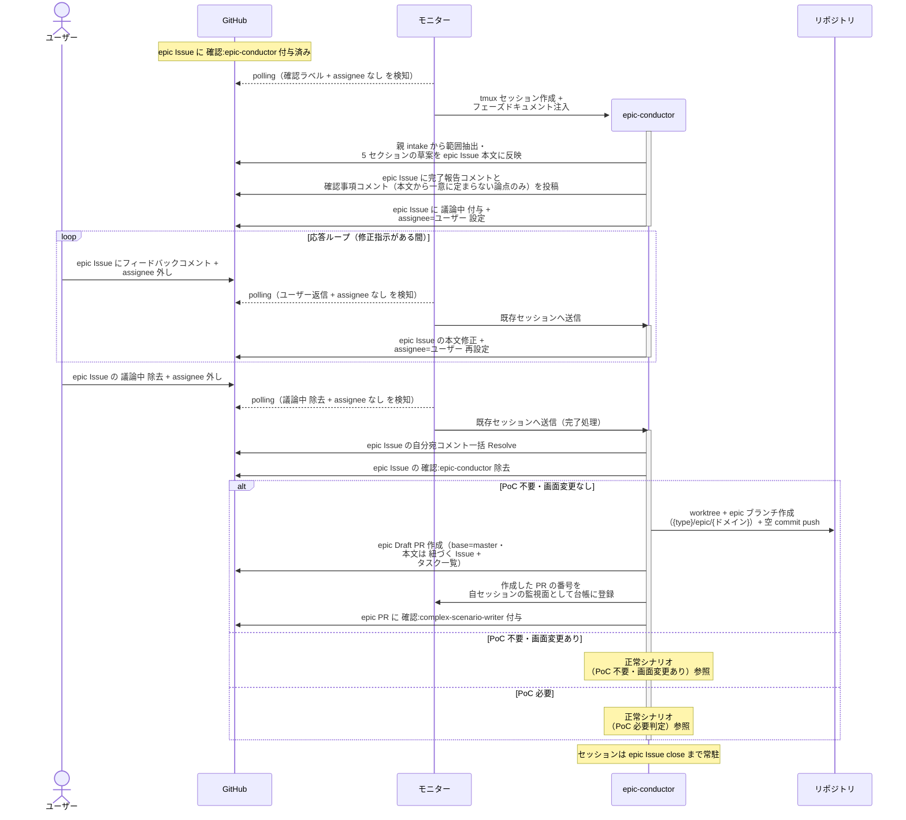
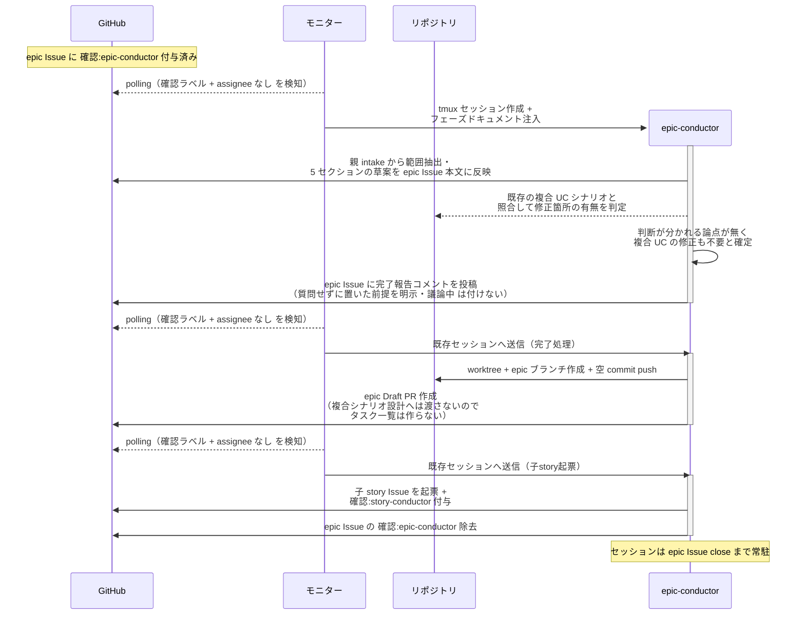
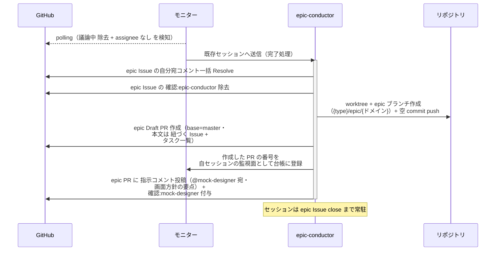
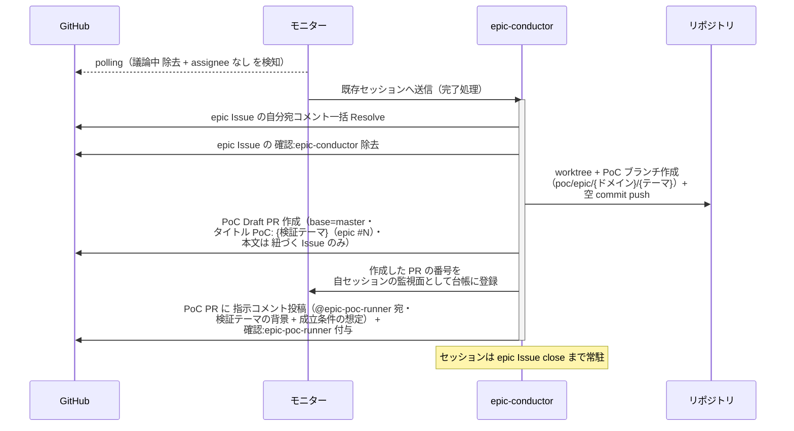
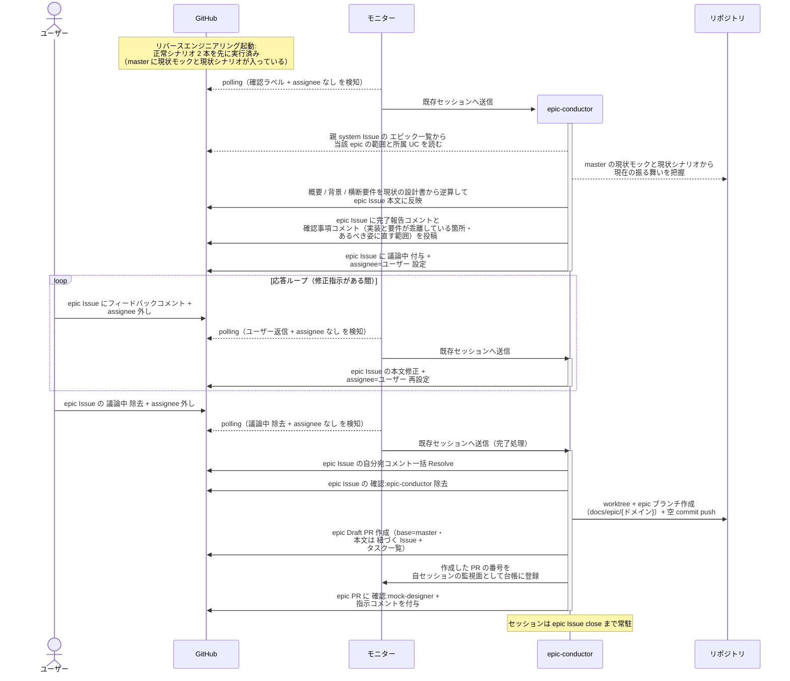

# epic要件確定

epic-conductor が epic Issue の本文（概要 / 背景 / ユースケース一覧 / 横断要件）を確定し、実現可能性 PoC の要否と画面変更（新規作成 / レイアウト変更）の有無を判定する単一ユースケース。

対応エージェント: `epic-conductor`（初回呼び出し）

- 対応テストファイル: `tests/e2e/単一ユースケース/test_epic要件確定.py`

## 正常シナリオ（PoC 不要・画面変更なし）

### セットアップ

| セットアップ | 説明 | 補足 |
| --- | --- | --- |
| Mock | なし（実環境で実行） | - |
| epic Issue | `layer:epic` + `確認:epic-conductor` 付きで存在 | 親 intake Issue と Sub-issue リンク済み・本文は空 |
| assignee | 未設定 | エージェント起動条件 |
| モニター | polling 中 | - |
| ユーザー回答 | 応答ループで PoC 不要・画面変更なしと回答する | 分岐を決定的に誘発（テストではユーザー役が固定回答） |

### フロー

### 期待値

- epic Issue 本文に `## 概要` / `## 背景` / `## ユースケース一覧` / `## 横断要件` が揃っている
- ユースケース一覧の `対応 story` 列が全行 `未起票`
- ユースケース一覧の `変更種別` 列が全行 `新規` / `変更` / `削除` のいずれかで埋まっている（未記入の行がない）
- `確認:epic-conductor` が除去され、epic Draft PR（本文に `## 紐づく Issue` と `## タスク一覧`）が作成されて `確認:complex-scenario-writer` が付与されている
- `## タスク一覧` に複合 UC シナリオの作成 / 修正・シナリオ索引の更新・複合 UC E2E テストの実行が列挙され、全行が未チェック（チェックは各行を担当した作業者が入れる）
- 作成した PR の番号が自セッションの監視面（モニターの台帳）に登録されている
- 自分宛コメントが全て Resolve 済み

## 正常シナリオ（確認事項なし）

### セットアップ

| セットアップ | 説明 | 補足 |
| --- | --- | --- |
| Mock | なし（実環境で実行） | - |
| epic Issue | `layer:epic` + `確認:epic-conductor` 付きで存在 | 親 intake Issue と Sub-issue リンク済み・本文は空 |
| 親 intake Issue | 対象範囲・PoC 要否・画面変更の有無・複合 UC への影響が本文から一意に読み取れる内容で書かれている | 確認事項が 0 件になる状況を決定的に誘発 |
| 既存の設計書 | 対象の複合 UC シナリオが master に存在する | 修正箇所の有無を判定する材料 |
| assignee | 未設定 | エージェント起動条件 |
| モニター | polling 中 | - |

### フロー

### 期待値

- 確認事項コメントが 1 件も投稿されていない（本文から一意に定まる論点を質問していない）
- `議論中` が付与されず assignee も設定されていない（ユーザーを止めずに通り抜けている）
- 完了報告コメントに、質問せずに前提として置いた判断とその根拠が書かれている
- epic Draft PR が作成され、`確認:complex-scenario-writer` も `確認:mock-designer` も付与されていない
- epic PR の本文に `## タスク一覧` が無い（epic PR 上で作業する担当が居ないため）
- 子 story Issue が起票され `確認:story-conductor` が付与されている
- epic Issue から `確認:epic-conductor` が除去されている

## 正常シナリオ（PoC 不要・画面変更あり）

### セットアップ

| セットアップ | 説明 | 補足 |
| --- | --- | --- |
| Mock | なし（実環境で実行） | - |
| 応答ループまで完了 | 5 セクション確定済み・`議論中` 除去済み（正常シナリオ（PoC 不要・画面変更なし）と同一の経過） | - |
| ユーザー回答 | PoC 不要・画面の新規作成 / レイアウト変更ありと回答済み | 分岐を決定的に誘発 |

### フロー

### 期待値

- epic Draft PR（base=master・本文に `## 紐づく Issue` と `## タスク一覧`）が作成され、`確認:mock-designer` と指示コメント（@mock-designer 宛・未解決）が付与・投稿されている
- `## タスク一覧` の先頭にモック作成が並び、続けて複合 UC シナリオの作成 / 修正・シナリオ索引の更新・複合 UC E2E テストの実行が列挙されている
- 作成した PR の番号が自セッションの監視面（モニターの台帳）に登録されている

## 正常シナリオ（PoC 必要判定）

### セットアップ

| セットアップ | 説明 | 補足 |
| --- | --- | --- |
| Mock | なし（実環境で実行） | - |
| 正常シナリオの応答ループまで完了 | 5 セクション確定済み・`議論中` 除去済み | - |
| PoC 要否 | epic の成立が前例のない技術機構に依存し、ユーザーが PoC 必要と回答済み | 例: 未検証のプロトコル連携・性能が成立条件 |

### フロー

### 期待値

- PoC Draft PR（base=master・タイトル `PoC: {検証テーマ}（epic #N）`・本文は `## 紐づく Issue` のみ）が作成され、`確認:epic-poc-runner` と指示コメント（@epic-poc-runner 宛・未解決）が付与・投稿されている
- 作成した PR の番号が自セッションの監視面（モニターの台帳）に登録されている
- epic Draft PR は作成されない

## 正常シナリオ（リバースエンジニアリング）

### セットアップ

| セットアップ | 説明 | 補足 |
| --- | --- | --- |
| Mock | なし（実環境で実行） | - |
| `リバースエンジニアリング` ラベル | 対象の Issue / PR に付与済み | 本経路を選ぶ判定材料。ユーザーが system Issue に付け、子 Issue へ引き継がれる |
| epic Issue | `layer:epic` + `type:docs` + `確認:epic-conductor` 付きで存在 | 本文の `## ユースケース一覧` は起票時に記入済み |
| エピック一覧 | 親 system Issue の `## エピック一覧` に当該 epic の所属 UC と着手順が確定済み | [システム構成確定](./システム構成確定.md) の成果物 |
| assignee | 未設定 | エージェント起動条件 |
| 現状の設計書 | 現状モックと現状の複合 UC シナリオが master に存在 | RE PR がマージ済みであることが前提 |
| モニター | polling 中 | - |

### フロー

### 期待値

- epic Issue 本文の 5 セクションが揃い、`## 概要` / `## 背景` / `## 横断要件` が現状の設計書から書かれている
- epic-conductor が実装コードを読み出した記録がない（入力は親 system Issue のエピック一覧と master の現状の設計書に閉じる）
- ユースケース一覧の `対応 story` 列が全行 `未起票`
- ユースケース一覧の `変更種別` 列が全行埋まっており、現状の設計書に対応する UC は `新規` ではない（既存実装の起こしなので `変更` / `削除`）
- 現状の設計書と要件が乖離している箇所が確認事項コメントに挙がり、ユーザー判断が本文に反映されている
- `確認:epic-conductor` が除去され、epic Draft PR（本文に `## 紐づく Issue` と `## タスク一覧`）が作成されて `確認:mock-designer` が付与されている
- 作成した PR の番号が自セッションの監視面（モニターの台帳）に登録されている
- 自分宛コメントが全て Resolve 済み

## 異常シナリオ

なし
